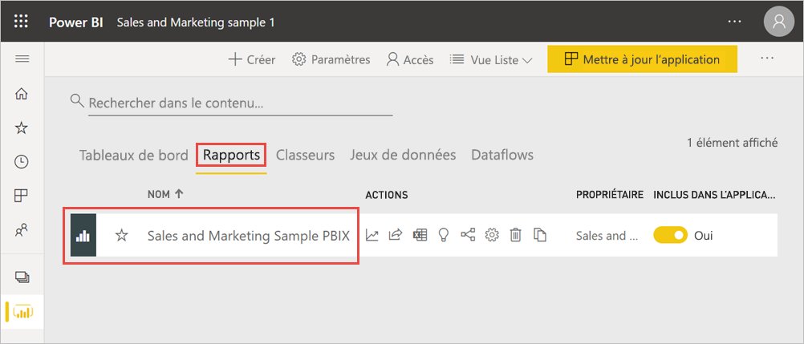
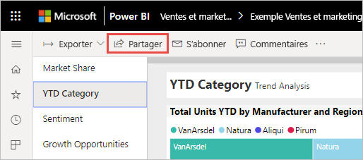
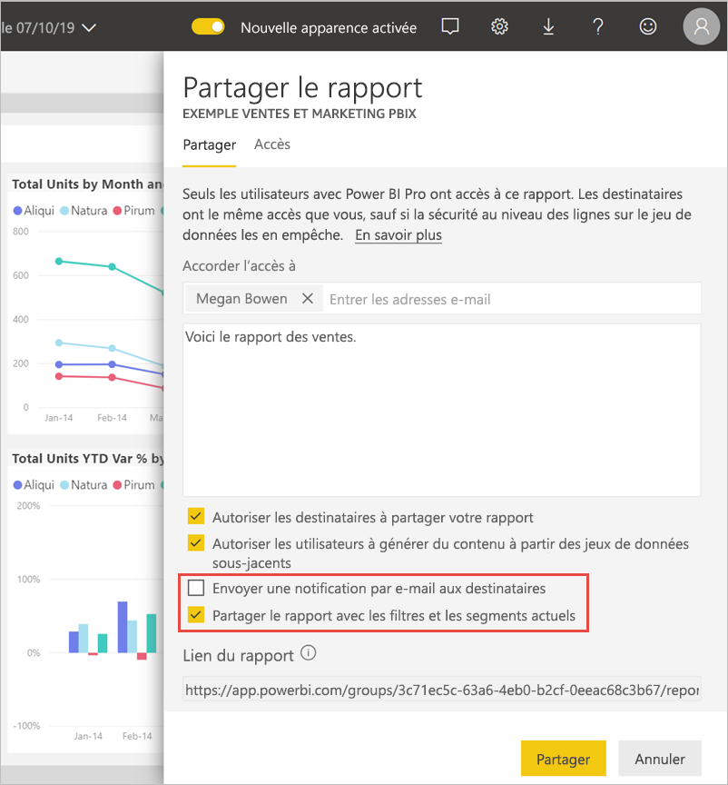
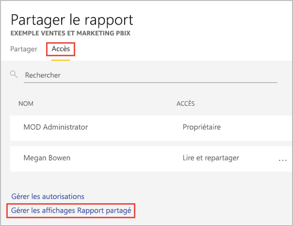
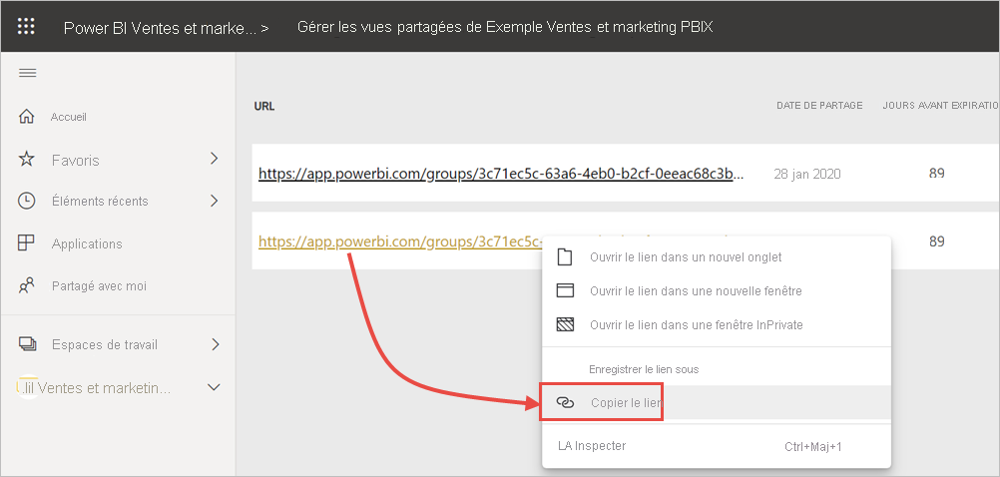

# Filtrer et partager un rapport Power BI
Le *partage* est une façon d’autoriser quelques utilisateurs à accéder à vos tableaux de bord et rapports. Est-il possible de partager une version filtrée d’un rapport ? Vous voulez peut-être que le rapport affiche uniquement les données relatives à une ville, un commercial ou une année spécifique. Cet article explique comment filtrer un rapport et partager la version filtrée du rapport. Une autre façon de partager un rapport filtré consiste à [ajouter des paramètres de requête à l’URL du rapport](service-url-filters.md). Dans les deux cas, le rapport est filtré quand les destinataires l’ouvrent pour la première fois. Ils peuvent effacer les sélections de filtre du rapport.

Power BI propose également [d’autres façons de collaborer et de distribuer des rapports](service-how-to-collaborate-distribute-dashboards-reports.md). Avec le partage, vous et vos destinataires avez besoin d’une [licence Power BI Pro](../fundamentals/service-features-license-type.md) ou le contenu doit être dans une [capacité Premium](../admin/service-premium-what-is.md). 

## Suivre les étapes avec des exemples de données

Cet article utilise l’exemple d’application modèle Marketing et ventes. Vous voulez l’essayer ? 

1. Installez [l’exemple d’application modèle Marketing et ventes](https://appsource.microsoft.com/product/power-bi/microsoft-retail-analysis-sample.salesandmarketingsample?tab=Overview).
2. Sélectionnez l’application, puis **Explorer l’application**.

   

3. Sélectionnez l’icône de crayon pour ouvrir l’espace de travail que vous avez installé avec l’application.

    

4. Dans la liste de contenu de l’espace de travail, sélectionnez **Rapports**, puis sélectionnez le rapport **Exemple PBIX Vente et marketing**.

    

    Vous pouvez maintenant passer à la suite.

## Définir un filtre dans le rapport

Ouvrez un rapport en [mode Édition](../consumer/end-user-reading-view.md) et appliquez un filtre.

Dans cet exemple, nous filtrons la page de catégorie chiffre d’affaires de l’application de modèle d’exemple Marketing et ventes pour afficher uniquement les valeurs où **Région** a la valeur **Central**. 
 

Enregistrez le rapport.

## Partager le rapport filtré

1. Sélectionnez **Partager**.

   

2. Désactivez **Envoyer une notification par courrier aux destinataires** pour pouvoir envoyer un lien filtré à la place. Sélectionnez **Partager le rapport avec les filtres et les segments actifs**, puis **Partager**.

    

4. Sélectionnez à nouveau **Partager**.

   

5. Sélectionnez l’onglet **Accès**, puis **Gérer les affichages Rapport partagé**.

    

6. Cliquez avec le bouton droit sur l’URL souhaitée, puis sélectionnez **Copier le lien**.

    

7. Si vous partagez ce lien, les destinataires verront votre rapport filtré. 

## Considérations et limitations
Voici quelques éléments à prendre en compte lors du partage de rapports :

* Quand vous partagez un jeu de données en gérant des autorisations, en partageant des rapports ou des tableaux de bord, ou en publiant une application, vous accordez l’accès à l’ensemble du jeu de données, sauf si [la sécurité au niveau des lignes (RLS)](../admin/service-admin-rls.md) limite leur accès. Les auteurs de rapports peuvent utiliser des fonctionnalités qui personnalisent les expériences utilisateur lors de l’affichage ou de l’interaction avec les rapports, par exemple le masquage de colonnes ou la limitation des actions sur les visuels. Ces expériences utilisateur personnalisées ne limitent pas les données auxquelles les utilisateurs peuvent accéder dans le jeu de données. Utilisez la [sécurité au niveau des lignes (RLS)](../admin/service-admin-rls.md) dans le jeu de données pour que les informations d’identification de chaque personne déterminent les données auxquelles elle peut accéder.

## Étapes suivantes
* [Moyens de partager votre travail dans Power BI](service-how-to-collaborate-distribute-dashboards-reports.md)
* [Partager un tableau de bord](service-share-dashboards.md)
* D’autres questions ? [Posez vos questions à la Communauté Power BI](https://community.powerbi.com/).
* Vous voulez donner votre avis ? Accédez au [site de la communauté Power BI](https://community.powerbi.com/) pour effectuer des suggestions.
