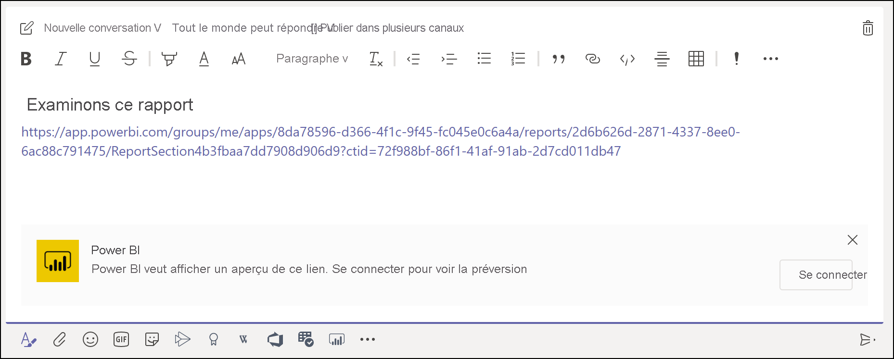
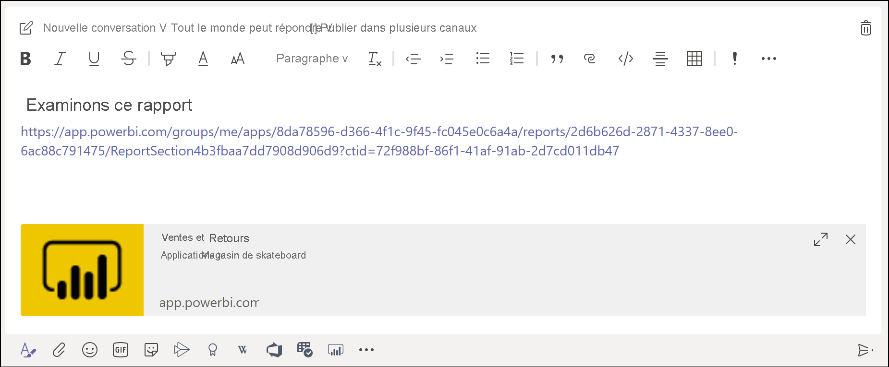
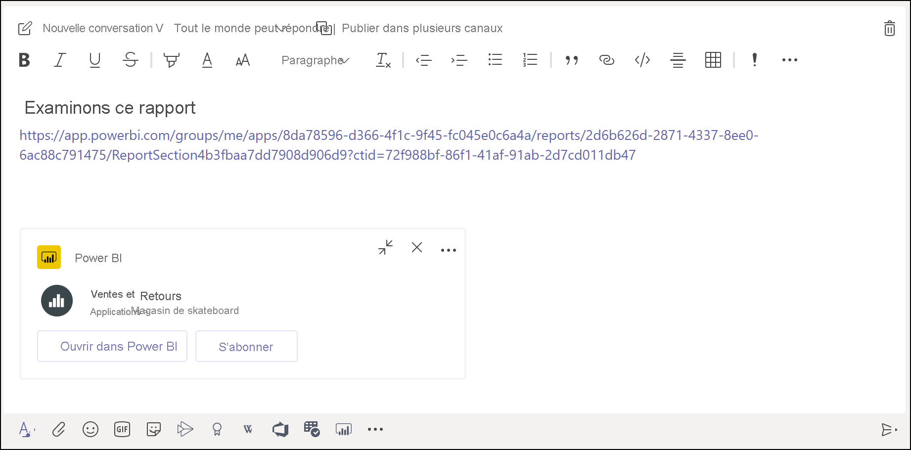

# Obtenir un aperçu du lien Power BI dans Microsoft Teams

Quand vous collez un lien vers vos rapports, tableaux de bord et applications dans la boîte de message Microsoft Teams, l’aperçu du lien montre des informations sur le lien. Des aperçus de lien sont fournis pour les éléments suivants dans Power BI :

- Rapports
- Tableaux de bord
- Applications

Le service d’aperçu de lien nécessite que vos utilisateurs se connectent. Pour vous déconnecter, sélectionnez l’icône **Power BI** dans le bas de la boîte de message. Sélectionnez ensuite **Se déconnecter**.

Pour plus d’informations sur l’interaction entre Power BI et Microsoft Teams, et notamment pour connaître les conditions à remplir, consultez [Collaboration dans Microsoft Teams avec Power BI](service-collaborate-microsoft-teams.md).

## Obtenir un aperçu d’un lien

Suivez ces étapes pour obtenir l’aperçu d’un lien pour du contenu dans le service Power BI.

1. Copiez un lien vers un rapport, un tableau de bord ou une application dans le service Power BI. Par exemple, copiez le lien à partir de la barre d’adresses du navigateur.

1. Collez le lien dans la boîte de message de Microsoft Teams. Connectez-vous au service d’aperçu de lien si vous y êtes invité. Il peut être nécessaire d’attendre quelques secondes pour que l’aperçu du lien se charge.

    

1. L’aperçu de lien de base s’affiche une fois la connexion effectuée.

    

1. Sélectionnez l’icône **Développer** pour montrer la carte enrichie de l’aperçu.

    

1. La carte enrichie de l’aperçu de lien montre le lien et les boutons d’action pertinents.

    

1. Envoyez le message.

## Problèmes connus et limitations

- L’authentification unique n’est pas prise en charge pour le service d’aperçu de lien.
- Les aperçus de lien ne fonctionnent pas dans les conversations des réunions ni dans les canaux privés.
- Pour d’autres problèmes, consultez la section [Problèmes connus et limitations](service-collaborate-microsoft-teams.md#known-issues-and-limitations) de l’article « Collaborer dans Microsoft Teams ».

## Étapes suivantes

- [Collaborer dans Microsoft Teams avec Power BI](service-collaborate-microsoft-teams.md)

D’autres questions ? [Essayez d’interroger la communauté Power BI](https://community.powerbi.com/)
