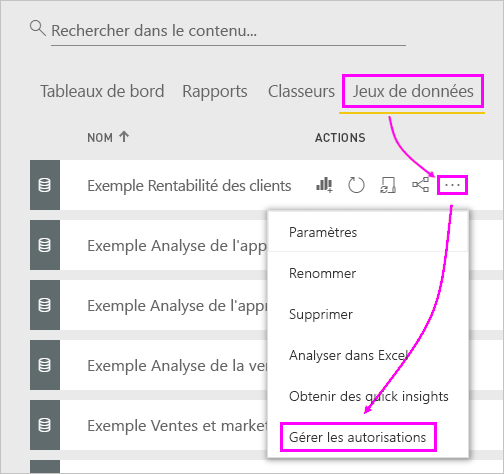
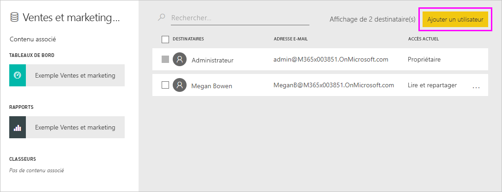
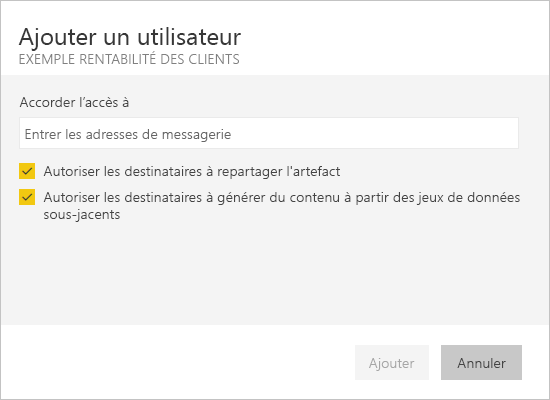

# Résolution des problèmes de partage de tableaux de bord et de rapports

Voici quelques problèmes courants qui peuvent survenir lorsque vous partagez un tableau de bord ou un rapport, ou lorsque quelqu’un d’autre en partage avec vous. 

## Les destinataires du tableau de bord voient une icône de verrou sur une vignette

Les destinataires du partage peuvent voir une vignette verrouillée dans un tableau de bord ou un message « Autorisation requise » lorsqu’ils tentent de consulter un rapport.

Dans ce cas, vous devez leur accorder l’autorisation d’accès au jeu de données sous-jacent.

1. Accédez à l’onglet **Jeux de données** dans votre liste de contenu.

1. Sélectionnez les points de suspension ( **...** ) en regard du jeu de données, puis **Gérer les autorisations**.

    

1. Sélectionnez **Ajouter un utilisateur**.

    

1. Entrez les adresses e-mail complètes des personnes, des groupes de distribution ou des groupes de sécurité. Vous ne pouvez pas effectuer de partage avec des listes de distribution dynamique.

    

1. Sélectionnez **Ajouter**.

## Je n’arrive pas à partager un tableau de bord ou un rapport

Pour pouvoir partager un tableau de bord ou un rapport, vous devez être autorisé à en partager le contenu sous-jacent, c’est-à-dire tous les rapports et jeux de données associés. Si un message vous indique que vous ne pouvez pas effectuer le partage, demandez à l’auteur du rapport de vous autoriser à repartager ces rapports et jeux de données.

## Je n’ai pas accès à un tableau de bord ou à un rapport

Si un message « Demander l’accès » s’affiche lorsque vous sélectionnez le lien vers un rapport ou un tableau de bord, c’est le signe que vous ne disposez pas de l’autorisation nécessaire pour l’afficher. Vous devez y [demander accès](service-request-access.md).

## Étapes suivantes

- [Partager des tableaux de bord et des rapports Power BI avec des collègues et d’autres utilisateurs](service-share-dashboards.md)
- [Comment partager des tableaux de bord, rapports et vignettes ?](service-how-to-collaborate-distribute-dashboards-reports.md)
-  [Partager un rapport Power BI filtré](service-share-reports.md)
- Vous avez des questions ? [Essayez la communauté Power BI](https://community.powerbi.com/)
