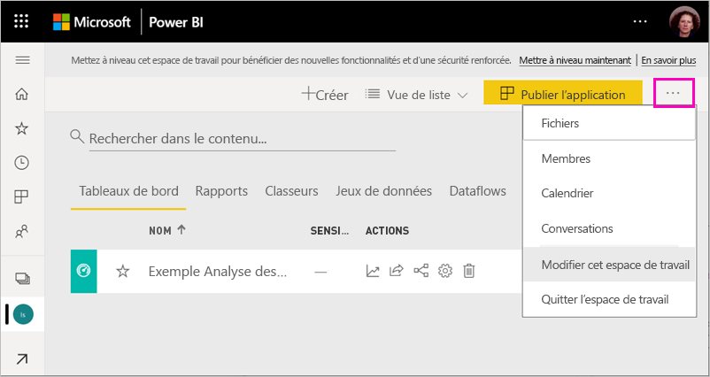
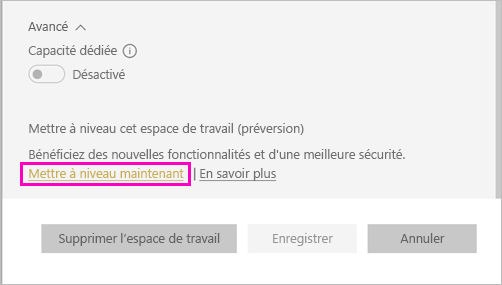
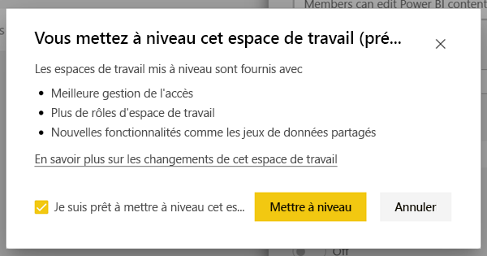
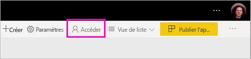
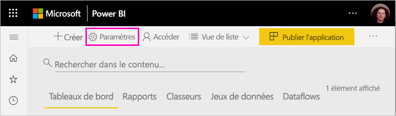
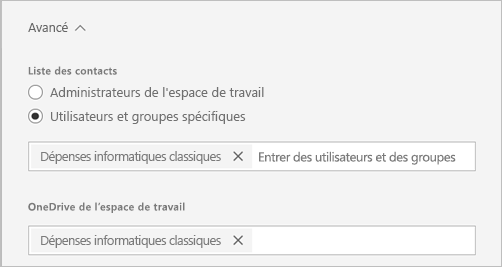
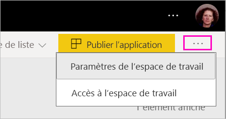
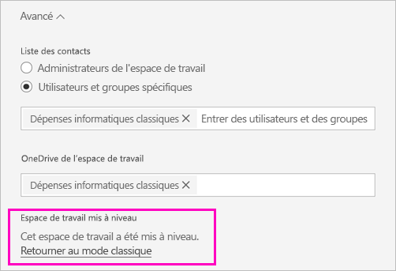
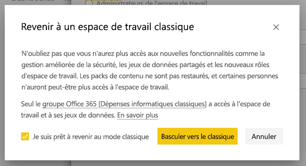

# Mettre à niveau les espaces de travail classiques vers de nouveaux espaces de travail dans Power BI

Cet article explique comment mettre à niveau ou *migrer* un espace de travail classique vers la nouvelle expérience d’espace de travail. Vous pouvez mettre à niveau n'importe quel espace de travail classique. Les nouveaux espaces de travail comportent des rôles d'espace de travail plus granulaires, pour vous permettre de mieux gérer l'accès au contenu. Vous bénéficiez aussi d'une plus grande souplesse pour gérer les espaces de travail mis à niveau car ils sont moins connectés à leur groupe Microsoft 365 d'origine. En savoir plus sur la [nouvelle expérience d'espace de travail](service-new-workspaces.md).

>[!NOTE]
>La mise à niveau de l’espace de travail est disponible en préversion publique. 

Mais votre espace de travail peut nécessiter des changements que vous devez planifier. Par exemple, les packs de contenu ne sont pas pris en charge dans la nouvelle expérience d’espace de travail. Consultez la section [Considérations et limitations relatives à la mise à niveau](#upgrade-considerations-and-limitations), plus loin dans cet article.

## Choses à prévoir avant la mise à niveau

Vous devez effectuer plusieurs opérations *après* la mise à niveau. Il est préférable de les planifier *avant* de procéder à la mise à niveau :
- Passez en revue la liste d'accès et prenez connaissance des [autorisations après la mise à niveau](#permissions-after-upgrade).
- Passez en revue la [liste des contacts](#modify-the-contact-list) et vérifiez qu'elle est définie comme vous le souhaitez.
- Si ce n’est déjà fait, découvrez la [nouvelle expérience d’espace de travail](service-new-workspaces.md).

## Mise à niveau d'un espace de travail classique

Tout administrateur d'un espace de travail peut mettre à jour cet espace de travail. Dans le cas d’espaces de travail classiques, pour être un administrateur d'espace de travail, vous devez être propriétaire du groupe Microsoft 365 sous-jacent. Pour mettre à niveau un espace de travail, procédez comme suit.

1. Dans la liste de contenu de l'espace de travail, sélectionnez **Plus d'options**. ( **...** ) >  **Modifier cet espace de travail**.

    

1. Développez **Avancé**, puis sélectionnez **Mettre à niveau maintenant**.

    

1. Passez en revue les informations de la boîte de dialogue. Des avertissements s’affichent si vous avez publié ou installé des packs de contenu dans l'espace de travail. Lorsque vous êtes prêt, cochez la case **Je suis prêt à mettre à niveau cet espace de travail**, puis sélectionnez **Mettre à niveau**.

    

2. Pendant la mise à niveau, le message **Mise à niveau en cours** s'affiche. La mise à niveau de votre espace de travail prend généralement moins d'une minute.

1. Une fois la mise à niveau terminée, la boîte de dialogue **Réussite** apparaît. Vous voyez votre nouvelle expérience d’espace de travail, avec le même nom et le même contenu. Nous vous recommandons de lire la section [Organiser le travail dans les nouveaux espaces de travail dans Power BI](service-new-workspaces.md) pour vous familiariser avec les différences entre les nouveaux espaces de travail et les espaces de travail classiques.

### Impact sur les autres utilisateurs de l'espace de travail

Nous recommandons d’effectuer la mise à niveau en dehors des heures de travail lorsque peu d'utilisateurs consultent ou modifient activement des éléments dans l'espace de travail.

Les utilisateurs qui utilisent activement l'espace de travail sont invités à actualiser leur navigateur. Les utilisateurs qui éditent un rapport peuvent l'enregistrer avant qu'il ne soit actualisé.

## Considérations et limites relatives la mise à niveau

- Après la mise à niveau, le contenu de l’espace de travail classique s’affiche dans le nouvel espace de travail. Il est également listé dans **Partagé avec moi**.
- Les URL et ID de votre espace de travail, le contenu de celui-ci et l'application publiée depuis l'espace de travail ne changent pas. Le contenu des packs de contenu installés dans votre espace de travail est traité séparément. Voir la section [Packs de contenu pendant la mise à niveau](#content-packs-during-upgrade) de cet article pour plus de détails.
- Les packs de contenu ne sont pas pris en charge dans la nouvelle expérience d’espace de travail. Consultez les sections consacrées aux [packs de contenu publiés](#published-content-packs) ou aux [packs de contenu installés](#installed-content-packs) pour plus d’informations sur leur gestion pendant la mise à niveau. Nous vous recommandons de supprimer les packs de contenu installés ou publiés de votre espace de travail avant la mise à niveau.
- Le groupe Microsoft 365 pour votre espace de travail classique n'est pas affecté par la mise à niveau de l'espace de travail dans Power BI. Les équipes, sites SharePoint, boîtes aux lettres ou autres ressources gérées par Microsoft 365 ne sont pas modifiés. Ces éléments restent intacts après la mise à niveau de votre espace de travail Power BI. Le groupe Microsoft 365 continue d'exister comme avant.
- Il existe certains changements dans la façon dont votre espace de travail est sécurisé après la mise à niveau. Consultez la section [Autorisations de l'espace de travail après la mise à niveau](#permissions-after-upgrade) pour plus de détails.
- Si nécessaire, une option pour **retourner à un espace de travail classique** est fournie. Cependant, elle ne restaure pas complètement certains aspects de votre espace de travail avant sa mise à niveau. Si vous commencez à utiliser des fonctionnalités disponibles uniquement dans le nouvel espace de travail, vous ne pourrez pas revenir en arrière. L'option de retour en arrière est disponible pendant 30 jours après la mise à niveau.

## Autorisations après la mise à niveau

Sélectionnez **Accès** dans la barre de menus en haut de la liste du contenu de l'espace de travail pour afficher les autorisations après la mise à niveau.

Chaque propriétaire de groupe Microsoft 365 est ajouté individuellement au rôle Admin de l'espace de travail mis à niveau. Le groupe Microsoft 365 lui-même est ajouté à un rôle d'espace de travail. Le rôle auquel il est ajouté dépend selon que l'espace de travail classique est *en lecture seule* ou *en lecture-écriture* :

- Lorsque l'espace de travail est défini sur **Les membres peuvent modifier le contenu Power BI**, après la mise à niveau, le groupe Microsoft 365 est ajouté à la liste d'accès à l'espace de travail avec le rôle **Membre**.
- Lorsque l'espace de travail est défini sur **Les membres peuvent seulement lire le contenu Power BI**, après la mise à niveau, le groupe Microsoft 365 est ajouté à la liste d'accès à l'espace de travail avec le rôle **Lecteur**.

Comme le groupe Microsoft 365 se voit attribuer un rôle dans l'espace de travail, tout utilisateur ajouté au groupe Microsoft 365 après la mise à niveau dispose de ce rôle dans l'espace de travail. Toutefois, si vous ajoutez de nouveaux propriétaires au groupe Microsoft 365 après la mise à niveau, ils n'ont pas le rôle Admin pour l'espace de travail.

### Différences au niveau des rôles avant et après la mise à niveau

Les rôles de l'espace de travail sont différents dans les espaces de travail classiques et les nouveaux espaces de travail. La nouvelle expérience d'espace de travail vous permet d’attribuer des rôles d'espace de travail aux groupes Microsoft 365, aux groupes de sécurité ou aux listes de distribution.

- Les **membres** peuvent partager des éléments individuels et accorder un accès à l'ensemble de l'espace de travail par le biais des rôles Membre, Contributeur ou Lecteur
- Les **lecteurs** peuvent seulement voir le contenu et ne peuvent pas exporter les données sous-jacentes ni effectuer une analyse dans Excel pour les jeux de données de l'espace de travail, à moins de disposer d’une autorisation de génération (Build).

Tous les utilisateurs qui ont accès aux éléments de l'espace de travail par le biais du partage ou de l'autorisation d'application conservent l’accès à ces éléments. Toute personne ayant accès à l'espace de travail a également accès à l'application publiée depuis l'espace de travail. Ces utilisateurs ne figurent pas dans la liste d'accès à l'application.

Nous vous recommandons d'évaluer s'il convient d'utiliser le nouveau rôle Contributeur. Après la mise à niveau, vous pouvez modifier le groupe Microsoft 365 afin d’afficher le rôle Contributeur dans le volet Accès.

Après la mise à niveau, vous pouvez créer un groupe de sécurité, un groupe Microsoft 365 ou une liste de distribution pour les administrateurs de l'espace de travail, au lieu de gérer l'accès en attribuant des rôles aux utilisateurs individuels.

En savoir plus sur les [rôles dans les nouveaux espaces de travail](service-new-workspaces.md#roles-in-the-new-workspaces).

## Licences après la mise à niveau

Les utilisateurs avec un rôle Admin, Membre ou Contributeur dans l’espace de travail ont besoin d'une licence Power BI Pro pour accéder à l'espace de travail.

Si l'espace de travail est partagé, les utilisateurs avec le rôle Lecteur ont également besoin d'une licence Power BI Pro pour accéder à l'espace de travail. Cependant, si l'espace de travail a une capacité Premium, les utilisateurs avec rôle Lecteur n'ont pas besoin d'une licence Pro pour accéder à l'espace de travail.

## Autres fonctionnalités du nouvel espace de travail

La nouvelle expérience d’espace de travail propose des fonctionnalités non disponibles sur les espaces de travail classiques. Par exemple la possibilité de définir une liste de contacts différente de celle des administrateurs ou des propriétaires de l'espace de travail. En revanche, vous restez connecté à la bibliothèque de documents SharePoint du groupe Microsoft 365.

### Modifier la liste de contacts

1. Sélectionnez **Paramètres** dans la barre de menus en haut de la liste du contenu de l'espace de travail pour accéder aux paramètres de l'espace de travail.

    

2. Sous **Avancé**, l'espace de travail **Liste de contacts** est configuré pour être le groupe Microsoft 365 à partir duquel l'espace de travail est mis à niveau. Vous pouvez ajouter d'autres utilisateurs ou groupes à la liste de contacts, ou la pointer vers les administrateurs de l'espace de travail.

    

### L'espace de travail OneDrive 

Après la mise à niveau, l'espace de travail **OneDrive** est connecté à la bibliothèque de documents SharePoint du groupe Microsoft 365. Cette bibliothèque de documents se présente sous la forme de l'option **OneDrive** dans l'expérience **Obtenir les données > Fichiers**. Certains utilisateurs de l’espace de travail peuvent ne pas être autorisés à accéder à cette bibliothèque de documents s’ils ne font pas partie du groupe Microsoft 365.

## Packs de contenu pendant la mise à niveau

La nouvelle expérience d'espace de travail ne prend pas en charge les packs de contenu. Utilisez plutôt des applications et des jeux de données partagés pour distribuer le contenu dans l'espace de travail. Nous vous recommandons de supprimer les packs de contenu publiés ou installés de l'espace de travail avant la mise à niveau. Cependant, s’il y a des packs de contenu publiés ou installés au moment d’effectuer la mise à niveau, le processus de mise à niveau tente d’en conserver le contenu, comme décrit plus loin dans cet article.  Il n'existe aucun moyen de restaurer le pack de contenu ou l'association de contenu au pack de contenu après la mise à niveau.

### Packs de contenu publiés

Les packs de contenu publiés à partir de l'espace de travail sont supprimés pendant la mise à niveau. Vous ne pourrez pas les publier ou les mettre à jour après la mise à niveau, même si vous revenez à l'espace de travail classique. Si d'autres personnes ont installé votre pack de contenu dans leurs propres espaces de travail, après la mise à niveau, ils obtiennent une copie du contenu du pack de contenu dans leurs espaces de travail. Consultez la section **Packs de contenu installés** pour plus de détails.

### Packs de contenu installés

Lorsque vous mettez à niveau votre espace de travail ou l'espace de travail à partir duquel le pack de contenu est publié est mis à niveau, des modifications importantes sont apportées aux packs de contenu installés. Après la mise à niveau, votre espace de travail contient une copie du contenu du pack de contenu. Il est connecté au jeu de données d'origine dans l'espace de travail d'origine.

Il existe cependant certains changements importants :

- Le contenu n'est plus mis à jour si le pack de contenu est mis à jour.
- Les URL et les identificateurs d'éléments changent et nécessitent la mise à jour de tous les signets ou liens que vous avez partagés avec d'autres utilisateurs.
- Toutes les personnalisations utilisateur effectuées sur le pack de contenu d'origine à partir de votre espace de travail sont perdues. Les personnalisations incluent les abonnements, les alertes, les signets personnels, les filtres persistants et les favoris.
- Les nouveaux utilisateurs peuvent ne pas avoir accès aux jeux de données qui se trouvaient dans le pack de contenu. Vous devez vérifier auprès du propriétaire du jeu de données que les utilisateurs de l'espace de travail ont accès aux données.

## Revenir à un espace de travail classique

Dans le cadre de la mise à niveau, vous avez la possibilité de revenir à un espace de travail classique pendant 30 jours après la mise à niveau. Cette fonctionnalité restaure l'association du contenu de l'espace de travail au groupe Microsoft 365 d'origine. Elle est disponible au cas où votre organisation rencontrerait des problèmes majeurs lors de l'utilisation du nouvel espace de travail. Il existe cependant des limitations. Consultez d'abord la section [Considérations sur le retour à l’espace de travail classique](#considerations-for-switching-back-to-classic) de cet article.

Pour revenir en arrière, vous devez être propriétaire du groupe Microsoft 365 auquel l'espace de travail était associé avant sa mise à niveau. Procédez comme suit.

1. Dans la liste de contenu de l'espace de travail, sélectionnez **Plus d'options** ( **...** ) > **Préférences de l’espace de travail**.

    

1. Développez **Avancé** et sélectionnez **Retourner au mode classique**. Si cette option n'est pas disponible, consultez la section [Considérations sur le retour à l’espace de travail classique](#considerations-for-switching-back-to-classic) de cet article.

    

1. Lorsque vous êtes prêt, cochez la case **Je suis prêt à revenir au mode classique** et sélectionnez **Basculer vers le classique**. Des avertissements ou des bloqueurs peuvent apparaître dans cette boîte de dialogue. Consultez la section [Considérations sur le retour à l’espace de travail classique](#considerations-for-switching-back-to-classic) de cet article si vous rencontrez ces problèmes.

    

1. Lorsque le retour est terminé, une boîte de dialogue de confirmation s'affiche.

    

### Considérations sur le retour à l’espace de travail classique

Vous ne pouvez pas revenir en arrière si l'une des affirmations suivantes concernant votre espace de travail est vraie :

- Le groupe Microsoft 365 a été supprimé.
- Vous avez changé effectué la mise à niveau il y a plus de 30 jours.
- Les jeux de données dans l'espace de travail sont utilisés par des rapports ou des tableaux de bord dans d'autres espaces de travail. Comment cela se produit-il ? Supposons que vous avez publié un pack de contenu à partir de l'espace de travail avant la mise à niveau, et que quelqu'un a installé le pack de contenu dans un autre espace de travail. Immédiatement après la mise à niveau, les jeux de données sont utilisés par les rapports et les tableaux de bord dans ce pack de contenu.
- L'espace de travail fait partie d'un pipeline de gestion du cycle de vie des applications.
- L'espace de travail est utilisé pour des applications modèles.
- L'espace de travail utilise la capacité des grands modèles.
- L'espace de travail utilise les nouvelles métriques d'utilisation.

Lorsque vous revenez à un espace de travail classique, vous ne restaurez pas une copie exacte de l'espace de travail original. Les changements suivants se produisent :

- Les autorisations pour l'espace de travail sont définies par le groupe Microsoft 365 auquel l'espace de travail mis à niveau était initialement connecté.
  - Tous les administrateurs du groupe Microsoft 365 deviennent des administrateurs de l'espace de travail classique.
  - Tous les membres du groupe Microsoft 365 deviennent des membres de l'espace de travail classique. Si l'espace de travail classique a été défini sur **Les membres peuvent seulement lire le contenu Power BI**, ce paramètre est restauré.
  - Tous les utilisateurs ou groupes d'utilisateurs ajoutés à l'espace de travail après la mise à niveau (en dehors du groupe Microsoft 365) perdent l'accès à l'espace de travail. Ajoutez-les au groupe Microsoft 365 pour leur donner accès. Notez que les groupes Microsoft 365 n'autorisent pas l'imbrication de groupes de sécurité ou de distribution dans l’appartenance.
  - Les utilisateurs qui ont reçu l'accès à l'application pour l'espace de travail continuent d'avoir accès à cette application.
  - Les utilisateurs qui ont reçu l'accès à des éléments dans l'espace de travail via le partage continuent d'avoir accès à ces éléments.
- Les packs de contenu publiés depuis l'espace de travail classique avant la mise à niveau ne sont pas restaurés.
- Les packs de contenu installés dans l'espace de travail classique avant la mise à niveau ne sont pas restaurés.
- Les abonnements créés par les utilisateurs dans l'espace de travail après la mise à niveau sont supprimés. Les abonnements qui existaient avant la mise à niveau continuent de fonctionner comme prévu.
- Les alertes de données ne sont pas conservées. Elles sont supprimées.
- Si vous avez renommé l'espace de travail après la mise à niveau, le nom de l'espace de travail est restauré pour correspondre au nom du groupe Microsoft 365.
- Les opérations en cours comme les actualisations ne sont pas affectées par la mise à niveau de l'espace de travail.

## Gérer la migration vers les nouveaux espaces de travail pour votre locataire 

Certaines organisations souhaitent déplacer une grande partie ou la totalité de leurs espaces de travail vers le nouvel espace de travail. L'outil de mise à niveau de l'espace de travail permet aux administrateurs de l'espace de travail de procéder à la mise à niveau. Les organisations qui souhaitent gérer un tel processus peuvent suivre les étapes ci-dessous.

1. La liste des espaces de travail dans le portail d'administration Power BI et l'API correspondante fournissent une liste de tous les espaces de travail disponibles dans Power BI. Les espaces de travail classiques sont affichés en tant que type Groupe dans la liste.
2. Demandez aux propriétaires de groupes, ou à votre administrateur Microsoft 365, de mettre à niveau les espaces de travail. Si vous voulez mettre à jour l'espace de travail, vous devez devenir propriétaire du groupe.

La capacité de mise à niveau de l'espace de travail ne fournit pas d'outils de mise à niveau en masse ou par programmation. Par ailleurs, les nouveaux groupes Microsoft 365 créés dans votre entreprise continueront à apparaître dans Power BI.
   
   
## Problèmes connus

Il se peut que vous rencontriez plusieurs problèmes connus à l’issue de la mise à niveau :
- Une boîte de dialogue d’avertissement « Échec du chargement du modèle » peut s’afficher. Ce message s’affiche par erreur et peut être ignoré. 
- Certains noms d’espace de travail ne sont plus les mêmes qu’avant la mise à niveau. Dans ce cas, le nom précédent de l’espace de travail est rétabli ou le nom de l’espace de travail devient vide. Pour résoudre ce problème, renommez l’espace de travail avec le nom souhaité.
- Si un pack de contenu était installé dans l’espace de travail, il se peut que vous trouviez dans ce dernier des tableaux de bord qui n’étaient pas visibles avant la mise à niveau. Dans ce cas, le pack de contenu n’a peut-être pas été mis à jour récemment. Vous pouvez supprimer ces tableaux de bord sans problème.

## Étapes suivantes

* [Organiser le travail dans les nouvelles expériences d’espace de travail](service-new-workspaces.md)
* [Créer de nouveaux espaces de travail](service-create-the-new-workspaces.md)
* [Créer les espaces de travail classiques](service-create-workspaces.md)
* Vous avez des questions ? [Essayez d’interroger la communauté Power BI](https://community.powerbi.com/)
