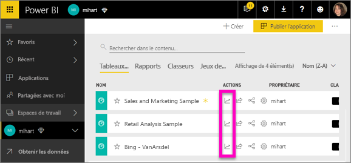
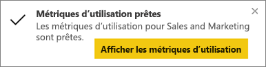
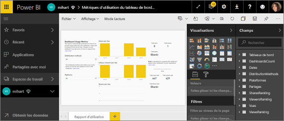
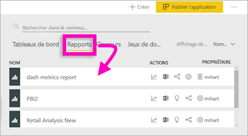
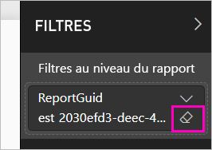

# Superviser les métriques d’utilisation de tableaux de bord et de rapports Power BI

Si vous créez des tableaux de bord et des rapports, des mesures d’utilisation vous aident à comprendre leur impact. Quand vous exécutez des métriques d’utilisation de tableau de bord ou de rapport, vous découvrez comment elles sont utilisées dans votre organisation, qui les utilise et dans quel but.  

Les rapports de métriques d’utilisation sont en lecture seule. Vous pouvez cependant copier un rapport de métriques d’utilisation. Cette opération de copie crée un rapport Power BI standard que vous pouvez modifier. Vous pouvez également créer vos propres rapports dans Power BI Desktop basés sur le jeu de données sous-jacent, qui contient des métriques d’utilisation pour tous les tableaux de bord ou tous les rapports d’un espace de travail. Pour commencer, le rapport copié montre des métriques seulement pour le rapport ou le tableau de bord sélectionné. Vous pouvez supprimer le filtre par défaut et avoir accès au jeu de données sous-jacent, avec toutes les métriques d’utilisation de l’espace de travail sélectionné. Vous pouvez même voir les noms des utilisateurs spécifiques, si votre administrateur l’a autorisé.

> [!NOTE]
> Les métriques d’utilisation permettent de suivre l’utilisation des rapports incorporés dans SharePoint Online. Elles ne font cependant pas le suivi des tableaux de bord et rapports incorporés via le flux « l’utilisateur a ses informations d’identification » ou « l’application a ses informations d’identification ». Les métriques d’utilisation ne suivent pas non plus l’utilisation des rapports incorporés via [Publication sur le web](service-publish-to-web.md).

## Pourquoi les métriques d’utilisation sont importantes

De cette manière, vous pouvez démontrer votre impact et hiérarchiser vos efforts. Vos mesures d’utilisation peuvent indiquer qu’un de vos rapports est utilisé quotidiennement par un segment important de l’organisation ou que vous avez créé un tableau de bord qui n’est pas du tout consulté. Ce type de retour est essentiel car il guide vos efforts de travail.

Vous pouvez exécuter des rapports de métriques d’utilisation seulement dans le service Power BI. Toutefois, si vous enregistrez un rapport des métriques d’utilisation ou que vous l’épinglez à un tableau de bord, vous pouvez l’ouvrir et le manipuler sur des appareils mobiles.

## Prérequis

- Vous avez besoin d’une licence Power BI Pro pour exécuter et accéder aux données des métriques d’utilisation. Cependant, la fonctionnalité de métriques d’utilisation capture les informations d’utilisation de tous les utilisateurs, quelle que soit la licence qui leur est attribuée.
- Pour accéder à ces métriques d’utilisation pour un tableau de bord ou un rapport spécifique, vous devez disposer d’un accès en modification à ce tableau de bord ou à ce rapport.
- Votre administrateur Power BI doit avoir activé les métriques d’utilisation pour les créateurs de contenu. Vous administrateur Power BI peut aussi avoir activé la collecte des données par utilisateur dans les métriques d’utilisation. Pour plus d’informations, consultez [Activer ces options dans le portail d’administration](../admin/service-admin-portal.md#control-usage-metrics). 

## Afficher un rapport Métriques d’utilisation

1. Commencez dans l’espace de travail contenant le tableau de bord ou le rapport.
2. Dans la liste du contenu de l’espace de travail ou dans le tableau de bord ou le rapport, sélectionnez l’icône des **Métriques d’utilisation**  .

    

    
3. La première fois que vous procédez de la sorte, Power BI crée le rapport des métriques d’utilisation et vous avertit quand il est prêt.

    
4. Pour voir les résultats, sélectionnez **Afficher les métriques d’utilisation**.

    Les métriques d’utilisation sont un atout important lorsque vous déployez et gérez des rapports et des tableaux de bord Power BI. Vous vous demandez quelles pages de votre rapport sont les plus utiles et quelles sont celles que vous devez éliminer progressivement ? Segmentez les **pages du rapport** pour le savoir. Vous vous demandez si vous devez créer une version mobile de votre tableau de bord ? Segmentez par **plateformes** pour savoir combien d’utilisateurs accèdent à votre contenu via les applications mobiles et via le navigateur web.

5. Vous pouvez également pointer sur une visualisation, puis sélectionner l’icône en forme d’épingle pour ajouter la visualisation à un tableau de bord. Une autre possibilité est de sélectionner **Épingler une page dynamique** dans la barre de menus du haut pour ajouter la page entière à un tableau de bord. Dans le tableau de bord, vous pouvez surveiller plus facilement les métriques d’utilisation ou les partager avec d’autres utilisateurs.

    > [!NOTE]
    > Si vous épinglez une vignette du rapport sur les mesures d’utilisation à un tableau de bord, vous ne pouvez pas ajouter ce tableau de bord à une application.

### Rapport Métriques d’utilisation du tableau de bord

### Rapport Métriques d’utilisation du rapport

## À propos du rapport Métriques d’utilisation

Quand vous sélectionnez **Métriques d’utilisation** ou l’icône  en regard d’un tableau de bord ou d’un rapport, Power BI génère un rapport prédéfini avec des métriques d’utilisation relatives à ce contenu pour les 90 derniers jours.  Ce rapport est très similaire aux rapports Power BI que vous connaissez déjà. Vous pouvez le segmenter en fonction de la façon dont vos utilisateurs finaux ont reçu leur accès, et s’ils ont accédé au service via le web ou via une application mobile, etc. À mesure que vos tableaux de bord et vos rapports évoluent, votre rapport de métriques d’utilisation évolue lui aussi et se met à jour quotidiennement avec de nouvelles données.  

Les rapports de métriques d’utilisation ne s’affichent pas dans les listes **Récents**, **Espaces de travail**, **Favoris**, ni dans d’autres listes de contenu. Vous ne pouvez pas les ajouter à une application. Si vous épinglez une vignette du rapport sur les mesures d’utilisation à un tableau de bord, vous ne pouvez pas ajouter ce tableau de bord à une application.

Pour explorer les données du rapport ou pour créer vos propres rapports sur le jeu de données sous-jacent, vous avez deux options : 

- Faire une copie du rapport dans le service Power BI. Pour plus d’informations, consultez [Enregistrer une copie du rapport de métriques d’utilisation](#save-a-copy-of-the-usage-metrics-report) plus loin dans cet article.
- Vous connecter au jeu de données depuis Power BI Desktop. Pour chaque espace de travail, le jeu de données porte le nom de « Report Usage Metrics Model » (Modèle de métriques d’utilisation du rapport). Pour plus d’informations, consultez [Établir une connexion à un jeu de données publié](../connect-data/desktop-report-lifecycle-datasets.md#establish-a-power-bi-service-live-connection-to-the-published-dataset).

    

## Métriques figurant dans le rapport

| Metric | Tableau de bord | Rapport | Description |
| --- | --- | --- | --- |
| Segment Méthode de distribution |oui |oui |Manière dont les utilisateurs ont eu accès au contenu. Il existe trois méthodes possibles : les utilisateurs peuvent accéder au tableau de bord ou au rapport s’ils sont membres d’un [espace de travail](../consumer/end-user-experience.md), quand du contenu est [partagé avec eux](service-share-dashboards.md) ou en installant une application ou un pack de contenu.  Notez que les vues dans une application sont comptées comme « packs de contenu ». |
| Segment Plateformes |oui |oui |L’accès au tableau de bord ou au rapport a-t-il eu lieu via le service Power BI (powerbi.com) ou un appareil mobile ? L’accès mobile inclut toutes nos applications iOS, Android et Windows. |
| Segment Page de rapport |non |oui |Si le rapport comporte plus d’une page, segmentez-le par page(s) visitées(s). Si vous voyez une option de liste « Vide », cela signifie qu’une page de rapport a été ajoutée récemment (dans les 24 heures, le nom réel de la nouvelle page s’affiche dans la liste des segments) et/ou que des pages de rapport ont été supprimées. « Vide » capture ces types de situations. |
| Visites par jour |oui |oui |Nombre total de visites par jour : une visite correspond à un chargement de page de rapport ou de tableau de bord par un utilisateur. |
| Visiteurs uniques par jour |oui |oui |Nombre d’utilisateurs *différents* qui ont consulté le tableau de bord ou le rapport (basé sur le compte d’utilisateur AAD). |
| Vues par l’utilisateur |oui |oui |Nombre de vues au cours des 90 derniers jours, ventilées par utilisateur. |
| Partages par jour |oui |non |Nombre de fois que le tableau de bord ou le rapport a été partagé avec un autre utilisateur ou groupe. |
| Nombre total de visites |oui |oui |Nombre de visites au cours des 90 derniers jours. |
| Nombre total de visiteurs |oui |oui |Nombre de visiteurs uniques au cours des 90 derniers jours. |
| Nombre total de partages |oui |non |Nombre de fois où que le tableau de bord ou le rapport a été partagé au cours des 90 derniers jours. |
| Total dans l’organisation |oui |oui |Nombre de tableaux de bord ou de rapports dans toute l’organisation qui ont été consultés au moins une fois au cours des 90 derniers jours.  Utilisé pour calculer le classement. |
| Classer : Nombre total de vues |oui |oui |Classement de ce tableau de bord ou rapport dans le nombre total de visites de tous les tableaux de bord ou rapports dans l’organisation au cours des 90 derniers jours. |
| Classer : Nombre total de partages |oui |non |Classement de ce tableau de bord ou rapport dans le nombre total de partages de tous les tableaux de bord ou rapports dans l’organisation au cours des 90 derniers jours. |

## Enregistrer une copie du rapport de métriques d’utilisation

Utilisez **Enregistrer sous** pour convertir le rapport de métriques d’utilisation en rapport Power BI standard, que vous pouvez personnaliser pour répondre à vos besoins spécifiques. Vous pouvez aussi utiliser Power BI Desktop pour générer des rapports de métriques d’utilisation personnalisés basés sur le jeu de données sous-jacent. Pour plus d’informations, consultez [Établir une connexion à un jeu de données publié](../connect-data/desktop-report-lifecycle-datasets.md#establish-a-power-bi-service-live-connection-to-the-published-dataset).

Mieux encore, le jeu de données sous-jacent comprend les détails d’utilisation de tous les tableaux de bord ou rapports dans l’espace de travail. Ceci ouvre plus de possibilités. Vous pouvez par exemple créer un rapport qui compare tous les tableaux de bord de votre espace de travail en fonction de leur utilisation. Vous pouvez aussi créer un tableau de bord des métriques d’utilisation pour votre application Power BI en agrégeant l’utilisation de tout le contenu distribué au sein de cette application.  Vous verrez comment supprimer le filtre et [afficher toutes les métriques d’utilisation de l’espace de travail](#see-all-workspace-usage-metrics) plus loin dans cet article.

### Créer une copie du rapport d’utilisation

Quand vous créez une copie du rapport d’utilisation prédéfini en lecture seule, Power BI crée une copie modifiable du rapport. À première vue, il se présente de la même façon. Cependant, vous pouvez maintenant ouvrir le rapport en mode Édition, ajouter de nouvelles visualisations, des filtres et des pages, modifier ou supprimer les visualisations existantes, etc. Power BI enregistre le nouveau rapport dans l’espace de travail actuel.

1. Dans le rapport des métriques d’utilisation, sélectionnez **Fichier > Enregistrer sous**. Power BI crée un rapport Power BI modifiable, enregistré dans l’espace de travail actuel.

    
2. Ouvrez le rapport en mode Édition, puis [interagissez avec lui comme vous le feriez avec tout autre rapport Power BI](../create-reports/service-interact-with-a-report-in-editing-view.md). Vous pouvez, par exemple, ajouter des pages, générer de nouvelles visualisations, ajouter des filtres, mettre en forme les polices et les couleurs, etc.

    
3. Le nouveau rapport est enregistré sous l’onglet **Rapports** de l’espace de travail en cours et ajouté à la liste des contenus **Récents**.

    

## Afficher *toutes* les métriques d’utilisation de l’espace de travail

Pour voir les métriques pour tous les tableaux de bord ou tous les rapports de l’espace de travail, vous devez supprimer un filtre. Par défaut, le rapport est filtré pour afficher seulement les métriques du tableau de bord ou du rapport qui a été utilisé pour le créer.

1. Sélectionnez **Modifier le rapport** pour ouvrir le nouveau rapport modifiable en mode Édition.

    
2. Dans le volet Filtres, localisez le compartiment **Filtres au niveau du rapport** et supprimez le filtre en sélectionnant la gomme en regard de **ReportGuid**.

    

    Votre rapport affiche maintenant des métriques pour la totalité de l’espace de travail.

## Contrôles d’administration de Power BI pour les métriques d’utilisation

Les rapports de métriques d’utilisation sont une fonctionnalité qu’un administrateur Power BI ou Office 365 peut activer ou désactiver. Les administrateurs ont un contrôle précis sur les utilisateurs ayant accès aux métriques d’utilisation. Par défaut, celles-ci sont **Activées** pour tous les utilisateurs de l’organisation.

> [!NOTE]
> Seuls les administrateurs du locataire Power BI peuvent voir le portail d’administration et modifier les paramètres. 

Par défaut, les données par utilisateur sont activées pour les métriques d’utilisation et les informations des comptes des consommateurs des contenus sont incluses dans le rapport des métriques. Si les administrateurs ne veulent pas exposer ces informations à tout ou partie des utilisateurs, ils peuvent désactiver la fonctionnalité pour des groupes de sécurité spécifiques ou pour l’ensemble de l’organisation. Les informations de compte figurent alors dans le rapport sous l’intitulé *Sans nom*.

Quand les métriques d’utilisation sont désactivées pour toute l’organisation, les administrateurs peuvent utiliser l’option **Supprimer tout le contenu des métriques d’utilisation** pour supprimer toutes les vignettes des rapports et des tableaux de bord existants qui ont été générés en utilisant les rapports de métriques d’utilisation. Cette option supprime tout accès aux données de métriques d’utilisation pour tous les utilisateurs au sein de l’organisation qui peuvent déjà les utiliser. La suppression du contenu de métriques d’utilisation existantes est irréversible.

Pour plus d’informations sur ces paramètres, consultez [Contrôler les métriques d’utilisation](../admin/service-admin-portal.md#control-usage-metrics) dans l’article sur le portail d’administration. 

## Métriques d’utilisation dans les clouds nationaux

Power BI est disponible dans des cloud nationaux distincts. Ces clouds offrent les mêmes niveaux de sécurité, de confidentialité, de conformité et de transparence que la version internationale de Power BI, combinés à un modèle unique pour les réglementations locales sur la fourniture de services, la résidence des données, l’accès et le contrôle. En raison de ce modèle unique adapté aux réglementations locales, les métriques d’utilisation ne sont pas disponibles dans les clouds nationaux. Pour plus d’informations, consultez [Clouds nationaux](https://powerbi.microsoft.com/clouds/).

## Considérations et limitations

### Différences entre les journaux d’audit et les métriques d’utilisation

Il est important de savoir que la comparaison entre les journaux d’audit et les métriques d’utilisation peut produire des différences, et de comprendre pourquoi. Les *journaux d’audit* sont collectés à l’aide de données issues du service Power BI alors que les *métriques d’utilisation* sont collectées sur le client. Les compteurs d’activités agrégés dans les journaux d’audit ne correspondent pas toujours aux métriques d’utilisation pour les raisons suivantes :

* Il arrive que les métriques d’utilisation sous-estiment les activités en raison de connexions réseau incohérentes, de bloqueurs de publicité ou d’autres problèmes susceptibles de perturber l’envoi d’événements à partir du client.
* Certains types de vues ne sont pas inclus dans les métriques d’utilisation, comme décrit précédemment dans cet article.
* Les métriques d’utilisation surestiment parfois les activités, dans les situations où le client actualise la page sans qu’il soit nécessaire de renvoyer une requête au service Power BI.

### Autres éléments à prendre en compte

Vous devez voir au moins une fois le contenu de votre espace de travail directement dans cet espace de travail. Si vous ne le faites pas, les données ne sont pas corrélées à partir des vues de l’application dans le rapport des métriques d’utilisation. Pour débloquer le traitement des données pour ce rapport, il vous suffit de voir le contenu dans votre espace de travail au moins une fois.

## Forum Aux Questions

Outre les différences potentielles entre les journaux d’audit et les métriques d’utilisation, les questions et les réponses suivantes, sur les métriques d’utilisation, pourront être utiles aux utilisateurs et aux administrateurs :

**Q :**    Je ne parviens pas à lancer les métriques d’utilisation sur un tableau de bord ou un rapport.

**R :**    Vous ne pouvez voir les métriques d’utilisation que pour le contenu dont vous êtes propriétaire ou que vous avez l’autorisation de modifier.

**Q :**    Les métriques d’utilisation capturent-elles des vues de tableaux de bord et de rapports incorporés ?

**R :**    Les métriques d’utilisation ne prennent pas en charge la capture de l’utilisation des tableaux de bord et des rapports incorporés, ni celle du flux [Publier sur le web](service-publish-to-web.md). Dans ce cas, nous vous recommandons d’utiliser des plateformes Web Analytics existantes pour effectuer le suivi de l’utilisation de l’application ou du portail d’hébergement.

**Q :**    Je ne parviens à lancer les métriques d’utilisation sur aucun contenu.

**R1 :**    Les administrateurs ont la possibilité de désactiver cette fonctionnalité dans leur organisation.  Contactez votre administrateur pour vérifier si c’est le cas.

**R2 :**    Les mesures d’utilisation sont une fonctionnalité de Power BI Pro.

**Q :**    Les données ne semblent pas à jour. Par exemple, les méthodes de distribution n’apparaissent pas, des pages de rapport sont manquantes, etc.

**R :**    La mise à jour des données peut prendre jusqu’à 24 heures.

**Q :**    Il y a quatre rapports dans l’espace de travail, mais le rapport des métriques d’utilisation n’en compte que trois.

**R :**    Le rapport des métriques d’utilisation ne comprend que les rapports (ou les tableaux de bord) qui ont été consultés au cours des 90 derniers jours.  Si un rapport (ou un tableau de bord) n’apparaît pas, c’est probablement parce qu’il n’a pas été utilisé au cours des 90 derniers jours.

## Étapes suivantes

[Administration de Power BI dans le portail d’administration](../admin/service-admin-portal.md)

D’autres questions ? [Posez vos questions à la communauté Power BI](https://community.powerbi.com/)
