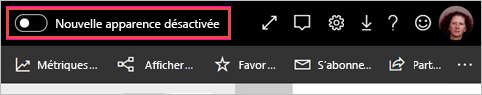
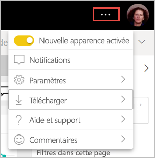

# Adhérer à la « nouvelle apparence » de l’espace de travail (préversion)

Les espaces de travail ont une nouvelle apparence semblable à la [nouvelle apparence](../service-new-look.md) du service Power BI. Toute personne utilisant le service Power BI (app.powerbi.com) peut adhérer. Quand vous activez la **nouvelle apparence** dans la barre d’en-tête noire, vous adhérez à la nouvelle apparence pour les rapports et les espaces de travail. Tous les espaces de travail, qu’ils soient classiques ou nouveaux, peuvent bénéficier de la nouvelle apparence.

Vous recherchez des informations sur la nouvelle apparence de **Power BI Desktop** ? Consultez [Utiliser le ruban mis à jour dans Power BI Desktop](../desktop-ribbon.md).

## Fonctionnalités de la nouvelle apparence

:::image type="content" source="media/service-workspaces-new-look/power-bi-workspace-new-look-numbered.png" alt-text="Nouvelle apparence des espaces de travail, avec des numéros de légende pour les explications":::

|Nombre  |Fonctionnement |
|---------|---------|
|    | **Obtenir des données** : il est plus facile d’ajouter du contenu à votre espace de travail. Sélectionnez le bouton **+ Nouveau** pour vous connecter aux données, ouvrir des fichiers et créer des rapports, des tableaux de bord, etc.  |
|   | **Basculeur de vues** : pour voir les connexions entre des dataflows, des jeux de données, des rapports et des tableaux de bord ainsi que leurs connexions à d'autres sources de données, basculez entre les vues **Liste** et **Traçabilité**. |
|  | **Recherche dans un espace de travail** : rechercher dans tout le contenu d’un espace de travail dans la nouvelle zone de recherche.  |
|   | **Liste et onglets** : tout le contenu d’un espace de travail figure dans une liste plate de tableaux de bord, de rapports, de jeux de données, etc., comme dans SharePoint. Vous n’ouvrez plus un espace de travail dans un onglet **Tableaux de bord** potentiellement vide et vous ne vous demandez plus où se trouve votre contenu. Voici le nouvel ordre des onglets :  **Tout** : affiche tout le contenu (tableaux de bord, rapports, classeurs, rapports paginés, jeux de données et dataflows) dans l’espace de travail.  **Contenu** : recueille tout le contenu créé pour la consommation (tableaux de bord, rapports, classeurs et rapports paginés) au sein de l’espace de travail.  **Jeux de données + dataflows** : rassemble tous les jeux de données et dataflows dans l’espace de travail pour faciliter la gestion des données. |
|  | **Filtres** : pour les espaces de travail contenant des centaines d’artefacts, vous pouvez filtrer le contenu dans le volet Filtres. Une fois qu’un filtre est appliqué, le filtre s’affiche en haut de la liste du contenu. |

**Actions rapides** : lorsque vous pointez sur le contenu de la liste, vous voyez les actions les plus courantes pour cet élément, ainsi que d’autres disponibles dans le menu **Plus d’options** (...).

:::image type="content" source="media/service-workspaces-new-look/power-bi-workspace-new-look-quick-actions.png" alt-text="Actions rapides dans le nouvel espace de travail":::

## Accepter la nouvelle présentation

Tout utilisateur du service Power BI peut choisir d’accepter la nouvelle présentation. Il suffit de faire glisser le curseur de **Nouvelle apparence désactivée** vers **Nouvelle apparence activée**.

Si vous devez revenir à l’ancienne apparence, il vous suffit de le refaire glisser vers **désactivée** . Si vous ne voyez pas cette option, sélectionnez le menu des points de suspension dans le coin supérieur droit.

## Étapes suivantes

- [Utiliser le ruban mis à jour dans Power BI Desktop](../desktop-ribbon.md)
- [Nouvelle apparence du service Power BI](../service-new-look.md)
- Vous avez des questions ? [Essayez la communauté Power BI](https://community.powerbi.com/)

