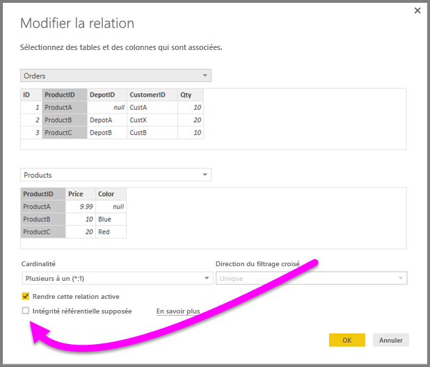
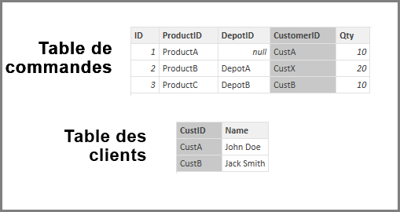

# Appliquer le paramètre Intégrité référentielle supposée dans Power BI Desktop
Lorsque vous vous connectez à une source de données à l’aide de **DirectQuery**, vous pouvez utiliser l’option **Intégrité référentielle supposée** pour exécuter des requêtes plus efficaces sur votre source de données. Cette fonctionnalité impose quelques exigences de données sous-jacentes, et n’est disponible qu’en utilisant **DirectQuery**.

Le paramètre **Intégrité référentielle supposée** permet aux requêtes sur la source de données d’utiliser des instructions de **JOINTURE INTERNE** plutôt que de **JOINTURE EXTERNE**, ce qui améliore l’efficacité des requêtes.

## Conditions d’utilisation du paramètre Intégrité référentielle supposée
Il s’agit d’un paramètre avancé qui est activé uniquement en cas d’utilisation de **DirectQuery** pour la connexion aux données. Pour que le paramètre **Intégrité référentielle supposée** fonctionne correctement, les conditions suivantes sont requises :

* Les données de la colonne **De** dans la relation ne peuvent jamais avoir de valeur *Null* ou *vide*
* Pour chaque valeur dans la colonne **De**, une valeur correspondante doit figurer dans la colonne **À**

Dans ce contexte, la colonne **De** est soit le côté *Plusieurs* dans une relation de *Un-à-plusieurs*, soit la colonne de la première table dans une relation de *Un-à-un*.

## Exemple d’utilisation du paramètre Intégrité référentielle supposée
L’exemple suivant montre comment le paramètre **Intégrité référentielle supposée** se comporte quand il est utilisé dans des connexions de données. L’exemple se connecte à une source de données qui inclut une table **Orders**, une table **Products** et une table **Depots**.

1. Dans l’illustration suivante qui présente les tables **Orders** et **Products**, notez qu’il existe une intégrité référentielle entre **Orders[ProductID]** et **Products[ProductID]** . La colonne **[ProductID]** de la table **Orders** n’a jamais la valeur *Null*, et chaque valeur apparaît également dans la table **Products**. Ainsi, le paramètre **Intégrité référentielle supposée** devrait être défini pour obtenir des requêtes plus efficaces (l’utilisation de ce paramètre ne modifie pas les valeurs affichées dans les éléments visuels).
   
   
2. Dans l’image suivante, vous pouvez remarquer qu’il n’existe pas d’intégrité référentielle entre **Orders[DepotID]** et **Depots[DepotID]** , car la valeur de **DepotID** est *Null* pour certaines entrées de la table *Orders*. Par conséquent, le paramètre **Intégrité référentielle supposée** ne devrait *pas* être défini.
   
   
3. Enfin, il n’existe aucune intégrité référentielle entre **Orders[CustomerID]** et **Customers[CustID]** dans les tables suivantes. La colonne **CustomerID** contient des valeurs (en l’occurrence, *CustX*) qui n’existent pas dans la table *Customers*. Par conséquent, le paramètre **Intégrité référentielle supposée** ne devrait *pas* être défini.
   
   

## Définition du paramètre Intégrité référentielle supposée
Pour activer cette fonctionnalité, activez la case à cocher en regard du paramètre **Intégrité référentielle supposée**, comme illustré dans l’image suivante.

Une fois sélectionné, le paramètre est validé par rapport aux données pour s’assurer qu’il n’y a pas de valeur *Null* ou de lignes incohérentes. *Toutefois*, lorsque le nombre de valeurs est très important, la validation ne garantit pas l’absence de problème d’intégrité référentielle.

De plus, la validation se produisant au moment de l’édition de la relation, elle ne reflète *pas* d’éventuelles modifications ultérieures des données.

## Que se passe-t-il si vous définissez erronément le paramètre Intégrité référentielle supposée ?
Le fait de définir le paramètre **Intégrité référentielle supposée** quand il existe des problèmes d’intégrité référentielle dans les données n’a pas pour effet de générer des erreurs. En revanche, cela entraîne des incohérences apparentes des données. Par exemple, dans le cas de la relation à la table **Depots** décrite ci-dessus, il en résulterait ce qui suit :

* Un élément visuel indiquant le total *Order Qty* indiquerait une valeur de 40
* Un élément visuel indiquant le total *Order Qty by Depot City* indiquerait une valeur totale de seulement *30*, car il n’inclurait pas l’Order ID 1, où **DepotID** a la valeur *Null*.

## Étapes suivantes
En savoir plus sur [DirectQuery](desktop-use-directquery.md)

En savoir plus sur les [Relations dans Power BI](../transform-model/desktop-create-and-manage-relationships.md)

En savoir plus sur la [Vue Relation dans Power BI Desktop](../transform-model/desktop-relationship-view.md).
