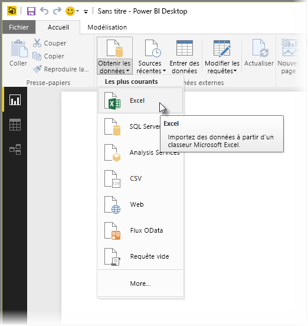
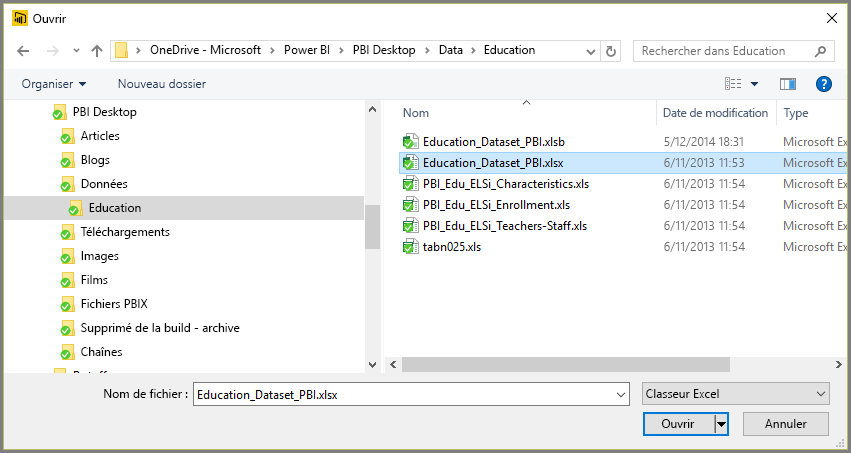
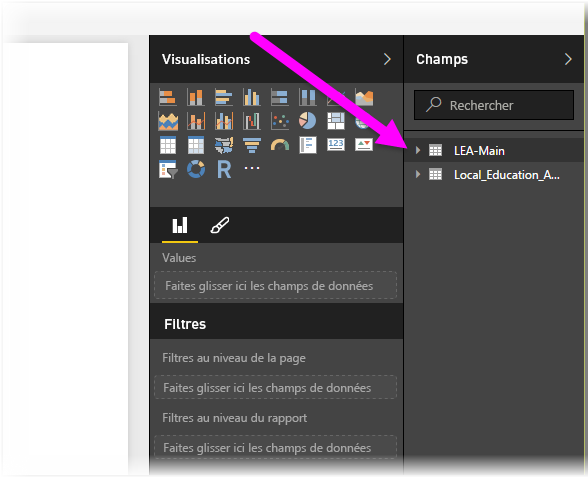

# Se connecter à des classeurs Excel dans Power BI Desktop
La connexion à un classeur Excel à partir de Power BI Desktop est simple. Cet article vous guide dans le processus.

Dans Power BI Desktop, sélectionnez **Obtenir des données > Excel** dans le ruban **Accueil**.

Sélectionnez votre classeur dans la boîte de dialogue **Ouvrir** qui s’affiche.

Power BI Desktop présente les tables sur d’autres éléments de données du classeur dans la fenêtre **Navigateur**. Lorsque vous sélectionnez une table dans le volet gauche, un aperçu des données s’affiche dans le volet droit.

Vous pouvez sélectionner le bouton Charger pour importer les données. Si vous souhaitez modifier les données à l’aide de l’**Éditeur de requête** avant de les importer dans Power BI Desktop, cliquez sur le bouton **Modifier**.

Lorsque vous chargez les données, Power BI Desktop affiche la fenêtre **Charger**, qui affiche l’activité associée au chargement des données.  

Lorsque vous avez terminé, Power BI Desktop affiche les tables et les champs importés de votre classeur Excel dans le volet **Champs**, à droite de la fenêtre.

C’est tout.

Vous êtes maintenant prêt à utiliser les données importées de votre classeur Excel dans Power BI Desktop pour créer des éléments visuels et des rapports ou bien pour interagir avec toutes les autres données auxquelles vous souhaitez vous connecter et que vous voulez importer, par exemple d’autres classeurs Excel, des bases de données ou toute autre source de données.

## Étapes suivantes
Vous pouvez connecter toutes sortes de données à l’aide de Power BI Desktop. Pour plus d’informations sur les sources de données, consultez les ressources suivantes :

* [Qu’est-ce que Power BI Desktop ?](../fundamentals/desktop-what-is-desktop.md)
* [Sources de données dans Power BI Desktop](desktop-data-sources.md)
* [Mettre en forme et combiner des données dans Power BI Desktop](desktop-shape-and-combine-data.md)
* [Se connecter à des fichiers CSV dans Power BI Desktop](desktop-connect-csv.md)   
* [Entrer des données directement dans Power BI Desktop](desktop-enter-data-directly-into-desktop.md)   
