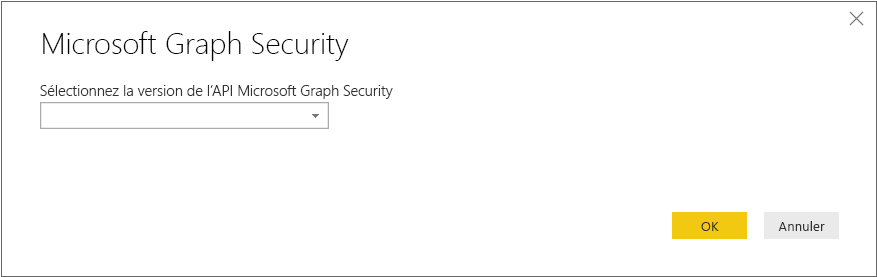
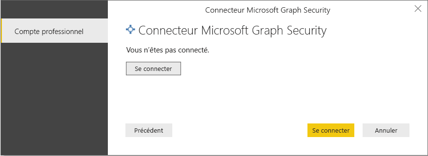
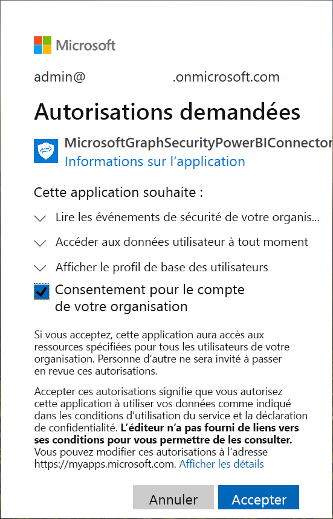
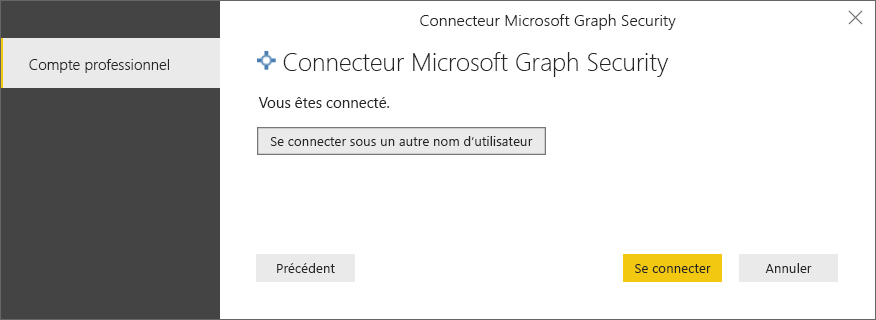
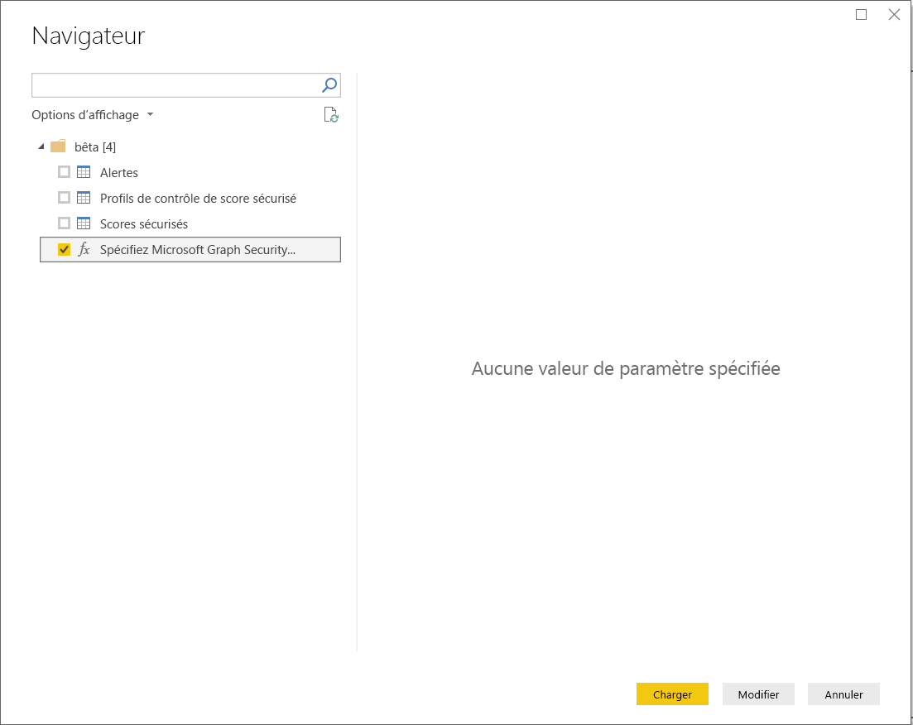
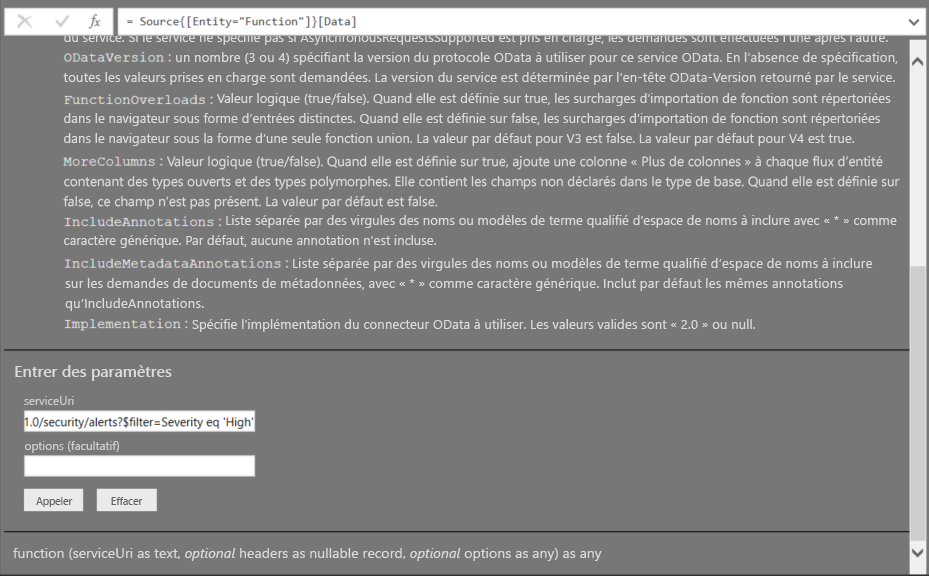

# Se connecter à l’API Microsoft Graph Security dans Power BI Desktop

Utilisez le connecteur Microsoft Graph Security de Power BI Desktop pour vous connecter à l’[API Microsoft Graph Security](/graph/security-concept-overview). Vous pouvez ensuite créer des tableaux de bord et des rapports qui fournissent des insights utiles sur vos [alertes](/graph/api/resources/alert) de sécurité et les [degrés de sécurisation](/graph/api/resources/securescores).

L’API Microsoft Graph Security connecte [plusieurs solutions de sécurité](/graph/api/resources/security-api-overview#alerts) de Microsoft et de ses partenaires pour faciliter la corrélation des alertes. Cette combinaison permet d’accéder à des informations contextuelles riches et simplifie l’automation. Elle permet aux organisations de rapidement obtenir des insights et d’agir sur plusieurs produits de sécurité, tout en réduisant les coûts et la complexité.

## Prérequis à l’utilisation du connecteur Microsoft Graph Security

Pour utiliser le connecteur Microsoft Graph Security, vous devez *explicitement* obtenir le consentement de l’administrateur général Azure Active Directory (Azure AD). Consultez [Exigences d’authentification pour Microsoft Graph Security](/graph/security-authorization).
Le consentement nécessite le nom et l’ID d’application du connecteur, qui est cité ici et qui est disponible dans le [portail Azure](https://portal.azure.com) :

| Propriété | Valeur |
|----------|-------|
| **Nom de l’application** | `MicrosoftGraphSecurityPowerBIConnector` |
| **ID de l’application** | `cab163b7-247d-4cb9-be32-39b6056d4189` |
| **URI de redirection** | `https://oauth.powerbi.com/views/oauthredirect.html` |
|||

Pour donner son consentement à l’utilisation du connecteur, votre administrateur général Azure AD peut utiliser l’une des méthodes suivantes :

* [Donner son consentement pour les applications Azure AD](/azure/active-directory/develop/v2-permissions-and-consent)

* Répondre à une demande que votre application logique envoie au cours de sa première exécution via l’[expérience de consentement d’application](/azure/active-directory/develop/application-consent-experience)
   
Le compte d’utilisateur qui se connecte au connecteur Microsoft Graph Security doit avoir le rôle Lecteur de sécurité Azure AD, **si** l’utilisateur n’est pas membre du rôle *Administrateur de la sécurité*. Consultez [Attribuer des rôles d’Azure AD aux utilisateurs](/graph/security-authorization#assign-azure-ad-roles-to-users).

## Utilisation du connecteur Microsoft Graph Security

Suivez ces étapes pour utiliser le connecteur :

1. Sélectionnez **Obtenir des données** > **Plus** dans le ruban **Accueil** de Power BI Desktop.
2. Sélectionnez **Services en ligne** dans la liste des catégories sur le côté gauche de la fenêtre.
3. Sélectionnez **Microsoft Graph Security (Bêta)** .

    
    
4. Dans la fenêtre **Microsoft Graph Security**, sélectionnez la version de l’API Microsoft Graph que vous souhaitez interroger : **v1.0** or **bêta**.

    
    
5. Connectez-vous à votre compte Azure Active Directory quand vous y êtes invité. Ce compte doit avoir le rôle *Lecteur Sécurité* ou *Administrateur de la sécurité* comme indiqué dans la section précédente.

     
    
6. Si vous êtes l’administrateur *et* si vous n’avez pas encore donné votre consentement pour utiliser le connecteur (application) Microsoft Graph Security de Power BI, vous verrez la boîte de dialogue suivante. Sélectionnez **Consentement pour le compte de votre organisation**.

    
    
7. Une fois que vous êtes connecté, vous voyez la boîte de dialogue suivante qui indique que vous avez été authentifié. Sélectionnez **Se connecter**.

    
    
8. Une fois que vous êtes connecté, la fenêtre **Navigateur** affiche les alertes, les degrés de sécurisation et les autres entités qui sont disponibles dans l’[API Microsoft Graph Security](/graph/security-concept-overview) pour la version que vous avez sélectionnée à l’étape 4. Sélectionnez une ou plusieurs entités à importer et utiliser dans Power BI Desktop. Ensuite, sélectionnez **Charger** pour obtenir l’affichage des résultats qui est indiqué à la fin de l’étape 9.

    
    
9. Si vous souhaitez utiliser une requête complexe avec l’API Microsoft Graph Security, sélectionnez **Specify custom Microsoft Graph Security URL to filter results** (Spécifier une URL Microsoft Graph Security personnalisée pour filtrer les résultats). Utilisez cette fonction pour envoyer une requête [OData.Feed](./desktop-connect-odata.md) à l’API Microsoft Graph Security avec les autorisations requises.

   L’exemple suivant utilise le *serviceUri* `https://graph.microsoft.com/v1.0/security/alerts?$filter=Severity eq 'High'`. Pour savoir comment générer des requêtes afin de filtrer, ordonner ou récupérer les résultats les plus récents, reportez-vous à [Options de requête de système OData](/graph/query-parameters).

   
    
   Quand vous sélectionnez **Invoke** (Appeler), la fonction **OData.Feed** effectue un appel à l’API, ce qui ouvre l’éditeur de requête. Vous filtrez et affinez le jeu de données que vous souhaitez utiliser. Ensuite, vous chargez ces données dans Power BI Desktop.

Voici la fenêtre des résultats pour les entités Microsoft Graph Security sur lesquelles a porté la requête :

   
    

Vous êtes maintenant prêt à utiliser les données importées à partir du connecteur Microsoft Graph Security dans Power BI Desktop. Vous pouvez créer des graphiques ou des rapports. Ou bien, vous pouvez interagir avec d’autres données que vous importez à partir de classeurs Excel, de bases de données ou d’autres sources de données.

## Étapes suivantes
* Consultez les exemples et modèles Power BI qui utilisent ce connecteur dans les [exemples Power BI de l’API Microsoft Graph Security sur GitHub](https://aka.ms/graphsecuritypowerbiconnectorsamples).

* Pour découvrir des scénarios utilisateur et des informations supplémentaires, consultez [ce billet de blog sur le connecteur Microsoft Graph Security de Power BI](https://aka.ms/graphsecuritypowerbiconnectorblogpost).

* Vous pouvez connecter toutes sortes de données à l’aide de Power BI Desktop. Pour plus d’informations, consultez les ressources suivantes :

    * [Qu’est-ce que Power BI Desktop ?](../fundamentals/desktop-what-is-desktop.md)
    * [Sources de données dans Power BI Desktop](desktop-data-sources.md)
    * [Mettre en forme et combiner des données dans Power BI Desktop](desktop-shape-and-combine-data.md)
    * [Se connecter à des classeurs Excel dans Power BI Desktop](desktop-connect-excel.md)
    * [Entrer des données directement dans Power BI Desktop](desktop-enter-data-directly-into-desktop.md)