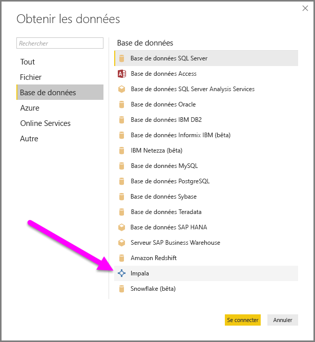
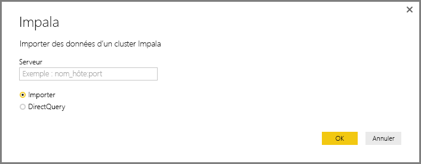
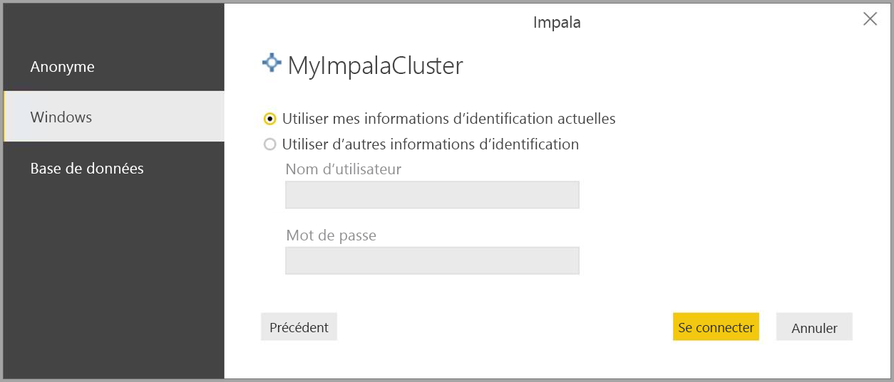

# Se connecter à une base de données Impala dans Power BI Desktop
Dans Power BI Desktop, vous pouvez vous connecter à une base de données **Impala** et utiliser les données sous-jacentes comme avec n’importe quelle autre source de données dans Power BI Desktop.

## Se connecter à une base de données Impala
Pour vous connecter à une base de données **Impala** , procédez comme suit : 

1. Sélectionnez **Obtenir des données** dans le ruban **Accueil** de Power BI Desktop. 

2. Sélectionnez **Base de données** dans les catégories à gauche. Vous voyez alors **Impala**.

    

3. Dans la fenêtre **Impala** qui s’affiche, tapez ou collez le nom de votre serveur Impala dans la zone. Sélectionnez ensuite **OK**. Vous pouvez **importer** des données directement dans Power BI, ou utiliser **DirectQuery**. En savoir plus sur [l’utilisation de DirectQuery](desktop-use-directquery.md).

    

4. Lorsque vous y êtes invité, entrez vos informations d’identification ou connectez-vous de façon anonyme. Le connecteur Impala prend en charge les authentifications anonyme, de base (nom d’utilisateur + mot de passe) et Windows.

    

    > [!NOTE]
    > Une fois que vous avez indiqué le nom d’utilisateur et le mot de passe d’un serveur **Impala** donné, Power BI Desktop utilise ces informations d'identification lors des tentatives de connexion ultérieures. Pour modifier ces informations d’identification, accédez à **Fichier > Options et paramètres > Paramètres de la source de données**.

5. Lorsque vous être connecté, une fenêtre **Navigateur** apparaît et affiche les données disponibles sur le serveur. Choisissez les éléments à importer parmi ces données et utilisez-les dans **Power BI Desktop**.

    

## Considérations et limitations
Quelques limitations et considérations doivent être prises en compte pour le connecteur **Impala** :

* Le connecteur Impala est pris en charge sur la passerelle de données locale en utilisant l’un des trois mécanismes d’authentification pris en charge.

## Étapes suivantes
De nombreuses sources de données sont accessibles avec Power BI Desktop. Pour plus d’informations sur les sources de données, consultez les ressources suivantes :

* [Qu’est-ce que Power BI Desktop ?](../fundamentals/desktop-what-is-desktop.md)
* [Sources de données dans Power BI Desktop](desktop-data-sources.md)
* [Mettre en forme et combiner des données dans Power BI Desktop](desktop-shape-and-combine-data.md)
* [Se connecter à des classeurs Excel dans Power BI Desktop](desktop-connect-excel.md)   
* [Entrer des données directement dans Power BI Desktop](desktop-enter-data-directly-into-desktop.md)   
