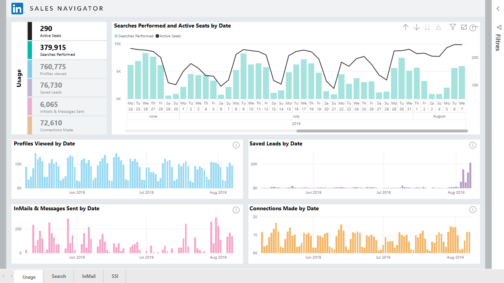
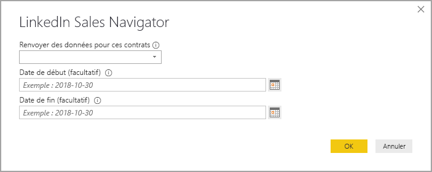
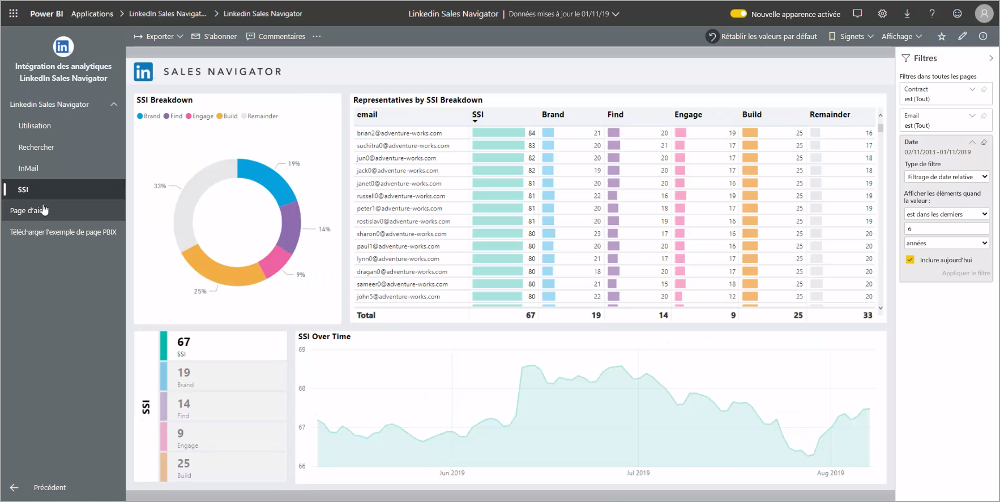
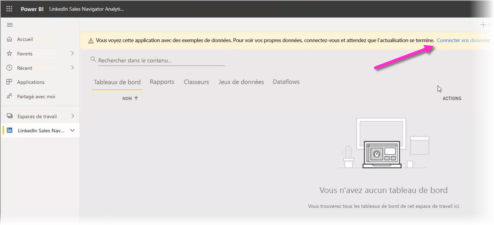

# Se connecter à LinkedIn Sales Navigator dans Power BI Desktop

Dans **Power BI Desktop**, vous pouvez vous connecter à **LinkedIn Sales Navigator** pour trouver et établir facilement des relations comme toute autre source de données dans Power BI Desktop, et créer des rapports prêts à l'emploi indiquant vos progrès.

Pour vous connecter aux données LinkedIn à l'aide de **LinkedIn Sales Navigator**, vous devez disposer d'un plan Entreprise LinkedIn Sales Navigator, et être un administrateur ou un utilisateur de création de rapports sur le contrat Sales Navigator.

La vidéo suivante fournit une visite rapide et un tutoriel pour utiliser l'application modèle **LinkedIn Sales Navigator**, décrite en détail [plus loin dans cet article](#using-the-linkedin-sales-navigator-template-app). 

> [!VIDEO https://www.youtube.com/embed/ZqhmaiORLw0]

## Se connecter à LinkedIn Sales Navigator

Pour vous connecter aux données **LinkedIn Sales Navigator**, sélectionnez **Obtenir des données** dans le ruban **Accueil** de Power BI Desktop. Sélectionnez **Services en ligne** dans les catégories à gauche, puis faites défiler jusqu'à **LinkedIn Sales Navigator (Beta)** .

Vous serez informé que vous vous connectez à un connecteur tiers encore en cours de développement. 

Quand vous sélectionnez **Continuer**, vous êtes invité à spécifier les données qui vous intéressent.

Dans la fenêtre **LinkedIn Sales Navigator** qui apparaît, sélectionnez les données que vous voulez retourner, soit *All contacts* (Tous les contacts) ou *Selected contacts* (Contacts sélectionnés) dans le premier menu déroulant. Vous pouvez ensuite spécifier les dates de début et de fin pour limiter les données reçues à une fenêtre temporelle particulière.

Une fois les informations fournies, Power BI Desktop se connecte aux données associées à votre contrat LinkedIn Sales Navigator. Utilisez la même adresse e-mail que celle utilisée pour vous connecter à LinkedIn Sales Navigator via le site web. 

Une fois connecté, vous êtes invité à sélectionner les données de votre contrat LinkedIn Sales Navigator dans une fenêtre **Navigator**.

Vous pouvez créer n'importe quel rapport à partir de vos données LinkedIn Sales Navigator. Pour vous faciliter la tâche, il existe également un fichier LinkedIn Sales Navigator.PBIX que vous pouvez télécharger, contenant des exemples de données déjà fournies, pour vous familiariser avec les données et les rapports, sans avoir à partir de zéro.

Vous pouvez télécharger le fichier PBIX à partir de l’emplacement suivant :
* [PBIX pour LinkedIn Sales Navigator](service-template-apps-samples.md)

Outre le fichier PBIX, LinkedIn Sales Navigator propose également une application modèle que vous pouvez télécharger et utiliser. La section suivante décrit en détail l'application modèle.

## Utilisation de l'application modèle LinkedIn Sales Navigator

Pour rendre l'utilisation de **LinkedIn Sales Navigator** aussi simple que possible, vous pouvez utiliser l'[application modèle](service-template-apps-overview.md) qui crée automatiquement un rapport prêt à l'emploi à partir de vos données LinkedIn Sales Navigator.

Lorsque vous téléchargez l'application, vous pouvez choisir de vous connecter à vos données ou d'explorer l'application avec des exemples de données. Vous pouvez toujours revenir en arrière et vous connecter à vos propres données LinkedIn Sales Navigator après avoir exploré les exemples de données. 

Vous pouvez obtenir l'application modèle **LinkedIn Sales Navigator** à partir du lien suivant :
* [Application modèle LinkedIn Sales Navigator](https://appsource.microsoft.com/en-us/product/power-bi/pbi-contentpacks.linkedin_navigator)

L'application modèle fournit quatre onglets pour vous aider à analyser et à partager vos informations :

* Utilisation
* Search
* InMail
* SSI

L'onglet **Usage** affiche l'ensemble de vos données LinkedIn Sales Navigator.

L'onglet **Search** vous permet d'approfondir les résultats de vos recherches :

L’onglet **InMail** fournit des informations sur l'utilisation de votre InMail, y compris le nombre d'InMails envoyés, les taux d'acceptation et d’autres informations utiles :

L'onglet **SSI** fournit des détails supplémentaires concernant votre indice de vente social (Social Selling Index ou SSI) :

Pour passer des exemples de données dans vos propres données, sélectionnez **Modifier une application** dans le coin supérieur droit (icône crayon), puis sélectionnez **Connecter vos données** dans l'écran qui apparaît.

De là, vous pouvez connecter vos propres données, en choisissant le nombre de jours de données à charger. Vous pouvez charger jusqu'à 365 jours de données. Vous devrez vous connecter, ici encore en utilisant la même adresse e-mail que celle utilisée pour vous connecter à LinkedIn Sales Navigator via le site web. 

l'application modèle actualise ensuite les données de l'application avec vos données. Vous pouvez également configurer une actualisation planifiée afin que les données de votre application soient aussi actuelles que ce que spécifie votre fréquence d’actualisation. 

Une fois les données mises à jour, vous pouvez voir l'application remplie avec vos propres données.

## Obtention d’aide

Si vous rencontrez des problèmes lors de la connexion à vos données, vous pouvez contacter le support de LinkedIn Sales Navigator à l’adresse https://www.linkedin.com/help/sales-navigator. 

## Étapes suivantes
Vous pouvez connecter toutes sortes de données à l’aide de Power BI Desktop. Pour plus d’informations sur les sources de données, consultez les ressources suivantes :

* [Qu’est-ce que Power BI Desktop ?](../fundamentals/desktop-what-is-desktop.md)
* [Sources de données dans Power BI Desktop](desktop-data-sources.md)
* [Mettre en forme et combiner des données dans Power BI Desktop](desktop-shape-and-combine-data.md)
* [Se connecter à des classeurs Excel dans Power BI Desktop](desktop-connect-excel.md)   
* [Entrer des données directement dans Power BI Desktop](desktop-enter-data-directly-into-desktop.md)   
