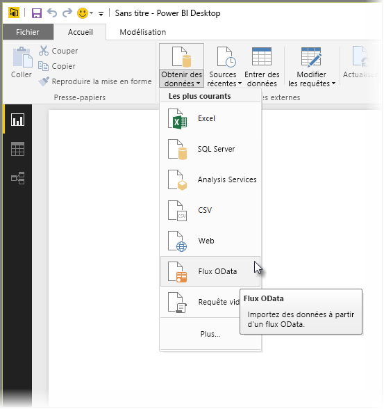
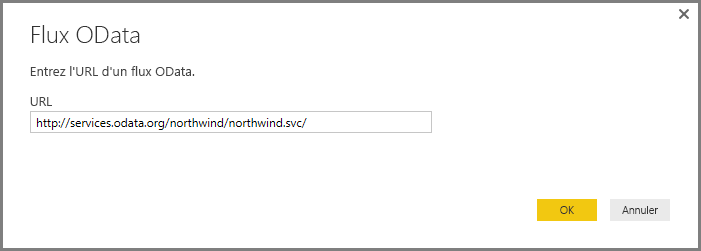
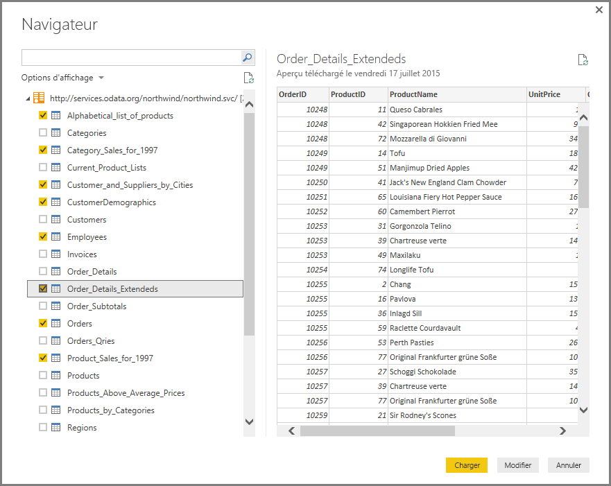
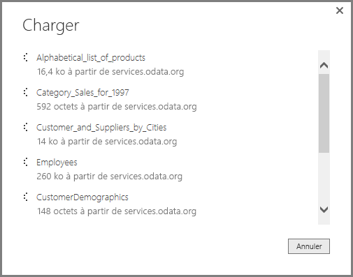
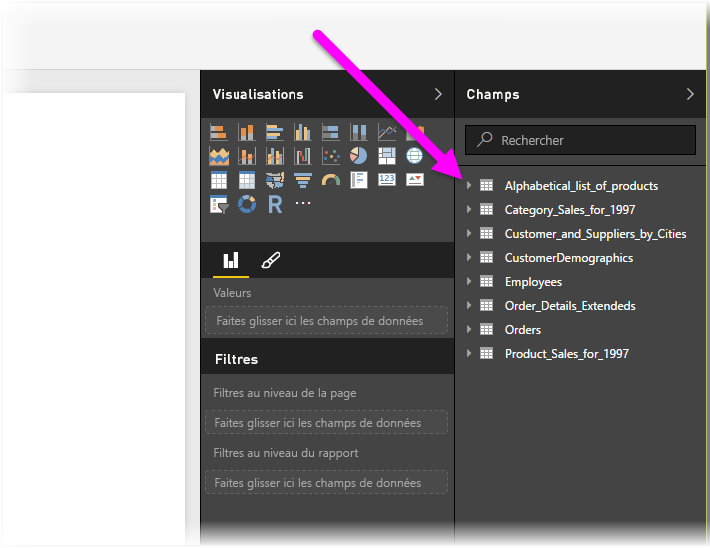

# Se connecter à des flux OData dans Power BI Desktop
Dans Power BI Desktop, vous pouvez vous connecter à un **flux OData** et utiliser les données sous-jacentes comme n’importe quelle autre source de données dans Power BI Desktop.

Pour vous connecter à un flux OData, sélectionnez **Obtenir des données > Flux OData** dans le ruban **Accueil** de Power BI Desktop.

Dans la fenêtre **Flux OData** qui s’affiche, tapez ou collez l’URL de votre flux OData dans le champ, puis sélectionnez **OK**.

Power BI Desktop se connecte au flux OData et affiche les tables disponibles et les autres éléments de données dans la fenêtre **Navigateur**. Lorsque vous sélectionnez un élément, le volet droit de la fenêtre **Navigateur** affiche un aperçu des données. Vous pouvez sélectionner autant de tables que vous le voulez. La fenêtre **Navigateur** affiche un aperçu de la table sélectionnée.

Vous pouvez utiliser le bouton **Modifier**, qui lance l’**Éditeur de requête**, dans lequel vous pouvez mettre en forme et transformer les données du flux OData avant de les importer dans Power BI Desktop. Vous pouvez également cliquer sur le bouton **Charger** et importer tous les éléments de données que vous avez sélectionnés dans le volet de gauche.

Lorsque vous sélectionnez **Charger**, Power BI Desktop importe les éléments sélectionnés et affiche une fenêtre **Charger** qui présente la progression de l’importation.

Une fois le chargement terminé, Power BI Desktop place les tables et les autres éléments de données sélectionnés dans le volet **Champs**, à droite de la vue *Rapports* dans Power BI Desktop.

C’est tout.

Vous êtes maintenant prêt à utiliser les données importées du flux OData dans Power BI Desktop pour créer des éléments visuels et des rapports ou bien pour interagir avec toutes les autres données auxquelles vous souhaitez vous connecter et que vous voulez importer, par exemple d’autres classeurs Excel, des bases de données ou toute autre source de données.

## Étapes suivantes
Vous pouvez connecter toutes sortes de données à l’aide de Power BI Desktop. Pour plus d’informations sur les sources de données, consultez les ressources suivantes :

* [Qu’est-ce que Power BI Desktop ?](../fundamentals/desktop-what-is-desktop.md)
* [Sources de données dans Power BI Desktop](desktop-data-sources.md)
* [Mettre en forme et combiner des données dans Power BI Desktop](desktop-shape-and-combine-data.md)
* [Se connecter à des classeurs Excel dans Power BI Desktop](desktop-connect-excel.md)   
* [Entrer des données directement dans Power BI Desktop](desktop-enter-data-directly-into-desktop.md)   
