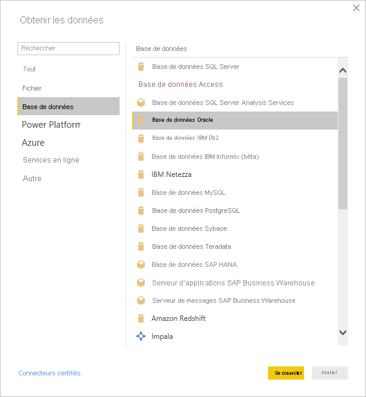
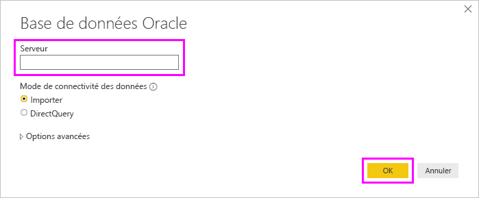
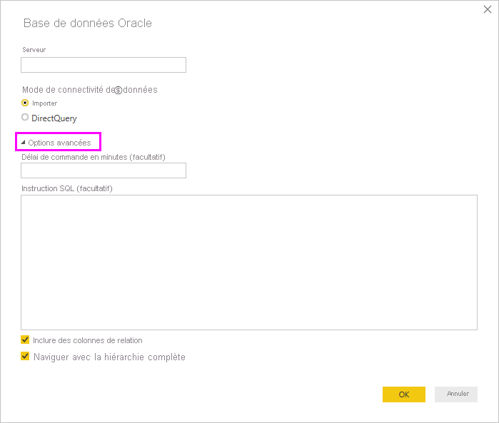

# Se connecter à une base de données Oracle avec Power BI Desktop
Pour se connecter à une base de données Oracle avec Power BI Desktop, le logiciel client Oracle approprié doit être installé sur l’ordinateur exécutant Power BI Desktop. Le logiciel client Oracle que vous utilisez dépend de la version de Power BI Desktop que vous avez installée : 32 bits ou 64 bits. Il dépend également de votre version du serveur Oracle.

Versions d’Oracle prises en charge : 
- Oracle Server 9 et versions ultérieures
- Logiciel ODAC (Oracle Data Access Client) 11.2 et versions ultérieures

> [!NOTE]
> Si vous configurez une base de données Oracle pour Power BI Desktop, une passerelle de données locale ou Power BI Report Server, consultez les informations de l’article [Type de connexion Oracle](/sql/reporting-services/report-data/oracle-connection-type-ssrs?view=sql-server-ver15). 

## Identification de la version installée de Power BI Desktop
Pour identifier la version installée de Power BI Desktop, sélectionnez **Fichier** > **Aide** > **À propos de**, puis regardez la ligne **Version**. L’illustration suivante indique qu’une version 64 bits de Power BI Desktop est installée :

## Installer le client Oracle
- Pour la version 32 bits de Power BI Desktop, [téléchargez et installez le client Oracle 32 bits](https://www.oracle.com/technetwork/topics/dotnet/utilsoft-086879.html).

- Pour la version 64 bits de Power BI Desktop, [téléchargez et installez le client Oracle 64 bits](https://www.oracle.com/database/technologies/odac-downloads.html).

> [!NOTE]
> Choisissez une version d’ODAC compatible avec votre serveur Oracle. Par exemple, ODAC 12.x ne prend pas toujours en charge Oracle Server version 9.
> Choisissez le programme d’installation Windows du client Oracle.
> Pendant l’installation du client Oracle, veillez à activer *Configurer ASP.NET sur les fournisseurs ODP.NET et/ou Oracle pour l’ensemble de l’ordinateur* en cochant la case correspondante dans l’Assistant Installation. Dans certaines versions de l’Assistant du client Oracle, elle est cochée par défaut, mais ce n’est pas le cas de toutes. Il faut qu’elle soit cochée pour que Power BI puisse se connecter à votre base de données Oracle.

## Se connecter à une base de données Oracle
Une fois que vous avez installé le pilote du client Oracle correspondant, vous pouvez vous connecter à une base de données Oracle. Pour établir la connexion, effectuez les étapes suivantes :

1. Sous l’onglet **Accueil**, sélectionnez **Obtenir les données**. 

2. Dans la fenêtre **Obtenir les de données** qui s’affiche, sélectionnez **Plus** (si nécessaire), sélectionnez **Base de données** > **Base de données Oracle**, puis sélectionnez **Se connecter**.
   
   
3. Dans la boîte de dialogue **Base de données Oracle** qui s’affiche, indiquez le nom du **serveur**, puis sélectionnez **OK**. Si un identificateur de sécurité (SID) est nécessaire, vous pouvez le spécifier dans le format suivant : *Nom_serveur/SID*, où *SID* est le nom unique de la base de données. Si le format *Nom_serveur/SID* ne fonctionne pas, utilisez *Nom_serveur/Nom_service*, où *Nom_service* est l’alias que vous utilisez pour vous connecter.

   

   > [!NOTE]
   > Si vous utilisez une base de données locale ou des connexions de base de données autonomes, vous devrez peut-être placer le nom du serveur entre guillemets pour éviter les erreurs de connexion. 
      
4. Si vous voulez importer des données en utilisant une requête de base de données native, placez votre requête dans la zone **Instruction SQL**, qui apparaît quand vous développez la section **Options avancées** de la boîte de dialogue **Base de données Oracle**.
   
   

5. Après avoir entré les informations de votre base de données Oracle dans la boîte de dialogue **Base de données Oracle** (et éventuellement des informations facultatives comme un SID ou une requête de base de données native), sélectionnez **OK** pour vous connecter.
5. Si la base de données Oracle exige des informations d’identification d’utilisateur de base de données, entrez-les dans la boîte de dialogue quand vous y êtes invité.

## Résolution des problèmes

Vous pouvez rencontrer l’une des erreurs suivantes dans Oracle quand la syntaxe de dénomination est incorrecte ou n’est pas configurée correctement :

* ORA-12154: TNS:could not resolve the connect identifier specified. (ORA-12154 : TNS : l’identificateur de connexion indiqué n’a pas pu être résolu.)
* ORA-12514: TNS:listener does not currently know of service requested in connect descriptor. (ORA-12514 : le processus d’écoute ne connaît pas actuellement le service demandé dans le descripteur de connexion.)
* ORA-12541: TNS:no listener. (ORA-12541 : TNS : pas de processus d’écoute.)
* ORA-12170: TNS:connect timeout occurred. (ORA-12170 : TNS : une expiration de la connexion s’est produite.)
* ORA-12504: TNS:listener was not given the SERVICE_NAME in CONNECT_DATA. (ORA-12504 : le processus d’écoute n’a pas reçu SERVICE_NAME dans CONNECT_DATA.)

Ces erreurs peuvent se produire si le client Oracle n’est pas installé ou s’il n’est pas configuré correctement. S’il est installé, vérifiez que le fichier tnsnames.ora est correctement configuré et que vous utilisez le bon nom de service .NET (net_service_name). Vous devez également vérifier que le net_service_name est le même sur l’ordinateur utilisant Power BI Desktop et sur l’ordinateur qui exécute la passerelle. Pour plus d’informations, consultez [Installer le client Oracle](#install-the-oracle-client).

Vous pouvez également rencontrer un problème de compatibilité entre la version du serveur Oracle et la version d’ODAC. En règle générale, vous voulez que ces versions correspondent, car certaines combinaisons sont incompatibles. Par exemple, ODAC 12.x ne prend pas en charge Oracle Server version 9.

Si vous avez téléchargé Power BI Desktop à partir du Microsoft Store, vous risquez ne pas pouvoir vous connecter aux bases de données Oracle en raison d’un problème de pilote Oracle. Si vous rencontrez ce problème, le message d’erreur retourné est : *Référence d’objet non définie*. Pour résoudre ce problème, effectuez une de ces étapes :

* Téléchargez Power BI Desktop à partir du [Centre de téléchargement](https://www.microsoft.com/download/details.aspx?id=58494) au lieu du Microsoft Store.

* Si vous voulez utiliser la version du Microsoft Store : sur votre ordinateur local, copiez oraons.dll depuis _12.X.X\client_X_ vers _12.X.X\client_X\bin_, où _X_ représente les numéros de la version et du répertoire.

Si vous voyez le message d’erreur *Référence d’objet non définie* dans Power BI Gateway quand vous vous connectez à une base de données Oracle, suivez les instructions fournies dans [Gérer votre source de données - Oracle](service-gateway-onprem-manage-oracle.md).

Si vous utilisez Power BI Report Server, consultez les instructions de l’article [Type de connexion Oracle](/sql/reporting-services/report-data/oracle-connection-type-ssrs?view=sql-server-ver15).