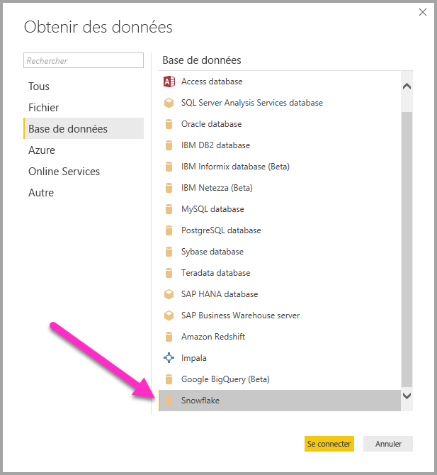
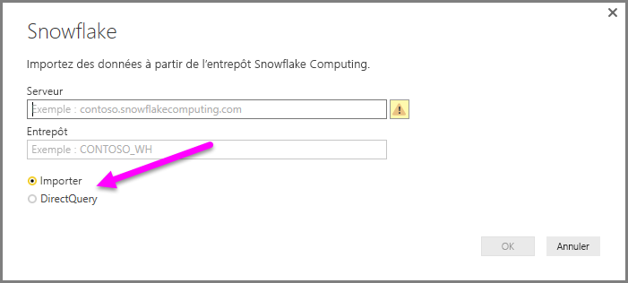
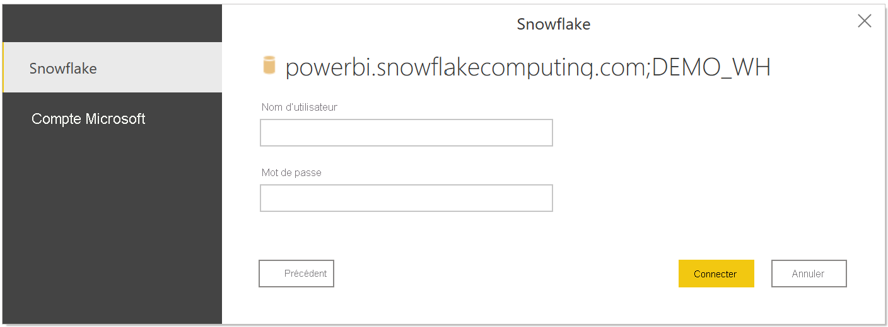
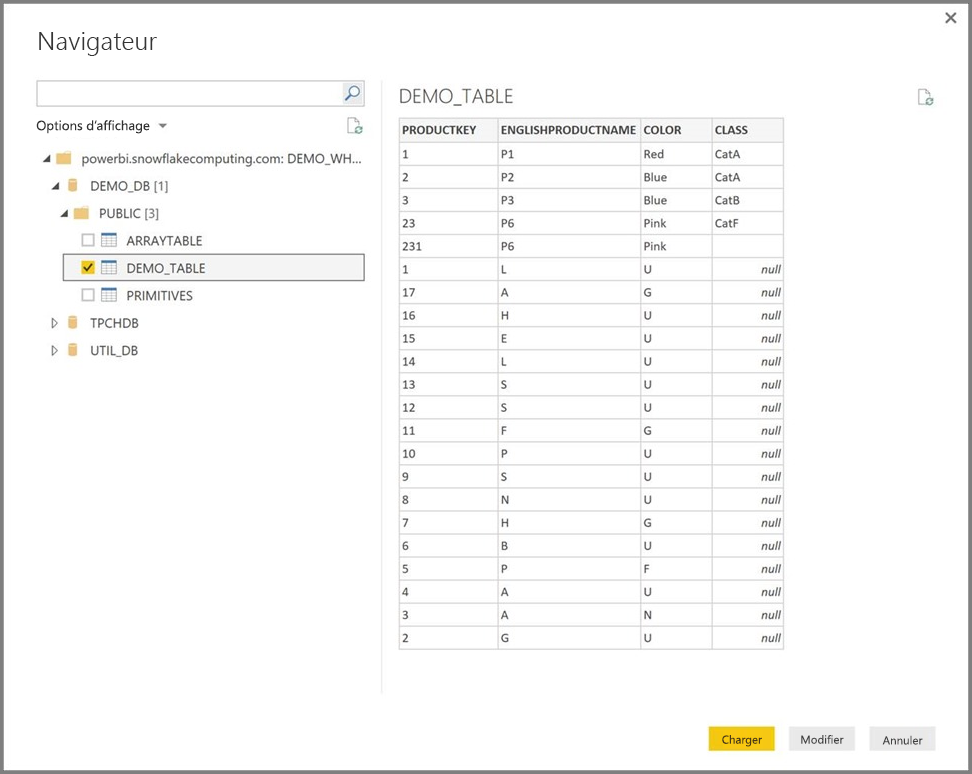

# Se connecter à un entrepôt Snowflake Computing dans Power BI Desktop
Dans Power BI Desktop, vous pouvez vous connecter à un entrepôt **Snowflake Computing** et utiliser les données sous-jacentes comme n’importe quelle autre source de données dans Power BI Desktop. 

## Se connecter à un entrepôt Snowflake Computing
Pour vous connecter à un entrepôt **Snowflake Computing**, sélectionnez **Obtenir des données** à partir du ruban **Accueil** de Power BI Desktop. Sélectionnez **Base de données** dans les catégories à gauche pour afficher **Snowflake**.

Dans la fenêtre **Snowflake** qui s’affiche, tapez ou collez le nom de votre entrepôt Snowflake Computing dans la zone, puis sélectionnez **OK**. Notez que vous pouvez choisir d’**importer** des données directement dans Power BI, ou utiliser **DirectQuery**. En savoir plus sur [l’utilisation de DirectQuery](desktop-use-directquery.md). Notez que l’authentification unique AAD prend en charge DirectQuery uniquement.

Lorsque vous y êtes invité, indiquez votre nom d’utilisateur et votre mot de passe.

> [!NOTE]
> Une fois que vous indiquez le nom d’utilisateur et le mot de passe d’un serveur **Snowflake** donné, Power BI Desktop les utilise dans les tentatives de connexion ultérieures. Pour modifier ces informations d’identification, accédez à **Fichier > Options et paramètres > Paramètres de la source de données**.
> 
> 

Si vous souhaitez utiliser l’option Compte Microsoft, l’intégration AAD avec Snowflake doit être configurée côté Snowflake. Pour ce faire, lisez la section Bien démarrer dans la [documentation Snowflake sur le sujet](https://docs.snowflake.net/manuals/user-guide/oauth-powerbi.html#power-bi-sso-to-snowflake).

Une fois que vous êtes connecté, une fenêtre **Navigateur** apparaît et affiche les données disponibles sur le serveur. Vous pouvez ensuite sélectionner un ou plusieurs éléments à importer et utiliser dans **Power BI Desktop**.

Vous pouvez **charger** la table sélectionnée, ce qui permet d’afficher la table entière dans **Power BI Desktop**, ou **modifier** la requête, ce qui permet d’ouvrir l’**éditeur de requête**. Vous pouvez ainsi filtrer et affiner l’ensemble de données que vous souhaitez utiliser, puis charger ce jeu de données affiné dans **Power BI Desktop**.

## Étapes suivantes
Vous pouvez connecter toutes sortes de données à l’aide de Power BI Desktop. Pour plus d’informations sur les sources de données, consultez les ressources suivantes :

* [Qu’est-ce que Power BI Desktop ?](../fundamentals/desktop-what-is-desktop.md)
* [Sources de données dans Power BI Desktop](desktop-data-sources.md)
* [Mettre en forme et combiner des données dans Power BI Desktop](desktop-shape-and-combine-data.md)
* [Se connecter à des classeurs Excel dans Power BI Desktop](desktop-connect-excel.md)   
* [Entrer des données directement dans Power BI Desktop](desktop-enter-data-directly-into-desktop.md)   
