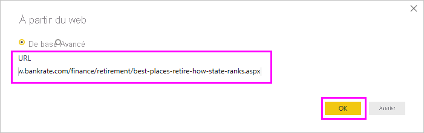
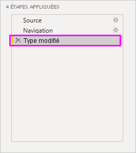
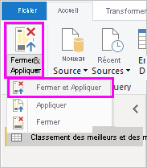
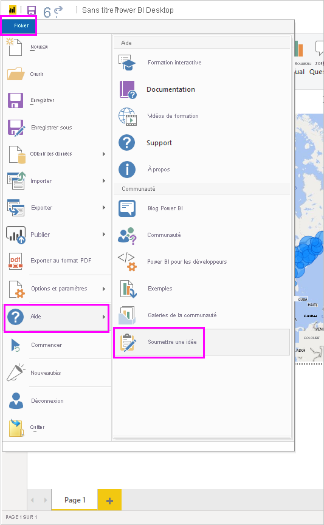

# Se connecter à des sources de données dans Power BI Desktop

Power BI Desktop vous permet de vous connecter facilement au monde des données en perpétuelle expansion. Si vous ne possédez pas Power BI Desktop, vous pouvez le [télécharger](https://go.microsoft.com/fwlink/?LinkID=521662) et l’installer.

De *nombreuses sortes* de sources de données sont disponibles dans Power BI Desktop. L’illustration ci-dessous montre comment se connecter aux données en sélectionnant **Obtenir des données** > **Autres** > **Web**.

## Exemple de connexion à des données

Pour cet exemple, nous allons nous connecter à une source de données **web**.

Imaginez que vous partez à la retraite. Vous souhaitez vivre dans un endroit avec du soleil, une fiscalité avantageuse et un bon système de santé. Ou... peut-être que vous êtes analyste de données et que vous souhaitez que ces informations soient utiles à vos clients, pour qu’ils puissent cibler les marchés *particulièrement porteurs*.

Dans les deux cas, vous trouvez une ressource web qui contient des données intéressantes sur ces thèmes, et sur d’autres :

[https://www.bankrate.com/finance/retirement/best-places-retire-how-state-ranks.aspx](https://www.bankrate.com/finance/retirement/best-places-retire-how-state-ranks.aspx)

Sélectionnez **Obtenir des données** > **Autres** > **Web**. Dans **À partir du web**, entrez l’adresse.

Quand vous sélectionnez **OK**, la fonctionnalité *Requête* de Power BI Desktop entre en jeu. Power BI Desktop contacte la ressource web et la fenêtre **Navigateur** renvoie les résultats trouvés dans cette page web. Dans ce cas, il a trouvé une table et le document global. Cette table nous intéresse, donc nous la sélectionnons dans la liste. La fenêtre **Navigateur** affiche un aperçu.

À ce stade, vous pouvez modifier la requête avant de charger la table en sélectionnant **Transformer les données** en bas de la fenêtre, ou juste charger la table.

Sélectionnez **Transformer les données** pour charger la table et lancer l’Éditeur Power Query. Le volet **Paramètres d’une requête** s’affiche. S’il ne s’affiche pas, sélectionnez **Afficher** dans le ruban, puis **Paramètres d’une requête** pour afficher le volet **Paramètres d’une requête**. Vous obtenez :

Les données sont plutôt du texte que des nombres, or nous avons besoin de nombres. Aucun problème. Pour changer, il suffit de cliquer avec le bouton droit sur l’en-tête de la colonne et de sélectionner **Modifier le type** > **Nombre entier**. Pour sélectionner plusieurs colonnes, commencez par sélectionner une colonne, maintenez la touche Maj enfoncée pour sélectionner d’autres colonnes adjacentes, puis cliquez avec le bouton droit sur un en-tête de colonne pour changer toutes les colonnes sélectionnées. Utilisez la touche Ctrl pour choisir des colonnes qui ne sont pas adjacentes.

Dans **Paramètres d’une requête**, les **ÉTAPES APPLIQUÉES** reflètent toutes les modifications apportées. Au fur et à mesure que vous apportez d’autres modifications aux données, l’Éditeur Power Query les enregistre dans la section **ÉTAPES APPLIQUÉES**, que vous pouvez ajuster, revisiter, réorganiser ou supprimer au besoin.

Il est possible d’apporter d’autres modifications à la table même après l’avoir chargée, mais nous n’en avons pas besoin pour l’instant. Quand vous avez terminé, sélectionnez **Fermer et appliquer** dans le ruban **Accueil**. Power BI Desktop applique les modifications et ferme l’Éditeur Power Query.

Le modèle de données étant chargé, dans la vue **Rapport** dans Power BI Desktop, nous pouvons commencer à créer des visualisations en faisant glisser des champs sur la zone de dessin.

Bien entendu, ce modèle est simple, avec une seule connexion de données. La plupart des rapports Power BI Desktop ont des connexions à différentes sources de données, adaptées à vos besoins, avec des relations qui produisent un modèle de données riche.

## Étapes suivantes
Power BI Desktop vous permet d’effectuer des tâches très diverses. Pour plus d’informations sur ses fonctionnalités, passez en revue les ressources suivantes :

* [Qu’est-ce que Power BI Desktop ?](../fundamentals/desktop-what-is-desktop.md)
* [À propos de l’éditeur de requêtes dans Power BI Desktop](../transform-model/desktop-query-overview.md)
* [Sources de données dans Power BI Desktop](desktop-data-sources.md)
* [Mettre en forme et combiner des données dans Power BI Desktop](desktop-shape-and-combine-data.md)
* [Effectuer des tâches de requête courantes dans Power BI Desktop](../transform-model/desktop-common-query-tasks.md)   

Vous souhaitez nous faire parvenir vos commentaires ? Excellent ! Utilisez l’élément de menu **Soumettre une idée** dans Power BI Desktop ou visitez la page [Community Feedback](https://community.powerbi.com/t5/Community-Feedback/bd-p/community-feedback). Nous attendons avec impatience vos commentaires.

