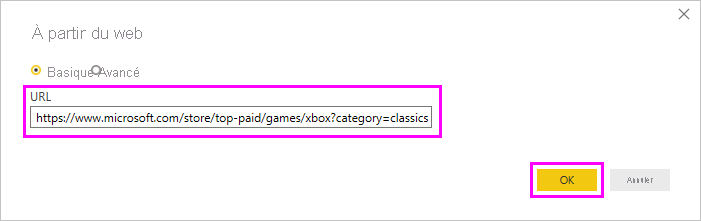
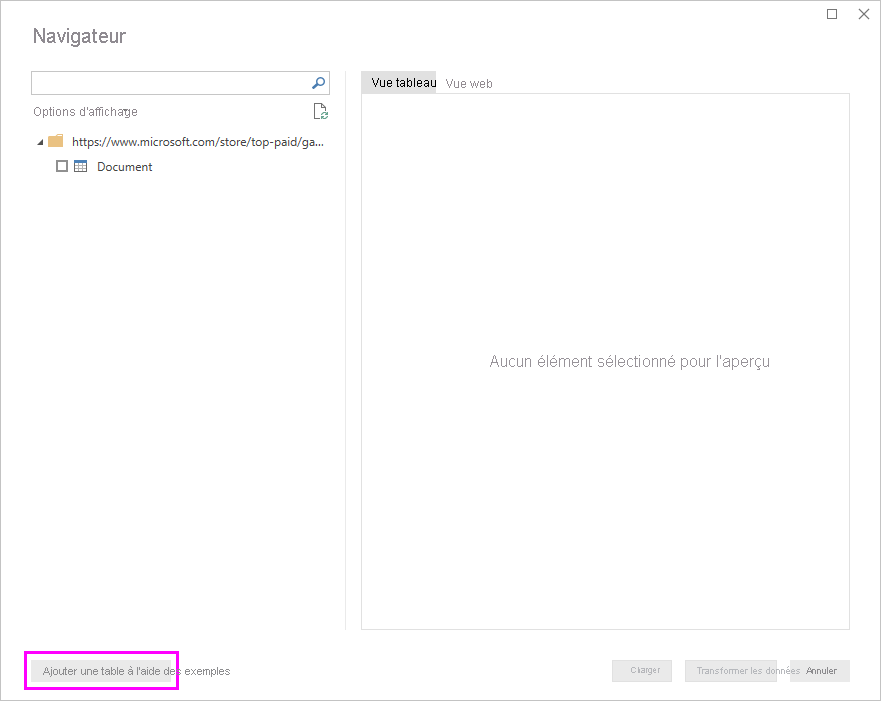
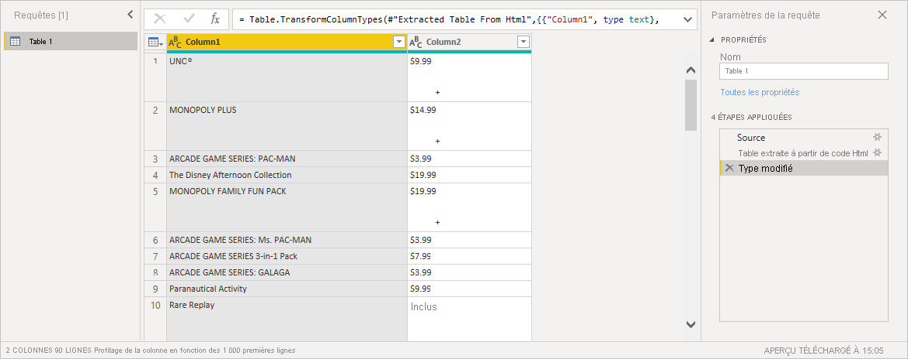

# Obtenir des données de page web en fournissant des exemples

L’obtention des données d’une page web permet aux utilisateurs d’extraire facilement les données de pages web et d’importer ces données dans *Power BI Desktop*. Cependant, les données des pages web figurent souvent dans des tables mal organisées et donc difficiles à extraire. L’obtention de données à partir de ces pages peut être compliquée, même si les données sont structurées et cohérentes.

Mais il existe une solution. Avec la fonctionnalité *Obtenir les données du web par exemple*, vous pouvez indiquer à Power BI Desktop les données à extraire en fournissant un ou plusieurs exemples dans la boîte de dialogue du connecteur. Power BI Desktop collecte les autres données sur la page qui correspondent à vos exemples. Cette solution vous permet d’extraire toutes sortes de données de pages web, y compris les données de tables *et* d’autres données ne figurant pas dans des tables.

Les prix dans les graphiques sont uniquement indiqués à titre d’exemple.

## Utilisation de l’option Obtenir les données du web par exemple

Sélectionnez **Obtenir des données** dans le menu du ruban **Accueil**. Dans la boîte de dialogue qui s’affiche, sélectionnez **Autres** parmi les catégories dans le volet gauche, puis choisissez **Web**. Sélectionnez **Connexion** pour continuer.

Dans **À partir du web**, entrez l’URL de la page web de laquelle vous souhaitez extraire des données. Dans cet article, nous allons utiliser la page web du Microsoft Store pour montrer le fonctionnement de ce connecteur.

Si vous souhaitez suivre la procédure, vous pouvez utiliser l’[URL du Microsoft Store](https://www.microsoft.com/store/top-paid/games/xbox?category=classics) mentionnée dans cet article :

    https://www.microsoft.com/store/top-paid/games/xbox?category=classics

Quand vous sélectionnez **OK**, vous êtes dirigé vers la boîte de dialogue **Navigateur**, où sont présentées toutes les tables ayant été automatiquement détectées dans la page web. Dans le cas illustré dans l’image ci-dessous, aucune table n’a été trouvée. Sélectionnez **Ajouter une table à l’aide des exemples** pour fournir des exemples.

**Ajouter une table à l’aide des exemples** présente une fenêtre interactive qui donne un aperçu du contenu de la page web. Entrez les exemples de valeurs des données que vous souhaitez extraire.

Dans cet exemple, nous allons extraire le *nom* et le *prix* de chacun des jeux dans la page. Pour cela, nous spécifions quelques exemples provenant de la page pour chaque colonne. Quand vous entrez les exemples, *Power Query* extrait les données qui correspondent au modèle des exemples d’entrées à l’aide d’algorithmes d’extraction de données intelligents.

> [!NOTE]
> Les suggestions de valeurs incluent uniquement les valeurs inférieures ou égales à 128 caractères en longueur.

Une fois que vous avez extrait toutes les données souhaitées de la page web, sélectionnez **OK** pour accéder à l’éditeur Power Query. Vous pouvez appliquer d’autres transformations ou mettre en forme les données, notamment en combinant ces données avec d’autres données de nos sources.

De là, vous pouvez créer des visuels ou bien utiliser les données de la page web pour créer des rapports dans Power BI Desktop.

## Étapes suivantes

Vous pouvez connecter toutes sortes de données à l’aide de Power BI Desktop. Pour plus d’informations sur les sources de données, consultez les ressources suivantes :

* [Ajouter une colonne à partir d’un exemple dans Power BI Desktop](../create-reports/desktop-add-column-from-example.md)
* [Se connecter à des pages web à partir de Power BI Desktop](desktop-connect-to-web.md)
* [Sources de données dans Power BI Desktop](desktop-data-sources.md)
* [Mettre en forme et combiner des données dans Power BI Desktop](desktop-shape-and-combine-data.md)
* [Se connecter à des classeurs Excel dans Power BI Desktop](desktop-connect-excel.md)
* [Se connecter à des fichiers CSV dans Power BI Desktop](desktop-connect-csv.md)
* [Entrer des données directement dans Power BI Desktop](desktop-enter-data-directly-into-desktop.md)
