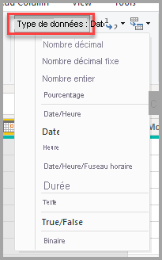

# Types de données dans Power BI Desktop
Cet article décrit les types de données pris en charge dans Power BI Desktop et Data Analysis Expressions (DAX). 

Lorsque vous chargez des données dans Power BI Desktop, celui-ci tente de convertir le type de données de la colonne source en un type de données qui prend mieux en charge un stockage, des calculs et une visualisation des données plus efficaces. Par exemple, si une colonne de valeurs que vous importez à partir d’Excel ne contient aucune valeur fractionnaire, Power BI Desktop convertit toute la colonne de données en type de données Nombre entier, qui convient davantage au stockage des nombres entiers.

Ce concept est important, car certaines fonctions DAX ont des exigences particulières en matière de type de données. Même si très souvent DAX convertit implicitement un type de données pour vous, cela n’est pas toujours le cas.  Par exemple, si une fonction DAX nécessite un type de données Date et que le type de données de votre colonne est Texte, la fonction DAX ne fonctionnera pas correctement.  Il est donc important et utile d’obtenir le type de données correct pour une colonne. Les conversions implicites sont décrites plus loin dans cet article.

## Déterminer et spécifier le type de données d’une colonne
Dans Power BI Desktop, vous pouvez déterminer et spécifier le type de données d’une colonne dans l’Éditeur de requête ou dans la vue Données ou Rapport :

**Types de données dans l’Éditeur de requête**

**Types de données dans la vue Données ou Rapport**

La liste déroulante Type de données dans l’Éditeur de requête comporte deux types de données actuellement absents dans la vue Données ou Rapport : **Date/Heure/Fuseau horaire** et **Durée**. Quand une colonne avec ces types de données est chargée dans le modèle et affichée dans la vue Données ou Rapport, une colonne avec le type de données Date/Heure/Fuseau horaire est convertie au format Date/Heure et une colonne avec le type de données Durée est convertie au format Nombre décimal.

Le type de données **Binaire** n’est pas pris en charge actuellement en dehors de l’éditeur de requête. Dans l’éditeur de requête, vous pouvez l’utiliser lors du chargement de fichiers binaires si vous le convertissez en d’autres types de données avant de le charger dans le modèle Power BI. Il existe dans les menus Vue de données et Vue de rapport pour des raisons de compatibilité, mais si vous essayez de charger des colonnes binaires dans le modèle Power BI, vous pouvez rencontrer des erreurs.  

### Types numériques
Power BI Desktop prend en charge trois types numériques :

**Nombre décimal** : représente un nombre à virgule flottante 64 bits (huit octets). C’est le type numérique le plus courant. Il correspond aux nombres tels qu’on se les représente habituellement.  Bien que conçu pour gérer les nombres avec des valeurs fractionnelles, il gère également les nombres entiers.  Le type Nombre décimal peut gérer des valeurs négatives comprises entre -1,79E +308 et -2,23E -308, 0, et des valeurs positives comprises entre 2,23E -308 et 1,79E +308. Par exemple, des nombres comme 34, 34,01 et 34,000367063 sont des nombres décimaux valides. La précision maximale qui peut être représentée dans un type Nombre décimal a une longueur de 15 chiffres. Le séparateur décimal peut figurer n’importe où dans le nombre. Le type Nombre décimal correspond à la manière dont Excel stocke les nombres.

**Nombre décimal fixe** : possède un emplacement fixe pour le séparateur décimal. Le séparateur décimal a toujours quatre chiffres à sa droite et autorise 19 chiffres de précision.  La plus grande valeur, qu’il peut représenter est 922 337 203 685 477,5807 (positif ou négatif).  Le type Nombre décimal fixe est utile dans les cas où l’arrondi peut introduire des erreurs.  Si vous utilisez beaucoup de nombres ayant de petites valeurs fractionnelles, il y a un risque de cumul qui peut entraîner une légère imprécision.  Les valeurs situées après les quatre chiffres à droite du séparateur décimal étant tronquées, le type Nombre décimal fixe peut vous aider à éviter ces genres d’erreurs.   Si vous connaissez SQL Server, ce type de données correspond au format Décimal de SQL Server (19,4) ou au type de données Devise dans Power Pivot. 

**Nombre entier** : représente un entier 64 bits (huit octets). S’agissant d’un entier, il ne comporte aucun chiffre à droite du séparateur décimal. Il autorise 19 chiffres ; les nombres entiers positifs ou négatifs compris entre -9 223 372 036 854 775 807 (-2^63+1) et 9 223 372 036 854 775 806 (2^63-2). Il peut représenter la plus grande précision possible parmi les divers types de données numériques.  Comme Nombre décimal fixe, le type Nombre entier peut être utile dans les cas où vous avez besoin de contrôler l’arrondi. 

> [!NOTE]
>  Le modèle de données Power BI Desktop prend en charge les valeurs d’entier 64 bits, mais le plus grand nombre de visuels pouvant être exprimé de façon sûre est 9,007,199,254,740,991 (2^53-1) en raison des limitations de JavaScript. Si vous travaillez avec des chiffres supérieurs dans votre modèle de données, vous pouvez réduire la taille par le biais de calculs avant de les ajouter à un visuel. 
> 
>

### Types Date/Heure
Power BI Desktop prend en charge cinq types de données Date/Heure dans la vue Requête.  Les types Date/Heure/Fuseau horaire et Durée sont convertis pendant le chargement dans le modèle. Le modèle de données Power BI Desktop prend en charge uniquement la date et l’heure, mais il peut être mis en forme sous forme de dates ou d’heures de manière indépendante. 

**Date/Heure** : représente une valeur de date et d’heure.  Dans les coulisses, la valeur Date/Heure est stockée au format Nombre décimal.  Vous pouvez donc effectuer une conversion entre les deux.   La partie heure d’une date est stockée sous forme de fraction de multiples entiers de 1/300 de seconde (3,33 ms).  Les dates comprises entre les années 1900 et 9999 sont prises en charge.

**Date** : représente seulement une date (aucune partie heure).  En cas de conversion dans le modèle, une valeur de Date est identique à une valeur de Date/Heure avec une valeur fractionnelle égale à zéro.

**Heure** : représente seulement une heure (aucune partie date).  En cas de conversion dans le modèle, une valeur d’Heure est identique à une valeur de Date/Heure sans aucun chiffre à gauche du séparateur décimal.

**Date/Heure/Fuseau horaire** : représente une Date/Heure au format UTC avec un décalage de fuseau horaire.  Ce format est converti en Date/Heure pendant le chargement dans le modèle. Le modèle Power BI n’ajuste pas le fuseau horaire en fonction de la localisation ou des paramètres régionaux d’un utilisateur. Si la valeur 09:00 est chargée dans le modèle aux États-Unis, elle s’affiche au format 09:00 chaque fois que le rapport est ouvert ou consulté. 

**Durée** : représente une durée. Ce format est converti au format Nombre décimal lors du chargement dans le modèle.  En tant que type Nombre décimal, il peut être ajouté ou soustrait d’un champ Date/Heure avec des résultats corrects.  S’agissant d’un type Nombre décimal, vous pouvez facilement l’utiliser dans des visualisations qui indiquent un ordre de grandeur.

### Type Texte
**Texte** : chaîne de données de caractères Unicode. Il peut s’agir de chaînes, de nombres ou de dates représentés dans un format texte. La longueur de chaîne maximale est de 268 435 456 caractères Unicode (256 méga caractères) ou de 536 870 912 octets.

### Type True/false
**Vrai/Faux** : valeur booléenne Vrai ou Faux.

### Type Vide/Null
**Vide** : type de données dans DAX qui représente et remplace les valeurs null SQL. Vous pouvez créer une valeur vide à l’aide de la fonction [VIDE](/dax/blank-function-dax) et vérifier la présence de valeurs vides à l’aide de la fonction logique [ESTVIDE](/dax/isblank-function-dax).

### Type de données Binaire

Le type de données Binaire peut être utilisé pour représenter n’importe quelles autres données au format binaire. Dans l’éditeur de requête, vous pouvez l’utiliser lors du chargement de fichiers binaires si vous le convertissez en d’autres types de données avant de le charger dans le modèle Power BI. Les colonnes binaires ne sont pas prises en charge dans le modèle de données Power BI. Il existe dans les menus Vue de données et Vue de rapport pour des raisons de compatibilité, mais si vous essayez de charger des colonnes binaires dans le modèle Power BI, vous pouvez rencontrer des erreurs.

> [!NOTE]
>  Si une colonne binaire se trouve dans le résultat des étapes d’une requête, une tentative d’actualisation des données via une passerelle peut provoquer des erreurs. Il est recommandé de supprimer explicitement toutes les colonnes binaires comme dernière étape dans vos requêtes.    
> 

### Type de données de table
DAX utilise un type de données de table dans de nombreuses fonctions, telles que les agrégations et les calculs Time Intelligence. Certaines fonctions nécessitent une référence à une table ; d’autres retournent une table qui peut ensuite servir d’entrée pour d’autres fonctions. Dans certaines fonctions qui nécessitent une table comme entrée, vous pouvez spécifier une expression qui correspond à une table. Pour certaines fonctions, une référence à une table de base est obligatoire. Pour plus d’informations sur les exigences relatives à des fonctions spécifiques, consultez [Référence des fonctions DAX](/dax/dax-function-reference).

## Conversion de types de données implicites et explicites dans les formules DAX
Chaque fonction DAX a des exigences spécifiques quant aux types de données utilisés comme entrées et sorties. Par exemple, certaines fonctions nécessitent des entiers pour certains arguments et des dates pour d’autres. D’autres fonctions nécessitent du texte ou des tables.

Si les données de la colonne que vous spécifiez comme argument sont incompatibles avec le type de données requis par la fonction, dans de nombreux cas DAX retourne une erreur. Toutefois, dans la mesure du possible DAX essaie de convertir implicitement les données vers le type de données requis. Par exemple :

* Vous pouvez taper une date comme chaîne. DAX l’analysera et tentera d’effectuer un cast vers l’un des formats de date et d’heure de Windows.
* Vous pouvez ajouter VRAI + 1 et obtenir le résultat 2, car VRAI est converti implicitement en nombre 1 et l’opération 1 + 1 est effectuée.
* Si vous additionnez des valeurs de deux colonnes et que l’une d’elles est représentée en tant que texte ("12") et l’autre en tant que nombre (12), DAX convertit implicitement la chaîne en nombre, puis effectue l’addition pour obtenir un résultat numérique. L’expression suivante retourne 44 : = "22" + 22.
* Si vous essayez de concaténer deux nombres, Excel les présente sous forme de chaînes, puis les concatène. L’expression suivante retourne "1234" : = 12 & 34.

### Tableau des conversions de données implicites
Le type de conversion effectué est déterminé par l’opérateur, qui convertit les valeurs dont il a besoin avant d’effectuer l’opération demandée. Ces tableaux répertorient les opérateurs et indiquent la conversion effectuée sur chaque type de données dans la colonne quand il est couplé avec le type de données dans la ligne d’intersection.

> [!NOTE]
>  Les types de données texte ne sont pas inclus dans ces tableaux. Quand un nombre est représenté comme dans un format texte, dans certains cas Power BI tente de déterminer le type numérique et le représente sous forme de nombre.
> 
> 

**Addition (+)**

| Opérateur(+) | ENTIER | DEVISE | RÉEL | Date/Heure |
| --- | --- | --- | --- | --- |
| ENTIER |ENTIER |DEVISE |RÉEL |Date/Heure |
| DEVISE |DEVISE |DEVISE |RÉEL |Date/Heure |
| RÉEL |RÉEL |RÉEL |RÉEL |Date/Heure |
| Date/Heure |Date/Heure |Date/Heure |Date/Heure |Date/Heure |

Par exemple, si un nombre réel est utilisé dans une opération d’addition avec des données de devise, les deux valeurs sont converties en nombre réel et le résultat retourné est un nombre réel.

**Soustraction (-)**

Dans le tableau suivant, l’en-tête de ligne est le diminuende (côté gauche) et l’en-tête de colonne est le diminuteur (côté droit).

| Opérateur(-) | ENTIER | DEVISE | RÉEL | Date/Heure |
| --- | --- | --- | --- | --- |
| ENTIER |ENTIER |DEVISE |RÉEL |RÉEL |
| DEVISE |DEVISE |DEVISE |RÉEL |RÉEL |
| RÉEL |RÉEL |RÉEL |RÉEL |RÉEL |
| Date/Heure |Date/Heure |Date/Heure |Date/Heure |Date/Heure |

Par exemple, si une date est utilisée dans une opération de soustraction avec un autre type de données, les deux valeurs sont converties en dates et la valeur de retour est également une date.

> [!NOTE]
>    Les modèles de données prennent également en charge l’opérateur unaire, - (négatif), mais cet opérateur ne change pas le type de données de l’opérande.
> 
> 

**Multiplication (*)**

| Opérateur(*) | ENTIER | DEVISE | RÉEL | Date/Heure |
| --- | --- | --- | --- | --- |
| ENTIER |ENTIER |DEVISE |RÉEL |ENTIER |
| DEVISE |DEVISE |RÉEL |DEVISE |DEVISE |
| RÉEL |RÉEL |DEVISE |RÉEL |RÉEL |

Par exemple, si un entier est combiné à un nombre réel dans une opération de multiplication, les deux nombres sont convertis en nombres réels et la valeur de retour est également un nombre réel.

**Division (/)**

Dans le tableau suivant, l’en-tête de ligne est le numérateur et l’en-tête de colonne est le dénominateur.

| Opérator(/) (ligne/colonne) | ENTIER | DEVISE | RÉEL | Date/Heure |
| --- | --- | --- | --- | --- |
| ENTIER |RÉEL |DEVISE |RÉEL |RÉEL |
| DEVISE |DEVISE |RÉEL |DEVISE |RÉEL |
| RÉEL |RÉEL |RÉEL |RÉEL |RÉEL |
| Date/Heure |RÉEL |RÉEL |RÉEL |RÉEL |

Par exemple, si un entier est combiné avec une valeur de devise dans une opération de division, les deux valeurs sont converties en nombres réels et le résultat est également un nombre réel.

### Opérateurs de comparaison
Dans les expressions de comparaison, les valeurs booléennes sont considérées comme supérieures aux valeurs de chaîne et celles-ci sont considérées comme supérieures aux valeurs numériques ou de date/heure. Les nombres et les valeurs de date et d’heure sont considérés comme ayant le même rang. Aucune conversion implicite n’est effectuée pour les valeurs de chaîne ou booléennes. VIDE ou une valeur vide est convertie en 0/""/faux en fonction du type de données de l’autre valeur comparée.

Les expressions DAX suivantes illustrent ce comportement :

=SI(FAUX()\>"vrai","L’expression est vraie", "L’expression est fausse") retourne « L’expression est vraie ».

=SI("12"\>12,"L’expression est vraie", "L’expression est fausse") retourne « L’expression est vraie ».

=SI("12"=12,"L’expression est vraie", "L’expression est fausse") retourne « L’expression est fausse ».

Les conversions sont effectuées implicitement pour les types numériques ou de date/heure comme décrit dans le tableau suivant :

| Opérateur de comparaison | ENTIER | DEVISE | RÉEL | Date/Heure |
| --- | --- | --- | --- | --- |
| ENTIER |ENTIER |DEVISE |RÉEL |RÉEL |
| DEVISE |DEVISE |DEVISE |RÉEL |RÉEL |
| RÉEL |RÉEL |RÉEL |RÉEL |RÉEL |
| Date/Heure |RÉEL |RÉEL |RÉEL |Date/heure |

### Gestion des vides, des chaînes vides et des valeurs zéro
Dans DAX, une valeur Null, une valeur vide, une cellule vide ou une valeur manquante sont toutes représentées par le même nouveau type de valeur, VIDE. Vous pouvez également générer des vides à l’aide de la fonction VIDE, ou vérifier la présence de vides à l’aide de la fonction ESTVIDE.

Le traitement des vides dans des opérations telles que l’addition ou la concaténation dépend de la fonction. Le tableau suivant résume les différences entre les formules DAX et Microsoft Excel, dans la façon dont les vides sont gérés.

| Expression | DAX | Excel |
| --- | --- | --- |
| VIDE + VIDE |VIDE |0(Zéro) |
| VIDE + 5 |5 |5 |
| VIDE * 5 |VIDE |0(Zéro) |
| 5/VIDE |Infini |Erreur |
| 0/VIDE |NaN |Erreur |
| VIDE/VIDE |VIDE |Erreur |
| FAUX OU VIDE |FAUX |FAUX |
| FAUX ET VIDE |FAUX |FAUX |
| VRAI OU VIDE |VRAI |VRAI |
| VRAI ET VIDE |FAUX |VRAI |
| VIDE OU VIDE |VIDE |Erreur |
| VIDE ET VIDE |VIDE |Erreur |
