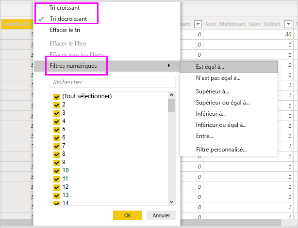

# Utiliser la vue Données dans Power BI Desktop

La *Vue de données* vous permet d’inspecter, d’explorer et de comprendre les données dans votre modèle *Power BI Desktop*. Elle diffère de la façon dont vous affichez les données, les colonnes et les tables dans l’*éditeur Power Query*. La Vue de données vous permet d’examiner vos données *après* leur chargement dans le modèle.

> [!NOTE]
> Étant donné que la Vue de données affiche les données après leur chargement dans le modèle, l’icône Vue de données n’est pas visible si toutes les sources de données sont basées sur DirectQuery. 

Quand vous modélisez vos données, vous souhaitez parfois consulter le contenu réel d’une table ou d’une colonne sans créer un visuel sur le canevas de rapport. Vous voudrez peut-être voir le contenu jusqu’au niveau de la ligne. Cette possibilité se révèle particulièrement utile quand vous créez des mesures et des colonnes calculées, ou quand vous devez identifier un type de données ou une catégorie de données.

Regardons de plus près certains des éléments trouvés dans la Vue de données.

1. **Icône Vue de données**. Sélectionnez cette icône pour accéder à la Vue de données.

2. **Grille de données**. Cette zone montre la table sélectionnée et toutes les colonnes et lignes qu’elle contient. Les colonnes masquées dans la vue *Rapport* sont grisées. Vous pouvez cliquer avec le bouton droit sur une colonne pour afficher des options.

3. **Ruban de modélisation**. Vous pouvez ici gérer les relations, créer des calculs et changer le type de données, le format ou la catégorie de données pour une colonne.

4. **Barre de formule**. Entrez des formules DAX (Data Analysis Expression) pour les mesures et les colonnes calculées.

5. **Rechercher**. Recherchez une table ou une colonne dans votre modèle.

6. **Liste de champs**. Sélectionnez une table ou une colonne à voir dans la grille de données.

## Filtrage dans la Vue de données

Vous pouvez également filtrer et trier les données dans la Vue de données. Chaque colonne montre une icône qui identifie le sens du tri, s’il est appliqué.

Vous pouvez filtrer des valeurs individuelles ou utiliser le filtrage avancé en fonction des données de la colonne.

> [!NOTE]
> Quand un modèle Power BI est créé dans une autre culture que celle de votre interface utilisateur actuelle, la zone de recherche ne s’affiche que pour les champs de texte de l’interface utilisateur de la Vue de données, et rien d’autre. Cette situation serait celle, par exemple, d’un modèle, créé en anglais américain, que vous consultez en français.

## Étapes suivantes

Power BI Desktop permet d’effectuer des tâches très diverses. Pour plus d’informations sur ses fonctionnalités, passez en revue les ressources suivantes :

* [Qu’est-ce que Power BI Desktop ?](../fundamentals/desktop-what-is-desktop.md)
* [Vue d’ensemble des requêtes dans Power BI Desktop](../transform-model/desktop-query-overview.md)
* [Types de données dans Power BI Desktop](desktop-data-types.md)
* [Mettre en forme et combiner des données dans Power BI Desktop](desktop-shape-and-combine-data.md)
* [Tâches courantes relatives aux requêtes dans Power BI Desktop](../transform-model/desktop-common-query-tasks.md)
