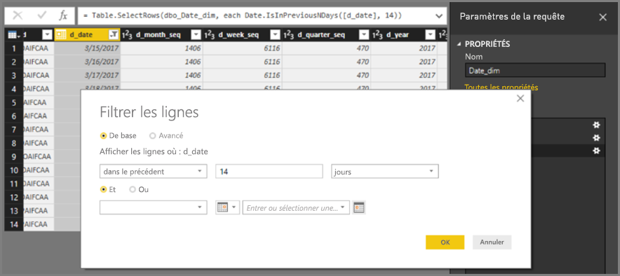
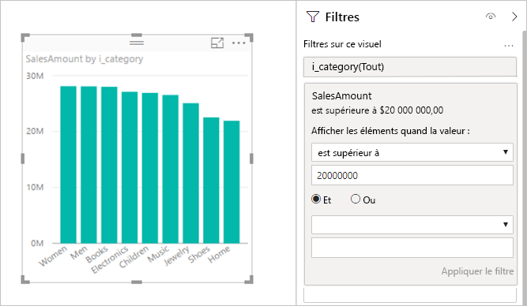
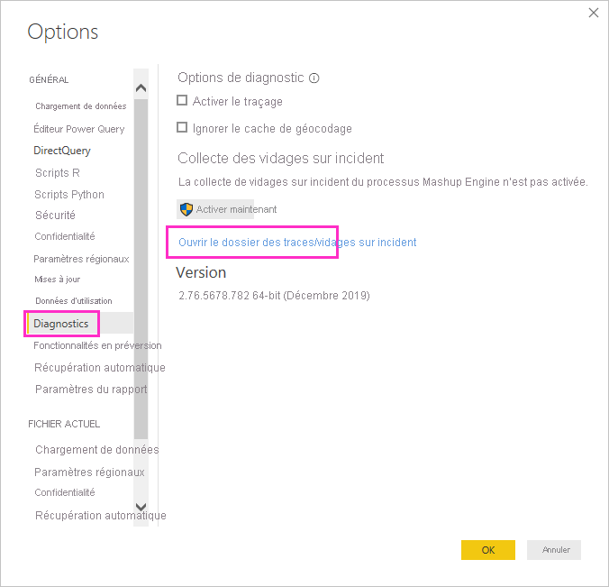
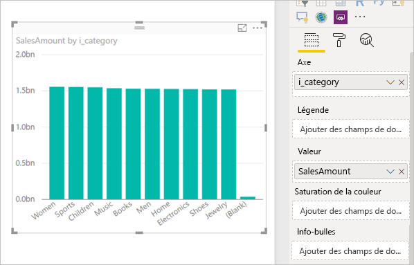

# <a name="about-using-directquery-in-power-bi"></a>À propos de l’utilisation de DirectQuery dans Power BI

Lorsque vous utilisez *Power BI Desktop* ou le *service Power BI*, vous pouvez vous connecter à toutes sortes de sources de données et établir ces connexions aux données de différentes façons. Vous pouvez *importer* des données dans Power BI, ce qui est la méthode la plus courante pour obtenir des données ou vous connecter directement aux données dans le dépôt source d’origine, ce qu’on appelle une requête *DirectQuery*. Cet article décrit les fonctionnalités de DirectQuery :

* Différentes options de connectivité pour DirectQuery
* Conseils relatifs à l’opportunité d’utiliser DirectQuery plutôt qu’une importation
* Inconvénients de l’utilisation de DirectQuery
* Bonnes pratiques d’utilisation de DirectQuery

Suivez les bonnes pratiques pour déterminer s’il est préférable d’utiliser l’importation ou DirectQuery :

* Nous vous recommandons d’importer des données dans Power BI chaque fois que c’est possible. L’importation tire parti du moteur de requête hautes performances de Power BI et vous offre une expérience très interactive et complète.
* Si vous ne pouvez pas atteindre vos objectifs en important des données, songez à utiliser DirectQuery. Par exemple, lorsque les données changent fréquemment et que les rapports doivent refléter les données les plus récentes, DirectQuery est préférable. Cependant, l’utilisation de DirectQuery n’est possible que si la source de données sous-jacente est capable de fournir des requêtes interactives en moins de 5 secondes pour une requête d’agrégation type et qu’elle peut gérer la charge de requête ainsi générée. De plus, la liste des limitations qui accompagnent l’utilisation de DirectQuery doit être examinée attentivement.

L’ensemble de fonctionnalités offertes par Power BI pour l’importation et DirectQuery évolue au fil du temps. Les changements apporteront une plus grande flexibilité lors de l’utilisation de données importées. L’importation pourra être utilisée dans davantage de cas, et certains inconvénients liés à l’utilisation de DirectQuery seront éliminés. Quelles que soient les améliorations, en cas d’utilisation de DirectQuery, les performances de la source de données sous-jacente restent une considération majeure. Si cette source de données sous-jacente est lente, l’utilisation de DirectQuery demeure impossible.

Cet article a trait à DirectQuery avec Power BI, non à *SQL Server Analysis Services*. DirectQuery est également une fonctionnalité de SQL Server Analysis Services. De nombreuses informations fournies dans cet article s’appliquent à cette fonctionnalité. Il existe également des différences importantes. Pour plus d’informations sur l’utilisation de DirectQuery avec SQL Server Analysis Services, consultez [DirectQuery dans SQL Server 2016 Analysis Services](https://download.microsoft.com/download/F/6/F/F6FBC1FC-F956-49A1-80CD-2941C3B6E417/DirectQuery%20in%20Analysis%20Services%20-%20Whitepaper.pdf).

Si cet article se concentre sur le workflow recommandé pour DirectQuery, où le rapport est créé dans Power BI Desktop, il traite également de la connexion directe au service Power BI.

## <a name="power-bi-connectivity-modes"></a>Modes de connectivité Power BI

Power BI se connecte à un vaste éventail de sources de données, notamment :

* services en ligne (Salesforce, Dynamics 365, etc.) ;
* bases de données (SQL Server, Access, Amazon Redshift, etc.) ;
* fichiers simples (Excel, JSON, etc.) ;
* autres sources de données (Spark, sites web, Microsoft Exchange, etc.).

Pour ces sources, il est possible d’importer les données dans Power BI. Pour certaines, il est également possible de se connecter à l’aide de DirectQuery. Pour obtenir un récapitulatif des sources compatibles avec DirectQuery, consultez [Sources de données prises en charge par DirectQuery](power-bi-data-sources.md). D’autres sources seront prises en charge par DirectQuery dans le futur. L’accent sera mis principalement sur les sources susceptibles d’offrir de bonnes performances de requête interactive.

SQL Server Analysis Services constitue un cas spécial. Lors de la connexion à SQL Server Analysis Services, vous pouvez choisir d’importer les données ou d’utiliser une *connexion active*. L’utilisation d’une connexion active est similaire à l’utilisation de DirectQuery. Aucune donnée n’est importée, et la source de données sous-jacente est toujours interrogée pour l’actualisation d’un visuel. Toutefois, elle s’en distingue également à maints égards, ce qui justifie l’utilisation de termes distincts (*active* et *DirectQuery*).

Trois options permettent la connexion aux données : *importation*, *DirectQuery* et *Connexion active*.

### <a name="import-connections"></a>Connexions d’importation

Pour l’importation, quand vous utilisez la commande **Obtenir des données** dans Power BI Desktop pour vous connecter à une source de données telle que SQL Server, le comportement de cette connexion est le suivant :

* Au cours de l’exécution initiale de la commande Obtenir des données, les tables sélectionnées définissent chacune une requête qui retourne un jeu de données. Vous pouvez modifier ces requêtes avant le chargement des données, par exemple pour appliquer des filtres, agréger les données ou joindre des tables différentes.
* Lors du chargement, toutes les données définies par ces requêtes sont importées dans le cache Power BI.
* Lors de la génération d’un visuel dans Power BI Desktop, les données importées sont interrogées. Le magasin Power BI assure la rapidité de la requête. Toutes les modifications apportées au visuel sont immédiatement répercutées.
* Les modifications apportées aux données sous-jacentes ne sont répercutées dans aucun visuel. Il est nécessaire de procéder à une *actualisation* pour réimporter les données.
* Lors de la publication du rapport au format de fichier *.pbix* sur le service Power BI, un jeu de données est créé et chargé sur le service Power BI. Les données importées sont incluses dans ce jeu de données. Il est alors possible de planifier une actualisation de ces données, par exemple pour les réimporter quotidiennement. Selon l’emplacement de la source de données d’origine, il peut être nécessaire de configurer une passerelle de données locale.
* Lors de l’ouverture d’un rapport existant dans le service Power BI ou de la création d’un rapport, les données importées sont de nouveau interrogées, ce qui garantit l’interactivité.
* Des visuels ou des pages de rapport entières peuvent être épinglés sous forme de vignettes de tableau de bord. Les vignettes sont actualisées automatiquement chaque fois que le jeu de données sous-jacent est actualisé.

### <a name="directquery-connections"></a>Connexions DirectQuery

Pour DirectQuery, quand vous utilisez la commande **Obtenir des données** dans Power BI Desktop pour vous connecter à une source de données, le comportement de cette connexion est le suivant :

* Lors de l’exécution initiale de la commande Obtenir des données, la source est sélectionnée. Pour des sources relationnelles, un ensemble de tables est sélectionné, chaque table définissant une requête qui retourne un jeu de données de façon logique. Pour des sources multidimensionnelles telles que SAP BW, seule la source est sélectionnée.
* Toutefois, au chargement, aucune donnée n’est importée dans le magasin Power BI. Au lieu de cela, lors de la génération d’un visuel dans Power BI Desktop, des requêtes sont envoyées à la source de données sous-jacente pour extraire les données nécessaires. Le temps d’actualisation du visuel varie selon les performances de la source de données sous-jacente.
* Les modifications apportées aux données sous-jacentes ne sont pas immédiatement répercutées dans tous les visuels existants. Il est toujours nécessaire de procéder à une actualisation. Les requêtes nécessaires sont renvoyées pour chaque visuel, et le visuel est mis à jour si nécessaire.
* Lors de la publication du rapport sur le service Power BI, celui-ci génère à nouveau un jeu de données, tout comme pour une importation. Toutefois, *aucune donnée* n’est incluse dans ce jeu de données.
* Lors de l’ouverture ou de la création d’un rapport dans le service Power BI, la source de données sous-jacente est à nouveau interrogée pour extraire les données nécessaires. Selon l’emplacement de la source de données d’origine, il peut être nécessaire de configurer une passerelle de données locale comme c’est le cas pour le mode Importation si les données sont actualisées.
* Des visuels ou des pages de rapport entières peuvent être épinglés sous forme de vignettes de tableau de bord. Pour garantir la rapidité de l’ouverture d’un tableau de bord, les vignettes sont actualisées automatiquement à intervalles réguliers, par exemple toutes les heures. La fréquence de cette actualisation peut être contrôlée pour refléter la fréquence à laquelle les données changent et en fonction de l’importance d’afficher les données les plus récentes. À l’ouverture d’un tableau de bord, les vignettes reflètent les données correspondant à l’heure de la dernière actualisation et pas nécessairement les dernières modifications apportées à la source de données sous-jacente. Vous pouvez actualiser un tableau de bord ouvert pour vérifier qu’il est à jour.

### <a name="live-connections"></a>Connexions actives

Quand vous vous connectez à SQL Server Analysis Services, vous avez la possibilité d’importer les données à partir du modèle de données sélectionné ou d’établir une connexion active à celui-ci. Si vous utilisez l’importation, vous définissez une requête sur cette source SQL Server Analysis Services externe, et les données sont importées normalement. Si vous utilisez une connexion active, aucune requête n’est définie, et le modèle externe tout entier apparaît dans la liste de champs.

La situation décrite dans le paragraphe précédent s’applique également à la connexion aux sources suivantes, à ceci près qu’il n’existe aucune option pour importer les données :

* Jeux de données Power BI, par exemple, quand vous vous connectez à un jeu de données Power BI précédemment créé et publié sur le service pour générer un nouveau rapport
* Common Data Services

Le comportement des rapports sur SQL Server Analysis Services lors de la publication sur le service Power BI présente les similitudes suivantes avec les rapports DirectQuery :

* Lors de l’ouverture ou de la création d’un rapport dans le service Power BI, la source SQL Server Analysis Services sous-jacente est interrogée, ce qui nécessite éventuellement une passerelle de données locale.
* Les vignettes de tableau de bord sont actualisées automatiquement à intervalles réguliers, par exemple toutes les heures.

Il existe également des différences importantes. Par exemple, pour les connexions actives, l’identité de l’utilisateur qui ouvre le rapport est toujours transmise à la source SQL Server Analysis Services sous-jacente.

Ces comparaisons étant faites, la suite de cet article porte exclusivement sur DirectQuery.

## <a name="when-is-directquery-useful"></a>Quand DirectQuery est-il utile ?

Le tableau suivant décrit les scénarios où une connexion avec DirectQuery peut être particulièrement utile, notamment quand la conservation des données dans la source d’origine peut s’avérer avantageuse. La description inclut une discussion concernant la disponibilité du scénario spécifié dans Power BI.

| Limitation | Description |
| --- | --- |
| Les données changent fréquemment et des rapports en quasi temps réel sont nécessaires |Les modèles avec des données importées peuvent être actualisés au maximum une fois par heure (plus fréquemment avec des abonnements Power BI Pro ou Power BI Premium). Si les données évoluent en permanence et qu’il est nécessaire que les rapports présentent les données les plus récentes, l’utilisation de l’importation avec une actualisation à intervalles réguliers peut ne pas répondre à ces besoins. Vous pouvez envoyer les données en streaming directement à Power BI, même s’il existe des limites aux volumes de données pris en charge en pareil cas. <br/> <br/> En revanche, l’utilisation de DirectQuery signifie que l’ouverture ou l’actualisation d’un rapport ou d’un tableau de bord affiche toujours les données les plus récentes dans la source. Par ailleurs, les vignettes de tableau de bord peuvent être mises à jour plus fréquemment (jusqu’à toutes les 15 minutes). |
| Les données sont très volumineuses |Si les données sont très volumineuses, il est impossible de les importer toutes. À l’opposé, DirectQuery ne nécessite aucun transfert important de données, car celles-ci sont interrogées sur place. <br/> <br/> Toutefois, des données volumineuses peuvent également impliquer un ralentissement excessif des performances des requêtes portant sur cette source sous-jacente comme expliqué dans la section [Implications de l’utilisation de DirectQuery](#implications-of-using-directquery). Il n’est pas toujours nécessaire d’importer l’absolue totalité des données. Au lieu de cela, les données peuvent être pré-agrégées lors de l’importation. L’*Éditeur de requête* facilite précisément cette opération. À la limite, il serait possible d’importer exactement les données d’agrégation nécessaires pour chaque visuel. Si DirectQuery constitue l’approche la plus simple pour des données volumineuses, l’importation de données agrégées peut offrir une solution si la source de données sous-jacente est trop lente. |
| Des règles de sécurité sont définies dans la source sous-jacente |Quand les données sont importées, Power BI se connecte à la source de données en utilisant les informations d’identification de l’utilisateur actif (extraites de Power BI Desktop) ou des informations d’identification définies dans le cadre de la configuration de l’actualisation planifiée (extraites du service Power BI). En cas de publication et de partage d’un tel rapport, veillez à le partager uniquement avec des utilisateurs autorisés à consulter les données concernées ou à définir une sécurité au niveau des lignes associée au jeu de données. <br/> <br/> Dans l’idéal, étant donné que DirectQuery interroge toujours la source sous-jacente, cette configuration permettrait d’appliquer tout type de sécurité à cette source sous-jacente. Toutefois, aujourd’hui, Power BI se connecte toujours à la source sous-jacente à l’aide des mêmes informations d’identification que celles utilisées pour l’importation. <br/> <br/> Tant que Power BI ne permet pas que l’identité du consommateur du rapport soit transmise directement à la source sous-jacente, DirectQuery n’offre aucun avantage concernant la sécurité de la source de données. |
| Des restrictions de souveraineté des données s’appliquent |Certaines organisations adoptent des stratégies relatives à la souveraineté des données, en vertu desquelles les données ne peuvent pas quitter le site de l’organisation. Une solution basée sur l’importation occasionnerait clairement des problèmes. À l’opposé, avec DirectQuery, ces données restent dans la source sous-jacente. <br/> <br/> Toutefois, même avec DirectQuery, des caches de données au niveau du visuel sont conservés dans le service Power BI en raison de l’actualisation planifiée des vignettes. |
| La source de données sous-jacente est une source OLAP contenant des mesures |Si la source de données sous-jacente contient des *mesures* (comme c’est le cas dans SAP HANA ou SAP Business Warehouse), l’importation des données génère d’autres problèmes. Cela signifie que les données importées présentent un niveau particulier d’agrégation, défini par la requête. Par exemple, mesurez **TotalSales** selon les critères **Class**, **Year** et **City**. Ensuite, si un visuel est créé, qui demande des données à un niveau supérieur d’agrégation (par exemple, **TotalSales** selon le critère **Year**), il agrège encore davantage la valeur agrégée. Cette agrégation convient pour des mesures additives (par exemple, **Somme** et **Min**), mais constitue un problème pour des mesures non additives (par exemple, **Moyenne** et **DistinctCount**). <br/> <br/> Pour faciliter l’obtention des données agrégées appropriées (en fonction des besoins du visuel) directement à partir de la source, il faudrait envoyer des requêtes par visuel comme c’est le cas dans DirectQuery. <br/> <br/> Lors de la connexion à SAP Business Warehouse (BW), le choix de DirectQuery permet ce traitement des mesures. Pour plus d’informations sur SAP BW, consultez [DirectQuery et SAP BW](desktop-directquery-sap-bw.md). <br/> <br/> Toutefois, actuellement, DirectQuery sur SAP HANA traite cela comme une source relationnelle et se comporte de façon similaire à une importation. Cette approche est développée dans [DirectQuery et SAP HANA](desktop-directquery-sap-hana.md). |

En résumé, compte tenu des capacités actuelles de DirectQuery dans Power BI, il se révélera particulièrement avantageux dans les scénarios suivants :

* Les données changent fréquemment, et des rapports en quasi temps réel sont nécessaires.
* Les données gérées sont très volumineuses et ne nécessitent pas d’agrégation préalable.
* Des restrictions de souveraineté des données s’appliquent.
* La source est multidimensionnelle et contient des mesures (par exemple, SAP BW).

Les détails de la liste précédente ont trait à l’utilisation de Power BI seul. Vous avez cependant la possibilité d’utiliser un modèle SQL Server Analysis Services ou Azure Analysis Services externe pour importer des données, puis d’utiliser Power BI pour la connexion à ce modèle. Si cette approche nécessite une configuration supplémentaire, elle offre davantage de flexibilité. Elle permet d’importer des volumes de données beaucoup plus importants. Par ailleurs, elle n’impose aucune restriction quant à la fréquence d’actualisation des données.

## <a name="implications-of-using-directquery"></a>Implications de l’utilisation de DirectQuery

L’utilisation de DirectQuery peut avoir des conséquences négatives comme l’explique cette section. Certaines de ces limitations peuvent varier légèrement selon la source utilisée. Nous les abordons le cas échéant, et des articles distincts traitent des sources sensiblement différentes.

### <a name="performance-and-load-on-the-underlying-source"></a>Performances et charge sur la source sous-jacente

Lors de l’utilisation de DirectQuery, l’expérience globale dépend beaucoup des performances de la source de données sous-jacente. Si l’actualisation de chaque visuel, par exemple après la modification d’une valeur de segment, prend quelques secondes (généralement moins de 5 secondes), l’expérience peut être raisonnable. Elle peut cependant sembler lente par rapport à la réponse immédiate offerte par l’importation de données dans Power BI. Si la lenteur de la source fait que l’actualisation d’un visuel prend plus que quelques dizaines de secondes, l’expérience devient très médiocre. Les délais de requête peuvent même expirer.

Outre les performances de la source sous-jacente, il convient d’accorder une attention particulière à la charge placée sur celle-ci. La charge a en effet un impact sur les performances. Chaque ouverture de rapport partagé par un utilisateur et chaque actualisation de vignette de tableau de bord ont pour effet d’envoyer au moins une requête par visuel à la source sous-jacente. La source doit donc être en mesure de gérer une telle charge de requête tout en continuant à offrir des performances raisonnables.

### <a name="security-implications-when-combining-data-sources"></a>Implications en matière de sécurité lors de la combinaison de sources de données

Il est possible d’utiliser plusieurs sources de données dans un modèle DirectQuery, tout comme lorsque vous importez des données, à l’aide de la fonctionnalité [Modèles composites](../transform-model/desktop-composite-models.md). Si vous utilisez plusieurs sources de données, vous devez comprendre comment les données sont déplacées entre les sources de données sous-jacentes et les [implications relatives à la sécurité](../transform-model/desktop-composite-models.md#security-implications) qui s’ensuivent.

### <a name="limited-data-transformations"></a>Transformations de données limitées

De même, il existe des limitations aux transformations de données qui peuvent être appliquées dans l’Éditeur de requête. Avec des données importées, il est possible d’appliquer aisément un ensemble sophistiqué de transformations pour nettoyer les données et en modifier la forme avant de les utiliser pour créer des visuels, par exemple en analysant des documents JSON ou en faisant pivoter des données disposées en colonnes pour les disposer en lignes. Ces transformations sont plus limitées dans DirectQuery.

Tout d’abord, quand vous vous connectez à une source OLAP telle que SAP Business Warehouse, aucune transformation ne peut être définie et le modèle externe entier est extrait de la source. Pour des sources relationnelles comme SQL Server, il est toujours possible de définir une série de transformations par requête, mais celles-ci sont limitées pour des raisons de performances.

Toutes les transformations de ce type doivent être appliquées à chaque requête adressée à la source sous-jacente, plutôt qu’une seule fois lors de l’actualisation des données, de sorte qu’elles sont limitées aux transformations qui peuvent raisonnablement être traduites dans une seule requête native. Si vous utilisez une transformation trop complexe, vous recevez un message d’erreur indiquant que vous devez la supprimer ou que le modèle a basculé vers le mode Importation.

De plus, la requête qui résulte de la commande **Obtenir des données** ou de l’Éditeur de requête est utilisée dans une sous-sélection à l’intérieur des requêtes générées et envoyées pour extraire les données nécessaires pour un visuel. La requête définie dans l’Éditeur de requête doit être valide dans ce contexte. Cela signifie en particulier qu’il n’est pas possible d’utiliser une requête avec des expressions de table communes ou qui appelle des procédures stockées.

### <a name="modeling-limitations"></a>Limitations de la modélisation

Le terme *modélisation* dans ce contexte signifie affiner et enrichir les données brutes dans le cadre de la création d’un rapport qui les utilise. Voici quelques exemples :

* définition de relations entre des tables ;
* ajout de calculs (colonnes calculées et mesures) ;
* changement de nom et masquage de colonnes et de mesures ;
* définition de hiérarchies ;
* définition de la mise en forme, de la synthèse par défaut et de l’ordre de tri pour une colonne ;
* regroupement ou clustering de valeurs.

Quand vous utilisez DirectQuery, bon nombre de ces enrichissements de modèle peuvent être apportés, et le principe subsiste certainement que les données brutes sont enrichies pour améliorer leur consommation ultérieure. Or, certaines fonctionnalités de modélisation ne sont pas disponibles ou sont limitées lors de l’utilisation de DirectQuery. Les limitations sont généralement appliquées pour éviter des problèmes de performances. Les limitations communes à toutes les sources DirectQuery sont listées ici. Des limitations supplémentaires peuvent s’appliquer à certaines sources comme décrit dans les articles présentés à la section [Étapes suivantes](#next-steps).

* **Aucune hiérarchie de dates intégrée :** quand vous importez des données, une hiérarchie de dates intégrée est disponible pour chaque colonne de date/heure présente. Par exemple, lors de l’importation d’une table de commandes client incluant une colonne **OrderDate**, en cas d’utilisation d’**OrderDate** dans un visuel, il est possible de choisir le niveau approprié (année, mois, jour) à utiliser. Cette hiérarchie de dates intégrée n’est pas disponible si vous utilisez DirectQuery. Si une table **Date** est disponible dans la source sous-jacente (comme c’est le cas dans de nombreux entrepôts de données), les fonctions Time Intelligence de DAX peuvent être utilisées normalement.
* **Prise en charge de la date/heure seulement avec une précision à la seconde :** Quand vous utilisez des colonnes de type heure dans votre jeu de données, Power BI émet des requêtes vers la source sous-jacente seulement à un niveau de détail de l’ordre de la seconde. Les requêtes ne sont pas envoyées à la source DirectQuery pour les millisecondes. Vous devez donc supprimer cette partie des heures dans vos colonnes sources.
* **Limitations dans les colonnes calculées :** les colonnes calculées doivent figurer à l’intérieur d’une ligne, car elles peuvent uniquement faire référence à des valeurs d’autres colonnes de la même table, sans possibilité d’utiliser des fonctions d’agrégation. De plus, les fonctions scalaires DAX autorisées telles que `LEFT()` se limitent à celles qui peuvent simplement être envoyées (push) à la source sous-jacente. Les fonctions varient selon les capacités exactes de la source. Les fonctions non prises en charge ne sont pas proposées dans la saisie semi-automatique lors de la création du DAX pour une colonne calculée et leur utilisation entraînerait une erreur.
* **Aucune prise en charge pour les fonctions DAX parent-enfant :** le mode DirectQuery ne permet pas d’utiliser la famille de fonctions `DAX PATH()`, qui servent généralement à gérer des structures parent-enfant (par exemple, un graphique de comptes ou des hiérarchies d’employés).
* **Les tables calculées ne sont pas prises en charge :** la possibilité de définir une table calculée à l’aide d’une expression DAX n’est pas prise en charge en mode DirectQuery.
* **Filtrage des relations :** pour plus d’informations sur le filtrage bidirectionnel, consultez [Filtrage croisé bidirectionnel](https://download.microsoft.com/download/2/7/8/2782DF95-3E0D-40CD-BFC8-749A2882E109/Bidirectional%20cross-filtering%20in%20Analysis%20Services%202016%20and%20Power%20BI.docx). Ce livre blanc présente des exemples dans le contexte de SQL Server Analysis Services. Les points fondamentaux s’appliquent de la même manière à Power BI.
* **Absence de clustering :** DirectQuery ne permet pas d’utiliser la fonctionnalité de clustering pour rechercher automatiquement les groupes.

### <a name="reporting-limitations"></a>Limitations des rapports

Presque toutes les fonctionnalités de rapports sont prises en charge pour les modèles DirectQuery. Par conséquent, tant que la source sous-jacente offre un niveau de performances approprié, le même ensemble de visualisations peut être utilisé. Il existe des limitations importantes de certaines des autres fonctionnalités offertes dans le service Power BI après la publication d’un rapport :

* **Quick Insights n’est pas pris en charge :** Power BI Quick Insights effectue des recherches rapides dans différents sous-ensembles de votre jeu de données tout en appliquant un jeu d’algorithmes sophistiqués pour détecter les informations potentiellement intéressantes. Étant donné la nécessité de performances très élevées des requêtes, cette fonctionnalité n’est pas disponible sur des jeux de données en mode DirectQuery.
* **La fonctionnalité Questions et réponses n’est pas pris en charge :** la fonctionnalité Questions et réponses de Power BI vous permet d’explorer vos données à l’aide de fonctionnalités intuitives du langage naturel et de recevoir des réponses sous la forme de graphiques et de diagrammes. Toutefois, elle n’est actuellement pas prise en charge sur des jeux de données en mode DirectQuery.
* **L’exploration dans Excel risque d’entraîner une dégradation des performances :** vous pouvez explorer vos données en utilisant la fonctionnalité « Explorer dans Excel » sur un jeu de données. Cette approche permet de créer des tableaux croisés dynamiques et des graphiques croisés dynamiques dans Excel. Quand cette fonctionnalité est prise en charge sur des jeux de données en mode DirectQuery, les performances sont généralement plus lentes que celles de la création de visuels dans Power BI. Ainsi, si l’utilisation d’Excel est importante pour vos scénarios, vous devez en tenir compte avant de décider d’utiliser DirectQuery.

### <a name="security"></a>Sécurité

Comme indiqué plus haut dans cet article, un rapport dans DirectQuery utilise toujours les mêmes informations d’identification fixes pour se connecter à la source de données sous-jacente, après publication sur le service Power BI. Ce comportement s’applique spécifiquement à DirectQuery et non aux connexions actives à SQL Server Analysis Services qui diffèrent à cet égard. Immédiatement après la publication d’un rapport DirectQuery, il est nécessaire de configurer les informations d’identification de l’utilisateur qui seront utilisées. Tant que cela n’est pas fait, l’ouverture du rapport sur le service Power BI entraîne une erreur.

Une fois les informations d’identification fournies, celles-ci sont utilisées *quel que soit l’utilisateur qui ouvre le rapport*. À cet égard, cela se passe exactement comme pour les données importées. Chaque utilisateur voit les mêmes données sauf si une sécurité au niveau des lignes a été définie dans le cadre du rapport. Il convient d’accorder la même attention au partage du rapport si des règles de sécurité sont définies dans la source sous-jacente.

### <a name="behavior-in-the-power-bi-service"></a>Comportement dans le service Power BI

Cette section décrit le comportement d’un rapport DirectQuery dans le service Power BI pour expliquer l’importance de la charge appliquée à la source de données back-end, compte tenu du nombre d’utilisateurs avec lesquels le rapport et le tableau de bord sont partagés, de la complexité du rapport et du fait qu’une sécurité au niveau des lignes a été définie ou non dans le rapport.

#### <a name="reports--opening-interacting-with-editing"></a>Rapports : ouverture, interaction, modification

À l’ouverture d’un rapport, tous les visuels sur la page visible sont actualisés. Chaque visuel nécessite généralement au moins une requête à la source de données sous-jacente. Certains visuels peuvent nécessiter plusieurs requêtes. Par exemple, un visuel peut présenter des valeurs agrégées de deux tables de faits différentes ou contenir une mesure plus complexe ou des totaux d’une mesure non additive telle que Count Distinct. Le déplacement vers une nouvelle page entraîne l’actualisation de ces visuels. L’actualisation envoie un nouvel ensemble de requêtes à la source sous-jacente.

Chaque interaction utilisateur sur le rapport peut entraîner une actualisation des visuels. Par exemple, la sélection d’une valeur différente sur un segment nécessite l’envoi d’un nouvel ensemble de requêtes pour actualiser tous les visuels concernés. C’est également vrai en cas de clic sur un visuel pour opérer une sélection croisée d’autres visuels, ou de modification d’un filtre.

De même, la modification d’un nouveau rapport exige l’envoi de requêtes à chaque étape de la production du visuel final.

Des résultats sont mis en cache. L’actualisation d’un visuel est instantanée si des résultats rigoureusement identiques ont été récemment obtenus. Si la sécurité au niveau des lignes n’est pas définie, ces caches ne sont pas partagés entre les utilisateurs.

#### <a name="dashboard-refresh"></a>Actualisation du tableau de bord

Il est possible d’épingler au tableau de bord des visuels ou des pages entières sous forme de vignettes. Les vignettes basées sur des jeux de données DirectQuery sont actualisées automatiquement selon une planification. Les vignettes envoient des requêtes à la source de données back-end. Par défaut, les jeux de données sont actualisés toutes les heures. Cet intervalle peut cependant être défini dans le cadre du paramétrage des jeux de données entre une fois par semaine et toutes les 15 minutes.

Si aucune sécurité au niveau des lignes n’est définie dans le modèle, chaque vignette est actualisée une seule fois et les résultats sont partagés entre tous les utilisateurs. Si une telle sécurité est définie, cela peut avoir un effet multiplicateur important. Chaque vignette nécessite l’envoi de requêtes distinctes à la source sous-jacente pour chaque utilisateur.

Un tableau de bord comportant 10 vignettes, partagé avec 100 utilisateurs, créé sur un jeu de données à l’aide de DirectQuery avec une sécurité au niveau des lignes et configuré pour s’actualiser toutes les 15 minutes entraîne l’envoi d’au moins 1 000 requêtes toutes les 15 minutes à la source back-end.

Soyez particulièrement attentif à l’utilisation de la sécurité au niveau des lignes et à la configuration de la planification de l’actualisation.

#### <a name="time-outs"></a>Délais d’expiration

Un délai d’expiration de quatre minutes est appliqué aux requêtes individuelles dans le service Power BI. Les requêtes qui prennent plus de temps échouent. Comme souligné précédemment, il est recommandé d’utiliser DirectQuery pour les sources qui offrent des performances de requêtes pratiquement interactives. Cette limite vise à éviter les problèmes résultant de temps d’exécution trop longs.

### <a name="other-implications"></a>Autres implications

Voici d’autres conséquences générales de l’utilisation de DirectQuery :

* **Si les données évoluent, une actualisation est nécessaire pour que les données les plus récentes s’affichent :** compte tenu de l’utilisation de caches, il n’est pas garanti que le visuel affiche toujours les données les plus récentes. Par exemple, un visuel peut afficher les transactions du dernier jour. Dans la mesure où un segment est modifié, il peut être actualisé pour présenter les transactions des deux derniers jours. Celles-ci peuvent inclure les transactions récentes, voire les nouvelles transactions. Le rétablissement du segment à sa valeur d’origine se traduit par le fait qu’il affiche à nouveau la valeur mise en cache obtenue précédemment.

  La sélection de l’option **Actualiser** a pour effet d’effacer tous les caches et d’actualiser tous les visuels sur la page pour afficher les données les plus récentes.

* **Si les données changent, il n’existe aucune garantie de cohérence entre les visuels :** des visuels différents, qu’ils figurent sur une même page ou sur des pages différentes, peuvent être actualisés à des moments différents. Si les données de la source sous-jacente changent, il n’existe aucune garantie que chaque visuel affiche des données correspondant précisément au même point dans le temps. En effet, étant donné que plusieurs requêtes sont parfois nécessaires pour un seul visuel (par exemple, pour obtenir les détails et les totaux), la cohérence, y compris au sein d’un même visuel, n’est pas garantie. Garantir cette cohérence nécessiterait l’actualisation de tous les visuels chaque fois qu’un visuel est actualisé et l’utilisation de fonctionnalités coûteuses telles que l’isolement de capture instantanée dans la source de données sous-jacente.

  Ce problème peut être atténué dans une large mesure en sélectionnant à nouveau la commande **Actualiser**, qui a pour effet de mettre à jour tous les visuels de la page. Même en utilisant le mode Importation, il existe un problème similaire de garantie de la cohérence en cas d’importation de données à partir de plusieurs tables.

* **Une actualisation dans Power BI Desktop est nécessaire pour refléter les modifications des métadonnées :** après la publication d’un rapport, la commande **Actualiser** a pour effet de mettre à jour les visuels dans le rapport. Si le schéma de la source sous-jacente a changé, ces modifications ne sont pas automatiquement appliquées pour modifier les champs disponibles dans la liste de champs. Si des tables ou des colonnes ont été supprimées de la source sous-jacente, cela peut entraîner un échec de requête lors de l’actualisation. L’ouverture du rapport dans Power BI Desktop et le choix de la commande **Actualiser** ont pour effet de mettre à jour les champs dans le modèle pour refléter les modifications.

* **Limite d’un million de lignes retournées sur toute requête :** une limite fixe d’un million de lignes s’applique au nombre de lignes qui peuvent être retournées dans une requête adressée à la source sous-jacente. Cette limite n’a généralement pas de conséquences pratiques, et il est improbable que les visuels affichent autant de points. Toutefois, la limite peut être atteinte dans les cas où Power BI n’optimise pas entièrement les requêtes envoyées et si des résultats intermédiaires demandés dépassent la limite. Cela peut également se produire lors de la création d’un visuel, en cherchant à obtenir un état final plus raisonnable. Par exemple, à défaut d’application d’un filtre, l’inclusion de **Customer** et de **TotalSalesQuantity** entraîne le dépassement de cette limite s’il y a plus de 1 million de clients.

  L’erreur retournée serait : « Le jeu de résultats d’une requête sur une source de données externe a dépassé la taille maximale autorisée de « 1 000 000 » lignes. »

* **Impossible de changer à partir de l’importation en mode DirectQuery :** s’il est possible de basculer un modèle du mode DirectQuery au mode Importation, cela signifie que toutes les données nécessaires doivent être importées. Il est également impossible de rebasculer dans l’autre sens, principalement en raison des fonctionnalités non prises en charge en mode DirectQuery. Les modèles DirectQuery sur des sources multidimensionnelles telles que SAP BW ne peuvent pas non plus être basculés du mode DirectQuery vers le mode Importation, en raison du traitement différent des mesures externes.

## <a name="directquery-in-the-power-bi-service"></a>DirectQuery dans le service Power BI

Toutes les sources sont prises en charge à partir de Power BI Desktop. Certaines sources sont également accessibles directement à partir du service Power BI. Par exemple, il est possible qu’un utilisateur professionnel utilise Power BI pour se connecter à ses données dans Salesforce et obtienne immédiatement un tableau de bord, sans utiliser Power BI Desktop.

Seules deux des sources compatibles avec DirectQuery sont disponibles directement dans le service :

* Spark
* Azure SQL Data Warehouse

Toutefois, dès lors que vous utilisez DirectQuery sur ces deux sources, nous vous recommandons de commencer dans Power BI Desktop. En effet, lors de l’établissement initial de la connexion dans le service Power BI, de nombreuses limitations clés s’appliquent. Si le point de départ est facile (à partir du service Power BI), il existe des limitations à l’amélioration du rapport obtenu. Par exemple, il n’est pas possible, ensuite, de créer des calculs, d’utiliser de nombreuses fonctionnalités analytiques, voire d’actualiser les métadonnées pour refléter des modifications apportées au schéma sous-jacent.

## <a name="guidance-for-using-directquery-successfully"></a>Aide pour une utilisation fructueuse de DirectQuery

Si vous prévoyez d’utiliser DirectQuery, cette section fournit des conseils d’ordre général sur la façon de l’utiliser correctement. L’aide fournie dans cette section est dérivée des conséquences de l’utilisation de DirectQuery décrites dans cet article.

### <a name="back-end-data-source-performance"></a>Performances de la source de données back-end

Vérifiez que les visuels simples sont actualisés sous un délai raisonnable. Pour bénéficier d’une expérience interactive raisonnable, ce délai d’actualisation ne doit pas dépasser 5 secondes. Si l’actualisation des visuels prend plus de 30 secondes, il est très probable que d’autres problèmes se produisent après la publication du rapport, ce qui peut rendre la solution impraticable.

Si les requêtes sont lentes, examinez celles envoyées à la source sous-jacente et la cause des problèmes de performances des requêtes. Cet article ne couvre pas toutes les bonnes pratiques d’optimisation de base de données sur l’ensemble des sources sous-jacentes potentielles. Il porte sur les pratiques standard relatives aux bases de données, applicables à la plupart des situations :

* Les relations basées sur des colonnes d’entiers sont généralement plus performantes que les jointures de colonnes dont les types de données diffèrent.
* Les index appropriés doivent être créés. La création d’index implique généralement d’utiliser des index de stockage en colonne dans les sources qui les prennent en charge, par exemple SQL Server.
* Toutes les statistiques nécessaires dans la source doivent être mises à jour.

### <a name="model-design-guidance"></a>Aide à la conception d’un modèle

Quand vous définissez le modèle, tenez compte des recommandations suivantes :

* **Évitez les requêtes complexes dans l’Éditeur de requête.** L’Éditeur de requête convertit une requête complexe en une requête SQL unique. Celle-ci apparaît dans la sous-sélection de chaque requête envoyée à cette table. Si cette requête est complexe, elle peut entraîner des problèmes de performances à chaque requête envoyée. La requête SQL réelle pour un ensemble d’étapes peut être obtenue en sélectionnant la dernière étape dans l’Éditeur de requête, puis en choisissant **Afficher la requête native** dans le menu contextuel.
* **Veillez à utiliser des mesures simples.** Au départ, nous recommandons de limiter les mesures à des agrégats simples. Ensuite, si celles-ci offrent des performances satisfaisantes, vous pouvez définir des mesures plus complexes en restant attentif aux performances de chacune d’elles.
* **Évitez les relations sur des colonnes calculées.** Cette recommandation s’applique aux bases de données impliquant des jointures de plusieurs colonnes. Actuellement, Power BI ne permet pas qu’une relation soit basée sur plusieurs colonnes comme la relation FK/PK. La solution de contournement courante consiste à concaténer les colonnes à l’aide d’une colonne calculée et à baser la jointure sur cette colonne. Si cette solution de contournement est raisonnable pour des données importées, en cas d’utilisation de DirectQuery, elle aboutit à une jointure sur une expression. Ce résultat empêche généralement l’utilisation d’index et entraîne une dégradation des performances. La seule solution de contournement consiste à matérialiser réellement les colonnes multiples dans une colonne unique de la base de données sous-jacente.
* **Évitez les relations sur des colonnes uniqueidentifier.** Power BI ne prend pas en charge un type de données `uniqueidentifier` en mode natif. La définition d’une relation entre des colonnes de type `uniqueidentifier` entraîne une requête avec une jointure impliquant un cast. Là encore, cette approche aboutit généralement à une dégradation des performances. Tant que ce cas n’est pas spécifiquement optimisé, la seule solution de contournement consiste à matérialiser des colonnes d’un autre type dans la base de données sous-jacente.
* **Masquez la colonne sur des relations.** La colonne *à* sur les relations est généralement la clé primaire sur la table *à*. Cette colonne doit être masquée. Si elle est masquée, elle n’apparaît pas dans la liste de champs et ne peut pas être utilisée dans les visuels. Souvent, les colonnes sur lesquelles reposent des relations sont en fait des *colonnes système*, par exemple, des clés de substitution dans un entrepôt de données. Il est conseillé de masquer ces colonnes dans tous les cas. Si la colonne a du sens, introduisez une colonne calculée visible, comportant une expression simple d’égalité avec la clé primaire comme dans l’exemple suivant :

  ```sql  
      ProductKey_PK   (Destination of a relationship, hidden)
      ProductKey (= [ProductKey_PK],   visible)
      ProductName
      ...
  ```

* **Examinez l’ensemble des utilisations de colonnes calculées et modifications de type de données.** L’utilisation de ces fonctionnalités n’est pas toujours néfaste. Elle entraîne l’envoi à la source sous-jacente de requêtes contenant des expressions plutôt que de simples références à des colonnes. Ceci peut également empêcher l’utilisation d’index.
* **Évitez d’utiliser le filtrage croisé bidirectionnel sur des relations.** L’utilisation du filtrage croisé bidirectionnel peut aboutir à des instructions de requête qui ne fonctionnent pas correctement.
* **Expérimentez le paramètre d’*Intégrité référentielle supposée*.** Le paramètre Intégrité référentielle supposée appliqué à des relations permet l’utilisation d’instructions `INNER JOIN` par les requêtes (plutôt que des instructions `OUTER JOIN`). Cette recommandation permet généralement d’améliorer les performances des requêtes, même si celles-ci dépendent des spécificités de la source de données.
* **N’utilisez pas de filtrage de date relative dans l’Éditeur de requête.** L’Éditeur de requête permet de définir un filtrage de date relative. Par exemple, pour filtrer les lignes où la date se situe dans les 14 derniers jours.
  
  
  
  Toutefois, ce filtre est converti en un filtre basé sur la date fixe comme au moment de la création de la requête. Ce résultat peut être observé dans la vue de la requête native.
  
  
  
  Ce résultat n’est probablement pas celui que vous souhaitiez. Pour vous assurer que le filtre est appliqué en fonction de la date d’exécution du rapport, appliquez plutôt le filtre dans le rapport en tant que Filtre de rapport. Actuellement, cette approche consiste à créer une colonne calculée calculant le nombre de jours passés (en utilisant la fonction `DAX DATE()`), puis en utilisant cette colonne calculée dans un filtre.

### <a name="report-design-guidance"></a>Aide à la conception d’un rapport

Quand vous créez un rapport à l’aide d’une connexion DirectQuery, suivez les recommandations ci-après :

* **Envisagez d’utiliser les options de réduction de la requête :** Power BI propose des options de rapport permettant d’envoyer moins de requêtes et de désactiver certaines interactions qui aboutiraient à une mauvaise expérience dans le cas où les requêtes résultantes mettent longtemps à s’exécuter. Pour accéder à ces options dans Power BI Desktop, cliquez sur **Fichier** > **Options et paramètres** > **Options** et sélectionnez **Réduction des requêtes**.

   

    Cochez la case **Réduction des requêtes** pour désactiver la mise en surbrillance croisée sur l’ensemble du rapport. Vous pouvez également afficher un bouton **Appliquer** sur les segments ou sur les sélections de filtres. Cette approche vous permet d’en sélectionner un grand nombre avant de les appliquer. Aucune requête n’est envoyée tant que vous n’avez pas sélectionné le bouton **Appliquer** sur le segment. Vos sélections peuvent ensuite être utilisées pour filtrer les données.

    Ces options s’appliquent à votre rapport quand vous interagissez avec dans Power BI Desktop. Elles s’appliquent également quand les utilisateurs consomment le rapport dans le service Power BI.

* **Appliquer d’abord des filtres :** appliquez toujours les filtres applicables au début de la création d’un visuel. Par exemple, au lieu de faire glisser vers **TotalSalesAmount** et **ProductName**, puis de filtrer sur une année en particulier, appliquez le filtre à **Année** dès le début. Chaque étape de création d’un visuel entraîne l’envoi d’une requête. Même s’il est possible d’apporter une autre modification avant l’accomplissement de la première requête, cette approche laisse toujours peser une charge inutile sur la source sous-jacente. L’application précoce de filtres rend généralement ces requêtes intermédiaires moins coûteuses. Par ailleurs, la non-application précoce de filtres peut amener à atteindre la limite de 1 million de lignes.
* **Limitez le nombre de visuels sur une page :** quand vous ouvrez une page ou modifiez un filtre ou un segment au niveau page, tous les visuels sur la page sont actualisés. Il existe également une limite au nombre de requêtes envoyées en parallèle. À mesure que le nombre de visuels augmente, certains d’entre eux sont actualisés en série, ce qui augmente le temps nécessaire à l’actualisation de la page entière. C’est pourquoi il est recommandé de limiter le nombre de visuels sur une même page et d’avoir plutôt un nombre plus important de pages plus simples.
* **Envisagez de désactiver l’interaction entre les visuels :** Par défaut, vous pouvez utiliser les visualisations d’une page de rapport pour filtrer et mettre en évidence les autres visualisations de la page. On parle alors de « filtrage croisé » et de « mise en évidence croisée ». Par exemple, quand vous sélectionnez **1999** sur le graphique en secteurs, l’histogramme est sélectionné de façon croisée pour afficher les ventes par catégorie pour l’année **1999**.
  
  
  
  Le filtrage croisé et la sélection croisée dans DirectQuery nécessitent l’envoi des requêtes à la source sous-jacente. L’interaction doit être désactivée si le temps nécessaire pour répondre aux sélections des utilisateurs est trop long. Vous pouvez désactiver cette interaction dans l’intégralité du rapport (comme décrit plus haut dans la section consacrée aux options de réduction des requêtes) ou au cas par cas. Pour plus d’informations, consultez [Comment les visuels s’entrefiltrent dans un rapport Power BI](../consumer/end-user-interactions.md).

Au-delà des suggestions ci-dessus, sachez que chacune des fonctions de création de rapports suivantes peut entraîner des problèmes de performances :

* **Filtres de mesures :** les visuels comprenant des mesures ou des agrégats de colonnes peuvent contenir des filtres dans ces mesures. Par exemple, le graphique ci-dessous présente la valeur **SalesAmount** par **catégorie**, mais inclut uniquement les catégories avec plus de 20 millions de ventes (**20M**).
  
  
  
  Cette approche entraîne l’envoi de deux requêtes à la source sous-jacente :
  
  * La première requête récupère les catégories correspondant à la condition (valeur **SalesAmount** supérieures à 20 millions).
  * La deuxième requête récupère ensuite les données nécessaires au visuel, notamment les catégories qui respectent la condition dans la clause `WHERE`.
  
  Cette approche est généralement efficace s’il existe des centaines, voire des milliers de catégories comme dans cet exemple. Les performances peuvent se dégrader si le nombre de catégories est beaucoup plus élevé. La requête échoue s’il y a plus d’un million de catégories respectant la condition. La limite d’un million de lignes a été évoquée plus haut.

* **Filtres TopN :** vous pouvez définir des filtres avancés pour filtrer uniquement les N premières (ou dernières) valeurs classées par une mesure. Par exemple, vous pouvez définir des filtres incluant les 10 premières catégories du visuel précédent. Encore une fois, cette approche entraîne l’envoi de deux requêtes à la source sous-jacente. Toutefois, la première requête retourne toutes les catégories de la source sous-jacente, puis les catégories TopN sont déterminées sur la base des résultats retournés. Selon la cardinalité de la colonne impliquée, cette approche peut entraîner des problèmes de performances ou des échecs de requête en raison de la limite de 1 million de lignes.

* **Médiane :** en règle générale, toute agrégation (comme `Sum` ou `Count Distinct`) est envoyée (push) à la source sous-jacente. Toutefois, cela n’est pas vrai pour la valeur médiane, car cet agrégat n’est généralement pas pris en charge par la source sous-jacente. Dans ce cas, les données détaillées sont extraites de la source sous-jacente, et la valeur médiane calculée à partir des résultats retournés. Cette approche est raisonnable quand la valeur médiane doit être calculée sur un nombre relativement restreint de résultats. Cependant, des problèmes de performances ou des échecs de requêtes (en raison de la limite de 1 million de lignes) se produisent si la cardinalité est importante. Par exemple, une **valeur médiane de population d’un pays** pourrait être raisonnable, tandis qu’une **valeur médiane de prix de vente** pourrait ne pas l’être.

* **Filtres de texte avancés (_contient_ et autres) :** Lors d’un filtrage sur une colonne de texte, un filtrage avancé permet d’utiliser des filtres tels que *contient*, *commence par*, etc. Ces filtres peuvent certainement entraîner une dégradation des performances pour certaines sources de données. En particulier, le filtre par défaut *contient* ne doit pas être utilisé en cas de recherche d’une correspondance exacte. Si les résultats peuvent être identiques, en fonction des données réelles, les performances peuvent être considérablement différentes en raison de l’utilisation d’index.

* **Multisélection de segments :** par défaut, les segments n’autorisent qu’une seule sélection. L’autorisation d’une multisélection dans les filtres peut entraîner des problèmes de performances, car l’utilisateur sélectionne un ensemble d’éléments dans le segment. Par exemple, si l’utilisateur sélectionne les 10 produits qui l’intéressent, chaque nouvelle sélection entraîne l’envoi de requêtes à la source. Même si l’utilisateur peut sélectionner l’élément suivant avant la fin de requête, cette approche entraîne une charge supplémentaire sur la source sous-jacente.

* **Envisagez de désactiver les totaux sur les visuels :** par défaut, les tables et les matrices affichent les totaux et les sous-totaux. Dans de nombreux cas, il faut envoyer des requêtes distinctes à la source sous-jacente pour obtenir les valeurs de ces totaux. Cela s’applique à chaque fois que l’agrégation *DistinctCount* est utilisée et dans tous les cas si vous utilisez DirectQuery sur SAP BW ou SAP HANA. Ces totaux doivent être désactivés à l’aide du volet **Format**.

### <a name="maximum-number-of-connections-option-for-directquery"></a>Option Nombre maximal de connexions pour DirectQuery

Vous pouvez définir le nombre maximal de connexions que DirectQuery ouvre pour chaque source de données sous-jacente et ainsi contrôler le nombre de requêtes envoyées simultanément à chaque source de données.

Par défaut, DirectQuery ouvre au maximum 10 connexions simultanées. Vous pouvez modifier ce nombre maximal pour le fichier actif dans Power BI Desktop. Sélectionnez **Fichier** > **Options et paramètres** > **Options**. Dans la section **Fichier actif** du volet gauche, sélectionnez **DirectQuery**.


Le paramètre est uniquement activé quand il existe au moins une source DirectQuery dans le rapport actuel. La valeur s’applique à toutes les sources DirectQuery et à toutes les nouvelles sources DirectQuery ajoutées au même rapport.

L’augmentation de la valeur **Nombre maximal de connexions par source de données** permet l’envoi d’un nombre plus élevé de requêtes (jusqu’au nombre maximal spécifié) à la source de données sous-jacente. Cette approche s’avère utile quand de nombreux visuels figurent sur une seule page ou quand de nombreux utilisateurs accèdent à un rapport en même temps. Une fois le nombre maximal de connexions atteint, les requêtes sont mises en file d’attente jusqu’à ce qu’une connexion soit disponible. L’augmentation de cette limite entraîne celle de la charge sur la source sous-jacente, si bien que le paramètre ne garantit pas une amélioration des performances globales.

Une fois qu’un rapport est publié, le nombre maximal de requêtes simultanées envoyées à la source de données sous-jacente dépend également des limites fixées. Ces limites dépendent de l’environnement cible dans lequel le rapport est publié. Chaque environnement (par exemple Power BI, Power BI Premium ou Power BI Report Server) peut imposer des limites différentes.

### <a name="diagnosing-performance-issues"></a>Diagnostic des problèmes de performances

Cette section décrit comment diagnostiquer des problèmes de performances ou obtenir des informations plus détaillées pour permettre l’optimisation des rapports.

Il est recommandé de débuter un diagnostic de problèmes de performances dans Power BI Desktop plutôt que dans le service Power BI. Les problèmes de performances sont souvent liés aux performances de la source sous-jacente. Vous pouvez identifier et diagnostiquer les problèmes plus facilement dans l’environnement plus isolé de Power BI Desktop. Cette approche élimine d’emblée certains composants tels que la passerelle Power BI. Si Power BI Desktop ne permet pas d’identifier les problèmes de performances, examinez les spécificités du rapport dans le service Power BI. [L’analyseur de performances](../create-reports/desktop-performance-analyzer.md) est un outil utile pour identifier les problèmes tout au long de ce processus.

De même, il est recommandé de commencer par tenter d’isoler les problèmes d’un visuel spécifique, plutôt que d’examiner un grand nombre de visuels figurant sur une page.

Supposons que les étapes des paragraphes précédents de cette section ont été effectuées. Nous disposons à présent d’un seul visuel sur une page dans Power BI Desktop, qui reste lent. Utilisez l’[analyseur de performances](../create-reports/desktop-performance-analyzer.md) pour déterminer les requêtes qui sont envoyées à la source sous-jacente par Power BI Desktop. Il est également possible de voir les traces et les informations de diagnostic qui peuvent être émises par la source de données sous-jacente. Les traces peuvent également contenir des informations utiles sur la façon dont la requête a été exécutée et la manière de l’améliorer.

De plus, même en l’absence de telles traces de la source, il est possible de voir les requêtes envoyées par Power BI ainsi que leurs durées d’exécution comme décrit dans la section suivante.

#### <a name="determining-the-queries-sent-by-power-bi-desktop"></a>Détermination des requêtes émises par Power BI Desktop

Par défaut, Power BI Desktop journalise les événements survenant au cours d’une session donnée dans un fichier de trace nommé *FlightRecorderCurrent.trc*.

Pour certaines sources DirectQuery, ce journal comprend toutes les requêtes envoyées à la source de données sous-jacente. Les autres sources DirectQuery seront incluses ultérieurement. Les sources suivantes envoient des requêtes au journal :

* SQL Server
* Azure SQL Database
* Azure SQL Data Warehouse
* Oracle
* Teradata
* SAP HANA

Le fichier de trace figure dans le dossier *AppData* de l’utilisateur actuel :

*\<Utilisateur>\AppData\Local\Microsoft\Power BI Desktop\AnalysisServicesWorkspaces*

Pour accéder à ce dossier, dans Power BI Desktop, sélectionnez **Fichier** > **Options et paramètres** > **Options**, puis **Diagnostics**. La boîte de dialogue suivante s’affiche :



Quand vous sélectionnez **Ouvrir le dossier des traces/vidages sur incident** sous **Options de diagnostic**, le dossier suivant s’ouvre : *\<Utilisateur>\AppData\Local\Microsoft\Power BI Desktop\Traces*.

En accédant au dossier parent de ce dossier, vous pouvez voir le dossier contenant *AnalysisServicesWorkspaces*, qui inclut un dossier d’espace de travail pour chaque instance ouverte de Power BI Desktop. Les noms de ces dossiers ont un nombre entier en suffixe, par exemple *AnalysisServicesWorkspace2058279583*.

Ce dossier comprend un sous-dossier *\\Data*, qui contient le fichier de trace *FlightRecorderCurrent.trc* pour la session Power BI active. Le dossier d’espace de travail correspondant est supprimé à l’issue de la session Power BI Desktop associée.

Vous pouvez lire les fichiers de trace à l’aide de l’outil *SQL Server Profiler*, disponible en téléchargement gratuit avec [SQL Server Management Studio](https://msdn.microsoft.com/library/mt238290.aspx).

Une fois que vous avez téléchargé et installé SQL Server Management Studio, exécutez SQL Server Profiler.


Pour ouvrir le fichier de trace, procédez comme suit :

1. Dans SQL Server Profiler, sélectionnez **Fichier** > **Ouvrir** > **Fichier de trace**.

1. Entrez le chemin d’accès du fichier de trace pour la session Power BI actuellement ouverte, par exemple : *C:\Utilisateurs\<utilisateur>\AppData\Local\Microsoft\Power BI Desktop\AnalysisServicesWorkspaces\AnalysisServicesWorkspace2058279583\Data*.

1. Ouvrez *FlightRecorderCurrent.trc*.

Tous les événements de la session en cours sont affichés. Un exemple annoté est présenté ici. Il met en évidence les groupes d’événements. Chaque groupe inclut les événements suivants :

* Des événements `Query Begin` et `Query End` qui représentent le début et la fin d’une requête DAX générée par l’interface utilisateur, par exemple à partir d’un visuel ou du remplissage d’une liste de valeurs dans l’interface utilisateur de filtre.
* Une ou plusieurs paires d’événements `DirectQuery Begin` et `DirectQuery End`, qui représentent une requête envoyée à la source de données sous-jacente dans le cadre de l’évaluation de la requête DAX.

Dans la mesure où plusieurs requêtes DAX peuvent être exécutées en parallèle, les événements de différents groupes peuvent être entrelacés. La valeur `ActivityID` permet de déterminer les événements qui appartiennent à un même groupe.


Les autres colonnes dignes d’intérêt sont les suivantes :

* **TextData :** détail textuel de l’événement. Pour les événements `Query Begin/End`, il s’agit de la requête DAX. Pour les événements `DirectQuery Begin/End`, il s’agit de la requête SQL envoyée à la source sous-jacente. Les données **TextData** pour l’événement sélectionné s’affichent également dans la zone inférieure.
* **EndTime :** heure de fin de l’événement.
* **Duration :** durée d’exécution de la requête DAX ou SQL, exprimée en millisecondes.
* **Error :** Indique si une erreur s’est produite, auquel cas l’événement s’affiche également en rouge.

Dans l’image ci-dessus, certaines colonnes moins intéressantes ont été rétrécies pour faciliter la visualisation des autres colonnes.

L’approche recommandée pour la capture d’une trace afin de diagnostiquer un problème de performances potentiel est la suivante :

* Ouvrez une session Power BI Desktop pour éviter les confusions possibles entre plusieurs dossiers de l’espace de travail.
* Effectuez l’ensemble des actions qui vous intéressent dans Power BI Desktop. Incluez ensuite quelques actions supplémentaires pour vous assurer que les événements intéressants sont vidés dans le fichier de trace.
* Ouvrez SQL Server Profiler, puis examinez la trace comme décrit précédemment. N’oubliez pas que le fichier de trace est supprimé à la fermeture de Power BI Desktop. Par ailleurs, les actions supplémentaires effectuées dans Power BI Desktop n’apparaissent pas immédiatement. Vous devez fermer puis rouvrir le fichier de trace pour voir les nouveaux événements.
* Conservez des sessions individuelles relativement petites (10 secondes d’actions éventuellement, mais pas des centaines). Cette approche simplifie l’interprétation du fichier de trace. Par ailleurs, la taille du fichier de trace est limitée. Pour les sessions longues il se peut que des événements du début soient supprimés.

#### <a name="understanding-the-form-of-query-sent-by-power-bi-desktop"></a>Compréhension de la forme d’une requête envoyée par Power BI Desktop

Le format général des requêtes créées et envoyées par Power BI Desktop utilise des sous-sélections pour chacune des tables référencées. La sous-sélection est définie par la requête de l’Éditeur de requête. Par exemple, imaginez les tables TPC-DS suivantes dans SQL Server :


Considérez la requête suivante :


Cette requête renvoie le visuel suivant :



L’actualisation de ce visuel génère la requête SQL présentée ici. Comme vous pouvez le voir, il y a trois sous-sélections (`Web Sales`, `Item` et `Date_dim`) qui retournent chacune toutes les colonnes de la table correspondante, même si le visuel ne fait réellement référence qu’à quatre colonnes. Ces requêtes dans les sous-sélections grisées sont le résultat précis des requêtes définies dans l’Éditeur de requête. L’utilisation de sous-sélections de cette manière semble ne pas impacter les performances en ce qui concerne les sources de données prises en charge jusqu’à présent pour DirectQuery. Des sources de données telles que SQL Server optimisent les références aux autres colonnes.

Power BI utilise ce modèle, car la requête SQL utilisée peut être fournie directement par l’analyste. Elle est utilisée « en l’état », sans tentative de réécriture.


## <a name="next-steps"></a>Étapes suivantes

Cet article décrit les aspects de DirectQuery communs à toutes les sources de données. Certains détails sont propres à des sources spécifiques. Consultez les articles suivants sur des sources spécifiques :

* [DirectQuery et SAP HANA](desktop-directquery-sap-hana.md)
* [DirectQuery et SAP BW](desktop-directquery-sap-bw.md)

Pour plus d’informations sur DirectQuery, consultez la ressource suivante :

* [Sources de données prises en charge par DirectQuery](power-bi-data-sources.md)
