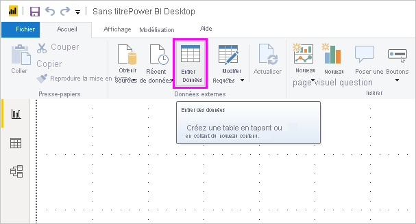
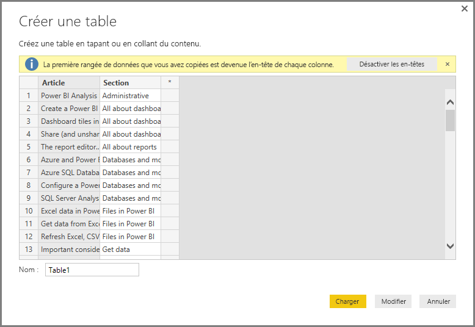

# Entrer des données directement dans Power BI Desktop

Avec Power BI Desktop, vous pouvez entrer directement des données et les utiliser dans des rapports et des visualisations. Par exemple, vous pouvez copier certaines parties d’un classeur ou d’une page web, puis les coller dans Power BI Desktop.

Pour entrer des données directement dans Power BI Desktop sous la forme d’une nouvelle table, sélectionnez **Entrer des données** dans le ruban **Accueil**.

Power BI Desktop peut essayer d’apporter de légères modifications aux données si besoin, comme c’est le cas lorsque vous chargez des données depuis une autre source. Par exemple, dans le cas suivant, il place la première ligne de données en en-tête.

Si vous souhaitez mettre en forme les données que vous avez entrées ou collées, sélectionnez **Modifier** pour ouvrir **l’éditeur de requête**. Vous pouvez mettre en forme et transformer les données avant de les placer dans Power BI Desktop. Sélectionnez **Charger** pour importer les données telles qu’elles apparaissent.

Lorsque vous cliquez sur **Charger**, Power BI Desktop crée une table à partir de vos données et la met à votre disposition dans le volet **Champs**. Dans l’image suivante, Power BI Desktop présente ma nouvelle table, appelée *Table1*, et les deux champs qui ont été créés dans cette table.

Et voilà ! C’est aussi simple que ça d’entrer des données dans Power BI Desktop.

Vous êtes maintenant prêt à utiliser les données dans Power BI Desktop. Vous pouvez créer des visuels et des rapports ou bien interagir avec toutes les autres données auxquelles vous souhaitez vous connecter et que vous voulez importer, par exemple des classeurs Excel, des bases de données ou toute autre source de données.

## Étapes suivantes

Vous pouvez connecter toutes sortes de données à l’aide de Power BI Desktop. Pour plus d’informations sur les sources de données, consultez les ressources suivantes :

* [Qu’est-ce que Power BI Desktop ?](../fundamentals/desktop-what-is-desktop.md)
* [Sources de données dans Power BI Desktop](desktop-data-sources.md)
* [Mettre en forme et combiner des données dans Power BI Desktop](desktop-shape-and-combine-data.md)
* [Se connecter à des classeurs Excel dans Power BI Desktop](desktop-connect-excel.md)
* [Se connecter à des fichiers CSV dans Power BI Desktop](desktop-connect-csv.md)
