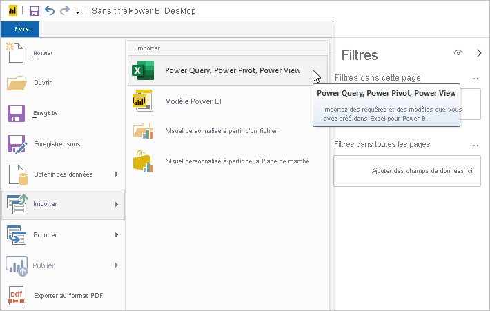
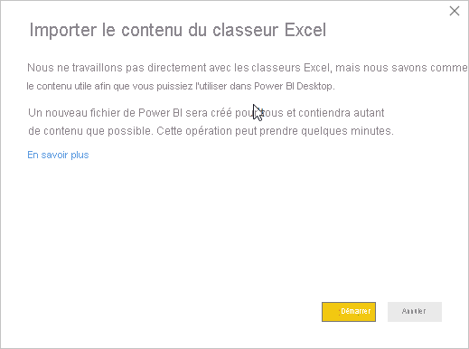
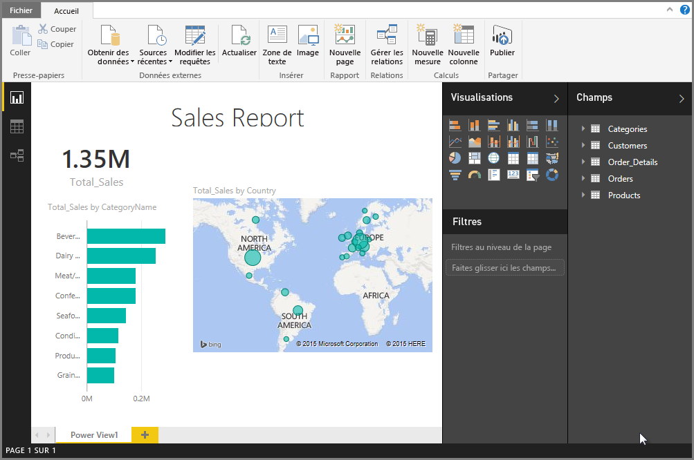

# Importer des classeurs Excel dans Power BI Desktop
Avec Power BI Desktop, vous pouvez facilement importer des classeurs Excel qui contiennent des requêtes Power Query, des modèles Power Pivot et des feuilles de calcul Power View dans Power BI Desktop. Power BI Desktop crée automatiquement des rapports et des visualisations basés sur le classeur Excel. Après avoir importé les rapports, vous pouvez continuer à les améliorer et à les affiner dans Power BI Desktop, à l’aide des fonctionnalités existantes et des nouvelles fonctionnalités proposées lors de chaque mise à jour mensuelle de Power BI Desktop.

## Comment importer un classeur Excel ?
1. Pour importer un classeur Excel dans Power BI Desktop, sélectionnez **Fichier** > **Importer** > **Power Query, Power Pivot, Power View**.

   

2. Dans la fenêtre **Ouvrir**, sélectionnez un classeur Excel à importer. 

   Bien qu’il n’existe actuellement aucune limitation quant à la taille ou au nombre d’objets dans le classeur, sachez qu’il faut plus de temps à Power BI Desktop pour analyser et importer les classeurs volumineux.

   > [!NOTE]
   > Pour charger ou importer des fichiers Excel à partir de dossiers OneDrive Entreprise partagés ou de dossiers de groupe Office 365, indiquez l’URL du fichier Excel dans la source de données web dans Power BI Desktop. Vous devez suivre plusieurs étapes pour formater correctement l’URL OneDrive Entreprise ; pour obtenir plus d’informations et l’ensemble des étapes appropriées, consultez [Utiliser des liens OneDrive Entreprise dans Power BI Desktop](desktop-use-onedrive-business-links.md).
   > 
   > 

3. Dans la boîte de dialogue Importer qui s’affiche, sélectionnez **Démarrer**.

   

   Power BI Desktop analyse le classeur et le convertit en fichier Power BI Desktop (.pbix). Cette action est un événement ponctuel. Une fois le fichier Power BI Desktop créé avec ces étapes, il n’a aucune dépendance envers le classeur Excel d’origine, et vous pouvez donc le modifier, l’enregistrer et le partager sans que cela n’affecte le classeur d’origine.

   Au terme de l’importation, une page récapitulative s’affiche : elle décrit les éléments qui ont été convertis et liste tous les éléments qui n’ont pas été importés.

   

4. Sélectionnez **Fermer**. 

   Power BI Desktop importe le classeur Excel et charge un rapport basé sur le contenu du classeur.

   

Après avoir importé le classeur, vous pouvez continuer à travailler sur le rapport. Par exemple, créez des visualisations, ajoutez des données ou créez des pages de rapport à l’aide des fonctionnalités et caractéristiques incluses dans Power BI Desktop.

## Quels sont les éléments du classeur qui sont importés ?
Power BI Desktop peut importer les éléments suivants, communément appelés *objets*dans Excel.

| Objet d’un classeur Excel | Résultat final dans le fichier Power BI Desktop |
| --- | --- |
| Requêtes Power Query |Toutes les requêtes Power Query dans Excel sont converties en requêtes dans Power BI Desktop. Si des groupes de requêtes sont définis dans le classeur Excel, la même organisation est répliquée dans Power BI Desktop. Toutes les requêtes sont chargées, sauf si elles sont configurées avec l’option **Créer uniquement la connexion** dans la boîte de dialogue Excel **Importer des données**. Vous pouvez personnaliser le comportement de chargement en sélectionnant **Propriétés** sous l’onglet **Accueil** de l’Éditeur Power Query dans Power BI Desktop. |
| Connexions de données externes Power Pivot |Toutes les connexions de données externes Power Pivot sont converties en requêtes dans Power BI Desktop. |
| Tables liées ou tables du classeur actuel |S’il existe dans Excel une table de feuille de calcul qui a été liée au modèle de données ou à une requête (à l’aide de l’option *À partir du tableau* ou de la fonction *Excel.CurrentWorkbook()* en M), les options suivantes sont proposées : <ol><li><b>Importer le tableau dans le fichier Power BI Desktop</b>. Ce tableau est une capture instantanée ponctuelle des données, après laquelle les données sont en lecture seule dans le tableau dans Power BI Desktop. Il existe une limite de taille de 1 million de caractères (au total, en combinant toutes les en-têtes de colonnes et toutes les cellules) pour les tableaux créés à l’aide de cette option.</li><li><b>Conserver une connexion au classeur d’origine.</b> En guise d’alternative, vous pouvez conserver une connexion au classeur Excel d’origine et Power BI Desktop récupère le contenu le plus récent de ce tableau à chaque actualisation, comme pour toute autre requête créée par rapport à un classeur Excel dans Power BI Desktop.</li></ul> |
| Colonnes calculées, mesures, indicateurs de performance clé, catégories de données et relations dans le modèle de données |Ces objets de modèle de données sont convertis en objets équivalents dans Power BI Desktop. Notez que certaines catégories de données, comme Image, ne sont pas encore disponibles dans Power BI Desktop. Dans ces cas-là, les informations de catégorie de données sont réinitialisées pour les colonnes en question. |
| Feuilles de calcul Power View |Une page de rapport est créée pour chaque feuille de calcul Power View dans Excel. Le nom et l’ordre de ces pages de rapport correspondent à ceux du classeur Excel d’origine. |

## Y a-t-il des restrictions quant à l’importation d’un classeur ?
Il existe quelques limitations quant à l’importation d’un classeur dans Power BI Desktop :

* **Connexions externes à des modèles tabulaires SQL Server Analysis Services** : dans Excel 2013, vous pouvez créer une connexion à des modèles tabulaires SQL Server Analysis Services et créer des rapports Power View sur ces modèles sans avoir à importer les données. Ce type de connexion n’est pas pris en charge actuellement pour l’importation de classeurs Excel dans Power BI Desktop. Pour résoudre ce problème, vous devez recréer ces connexions externes dans Power BI Desktop.
* **Hiérarchies :** ce type d’objet de modèle de données n’est pas pris en charge actuellement dans Power BI Desktop. Par conséquent, les hiérarchies sont ignorées lors de l’importation d’un classeur Excel dans Power BI Desktop.
* **Colonnes de données binaires :** ce type de colonne de modèle de données n’est pas pris en charge actuellement dans Power BI Desktop. Les colonnes de données binaires sont supprimées du tableau créé dans Power BI Desktop.
* **Éléments Power View non pris en charge :** certaines fonctionnalités de Power View ne sont pas encore disponibles dans Power BI Desktop, telles que les thèmes ou certains types de visualisations (nuages de points avec axe de lecture et comportements d’exploration au niveau du détail, entre autres). Ces visualisations non prises en charge génèrent des messages *Visualisation non prise en charge* à leurs emplacements correspondants dans le rapport Power BI Desktop, que vous pouvez supprimer ou reconfigurer en fonction de vos besoins.
* **Plages nommées utilisant** ***À partir du tableau*** **dans Power Query ou utilisant** ***Excel.CurrentWorkbook*** **en M :** l’importation des données de cette plage nommée dans Power BI Desktop n’est pas prise en charge actuellement, mais il s’agit d’une mise à jour planifiée. Actuellement, ces plages nommées sont chargées dans Power BI Desktop en tant que connexion au classeur Excel externe.
* **PowerPivot vers SSRS :** les connexions externes PowerPivot vers SQL Server Reporting Services (SSRS) ne sont pas prises en charge actuellement, car cette source de données n’est pas disponible dans Power BI Desktop.

