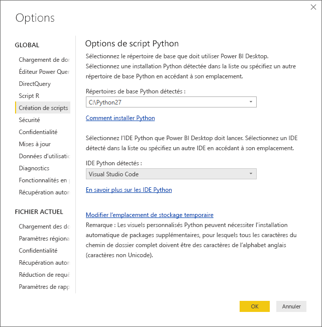
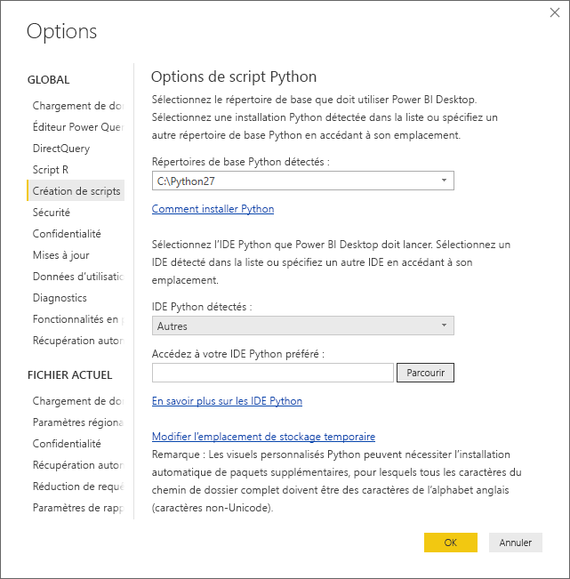
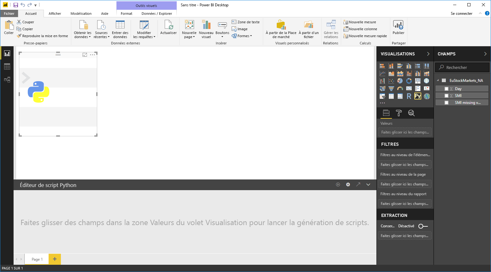
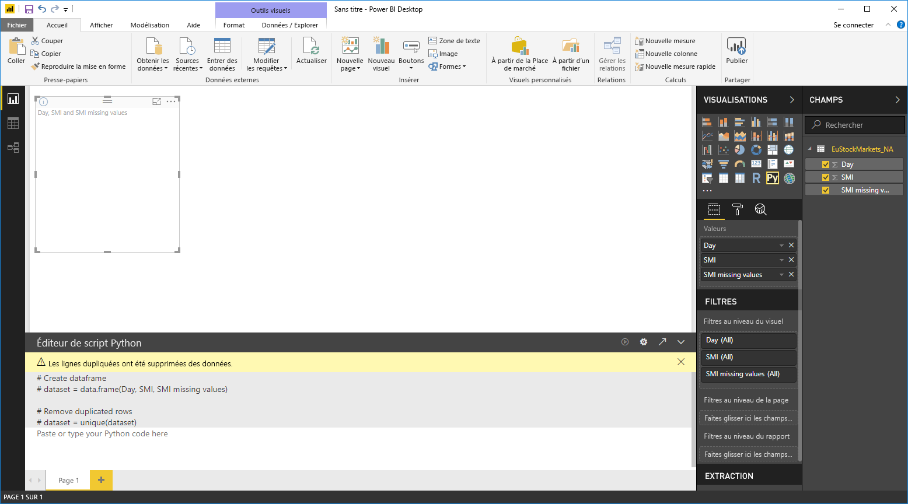
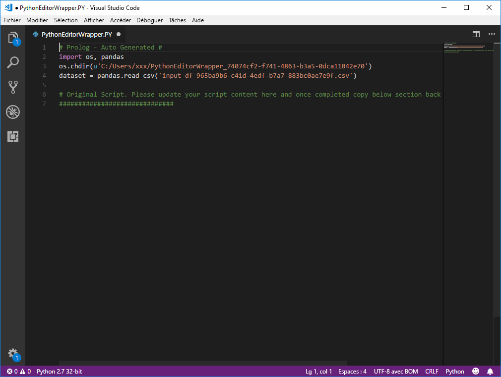

# Utiliser un IDE Python externe avec Power BI
Avec **Power BI Desktop**, vous pouvez utiliser un IDE (environnement de développement intégré) Python externe pour créer et affiner des scripts Python, puis utiliser ces scripts dans Power BI.

## Activer un IDE Python externe
Vous pouvez lancer votre IDE Python externe à partir de **Power BI Desktop** et importer et afficher vos données automatiquement dans l’IDE Python. À partir de là, vous pouvez modifier le script dans cet IDE Python externe, puis le coller dans **Power BI Desktop** pour créer des rapports et des visuels Power BI.

Vous pouvez spécifier les IDE Python que vous souhaitez utiliser et les lancer automatiquement à partir de **Power BI Desktop**.

### Configuration requise
Pour utiliser cette fonctionnalité, vous devez installer un **IDE Python** sur votre ordinateur local. **Power BI Desktop** ne contient pas, ne déploie pas ni n’installe le moteur Python. Vous devez donc installer **Python** séparément sur votre ordinateur local. Vous pouvez choisir l’IDE Python à utiliser avec les options suivantes :

* Vous pouvez installer votre IDE Python favori, nombre d’entre eux sont gratuits, à partir de la [page de téléchargement Visual Studio Code](https://code.visualstudio.com/download/).
* **Power BI Desktop** prend également en charge **Visual Studio**.
* Vous pouvez également installer un autre IDE Python et configurer **Power BI Desktop** pour lancer cet **IDE Python** en effectuant l’une des opérations suivantes :
  
  * Vous pouvez associer des fichiers **.PY** à l’IDE externe que vous souhaitez lancer à l’aide de **Power BI Desktop**.
  * Vous pouvez spécifier l’exécutable que **Power BI Desktop** doit lancer en sélectionnant *Autres* à partir de la section **Options de script Python** de la boîte de dialogue **Options**. Pour ouvrir la boîte de dialogue **Options**, accédez à **Fichier > Options et paramètres > Options**.
    
    

Si vous avez plusieurs IDE Python installés, vous pouvez spécifier lequel lancer en le sélectionnant dans la liste déroulante *IDE Python détectés* de la boîte de dialogue **Options**.

Par défaut, **Power BI Desktop** lance **Visual Studio Code** en tant qu’IDE Python externe s’il est installé sur votre ordinateur local ; si **Visual Studio Code** n’est pas installé et que vous avez **Visual Studio**, ce dernier est lancé à la place. Si aucun de ces IDE Python n’est installé, l’application associée aux fichiers **.PY** est lancée.

Si aucune association au fichier **.PY** n’existe, il est possible de spécifier un chemin à un IDE personnalisé dans la section *Accédez à votre IDE Python préféré* de la boîte de dialogue **Options**. Vous pouvez également lancer un autre IDE Python en sélectionnant l’icône en forme d’engrenage **Paramètres** à côté de l’icône représentant une flèche **Lancer un IDE Python** dans **Power BI Desktop**.

## Lancer un IDE Python à partir de Power BI Desktop
Pour lancer un IDE Python à partir de **Power BI Desktop**, effectuez les étapes suivantes :

1. Chargez des données dans **Power BI Desktop**.
2. Sélectionnez quelques champs que vous souhaitez utiliser dans le volet **Champs**. Si vous n’avez pas encore activé les éléments visuels de script, vous êtes invité à le faire.
   
   
3. Lorsque les visuels de script sont activés, vous pouvez sélectionner un visuel Python à partir du volet **Visualisations**, qui crée un visuel Python vide prêt à afficher les résultats de votre script. Le volet **Éditeur de script Python** s’affiche également.
   
   
4. Vous pouvez maintenant sélectionner les champs que vous souhaitez utiliser dans votre script Python. Lorsque vous sélectionnez un champ, le champ **Éditeur de script Python** crée automatiquement un code de script basé sur le ou les champs que vous sélectionnez. Vous pouvez créer (ou coller) votre script Python directement dans le volet **Éditeur de script Python**, ou le laisser vide.
   
   
   
   > [!NOTE]
   > Le type d’agrégation par défaut pour les visuels Python est *Ne pas synthétiser*.
   > 
   > 
5. Vous pouvez maintenant lancer votre IDE Python directement à partir de **Power BI Desktop**. Sélectionnez le bouton **Lancer l’IDE Python** qui se trouve à droite de la barre de titre **Éditeur de script Python**, comme indiqué ci-dessous.
   
   
6. L’IDE Python spécifié est lancé par Power BI Desktop, comme illustré dans l’image suivante (où **Visual Studio Code** est l’IDE Python par défaut).
   
   
   
   > [!NOTE]
   > **Power BI Desktop** ajoute les trois premières lignes du script afin qu’il puisse importer vos données à partir de **Power BI Desktop** une fois que vous exécutez le script.
   > 
   > 
7. Les scripts que vous avez créés dans le **volet Éditeur de script Python** de **Power BI Desktop** apparaissent à partir de la ligne 4 de votre IDE Python. À ce stade, vous pouvez créer votre script Python dans l’IDE Python. Une fois que votre script Python est terminé dans votre IDE Python, vous devez le copier et le coller dans le volet **Éditeur de script Python** de **Power BI Desktop**, *à l’exclusion des* trois premières lignes du script générées automatiquement par **Power BI Desktop**. Ne recopiez pas les trois premières lignes du script dans **Power BI Desktop**, car elles ont été utilisées uniquement pour importer vos données dans votre IDE Python à partir de **Power BI Desktop**.

### Limites connues
Le lancement de l’IDE Python directement à partir de Power BI Desktop présente quelques limitations :

* L’exportation automatique de votre script de l’IDE Python vers **Power BI Desktop** n’est pas prise en charge.

## Étapes suivantes
Consultez les informations supplémentaires suivantes sur Python dans Power BI.

* [Exécution de scripts Python dans Power BI Desktop](desktop-python-scripts.md)
* [Créer des visuels Power BI avec Python](desktop-python-visuals.md)

