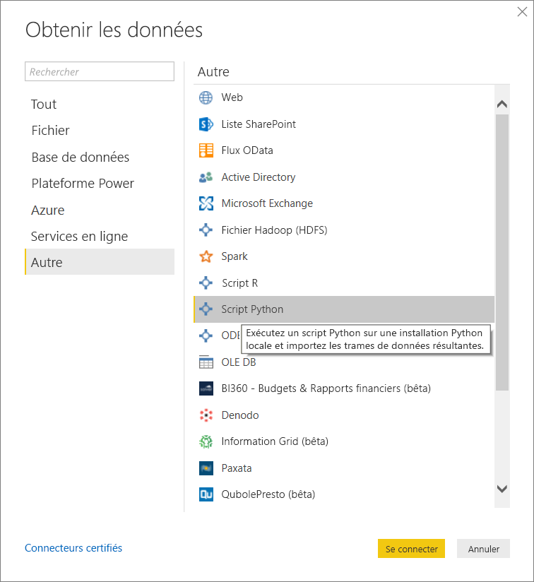
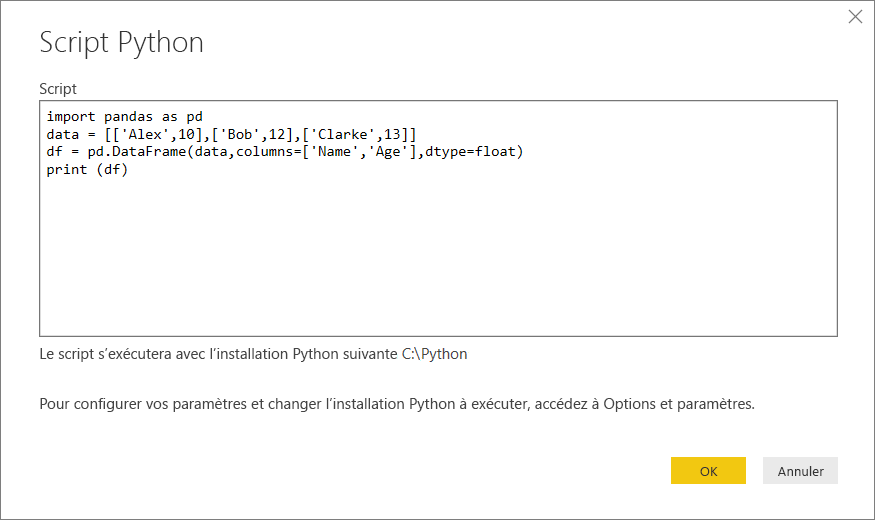
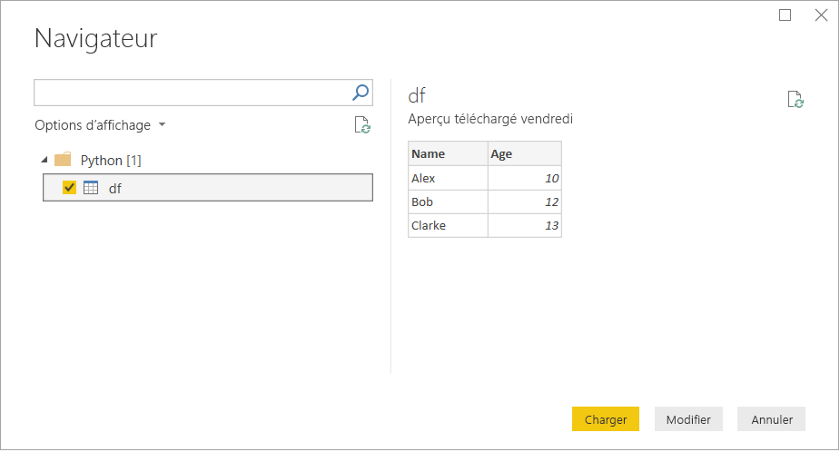
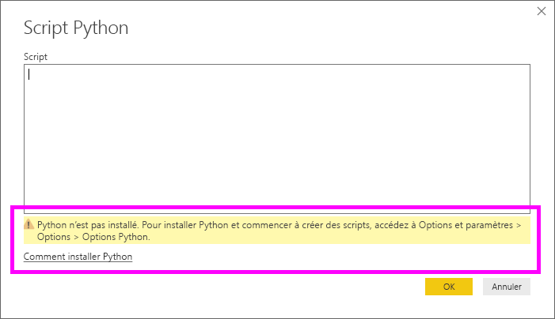

# <a name="run-python-scripts-in-power-bi-desktop"></a>Exécuter des scripts Python dans Power BI Desktop

Il est possible d’exécuter des scripts Python directement dans Power BI Desktop et d’importer les jeux de données obtenus dans un modèle de données Power BI Desktop.

## <a name="install-python"></a>Installer Python

Pour exécuter des scripts Python dans Power BI Desktop, vous devez installer Python sur votre ordinateur local. Pour télécharger Python, accédez au [site web Python](https://www.python.org/). La version actuelle des scripts Python prend en charge les espaces et les caractères Unicode dans le chemin d’installation.

### <a name="install-required-python-packages"></a>Installer les packages Python nécessaires

L’intégration de Python dans Power BI nécessite l’installation de deux packages Python :

* [Pandas](https://pandas.pydata.org/) : bibliothèque logicielle pour la manipulation et l’analyse de données. Ce package offre des structures de données et des opérations pour la manipulation de tables numériques et de séries chronologiques. Vos données importées doivent se trouver dans une [trame de données Pandas](https://www.tutorialspoint.com/python_pandas/python_pandas_dataframe.htm). Une trame de données est une structure de données à deux dimensions. Par exemple, les données sont alignées de manière tabulaire dans des lignes et des colonnes.
* [Matplotlib](https://matplotlib.org/) : bibliothèque de traçage pour Python et son extension mathématique numérique [NumPy](https://www.numpy.org/). Elle fournit une API orientée objet pour incorporer des tracés dans des applications à l’aide de boîtes à outils d’interface utilisateur graphique à usage général comme Tkinter, wxPython, Qt ou GTK+.

Dans une console ou un interpréteur de commandes, utilisez l’outil en ligne de commande [pip](https://pip.pypa.io/en/stable/) pour installer les deux packages. L’outil pip est empaqueté avec des versions plus récentes de Python.

```CMD
pip install pandas
pip install matplotlib
```

## <a name="enable-python-scripting"></a>Activer les scripts Python

Pour activer les scripts Python :

1. Dans Power BI Desktop, sélectionnez **Fichier** > **Options et paramètres** > **Options** > **Création de scripts Python**. La page **Options de scripts Python** s’affiche.

   

1. Si nécessaire, indiquez le chemin local d’installation de Python dans **Répertoires de base Python détectés**.

   Dans l’image ci-dessus, le chemin local d’installation de Python est *C:\Python*. Vérifiez que le chemin correspond à l’installation locale de Python que Power BI Desktop doit utiliser.

1. Sélectionnez **OK**.

Une fois que vous avez spécifié votre installation de Python, vous êtes prêt à exécuter des scripts Python dans Power BI Desktop.

## <a name="run-python-scripts"></a>Exécuter les scripts Python

En quelques étapes, vous pouvez exécuter des scripts Python et créer un modèle de données. À partir de ce modèle, vous pouvez créer des rapports et les partager sur le service Power BI.

### <a name="prepare-a-python-script"></a>Préparer un script Python

Tout d’abord, créez un script dans votre environnement de développement Python local et vérifiez qu’il s’exécute correctement. Par exemple, voici un script Python simple qui importe Pandas et utilise une trame de données :

```python
import pandas as pd
data = [['Alex',10],['Bob',12],['Clarke',13]]
df = pd.DataFrame(data,columns=['Name','Age'],dtype=float)
print (df)
```

Lorsqu’il est exécuté, ce script retourne :

```python
     Name   Age
0    Alex  10.0
1     Bob  12.0
2  Clarke  13.0
```

Lors de la préparation et de l’exécution d’un script Python dans Power BI Desktop, vous pouvez être confronté à quelques limitations :

* Seules les trames de données Pandas sont importées, donc vérifiez que les données que vous souhaitez importer dans Power BI sont représentées dans une trame de données.
* Tous les scripts Python exécutés pendant plus de 30 minutes expirent.
* Les appels interactifs dans le script Python, comme l’attente d’une entrée utilisateur, arrêtent l’exécution du script.
* Lorsque vous définissez le répertoire de travail dans le script Python, vous *devez* définir un chemin complet vers le répertoire de travail au lieu d’un chemin relatif.
* Actuellement, les tables imbriquées ne sont pas prises en charge.

### <a name="run-your-python-script-and-import-data"></a>Exécuter votre script Python et importer des données

Pour exécuter votre script Python dans Power BI Desktop :

1. Dans le ruban Accueil, sélectionnez **Obtenir des données** > **Autre**.

1. Sélectionnez **Autre** > **Script Python**, comme l’illustre l’image suivante :

   

1. Sélectionnez **Se connecter**. La dernière version de Python installée en local est sélectionnée comme moteur Python. Copiez votre script dans la boîte de dialogue **Script Python** qui s’affiche. Ici, nous entrons le script Python simple montré précédemment.

   

1. Sélectionnez **OK**. Si le script s’exécute correctement, le **Navigateur** s’affiche et vous pouvez charger les données afin de les utiliser. Pour l’exemple, sélectionnez **df**, comme l’illustre l’image, puis **Charger**.

    

### <a name="troubleshooting"></a>Résolution des problèmes

Si Python n’est pas installé ou identifié, un avertissement s’affiche. Vous pouvez également voir un avertissement si vous avez plusieurs installations d’ordinateurs locaux. Consultez les sections précédentes sur l’installation de Python et l’activation des scripts Python.



#### <a name="using-custom-python-distributions"></a>Utilisation de distributions Python personnalisées

Power BI exécute les scripts directement en utilisant l’exécutable python.exe à partir d’un répertoire fourni par l’utilisateur (par le biais de la page Paramètres). Les distributions qui nécessitent une étape supplémentaire pour préparer l’environnement (par exemple, Conda) peuvent rencontrer un problème entraînant l’échec de leur exécution.

Nous vous recommandons d’utiliser la distribution officielle de Python depuis https://www.python.org/ pour éviter les problèmes connexes.

En guise de solution possible, vous pouvez démarrer Power BI Desktop à partir de l’invite de votre environnement Python personnalisé.

### <a name="refresh"></a>Actualiser

Vous pouvez actualiser un script Python dans Power BI Desktop. Pour actualiser, accédez au ruban **Accueil**, puis sélectionnez **Actualiser**. Quand vous actualisez un script Python, Power BI Desktop le réexécute.

## <a name="known-limitations"></a>Limites connues

Actuellement, vous ne pouvez pas utiliser des scripts Python dans les rapports créés avec la fonctionnalité **Métadonnées améliorées (préversion)** activée. Les rapports existants continueront à fonctionner. Pour plus d’informations, consultez [Utilisation de métadonnées de jeu de données améliorées (préversion)](desktop-enhanced-dataset-metadata.md). 

## <a name="next-steps"></a>Étapes suivantes

Consultez les informations supplémentaires suivantes sur Python dans Power BI.

* [Créer des visuels Python dans Power BI Desktop](desktop-python-visuals.md)
* [Utiliser un IDE Python externe avec Power BI](desktop-python-ide.md)
