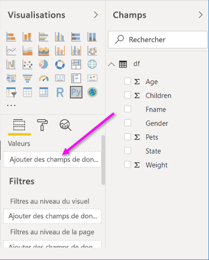
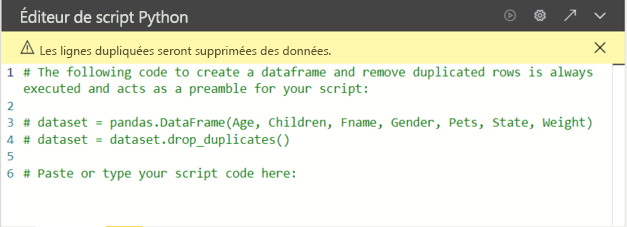
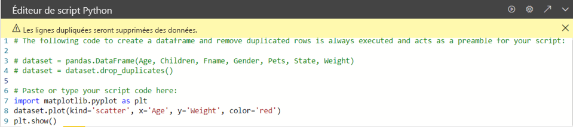

# <a name="create-power-bi-visuals-by-using-python"></a>Créer des visuels Power BI avec Python

Avec *Power BI Desktop*, vous pouvez utiliser Python pour visualiser vos données.

## <a name="prerequisites"></a>Prérequis

Suivez le tutoriel [Exécuter des scripts Python dans Power BI Desktop](desktop-python-scripts.md) à l’aide du script Python suivant :

```python
import pandas as pd 
df = pd.DataFrame({ 
    'Fname':['Harry','Sally','Paul','Abe','June','Mike','Tom'], 
    'Age':[21,34,42,18,24,80,22], 
    'Weight': [180, 130, 200, 140, 176, 142, 210], 
    'Gender':['M','F','M','M','F','M','M'], 
    'State':['Washington','Oregon','California','Washington','Nevada','Texas','Nevada'],
    'Children':[4,1,2,3,0,2,0],
    'Pets':[3,2,2,5,0,1,5] 
}) 
print (df) 
```

L’article [Exécuter des scripts Python dans Power BI Desktop](desktop-python-scripts.md) montre comment installer Python sur un ordinateur local et l’activer pour écrire des scripts Python dans Power BI Desktop. Ce tutoriel utilise les données du script ci-dessus pour illustrer la création de visuels Python.

## <a name="create-python-visuals-in-power-bi-desktop"></a>Créer des visuels Python dans Power BI Desktop

1. Sélectionnez l’icône **Visuel Python** dans le volet **Visualisations**.

   

1. Dans la boîte de dialogue **Activer les éléments visuels de script** qui s’affiche, sélectionnez **Activer**.

    Quand vous ajoutez un visuel Python à un rapport, Power BI Desktop effectue les actions suivantes :

    - Une image de visuel Python apparaît sous forme d’espace réservé sur le canevas de rapport.

    - L’**Éditeur de script Python** s’affiche en bas du volet central.

    

1. Ensuite, faites glisser les champs **Age** (Âge), **Children** (Enfants), **Fname** (Prénom), **Gender** (Sexe), **Pets** (Animaux), **State** (État) et **Weight** (Poids) dans la section **Valeurs** où est indiqué **Ajouter des champs de données ici**.

    

   Votre script Python peut seulement utiliser des champs ajoutés à la section **Valeurs**. Vous pouvez ajouter ou supprimer des champs dans la section **Valeurs** tout en travaillant sur votre script Python. Power BI Desktop détecte automatiquement les modifications apportées aux champs.

   > [!NOTE]
   > Le type d’agrégation par défaut pour les visuels Python est *Ne pas synthétiser*.
   > 
   > 

1. Vous pouvez à présent utiliser les données sélectionnées pour créer un tracé.

    Quand vous sélectionnez ou supprimez des champs, le code correspondant est automatiquement généré ou supprimé dans l’Éditeur de script Python. 

    L’éditeur de script Python génère le code de liaison suivant à partir de vos sélections.

    - L’éditeur a créé un dataframe de *jeu de données*, avec les champs que vous avez ajoutés.
    - L’agrégation par défaut est *Ne pas synthétiser*.
    - À l’instar des visuels de table, les champs sont regroupés et les lignes en double n’apparaissent qu’une fois.

    

     > [!TIP]
     > Dans certains cas, il peut être dans votre intérêt de ne pas avoir recours au regroupement automatique ou bien d’afficher toutes les lignes, notamment les doublons. Si c’est le cas, vous pouvez ajouter un champ d’index à votre jeu de données. De cette façon, toutes les lignes sont considérées comme étant uniques, ce qui empêche le regroupement.

   Vous pouvez accéder aux colonnes du jeu de données par leurs noms respectifs. Par exemple, vous pouvez coder `dataset["Age"]` dans votre script Python pour accéder au champ Age (Âge).

1. Une fois la trame de données générée automatiquement par les champs que vous avez sélectionnés, vous pouvez écrire un script Python qui génère le traçage sur l’appareil Python par défaut. Une fois le script terminé, sélectionnez **Exécuter** dans la barre de titre de l’**Éditeur de script Python**.

   Power BI Desktop retrace le visuel si l’un des événements suivants se produit :

   - Lorsque vous sélectionnez **Exécuter** dans la barre de titres **Éditeur de script Python**
   - À chaque changement de données dû à l’actualisation des données, au filtrage ou à la mise en surbrillance

   Quand vous exécutez un script Python qui génère une erreur, le visuel Python n’est pas tracé et un message d’erreur de canevas s’affiche. Pour plus d’informations sur l’erreur, sélectionnez **Afficher les détails** à partir du message.

   Pour obtenir une plus grande vue des visualisations, vous pouvez réduire l’**Éditeur de script Python**.

Nous allons à présent créer des visuels.

## <a name="create-a-scatter-plot"></a>Créer un nuage de points

Nous allons créer un nuage de points pour voir s’il existe une corrélation entre l’âge et le poids.

1. Sous **Collez ou tapez votre code de script ici**, entrez ce code :

   ```python
   import matplotlib.pyplot as plt 
   dataset.plot(kind='scatter', x='Age', y='Weight', color='red')
   plt.show() 
   ```  

   Le volet de l’Éditeur de script Python doit maintenant ressembler à ceci :

   

   La bibliothèque **matplotlib** est importée pour tracer et créer nos visuels.

1. Quand vous sélectionnez le bouton **Exécuter** le script, le nuage de points suivant est généré dans l’espace réservé de l’image du visuel Python.

   

## <a name="create-a-line-plot-with-multiple-columns"></a>Créer un tracé de ligne avec plusieurs colonnes

 Nous allons créer un tracé de ligne pour chaque personne qui indique leur nombre d’enfants et d’animaux. Supprimez ou commentez le code indiqué sous **Collez ou tapez votre code de script ici**, puis entrez ce code Python :

 ```python
 import matplotlib.pyplot as plt 
ax = plt.gca() 
dataset.plot(kind='line',x='Fname',y='Children',ax=ax) 
dataset.plot(kind='line',x='Fname',y='Pets', color='red', ax=ax) 
plt.show() 
```

Quand vous sélectionnez le bouton **Exécuter** le script, le tracé de ligne suivant est généré avec plusieurs colonnes.


## <a name="create-a-bar-plot"></a>Créer un tracé à barres

Créons un tracé à barres pour l’âge de chaque personne. Supprimez ou commentez le code indiqué sous **Collez ou tapez votre code de script ici**, puis entrez ce code Python :

```python
import matplotlib.pyplot as plt 
dataset.plot(kind='bar',x='Fname',y='Age') 
plt.show() 
```

Quand vous sélectionnez le bouton **Exécuter** le script, le tracé à barres suivant est généré :

 

## <a name="security"></a>Sécurité

> [!IMPORTANT] 
> **Sécurité des scripts Python :** Les éléments visuels Python sont créés à partir de scripts Python, qui peuvent contenir du code qui présente des risques pour la sécurité ou la confidentialité. Quand un utilisateur tente de voir ou d’utiliser un visuel Python pour la première fois, un message d’avertissement de sécurité lui est présenté. Activez les visuels Python seulement si vous faites confiance à l’auteur et à la source ou après avoir examiné et compris le script Python.
>  

## <a name="more-information-about-plotting-with-matplotlib-pandas-and-python"></a>Informations supplémentaires sur le traçage avec Matplotlib, Pandas et Python

Ce tutoriel est conçu pour vous aider à créer des visuels avec Python dans Power BI Desktop. Il aborde rapidement les nombreuses options et fonctionnalités permettant de créer des rapports visuels à l’aide de Python, Pandas et la bibliothèque Matplotlib. De nombreuses informations supplémentaires sont disponibles, ainsi que des liens pour vous aider à bien démarrer.

- Documentation du site web [Matplotlib](https://matplotlib.org/). 
- [Tutoriel Matplotlib : Guide de base pour utiliser Matplotlib avec Python](https://www.datasciencelearner.com/matplotlib-tutorial-complete-guide-to-use-matplotlib-with-python/) 
- [Tutoriel Matplotlib : Bibliothèque Matplotlib Python avec des exemples](https://www.edureka.co/blog/python-matplotlib-tutorial/) 
- [Informations de référence sur l’API Pandas](https://pandas.pydata.org/pandas-docs/stable/reference/index.html) 
- [Visualisations Python dans le service Power BI](https://powerbi.microsoft.com/blog/python-visualizations-in-power-bi-service/) 
- [Utilisation de visuels Python dans Power BI](https://www.absentdata.com/how-to-user-python-and-power-bi/)

## <a name="known-limitations"></a>Limites connues

Les visuels Python dans Power BI Desktop présentent quelques limitations :

- Taille des données : les données utilisées par le visuel Python pour le traçage sont limitées à 150 000 lignes. Si plus de 150 000 lignes sont sélectionnées, seules les 150 000 premières lignes sont utilisées et un message s’affiche sur l’image. En outre, les données d’entrée ont une limite de 250 Mo. 
- Résolution : tous les visuels Python sont affichés dans une résolution de 72 ppp.
- Temps de calcul : si le calcul d’un visuel Python prend plus de cinq minutes, le délai d’exécution est dépassé, ce qui provoque une erreur.
- Relations : Comme avec d’autres visuels Power BI Desktop, si des champs de données provenant de différentes tables sans aucune relation définie entre elles sont sélectionnés, une erreur se produit.
- Les visuels Python sont actualisés lors de la mise à jour, du filtrage et de la sélection des données. Toutefois, l’image elle-même n’est pas interactive et ne peut pas être la source du filtrage croisé.
- Les visuels Python répondent à la sélection d’autres visuels, mais vous ne pouvez pas cliquer sur des éléments dans le visuel Python pour appliquer un filtre croisé à d’autres éléments.
- Seuls les tracés représentés sur l’écran Python par défaut s’affichent correctement sur le canevas. Évitez d’utiliser explicitement un autre écran Python.
- Les visuels Python ne prennent pas en charge le renommage des colonnes d’entrée. Les colonnes sont référencées par leur nom d’origine durant l’exécution du script.

## <a name="next-steps"></a>Étapes suivantes

Consultez les informations supplémentaires suivantes sur Python dans Power BI.

- [Exécuter des scripts Python dans Power BI Desktop](desktop-python-scripts.md)
- [Utiliser un IDE Python externe avec Power BI](desktop-python-ide.md)

