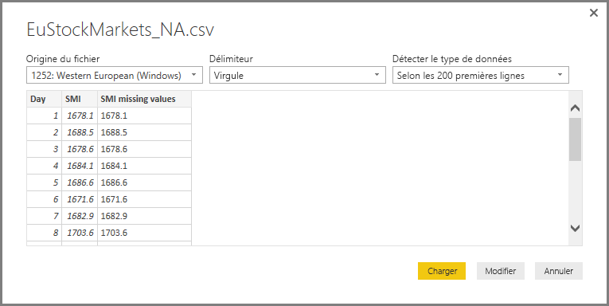
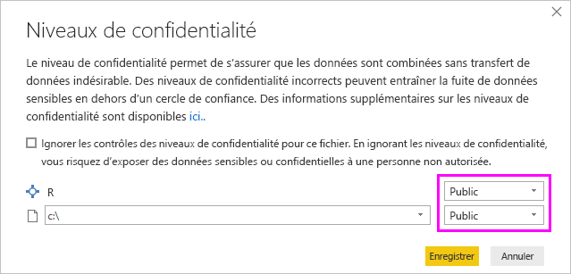
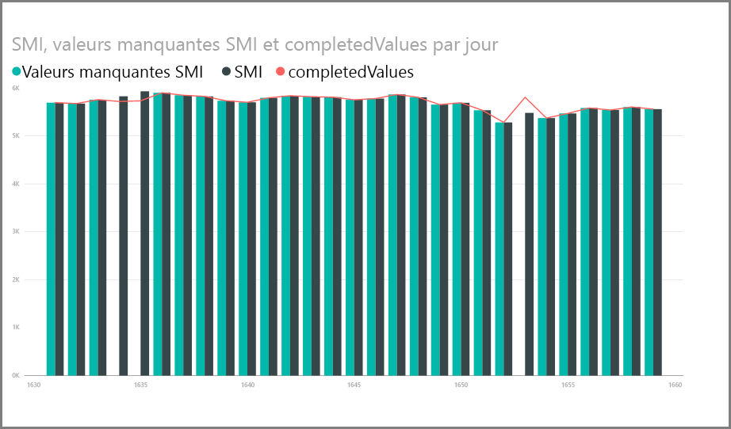

# <a name="use-r-in-power-query-editor"></a>Utiliser le langage R dans l’Éditeur Power Query

Le [langage R](https://mran.microsoft.com/documents/what-is-r) est un langage de programmation puissant qui est utilisé par de nombreux statisticiens, scientifiques des données et analystes de données. Vous pouvez utiliser R dans l’Éditeur Power Query de Power BI Desktop pour :

* Préparer des modèles de données.

* Créer des rapports.

* Procéder au nettoyage de données, à la mise en forme avancée de données et à l’analytique de jeux de données, ce qui inclut la saisie semi-automatique des données, les prédictions, le clustering, et bien plus encore.  

## <a name="install-r"></a>Installer R

Vous pouvez télécharger R gratuitement à partir de la [page de téléchargement de Revolution R Open](https://mran.revolutionanalytics.com/download/) et du [référentiel CRAN](https://cran.r-project.org/bin/windows/base/).

## <a name="install-mice"></a>Installer mice

Comme prérequis, installez la [bibliothèque mice](https://www.rdocumentation.org/packages/mice/versions/3.5.0/topics/mice) dans votre environnement R. Sans mice, l’exemple de code de script ne fonctionnera pas correctement. Le package mice implémente une méthode pour gérer les données manquantes.

Pour installer la bibliothèque mice :

1. Lancez le programme R.exe (par exemple, C:\Program Files\Microsoft\R Open\R-3.5.3\bin\R.exe).  

2. Exécutez la commande d’installation à partir de l’invite R :

   ``` 
   install.packages('mice') 
   ```

## <a name="use-r-in-power-query-editor"></a>Utiliser le langage R dans l’Éditeur Power Query

Pour illustrer l’utilisation de R dans l’Éditeur Power Query, nous allons partir d’un exemple de jeu de données boursières contenues dans un fichier .csv et effectuer les étapes suivantes :

1. [Téléchargez le fichier EuStockMarkets_NA.csv](https://download.microsoft.com/download/F/8/A/F8AA9DC9-8545-4AAE-9305-27AD1D01DC03/EuStockMarkets_NA.csv). Notez l’endroit où vous l’enregistrez.

1. Chargez le fichier dans Power BI Desktop. Sous l’onglet **Accueil**, sélectionnez **Obtenir les données** > **Texte/CSV**.

   

1. Sélectionnez le fichier EuStockMarkets_NA.csv, puis choisissez **Ouvrir**. Les données CSV s’affichent dans la boîte de dialogue **Fichier texte/CSV**.

   

1. Sélectionnez **Charger** pour charger les données du fichier. Quand Power BI a fini de charger les données, la nouvelle table s’affiche dans le volet **Champs**.

   

1. Pour ouvrir l’Éditeur Power Query, dans le ruban **Accueil**, sélectionnez **Modifier les requêtes**.

   

1. Sous l’onglet **Transformer**, sélectionnez **Exécuter un script R**. L’éditeur **Exécuter un script R** s’affiche. Les lignes 15 et 20 ont des données manquantes, tout comme d’autres lignes qui ne sont pas visibles dans l’image. Les étapes suivantes montrent de quelle façon R complète ces lignes à votre place.

   

1. Pour cet exemple, entrez le code de script suivant dans la zone **Script** de la fenêtre **Exécuter un script R**. Remplacez *&lt;Your File Path&gt;* (Chemin de votre fichier) par le chemin du fichier EuStockMarkets_NA.csv sur votre système de fichiers local, par exemple, C:/Users/John Doe/Documents/Microsoft/EuStockMarkets_NA.csv.

    ```r
       dataset <- read.csv(file="<Your File Path>/EuStockMarkets_NA.csv", header=TRUE, sep=",")
       library(mice)
       tempData <- mice(dataset,m=1,maxit=50,meth='pmm',seed=100)
       completedData <- complete(tempData,1)
       output <- dataset
       output$completedValues <- completedData$"SMI missing values"
    ```

    > [!NOTE]
    > Vous devrez remplacer une variable nommée *output* pour créer correctement le nouveau jeu de données avec les filtres appliqués.

7. Sélectionnez **OK**. L’Éditeur Power Query affiche un avertissement concernant la confidentialité des données.

   
8. Dans le message d’avertissement, sélectionnez **Continuer**. Dans la boîte de dialogue **Niveaux de confidentialité** qui s’affiche, définissez toutes les sources de données sur **Public** pour que les scripts R fonctionnent correctement dans le service Power BI. 

   

   Pour plus d’informations sur les paramètres de confidentialité et leurs implications, consultez [Niveaux de confidentialité Power BI Desktop](../admin/desktop-privacy-levels.md).

 9. Sélectionnez **Enregistrer** pour exécuter le script. 

   Le volet **Champs** comporte une nouvelle colonne appelée **completedValues**. Dans cette colonne, il manque quelques éléments de données, par exemple sur les lignes 15 et 18. La section suivante explique de quelle façon R gère ce problème.

   Avec seulement cinq lignes de script R, l’Éditeur Power Query a renseigné les valeurs manquantes sur la base d’un modèle de prévision.

## <a name="create-visuals-from-r-script-data"></a>Créer des visuels à partir des données de script R

Nous pouvons maintenant créer un visuel pour voir de quelle manière le code de script R avec la bibliothèque mice remplit les valeurs manquantes.



Vous pouvez enregistrer tous les visuels terminés dans un fichier .pbix Power BI Desktop, et utiliser le modèle de données et ses scripts R dans le service Power BI.

> [!NOTE]
> Vous pouvez [télécharger un fichier .pbix](https://download.microsoft.com/download/F/8/A/F8AA9DC9-8545-4AAE-9305-27AD1D01DC03/Complete%20Values%20with%20R%20in%20PQ.pbix) une fois toutes ces étapes terminées.

Après avoir chargé le fichier .pbix vers le service Power BI, vous devez effectuer des étapes supplémentaires pour activer l’actualisation des données du service et les visuels mis à jour :  

* **Activer l’actualisation planifiée du jeu de données** : pour activer l’actualisation planifiée du classeur contenant votre jeu de données avec des scripts R, consultez [Configuration d’une actualisation planifiée](refresh-scheduled-refresh.md). Cet article contient également des informations sur les passerelles personnelles.

* **Installer une passerelle personnelle** : une passerelle personnelle doit être installée sur la machine où se trouvent le fichier et R. Le service Power BI accède à ce classeur et restitue de nouveau tous les visuels mis à jour. Pour plus d’informations, consultez [Utiliser des passerelles personnelles dans Power BI](service-gateway-personal-mode.md).

## <a name="limitations"></a>Limites

Certaines limitations s’appliquent aux requêtes qui incluent des scripts R créés dans l’Éditeur Power Query :

* Tous les paramètres de source de données R doivent être définis comme étant **publics**. Toutes les autres étapes d’une requête dans l’Éditeur Power Query doivent également être publiques. 

   Pour obtenir les paramètres de la source de données, dans Power BI Desktop, sélectionnez **Fichier** > **Options et paramètres** > **Paramètres de la source de données**.

   

   Dans la boîte de dialogue **Paramètres de la source de données**, sélectionnez la ou les sources de données, puis sélectionnez **Modifier les autorisations**. Définissez le **Niveau de confidentialité** sur **Public**.

     
  
* Pour planifier l’actualisation des visuels R ou d’un jeu de données, activez l’actualisation planifiée et installez une passerelle personnelle sur l’ordinateur contenant le classeur et R. 

Vous pouvez réaliser toutes sortes de choses avec R et les requêtes personnalisées. Explorez et mettez en forme vos données exactement comme vous souhaitez les voir.

## <a name="next-steps"></a>Étapes suivantes

* [Présentation de R](https://mran.microsoft.com/documents/what-is-r) 

* [Exécuter des scripts R dans Power BI Desktop](desktop-r-scripts.md) 

* [Utiliser un IDE R externe avec Power BI](desktop-r-ide.md) 

* [Créer des visuels en utilisant des packages R dans le service Power BI](service-r-packages-support.md)
