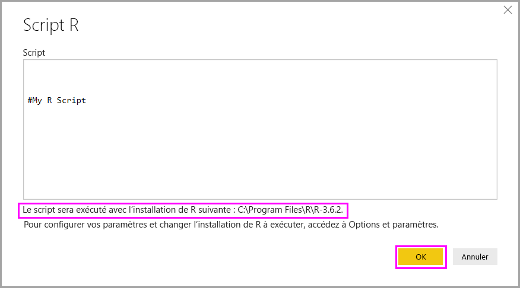
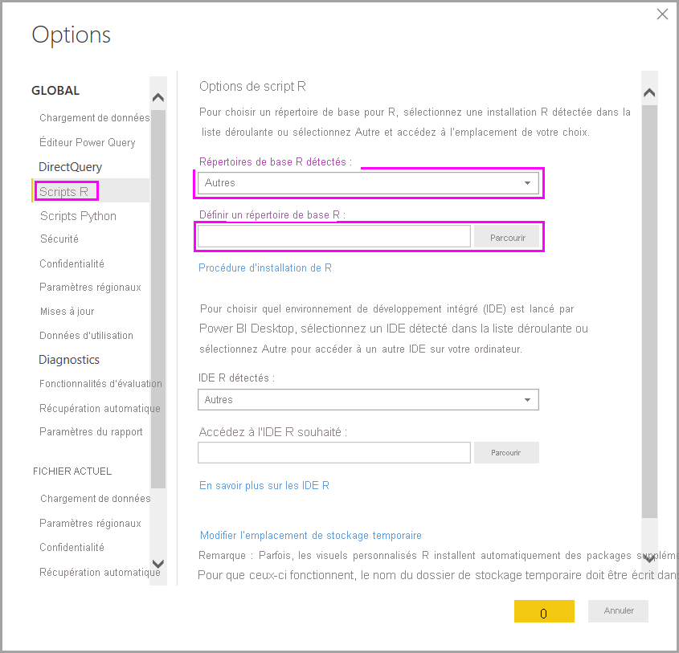

# Exécuter des scripts R dans Power BI Desktop

Vous pouvez exécuter des scripts R directement dans Power BI Desktop et importer les jeux de données obtenus dans un modèle de données Power BI Desktop.

## Installer R

Pour exécuter des scripts R dans Power BI Desktop, vous devez installer R sur votre ordinateur local. Vous pouvez télécharger et installer R gratuitement à partir de nombreux emplacements, dont le [Réseau d’applications Microsoft R](https://mran.revolutionanalytics.com/download/) et le [Référentiel CRAN](https://cran.r-project.org/bin/windows/base/). La version actuelle prend en charge les espaces (caractères vides) et les caractères Unicode dans le chemin d’installation.

## Exécuter des scripts R

En quelques étapes dans Power BI Desktop, vous pouvez exécuter des scripts R et créer un modèle de données. Avec le modèle de données, vous pouvez créer des rapports et les partager sur le service Power BI. Les scripts R dans Power BI Desktop prennent maintenant en charge les formats de nombres qui contiennent des virgules (,) et des points (.).

### Préparer un script R

Pour exécuter un script R dans Power BI Desktop, créez-le dans votre environnement de développement R local, puis assurez-vous qu’il fonctionne correctement.

Pour exécuter le script dans Power BI Desktop, assurez-vous qu’il s’exécute correctement dans un espace de travail nouveau et non modifié. Ce prérequis signifie que l’ensemble des packages et dépendances doivent être explicitement chargés et exécutés. Vous pouvez utiliser `source()` pour exécuter des scripts dépendants.

Lorsque vous préparez et exécutez un script R dans Power BI Desktop, vous pouvez être confronté à quelques limitations :

* Étant donné que seules les trames de données sont importées, n’oubliez pas de représenter les données que vous souhaitez importer dans Power BI dans une trame de données.
* Les colonnes qui sont de type Complexe et Vecteur ne sont pas importées et sont remplacées par des valeurs d’erreur dans la table créée.
* Les valeurs marquées comme `N/A` sont converties en valeurs `NULL` dans Power BI Desktop.
* Si un script R s’exécute pendant plus de 30 minutes, il expire.
* Les appels interactifs dans le script R, comme l’attente pour l’entrée d’un utilisateur, arrêtent l’exécution du script.
* Lorsque vous définissez le répertoire de travail dans le script R, vous *devez* définir un chemin d’accès complet vers le répertoire de travail, au lieu d’un chemin d’accès relatif.

### Exécuter votre script R et importer des données

Vous pouvez maintenant exécuter votre script R pour importer des données dans Power BI Desktop :

1. Dans Power BI Desktop, sélectionnez **Obtenir les données**, choisissez **Autre** > **Script R**, puis sélectionnez **Se connecter** :

    

2. Si R est installé sur votre ordinateur local, copiez simplement votre script dans la fenêtre de script et sélectionnez **OK**. La dernière version installée s’affiche en tant que moteur R.

    

3. Sélectionnez **OK** pour exécuter le script R. Lorsque le script s’exécute correctement, vous pouvez choisir les trames de données obtenues pour les ajouter au modèle Power BI.

Vous pouvez contrôler l’installation R à utiliser pour exécuter votre script. Pour spécifier vos paramètres d’installation de R, sélectionnez **Fichier** > **Options et paramètres** > **Options**, puis sélectionnez **Scripts R**. Sous **Options de script R**, la liste déroulante **Répertoires de base R détectés** affiche les options d’installation R actuelles. Si l’installation de R que vous souhaitez ne figure pas dans la liste, sélectionnez **Autre**, puis accédez à votre dossier d’installation R par défaut ou saisissez-le dans **Définir un répertoire de base R**.

### Actualisation

Vous pouvez actualiser un script R dans Power BI Desktop. Lorsque vous actualisez un script R, Power BI Desktop réexécute le script R dans l’environnement de Power BI Desktop.

## Étapes suivantes

Consultez les informations supplémentaires suivantes sur R dans Power BI.

* [Créer des visuels Power BI avec R](../create-reports/desktop-r-visuals.md)
* [Utiliser un IDE R externe avec Power BI](desktop-r-ide.md)
