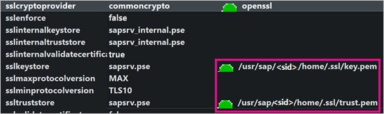
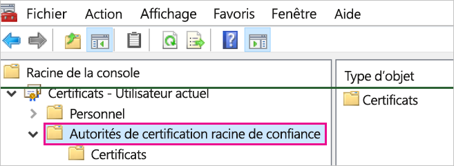
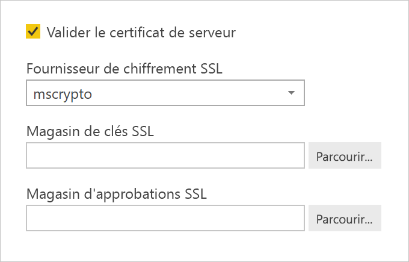

# <a name="enable-encryption-for-sap-hana"></a>Activer le chiffrement pour SAP HANA

Nous vous recommandons de chiffrer les connexions à un serveur SAP HANA à partir de Power BI Desktop et du service Power BI. Vous pouvez activer le chiffrement HANA à l’aide de la bibliothèque OpenSSL et de la bibliothèque propriétaire CommonCryptoLib (anciennement sapcrypto) de SAP. SAP recommande d’utiliser CommonCryptoLib, mais les fonctionnalités de chiffrement de base sont disponibles dans l’une ou l’autre des bibliothèques.

Cet article fournit une vue d’ensemble de l’activation du chiffrement à l’aide d’OpenSSL et référence des domaines spécifiques de la documentation SAP. Nous mettons régulièrement à jour le contenu et les liens, mais pour obtenir des instructions et un support complets, reportez-vous toujours à la documentation SAP officielle. Si vous souhaitez configurer le chiffrement à l’aide de CommonCryptoLib et non d’OpenSSL, reportez-vous à [How to Configure TLS/SSL in SAP HANA 2.0](https://blogs.sap.com/2018/11/13/how-to-configure-tlsssl-in-sap-hana-2.0/) (Configuration de TLS/SSL dans SAP HANA 2.0). Pour connaître la procédure à suivre pour migrer d’OpenSSL vers CommonCryptoLib, consultez [SAP Note 2093286](https://launchpad.support.sap.com/#/notes/2093286) (Note SAP 2093286) (compte super utilisateur requis).

> [!NOTE]
> Les étapes de configuration du chiffrement détaillées dans cet article se chevauchent avec les étapes d’installation et de configuration de l’authentification unique SAML. Que vous choisissiez OpenSSL ou CommonCryptoLib comme fournisseur de chiffrement de votre serveur HANA, assurez-vous que votre choix est cohérent dans les configurations de chiffrement et SAML.

L’activation du chiffrement pour SAP HANA à l’aide d’OpenSSL comprend quatre phases. Nous allons aborder ces phases ultérieurement.  Pour plus d’informations, consultez [Securing the Communication between SAP HANA Studio and SAP HANA Server through SSL](https://blogs.sap.com/2015/09/28/securing-the-communication-between-sap-hana-studio-and-sap-hana-server-through-ssl/) (Sécurisation de la communication entre SAP HANA Studio et SAP HANA Server via SSL).

## <a name="use-openssl"></a>Utiliser OpenSSL

Vérifiez que votre serveur HANA est configuré pour utiliser OpenSSL comme son fournisseur de services de chiffrement. Remplacez les informations de chemin d’accès manquantes ci-dessous par l’ID serveur (SID) du serveur HANA.



## <a name="create-a-certificate-signing-request"></a>Créer une demande de signature de certificat

Créez une demande de signature de certificat x509 pour le serveur HANA.

1. À l’aide de SSH, connectez-vous à la machine Linux sur laquelle le serveur HANA s’exécute en tant que \<sid\>adm.

1. Accédez au répertoire de base _/__usr/sap/\<sid\>/home_.

1. Créez un répertoire masqué portant le nom _.__ssl_s’il n’en existe pas déjà un.

1. Exécutez la commande suivante :

    ```
    openssl req -newkey rsa:2048 -days 365 -sha256 -keyout Server\_Key.pem -out Server\_Req.pem -nodes
    ```

Cette commande crée une demande de signature de certificat et une clé privée. Une fois signé, le certificat est valide pendant une année (voir le paramètre -days). Lorsque vous êtes invité à entrer le nom commun (CN), entrez le nom de domaine complet (FQDN) de l’ordinateur sur lequel le serveur HANA est installé.

## <a name="get-the-certificate-signed"></a>Obtenir le certificat signé

Obtenez le certificat signé par une autorité de certification (CA) approuvée par le ou les clients que vous utiliserez pour vous connecter au serveur HANA.

1. Si vous disposez déjà d’une autorité de certification d’entreprise approuvée (représentée par CA\_Cert.pem et CA\_Key.pem dans l’exemple suivant), signez la demande de certificat en exécutant la commande suivante :

    ```
    openssl x509 -req -days 365 -in Server\_Req.pem -sha256 -extfile /etc/ssl/openssl.cnf -extensions usr\_cert -CA CA\_Cert.pem -CAkey CA\_Key.pem -CAcreateserial -out Server\_Cert.pem
    ```

    Si vous n’avez pas encore d’autorité de certification que vous pouvez utiliser, vous pouvez créer vous-même une autorité de certification racine en suivant la procédure décrite dans [Securing the Communication between SAP HANA Studio and SAP HANA Server through SSL](https://blogs.sap.com/2015/09/28/securing-the-communication-between-sap-hana-studio-and-sap-hana-server-through-ssl/) (Sécurisation de la communication entre SAP HANA Studio et SAP HANA Server via SSL).

1. Créez la chaîne de certification du serveur HANA en combinant le certificat du serveur, la clé et le certificat de l’autorité de certification (le nom key.pem représente la convention pour SAP HANA) :

    ```
    cat Server\_Cert.pem Server\_Key.pem CA\_Cert.pem \> key.pem
    ```

1. Créez une copie de CA\_Cert.pem nommée trust.pem (le nom trust.pem est la convention pour SAP HANA) :

    ```
    cp CA\_Cert.pem trust.pem
    ```

1. Redémarrez le serveur HANA.

1. Vérifiez la relation d’approbation entre un client et l’autorité de certification que vous avez utilisée pour signer le certificat du serveur SAP HANA.

    Le client doit approuver l’autorité de certification utilisée pour signer le certificat x509 du serveur HANA avant de pouvoir établir une connexion chiffrée avec le serveur HANA à partir de la machine du client.

    Il existe plusieurs façons de s’assurer que cette relation d’approbation existe à l’aide de la console MMC (Microsoft Management Console) ou de la ligne de commande. Vous pouvez importer le certificat x509 de l’autorité de certification (trust.pem) dans le dossier **Autorités de certification racines de confiance** de l’utilisateur qui établira la connexion, ou dans le même dossier de l’ordinateur client lui-même, si cela est souhaitable.

    

    Vous devez d’abord convertir trust.pem en fichier .crt avant de pouvoir importer le certificat dans le dossier Autorités de certification racines de confiance, par exemple en exécutant la commande OpenSSL suivante :

    ```
    openssl x509 -outform der -in your-cert.pem -out your-cert.crt
    ```
    
    Pour plus d’informations sur l’utilisation d’OpenSSL pour la conversion, consultez la [documentation OpenSSL](https://www.openssl.org/docs/man1.0.2/man3/x509.html).

## <a name="test-the-connection"></a>Tester la connexion

Testez la connexion dans Power BI Desktop ou le service Power BI.

1. Dans Power BI Desktop ou dans la page **Gérer les passerelles** du service Power BI, assurez-vous que l’option **Valider le certificat du serveur** est activée avant de tenter d’établir une connexion avec votre serveur SAP HANA. Pour le champ **Fournisseur de chiffrement SSL**, sélectionnez mscrypto si vous avez suivi les étapes de configuration d’OpenSSL et commoncrypto si vous avez configuré cette bibliothèque en tant que fournisseur de chiffrement. Ne renseignez pas les champs Magasin de clés SSL et Magasin d’approbations SSL.

    - Power BI Desktop

        

    - Service Power BI

        

1. Vérifiez que vous pouvez établir correctement une connexion chiffrée avec le serveur avec l’option **Valider le certificat du serveur** activée, en chargeant des données dans Power BI Desktop ou en actualisant un rapport publié dans le service Power BI.
