# <a name="tutorial-shape-and-combine-data-in-power-bi-desktop"></a>Tutoriel : Mettre en forme et combiner des données dans Power BI Desktop

Avec Power BI Desktop, vous pouvez vous connecter à différents types de sources de données, puis mettre en forme les données en fonction de vos besoins, de façon à créer des rapports visuels à partager avec d’autres. *Mettre en forme* des données consiste à transformer les données, c’est-à-dire à renommer des colonnes ou des tables, à changer du texte en nombres, à supprimer des lignes, à définir la première ligne comme en-têtes, etc. *Combiner* des données consiste à se connecter à plusieurs sources de données, à les mettre en forme en fonction des besoins, puis à les regrouper dans une requête utile.

Dans ce tutoriel, vous allez découvrir comment :

* Mettre forme des données avec l’Éditeur de requête.
* Se connecter à différentes sources de données.
* Combiner ces sources de données et créer un modèle de données utilisable dans des rapports.

Ce tutoriel montre comment mettre en forme une requête avec Power BI Desktop et présente les tâches les plus courantes. Pour plus d’informations sur la requête utilisée ici, notamment sur sa création de toutes pièces, consultez [Prise en main de Power BI Desktop](../fundamentals/desktop-getting-started.md).

L’Éditeur de requête de Power BI Desktop fait largement appel aux menus contextuels (clic droit) ainsi qu’au ruban **Transformer**. La plupart des éléments que vous pouvez sélectionner dans le ruban sont aussi accessibles en cliquant avec le bouton droit sur un élément, par exemple une colonne, puis en choisissant une option dans le menu qui s’affiche.

## <a name="shape-data"></a>Mettre en forme les données
Quand vous mettez en forme des données dans l’Éditeur de requête, vous donnez à l’Éditeur de requête des instructions pas à pas pour ajuster les données à votre place à mesure qu’elles sont chargées et présentées. La source de données d’origine n’est pas affectée : seule cette vue particulière des données est ajustée, c’est-à-dire *mise en forme*.

Les étapes que vous spécifiez (par exemple, renommage d’une table, transformation d’un type de données ou suppression d’une colonne) sont enregistrées par l’Éditeur de requête. Chaque fois que cette requête se connecte à la source de données, l’Éditeur de requête effectue ces étapes, si bien que les données sont toujours mises en forme comme vous le spécifiez. Ce processus se produit chaque fois que vous utilisez l’Éditeur de requête ou qu’une personne utilise votre requête partagée, par exemple dans le service Power BI. Ces étapes sont capturées, de manière séquentielle, dans le volet **Paramètres des requêtes**, sous **Étapes appliquées**. Nous allons passer en revue chacune de ces étapes dans les paragraphes suivants.


Dans [Prise en main de Power BI Desktop](../fundamentals/desktop-getting-started.md), nous allons utiliser les données sur la retraite que nous avons récupérées en nous connectant à une source de données web, puis nous les mettrons en forme selon nos besoins. Nous ajouterons une colonne personnalisée pour calculer le classement en fonction de toutes les données qui représentent des facteurs d’égalité, puis nous comparerons cette colonne à la colonne existante, **Rank** (Classement).  

1. Dans le ruban **Ajouter une colonne**, sélectionnez **Colonne personnalisée** pour ajouter une colonne personnalisée.

    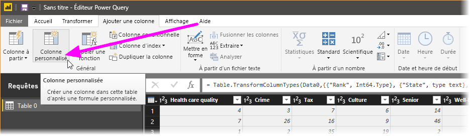

1. Dans la fenêtre **Colonne personnalisée**, dans **Nouveau nom de colonne**, entrez _New Rank_ (Nouveau classement). Dans **Formule de colonne personnalisée**, entrez les données suivantes :

    ```
    ([Cost of living] + [Weather] + [Health care quality] + [Crime] + [Tax] + [Culture] + [Senior] + [#"Well-being"]) / 8
    ```
 
1. Vérifiez que le message d’état indique *Aucune erreur de syntaxe n’a été détectée*, puis sélectionnez **OK**.

    

1. Pour maintenir la cohérence des données de la colonne, transformez les nouvelles valeurs de la colonne en nombres entiers. Pour les modifier, cliquez avec le bouton droit sur l’en-tête de la colonne, puis sélectionnez **Modifier le type \> Nombre entier**. 

    Si vous avez besoin de sélectionner plusieurs colonnes, sélectionnez une colonne, maintenez la touche **Maj** enfoncée, sélectionnez les colonnes adjacentes supplémentaires, puis cliquez avec le bouton droit sur un en-tête de colonne. Vous pouvez également utiliser la touche **Ctrl** pour sélectionner des colonnes non adjacentes.

    

1. Pour *transformer* des types de données de colonne, ce qui consiste à transformer le type de données actuel en un autre, sélectionnez **Texte de données : Texte** dans le ruban **Transformer**. 

   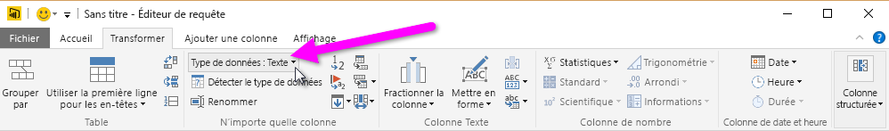

1. Dans **Paramètres de requête**, la liste **Étapes appliquées** reflète les étapes de mise en forme appliquées aux données. Pour supprimer une étape du processus de mise en forme, sélectionnez le **X** à gauche de l’étape. 

    Dans l’image suivante, la liste **Étapes appliquées** reflète les étapes ajoutées jusqu’à présent : 
     - **Source** : connexion au site web.
     - **Navigation** : sélection de la table. 
     - **Type modifié** : modification du type de colonne de *Texte* à *Nombre entier*. 
     - **Personnalisée ajoutée** : ajout d’une colonne personnalisée.
     - **Type modifié1** : dernière étape appliquée.

       

## <a name="adjust-data"></a>Ajuster les données

Avant d’utiliser cette requête, nous devons apporter quelques modifications pour ajuster ses données :

   - Ajuster les classements en supprimant une colonne.

       Nous avons décidé que la colonne **Cost of living** (Coût de la vie) n’était pas un facteur déterminant pour nos résultats. Après avoir supprimé cette colonne, nous constatons que les données sont inchangées. 

   - Corriger quelques erreurs.

       Comme nous avons supprimé une colonne, nous devons réajuster nos calculs dans la colonne **New Rank** en modifiant notamment une formule.

   - Trier les données.

       Trions les données en fonction des colonnes **New Rank** et **Rank**.
 
   - Remplacer les données.

       Nous allons voir comment remplacer une valeur spécifique et souligner la nécessité d’insérer une **Étape appliquée**.

   - Changer le nom de la table. 

       Sachant que **Table 0** n’est pas un descripteur utile pour la table, nous allons changer son nom.

1. Pour supprimer la colonne **Cost of living** (Coût de la vie), sélectionnez-la, choisissez l’onglet **Accueil** dans le ruban, puis sélectionnez **Supprimer les colonnes**.

    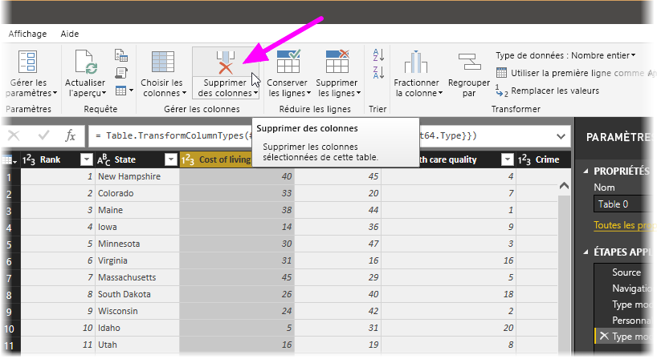

   Vous remarquerez que les valeurs de **New Rank** n’ont pas changé du fait de l’ordre des étapes. Sachant que l’Éditeur de requête enregistre les étapes de manière séquentielle, mais indépendamment les unes des autres, vous pouvez faire monter ou descendre chaque **étape appliquée** dans la séquence. 

1. Cliquez avec le bouton droit sur une étape. L’Éditeur de requête propose un menu qui vous permet d’effectuer les tâches suivantes : 
   - **Renommer** : renommez l’étape.
   - **Supprimer** : supprimez l’étape.
   - **Supprimer** **jusqu’à la fin** : supprimez l’étape active et toutes celles qui suivent.
   - **Déplacer vers le haut** : faites monter l’étape dans la liste.
   - **Déplacer vers le bas** : faites descendre l’étape dans la liste.

1. Déplacez la dernière étape, **Colonnes supprimées**, juste au-dessus de l’étape **Personnalisée ajoutée**.

   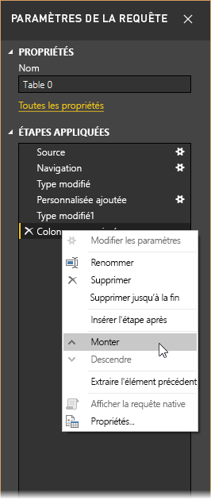

1. Sélectionnez l’étape **Personnalisée ajoutée**. 

   Notez que les données indiquent à présent _Error_ (Erreur), ce que nous devrons examiner.

   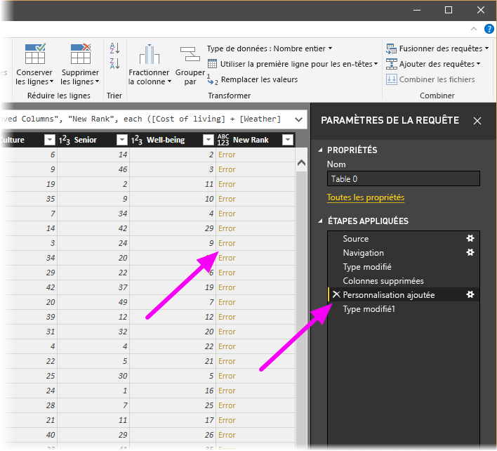

   Il existe plusieurs façons d’obtenir des informations sur chaque erreur. Si vous sélectionnez la cellule sans cliquer directement sur le mot *Erreur*, l’Éditeur de requête affiche les informations sur l’erreur au bas de la fenêtre.

   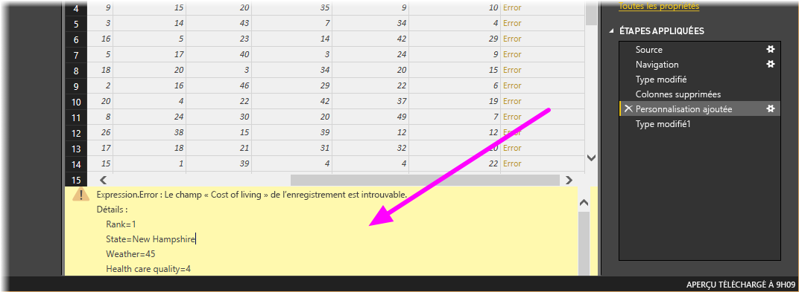

   Si vous sélectionnez le mot *Erreur* directement, l’Éditeur de requête crée une **étape appliquée** dans le volet **Paramètres de requête** et affiche des informations sur l’erreur. 

1. Comme nous n’avons pas besoin d’afficher d’informations sur les erreurs, sélectionnez **Annuler**.

1. Pour corriger les erreurs, sélectionnez la colonne **New Rank**, puis affichez la formule de données de la colonne en cochant la case **Barre de formule** à partir de l’onglet **Affichage**. 

   

1. Supprimez le paramètre _Cost of living_ et décrémentez le diviseur en modifiant la formule comme suit : 
   ```
    Table.AddColumn(#"Removed Columns", "New Rank", each ([Weather] + [Health care quality] + [Crime] + [Tax] + [Culture] + [Senior] + [#"Well-being"]) / 7)
   ```

1. Sélectionnez la coche verte à gauche de la zone de formule ou appuyez sur **Entrée**.

  L’Éditeur de requête remplace les données par les valeurs modifiées et l’étape **Personnalisée ajoutée** se termine sans erreur.

   > [!NOTE]
   > Vous pouvez aussi sélectionner **Supprimer les erreurs** via le ruban ou le menu contextuel pour supprimer les lignes qui présentent des erreurs. Ceci dit, comme nous voulons garder les données dans la table pour ce tutoriel, nous n’allons pas le faire.

1. Triez les données en fonction de la colonne **New Rank**. Sélectionnez d’abord la dernière étape appliquée, **Type modifié1** pour afficher les données les plus récentes. Ensuite, sélectionnez la liste déroulante située en regard de l’en-tête de colonne **New Rank**, puis choisissez **Tri croissant**.

   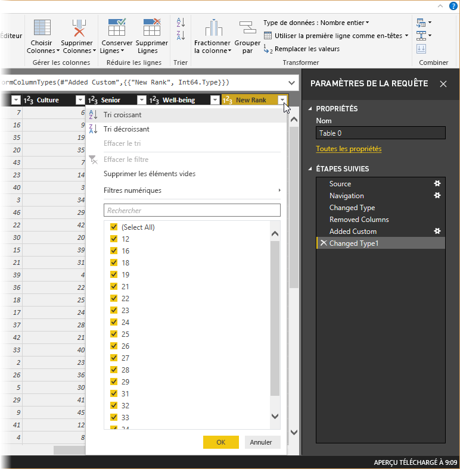

   Les données sont maintenant triées en fonction de la colonne **New Rank**. Cependant, si vous examinez la colonne **Rank**, vous remarquerez que les données ne sont pas triées correctement quand la valeur de **New Rank** est égale. Nous corrigerons cela à l’étape suivante.

1. Pour corriger le problème de tri des données, sélectionnez la colonne **New Rank** et remplacez la formule figurant dans la **Barre de formule** par la formule suivante :

   ```
    = Table.Sort(#"Changed Type1",{{"New Rank", Order.Ascending},{"Rank", Order.Ascending}})
   ```

1. Sélectionnez la coche verte à gauche de la zone de formule ou appuyez sur **Entrée**. 

   Les lignes sont à présent classées en fonction des colonnes **New Rank** et **Rank**. En outre, vous pouvez sélectionner n’importe quelle **étape appliquée** dans la liste et poursuivre la mise en forme des données à ce stade de la séquence. L’Éditeur de requête insère automatiquement une nouvelle étape de suite après l’**étape appliquée** actuellement sélectionnée. 

1. Dans **Étape appliquée**, sélectionnez l’étape qui précède la colonne personnalisée, à savoir l’étape **Colonnes supprimées**. Nous allons remplacer ici la valeur de classement **Weather** (Météo) en Arizona. Cliquez avec le bouton droit sur la cellule contenant le classement **Weather** (Météo) de l’Arizona, puis sélectionnez **Remplacer les valeurs**. Faites attention à l’**étape appliquée** qui est actuellement sélectionnée.

   

1. Sélectionnez **Insérer**.

    Comme nous insérons une étape, l’Éditeur de requête nous avertit du risque encouru ; l’ajout d’étapes peut occasionner la rupture de la requête. 

    

1. Remplacez la valeur de données par _51_. 

   L’Éditeur de requête remplace les données pour l’Arizona. Quand vous créez une **étape appliquée**, l’Éditeur de requête lui attribue un nom basé sur l’action effectuée, en l’occurrence **Valeur remplacée**. Si plusieurs étapes portent le même nom dans votre requête, l’Éditeur de requête ajoute un numéro séquentiel à chaque **étape appliquée** pour les différencier.

1. Sélectionnez la dernière **étape appliquée**, **Lignes triées**. 

   Notez que les données ont changé en ce qui concerne le nouveau classement de l’Arizona. La raison de ce changement est que nous avons inséré l’étape **Valeur remplacée** au bon endroit, avant l’étape **Personnalisée ajoutée**.

1. Enfin, nous voulons modifier le nom de cette table par quelque chose de plus explicite. Dans le volet **Paramètres de requête**, sous **Propriétés**, entrez le nouveau nom de la table, puis sélectionnez **Entrer**. Nommez cette table *RetirementStats*.

   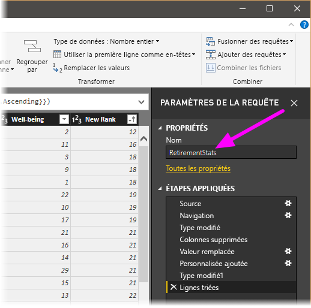

   Au moment de créer des rapports, il est particulièrement utile d’avoir des noms de table descriptifs, notamment quand il s’agit de se connecter à plusieurs sources de données qui figurent toutes dans le volet **Champs** de la vue **Rapport**.

   Les données sont maintenant mises en forme comme nous le souhaitions. À présent, connectons-nous à une autre source de données et combinons des données.

## <a name="combine-data"></a>Combiner des données
Les données sur les différents États sont intéressantes et pourront servir à des analyses complémentaire ou à créer d’autres requêtes. Toutefois, elles posent un problème : la plupart de ces données utilisent une abréviation à deux lettres pour les codes d’États, à la place du nom complet de l’État. Nous devons pouvoir associer les noms des États à leurs abréviations.

Par chance, il existe une autre source de données publique qui remplit précisément cette fonction, mais un effort important de mise en forme sera nécessaire pour la connecter à la table relative à la retraite. Pour mettre en forme les données, effectuez ces étapes :

1. Dans le ruban **Accueil** de l’Éditeur de requête, sélectionnez **Nouvelle source \> Web**. 

2. Entrez l’adresse du site web pour les abréviations des États, *https://en.wikipedia.org/wiki/List_of_U.S._state_abbreviations* , puis sélectionnez **Se connecter**.

   Le navigateur affiche le contenu du site web.

    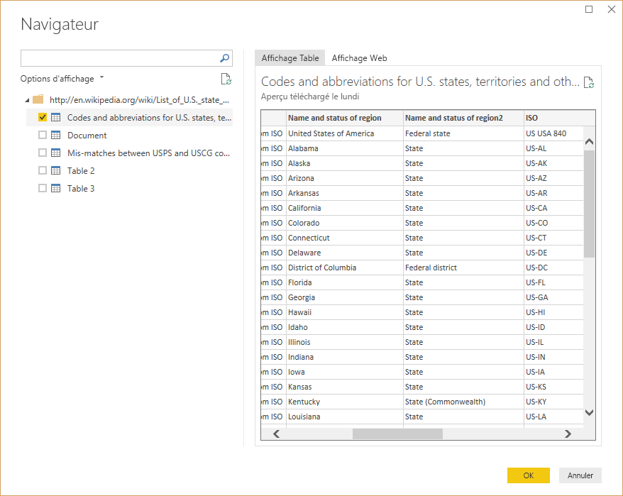

1. Sélectionnez **Codes and abbreviations**. 

   > [!TIP]
   > Quelques efforts de mise en forme sont nécessaires pour réduire les données de ce tableau à ce que nous voulons. Existe-t-il un moyen plus rapide ou plus facile d’effectuer les étapes suivantes ? Oui, il est possible de créer une *relation* entre les deux tables et de mettre en forme les données en fonction de cette relation. Les étapes suivantes restent utiles pour apprendre à travailler avec des tables. Cependant, les relations peuvent vous aider à utiliser rapidement les données de plusieurs tables.
> 
> 

Pour mettre en forme les données, effectuez ces étapes :

1. Supprimez la ligne du haut. Comme elle est le résultat de la façon dont la table de cette page web a été créée, nous n’en avons pas besoin. Sous l’onglet **Accueil** du ruban, sélectionnez **Réduire les lignes \>Supprimer les lignes \>Supprimer les lignes du haut**.

    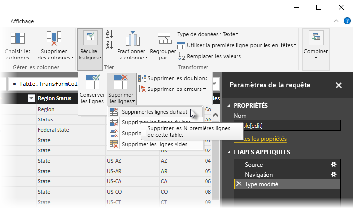

    La fenêtre **Supprimer les lignes du haut** s’affiche, dans laquelle vous pouvez spécifier le nombre de lignes à supprimer.

    > [!NOTE]
    > Si Power BI importe accidentellement les en-têtes sous la forme d’une ligne dans votre table de données, vous pouvez sélectionner **Utiliser la première ligne comme en-tête** dans l’onglet **Accueil** ou dans l’onglet **Transformer** du ruban pour corriger votre table.

1. Supprimez les 26 lignes du bas. Ces lignes correspondent à des territoires américains, que nous n’avons pas besoin d’inclure. Sous l’onglet **Accueil** du ruban, sélectionnez **Réduire les lignes \> Supprimer les lignes \> Supprimer les lignes du bas**.

    

1. Comme la table RetirementStats ne contient pas d’informations pour Washington DC, nous devons la filtrer hors de la liste. Sélectionnez la flèche déroulante **Region Status** (Statut de la région), puis décochez la case en regard de **Federal district** (District fédéral).

    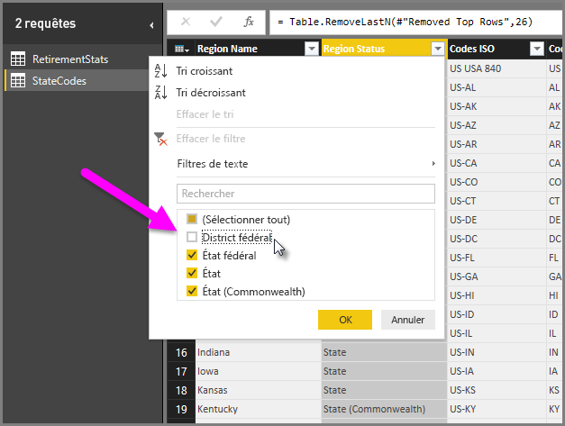

1. Supprimez quelques colonnes inutiles. Comme nous n’avons besoin que du mappage de chaque État avec leur abréviation à deux lettres officielle, nous pouvons supprimer les colonnes suivantes : **Colonne1**, **Colonne3**, **Colonne4**, puis **Colonne6** à **Colonne11**. Commencez par sélectionner la **Colonne1**, enfoncez la touche **Ctrl**, puis sélectionnez les autres colonnes à supprimer. À partir de l’onglet **Accueil** du ruban, sélectionnez **Supprimer les colonnes \> Supprimer les colonnes**.

   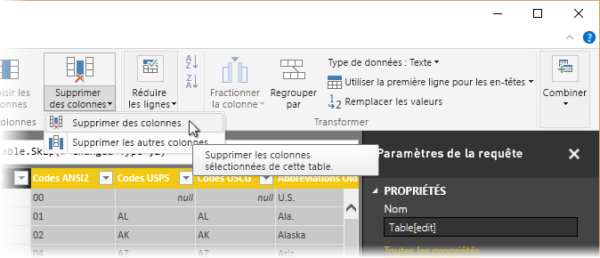

   > [!NOTE]
   > Il est maintenant judicieux de souligner que la *séquence* des étapes appliquées dans l’Éditeur de requête est importante et peut affecter la manière dont les données sont mises en forme. Il est également important de savoir comment une étape peut avoir un impact sur une étape ultérieure. Si vous supprimez une étape de la section Étapes appliquées, les étapes suivantes peuvent ne pas se comporter comme prévu initialement, en raison de l’impact de la séquence des étapes de la requête.

   > [!NOTE]
   > Quand vous redimensionnez la fenêtre Éditeur de requête pour réduire sa largeur, certains éléments du ruban sont condensés pour tirer le meilleur parti de l’espace visible. Quand vous augmentez la largeur de la fenêtre Éditeur de requête, les éléments de ruban sont développés pour exploiter pleinement la zone agrandie du ruban.

1. Renommez les colonnes et la table. Vous pouvez renommer une colonne de plusieurs façons : Tout d’abord, sélectionnez la colonne, puis choisissez **Renommer** à partir de l’onglet **Transformer** du ruban, ou cliquez avec le bouton droit et sélectionnez **Renommer**. Dans l’image suivante, les flèches indiquent les deux options ; vous ne devez en choisir qu’une seule.

   

1. Renommez les colonnes *State Name* (Nom de l’état) et *State Code* (Code de l’état). Pour renommer la table, entrez le **Nom** dans le volet **Paramètres de requête**. Nommez cette table *StateCodes*.

## <a name="combine-queries"></a>Combiner les requêtes

Maintenant que nous avons mis en forme la table StateCodes comme nous le voulions, combinons ces deux tables (ou requêtes) en une seule. Les tables dont nous disposons à présent étant le résultat des requêtes que nous avons appliquées aux données, elles sont souvent appelées *requêtes*.

Il existe deux façons principales de combiner des requêtes : par *fusion* et par *ajout*.

- Pour ajouter une ou plusieurs colonnes à une autre requête, vous *fusionnez* les requêtes. 
- Pour ajouter des lignes de données à une requête existante, vous *ajoutez* la requête.

Dans le cas présent, nous souhaitons fusionner les requêtes. Pour ce faire, procédez comme suit :
 
1. Dans le volet gauche de l’Éditeur de requête, sélectionnez la requête *dans laquelle* vous voulez fusionner l’autre requête. Dans ce cas, il s’agit de **RetirementStats**. 

1. Sélectionnez **Combiner \> Fusionner des requêtes** à partir de l’onglet **Accueil** du ruban.

   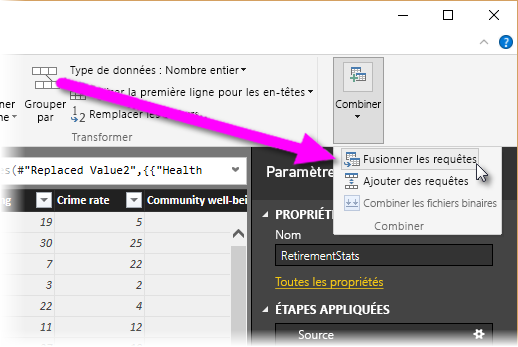

   Vous serez peut-être invité à définir les niveaux de confidentialité pour faire en sorte que les données soient combinées sans inclure ni transférer des données que vous ne voulez pas transférer.

   La fenêtre **Fusionner** s’affiche. Elle vous invite à sélectionner la table à fusionner dans la table déjà sélectionnée, puis les colonnes correspondantes à utiliser pour la fusion. 

1. Sélectionnez **State** (État) dans la table RetirementStats, puis sélectionnez la requête **StateCodes**. 

   Quand vous sélectionnez les colonnes correspondantes, le bouton **OK** est activé.

   

1. Sélectionnez **OK**.

   L’Éditeur de requête crée une colonne **NewColumn** à la fin de la requête, qui comporte le contenu de la table (requête) qui a été fusionnée avec la requête existante. Toutes les colonnes de la requête fusionnée sont condensées dans la colonne **NewColumn**, mais vous pouvez **développer** la table et inclure les colonnes de votre choix.

   

1. Pour développer la table fusionnée et sélectionner les colonnes à inclure, sélectionnez l’icône de développement (). 

   La fenêtre **Développer** apparaît.

   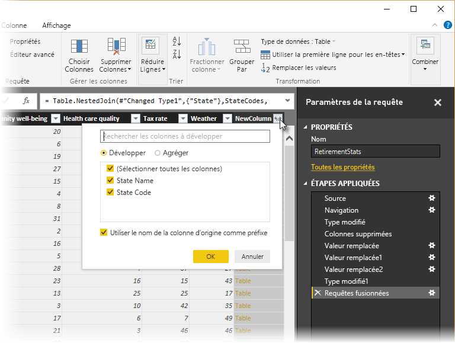

1. Dans ce cas, seule la colonne **State Code** nous intéresse. Sélectionnez cette colonne, décochez **Utiliser le nom de la colonne d’origine comme préfixe**, puis sélectionnez **OK**.

   Si nous avions laissé la case **Utiliser le nom de colonne d’origine comme préfixe** cochée, la colonne fusionnée aurait été nommée **NewColumn.State Code**.

   > [!NOTE]
   > Vous voulez savoir comment afficher la table NewColumn ? Vous pouvez faire des essais et si les résultats ne vous satisfont pas, supprimez simplement cette étape de la liste **Étapes appliquées** dans le volet **Paramètres d’une requête**. Votre requête retourne à l’état précédant l’application de l’étape **Développer**. Vous pouvez faire cela autant de fois que vous le voulez jusqu’à ce que le processus de développement vous convienne.

   Nous disposons à présent d’une requête (table) unique qui combine deux sources de données, chacune ayant été mise en forme selon nos besoins. Cette requête peut servir de base pour de nombreuses autres connexions de données intéressantes, comme des statistiques sur le coût du logement, des données démographiques ou des opportunités de travail dans un État.

1. Pour appliquer vos modifications et fermer l’Éditeur de requête, sélectionnez **Fermer et appliquer** à partir de l’onglet **Accueil** du ruban. 

   Le jeu de données transformé s’affiche dans Power BI Desktop, prêt à l’usage pour la création de rapports.

   

## <a name="next-steps"></a>Étapes suivantes
Pour plus d’informations sur Power BI Desktop et ses fonctionnalités, consultez les ressources suivantes :

* [Qu’est-ce que Power BI Desktop ?](../fundamentals/desktop-what-is-desktop.md)
* [Présentation des requêtes dans Power BI Desktop](../transform-model/desktop-query-overview.md)
* [Sources de données dans Power BI Desktop](desktop-data-sources.md)
* [Se connecter aux données dans Power BI Desktop](desktop-connect-to-data.md)
* [Tâches courantes relatives aux requêtes dans Power BI Desktop](../transform-model/desktop-common-query-tasks.md)   
