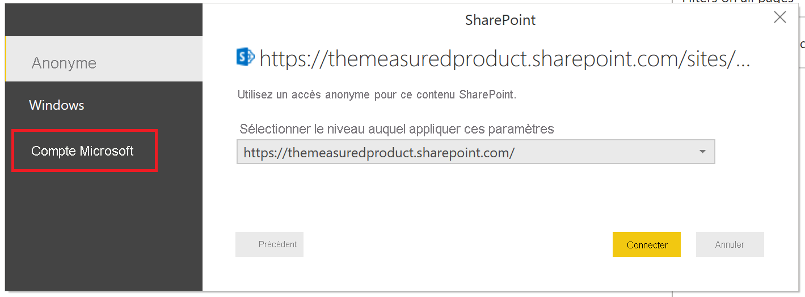
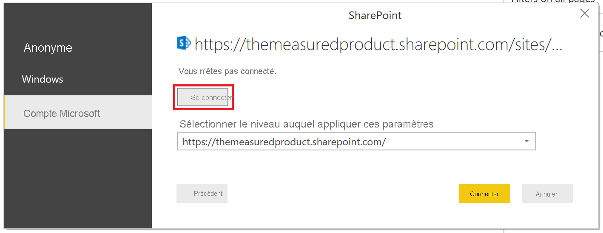
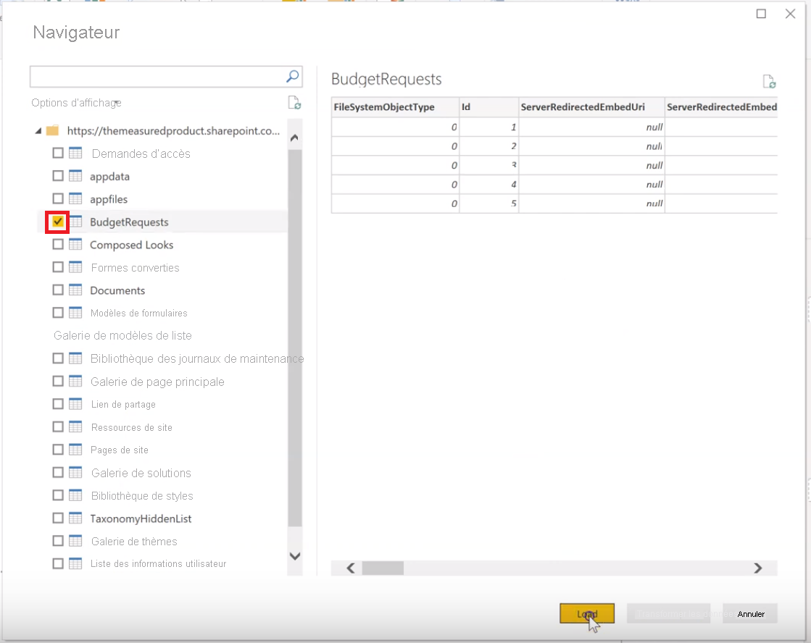

# Créer un rapport sur une liste SharePoint

De nombreuses équipes et organisations utilisent des listes dans SharePoint Online pour stocker des données, car les listes sont faciles à configurer et faciles à mettre à jour par les utilisateurs.  Parfois, il est beaucoup plus simple pour les utilisateurs de consulter un graphique pour comprendre rapidement les données, que d’examiner la liste elle-même. Dans ce tutoriel, nous montrons comment transformer vos données de liste SharePoint en rapport Power BI.

Regardez cette vidéo de tutoriel de cinq minutes, ou retrouvez les instructions pas à pas un peu plus bas.

<iframe width="400" height="450" src="https://www.youtube.com/embed/OZO3x2NF8Ak" frameborder="0" allowfullscreen></iframe>

## Partie 1 : Se connecter à votre liste SharePoint

1. Si vous n’avez pas déjà [Power BI Desktop](https://powerbi.microsoft.com/desktop/), vous pouvez le télécharger et l’installer.
2. Ouvrez Power BI Desktop et, sous l’onglet Accueil du ruban, sélectionnez **Obtenir des données** > **Plus**.
3. Sélectionnez **Services en ligne**, puis sélectionnez **Liste SharePoint Online**.  

    

4. Sélectionnez **Se connecter**.
4. Recherchez l’adresse (ou URL) de votre site SharePoint Online qui contient votre liste.  Dans une page de SharePoint Online, vous pouvez généralement obtenir l’adresse du site en sélectionnant **Accueil** dans le volet de navigation, ou l’icône du site en haut, puis en copiant l’adresse à partir de la barre d’adresses de votre navigateur web.

   Regardez une vidéo de cette étape :
   <iframe width="400" height="300" src="https://www.youtube.com/embed/OZO3x2NF8Ak?start=48&end=90" frameborder="0" allowfullscreen></iframe>

5. Dans Power BI Desktop, collez l’adresse dans le champ **URL du site** de la boîte de dialogue Ouvrir.

6. Un écran d’accès à SharePoint peut s’afficher, comme illustré dans l’image suivante.  Si vous ne le voyez pas, passez à l’étape 10.  Si vous le voyez, sélectionnez **Compte Microsoft** sur le côté gauche de la page.

    

7. Sélectionnez **Se connecter** et entrez le nom d’utilisateur et le mot de passe que vous utilisez pour vous connecter à Microsoft 365.

    

8. Ensuite, sélectionnez **Se connecter**.

9. Sur le côté gauche du navigateur, cochez la case en regard de la liste SharePoint à laquelle vous souhaitez vous connecter.

    

10. Sélectionnez **Charger**.  Power BI charge vos données de liste dans un nouveau rapport.

## Partie 2 : Créer un rapport

1. Sur le côté gauche, sélectionnez l’icône **Données** pour voir que vos données de liste SharePoint ont été chargées.

2. Assurez-vous que les colonnes de liste comportant des nombres affichent l’icône Somme, ou Sigma, dans le **volet Champs** à droite.  Pour celles qui n’ont pas cette icône, sélectionnez l’en-tête de colonne en mode affichage Table, sélectionnez l’onglet **Modélisation**, puis définissez **Type de données** sur **Nombre décimal** ou **Nombre entier**, en fonction des données.  Si vous êtes invité à confirmer votre modification, sélectionnez **Oui**.  Si le nombre a un format spécial, par exemple s’il s’agit d’une devise, vous pouvez l’indiquer en définissant le **Format**.

   Regardez une vidéo de cette étape :
   <iframe width="400" height="300" src="https://www.youtube.com/embed/OZO3x2NF8Ak?start=147&end=204" frameborder="0" allowfullscreen></iframe>

3. Sur le côté gauche, sélectionnez l’icône **Rapport**.
4. Sélectionnez les colonnes que vous souhaitez visualiser en cochant les cases correspondantes dans le volet **Champs** à droite.

   Regardez une vidéo de cette étape :
   <iframe width="400" height="300" src="https://www.youtube.com/embed/OZO3x2NF8Ak?start=215&end=252" frameborder="0" allowfullscreen></iframe>

5. Changez le type de visuel si nécessaire.
6. Vous pouvez créer plusieurs visualisations dans le même rapport en désélectionnant le visuel existant, puis en cochant les cases des autres colonnes dans le volet **Champs**.
7. Sélectionnez **Enregistrer** pour enregistrer votre rapport.
