# Tutoriel : Analyser les données Facebook à l’aide de Power BI Desktop

Dans ce tutoriel, vous apprenez à importer des données à partir de Facebook et à les utiliser dans Power BI Desktop. Vous allez vous connecter et importer des données depuis la page Facebook Power BI, vous appliquerez des transformations aux données importées et vous utiliserez les données dans des visualisations de rapport.

> [!WARNING]
> En raison des restrictions d’autorisation de l’application Facebook, les fonctionnalités de connecteur décrites dans cet article ne fonctionnent actuellement pas correctement. Nous travaillons avec Facebook pour rétablir cette fonctionnalité le plus rapidement possible.

## Se connecter à une page Facebook

Ce tutoriel utilise des données de la [page Facebook de Microsoft Power BI](https://www.facebook.com/microsoftbi). Vous n’avez pas besoin d’informations d’identification spécifiques pour vous connecter à cette page et importer des données, à l’exception d’un compte Facebook personnel.

1. Ouvrez Power BI Desktop, puis sélectionnez **Obtenir des données** dans la boîte de dialogue **Mise en route** ou, dans l’onglet du ruban **Accueil**, sélectionnez **Obtenir des données**, puis sélectionnez **Plus...** .
   
2. Dans la boîte de dialogue **Obtenir des données**, sélectionnez **Facebook** à partir du groupe **Services en ligne**, puis sélectionnez **Se connecter**.
   
   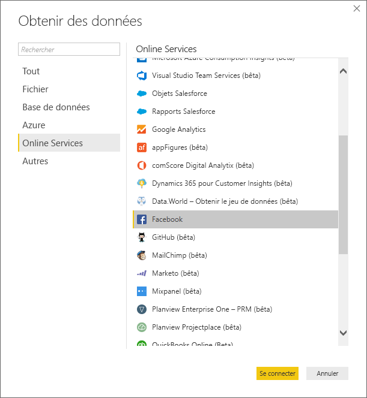
   
   Une boîte de dialogue s’affiche pour vous avertir des risques liés à l’utilisation d’un service tiers.
   
   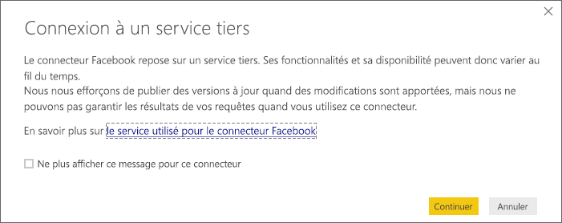
   
3. Sélectionnez **Continuer**. 
   
4. Dans la boîte de dialogue **Facebook**, entrez le nom de la page **microsoftbi** comme **nom d’utilisateur**, sélectionnez **Publications** dans la liste déroulante **Connexion** et sélectionnez **OK**.
   
   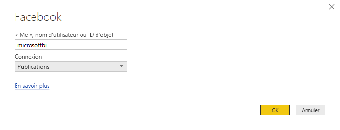
   
5. Quand vous êtes invité à indiquer vos informations d’identification, connectez-vous à votre compte Facebook et autorisez l’accès de Power BI à votre compte.
   
   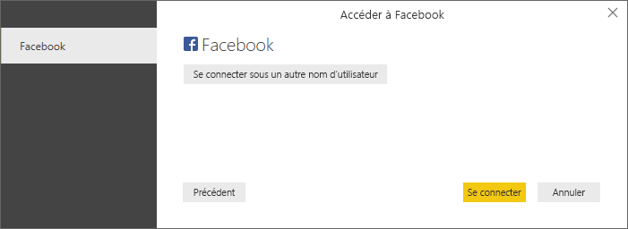

   Quand vous êtes connecté à la page Facebook de Power BI, vous obtenez un aperçu des données de publication de la page. 
   
   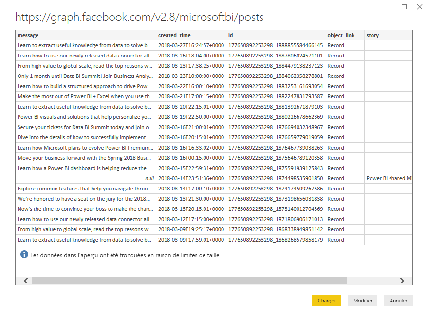
   
## Mettre en forme et transformer les données importées

Supposons que vous souhaitiez voir et afficher les publications avec le plus de commentaires au fil du temps, mais que vous constatiez dans l’aperçu des données de publication que les données **created_time** sont difficiles à lire et à comprendre et que les données sur les commentaires sont insuffisantes. Vous devez effectuer une mise en forme et un nettoyage des données pour en tirer le meilleur parti. Pour cela, vous pouvez utiliser l’Éditeur Power Query de Power BI Desktop pour modifier les données avant ou après leur importation dans Power BI Desktop. 

### Fractionner la colonne de date et d’heure

Tout d’abord, séparez les valeurs de date et d’heure dans la colonne **created_time** afin de la rendre plus lisible. 

1. Dans l’aperçu des données Facebook, sélectionnez **Modifier**. 
   
   
   
   L’Éditeur Power Query de Power BI Desktop s’ouvre dans une nouvelle fenêtre et affiche l’aperçu des données à partir de la page Facebook de Power BI. 
   
   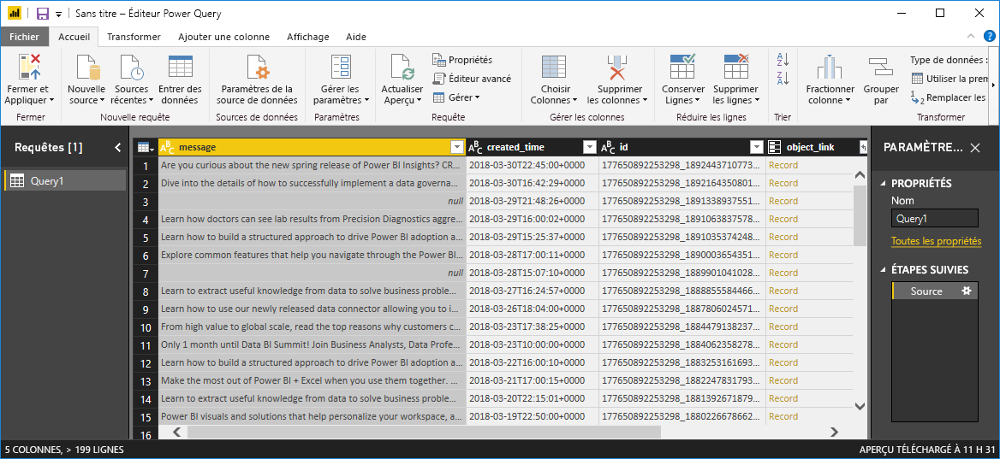
   
2. Sélectionnez la colonne **created_time**. Notez qu’il s’agit d’un type de données **Texte**, comme l’indique l’icône **ABC** dans l’en-tête de la colonne. Cliquez avec le bouton droit sur l’en-tête et sélectionnez **Fractionner la colonne** > **Par délimiteur** dans la liste déroulante. Vous pouvez également sélectionner **Fractionner la colonne** > **Par délimiteur** sous le groupe **Transformer** de l’onglet **Accueil** du ruban.  
   
   
   
3. Dans la boîte de dialogue **Fractionner la colonne par délimiteur**, sélectionnez **Personnalisé** dans la liste déroulante, entrez **T** (le caractère qui commence la partie heure des valeurs **created_time**) dans le champ d’entrée, puis sélectionnez **OK**. 
   
   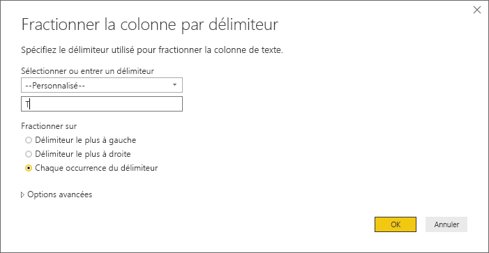
   
   La colonne se divise en deux colonnes qui contiennent les chaînes avant et après le délimiteur *T*. Les nouvelles colonnes sont nommées **created_time.1** et **created_time.2** respectivement. Power BI a automatiquement détecté les types de données et les a remplacés par **Date** pour la première colonne et **Heure** pour la deuxième colonne. Les valeurs de date et d’heure ont également été mises en forme pour être plus lisibles.
   
4. Renommez les deux colonnes. Sélectionnez la colonne **created_time.1** et sélectionnez **Renommer** dans le groupe **N’importe quelle colonne** de l’onglet **Transformer** du ruban. Vous pouvez également double-cliquer sur l’en-tête de colonne et entrer le nouveau nom de colonne **created_date**. Répétez cette opération pour la colonne **created_time.2** et renommez-la **created_time**.
   
   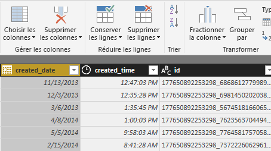
   
### Développer la colonne imbriquée

Une fois que les données de date et d’heure sont telles que vous le souhaitez, vous pouvez exposer les données de commentaires en développant une colonne imbriquée. 

1. Sélectionnez l’icône  en haut de la colonne **object_link** pour ouvrir la boîte de dialogue **Développer/Agréger**. Sélectionnez **Connexions**, puis sélectionnez **OK**. 
   
   
   
   L’en-tête de la colonne est remplacé par **object_link.connections**.
2. Sélectionnez l’icône  en haut de la colonne **object_link.connections**, sélectionnez **Commentaires**, puis sélectionnez **OK**. L’en-tête de la colonne est remplacé par **object_link.connections.comments**.
   
3. Sélectionnez l’icône  en haut de la colonne **object_link.connections.comments** et cette fois, sélectionnez **Agréger** au lieu de **Développer** dans la boîte de dialogue. Sélectionnez **# Count of id** (Nombre d’ID), puis **OK**. 
   
   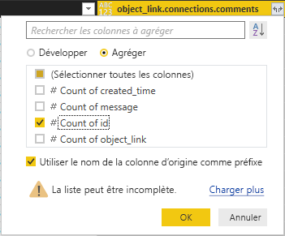
   
   Maintenant, la colonne affiche le nombre de commentaires pour chaque message. 
   
4. Renommez la colonne **Count of object_link.connections.comments.id** en **Number of comments** (Nombre de commentaires).
   
5. Sélectionnez la flèche vers le bas en regard de l’en-tête de colonne **Number of comments**, puis sélectionnez **Tri décroissant** pour afficher les publications triées de celle ayant le plus de commentaires à celle en ayant le moins. 
   
   
   
### Passer en revue les étapes de la requête

Lors de la mise en forme et de la transformation des données dans l’Éditeur Power Query, chaque étape est enregistrée dans la zone **Étapes appliquées** du volet **Paramètres de requête** à droite de la fenêtre de l’**Éditeur Power Query**. Vous pouvez revenir aux **Étapes appliquées** pour voir avec exactitude les modifications que vous avez apportées et pour les modifier, les supprimer ou les réorganiser si nécessaire. Modifiez-les avec prudence, car une modification apportée à une étape peut compromettre les étapes postérieures. 

Une fois ces transformations de données appliquées, vos **Étapes appliquées** doivent se présenter comme suit :
   
   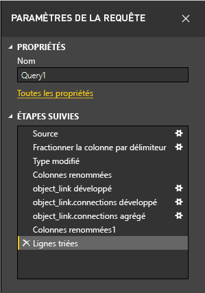
   
   >[!TIP]
   >À la base des **Étapes appliquées** se trouvent des formules écrites à l’aide du [langage de formule Power Query M](/powerquery-m/quick-tour-of-the-power-query-m-formula-language). Pour voir et modifier les formules, sélectionnez **Éditeur avancé** dans le groupe **Requête** de l’onglet **Accueil** du ruban. 

### Importer les données transformées

Quand vous êtes satisfait des données, sélectionnez **Fermer et appliquer** > **Fermer et appliquer** dans l’onglet **Accueil** du ruban pour les importer dans Power BI Desktop. 
   
   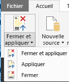
   
   Une boîte de dialogue affiche la progression du chargement des données dans le modèle de données Power BI Desktop. 
   
   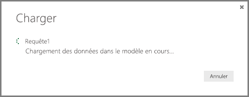
   
   Une fois les données chargées, elles s’affichent dans la vue **Rapport** comme nouvelle Requête dans le volet **Champs**.
   
   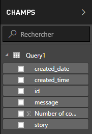
   
## Utiliser les données dans des visualisations de rapport 

Les données étant importées de la page Facebook, vous pouvez rapidement et facilement mieux les explorer à l’aide de visualisations. La création d’une visualisation est facile ; il vous suffit de sélectionner un champ ou de le faire glisser à partir du volet **Champs** vers le canevas du rapport.

### Créer un graphique à barres

1. Dans la vue **Rapport** de Power BI Desktop, sélectionnez **message** dans le volet **Champs** ou faites glisser ce champ vers le canevas du rapport. Une table montrant tous les messages publiés s’affiche dans le canevas. 
   
   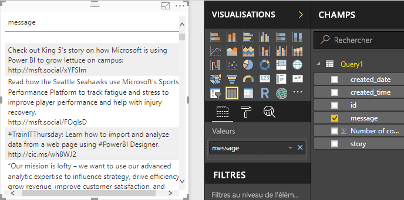
   
2. Une fois cette table sélectionnée, sélectionnez également **Number of comments** dans le volet **Champs** ou faites glisser ce champ vers la table. 
   
3. Sélectionnez l’icône **Graphique à barres empilées** dans le volet **Visualisations**. La table se transforme en graphique à barres pour indiquer le nombre de commentaires par publication. 
   
   
   
4. Sélectionnez **Autres options** (...) en regard de la visualisation, puis sélectionnez **Trier par** > **Number of comments** pour trier la table par nombre décroissant de commentaires. 

   Notez que les commentaires les plus nombreux étaient associés à un message **(Vide)** (ces publications étaient peut-être des récits, des liens, des vidéos ou tout autre contenu non textuel). 
   
5. Pour exclure les lignes vides, sélectionnez **message est (Tous)** dans le volet **Filtres**, sélectionnez **Sélectionner tout**, puis sélectionnez **(Vide)** . 

   L’entrée du volet **Filtres** est remplacée par **message n’est pas (Vide)** et la ligne **(Vide)** disparaît de la visualisation du graphique.
   
   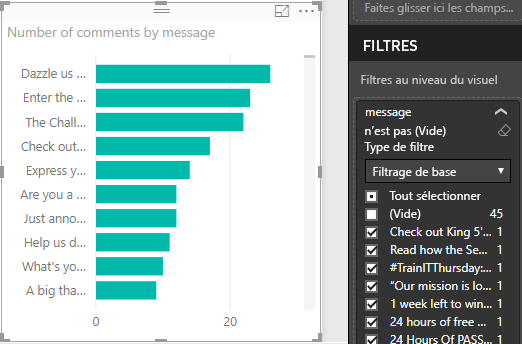
   
### Mettre en forme le graphique

La visualisation devient plus intéressante, mais vous ne pouvez pas voir une grande partie de la publication dans le graphique. Pour afficher davantage de texte de la publication :

1. À l’aide des poignées sur la visualisation du graphique, redimensionnez le graphique pour qu’il soit aussi grand que possible. 
   
2. Avec le graphique sélectionné, sélectionnez l’icône **Format** (rouleau de peinture) dans le volet **Visualisations**.
   
3. Sélectionnez la flèche vers le bas en regard de l’**axe Y** et faites glisser le curseur **Taille maximale** complètement vers la droite (**50 %** ). 
4. Réduisez la **Taille du texte** à **10 pt** pour afficher plus de texte.
   
   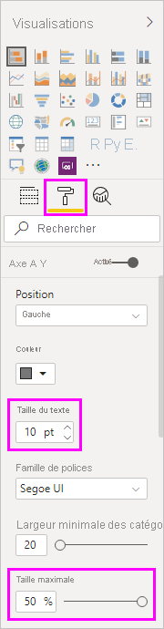
   
   Le graphique affiche à présent plus de contenu de la publication. 
   
   
   
L’axe X (nombre de commentaires) du graphique ne présente pas des valeurs exactes et semble perdu au bas du graphique. Nous allons plutôt utiliser des étiquettes de données : 

1. Sélectionnez l’icône **Format**, puis placez le curseur **Axe X** sur **Désactivé**. 
   
2. Placez le curseur **Étiquettes de données** sur **Désactivé**. 

   Le graphique affiche maintenant le nombre exact de commentaires pour chaque publication.
   
   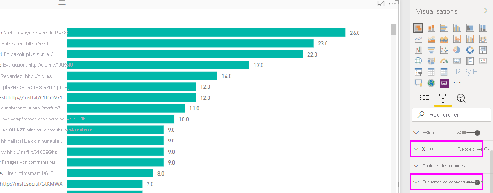
   
### Modifier le type de données

C’est mieux, mais toutes les étiquettes de données ont une décimale **.0**, ce qui est perturbant et trompeur, car **Number of posts** doit être un nombre entier. Pour les corriger, vous devez remplacer le type de données de la colonne **Number of posts** par **Nombre entier**.

1. Cliquez avec le bouton droit sur **Query1** dans le volet **Champs** ou pointez dessus, puis sélectionnez **Autres options** (...). 

2. Dans le menu contextuel, sélectionnez **Modifier la requête**. Vous pouvez également sélectionner **Modifier les requêtes** > **Modifier les requêtes** dans le groupe **Données externes** de l’onglet **Accueil** du ruban. 
   
3. Dans la fenêtre de l’**Éditeur Power Query**, sélectionnez la colonne **Number of comments** et modifiez le type de données en effectuant l’une de ces étapes : 
   - Sélectionnez l’icône **1.2** en regard de l’en-tête de colonne **Number of comments**, puis sélectionnez **Nombre entier** dans la liste déroulante.
   - Cliquez avec le bouton droit sur l’en-tête de colonne, puis sélectionnez **Modifier le type** > **Nombre entier**.
   - Sélectionnez **Type de données : Nombre décimal** dans le groupe **Transformer** de l’onglet **Accueil** ou le groupe **N’importe quelle colonne** de l’onglet **Transformer**, puis sélectionnez **Nombre entier**.
   
   L’icône dans l’en-tête de la colonne est remplacée par **123**, ce qui indique un type de données **Nombre entier**.
   
   
   
3. Pour appliquer les modifications, sélectionnez **Fichier** > **Fermer et appliquer** ou **Fichier** > **Appliquer** pour garder la fenêtre de l’**Éditeur Power Query** ouverte. 

   Une fois les modifications chargées, les étiquettes de données sur le graphique deviennent des nombres entiers.
   
   
   
### Créer un segment de date

Supposons que vous souhaitiez visualiser le nombre de commentaires sur les publications au fil du temps. Vous pouvez créer une visualisation de segment pour filtrer les données du graphique pour différentes périodes. 

1. Sélectionnez sur une zone vide du canevas, puis sélectionnez l’icône **Segment** dans le volet **Visualisations**. 

   Une visualisation de segment vide s’affiche.
   
   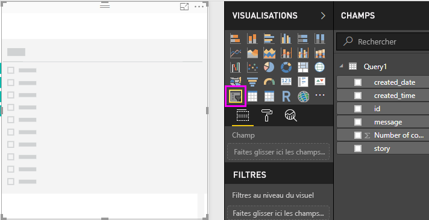
   
2. Sélectionnez le champ **created_date** dans le volet **Champs** ou faites-le glisser vers le nouveau segment. 

   Le segment se transforme en curseur de plage de dates, selon le type de données **Date**.
   
   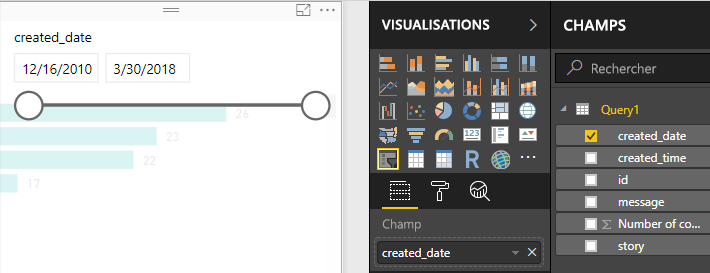
   
3. Déplacez les poignées du curseur pour sélectionner des plages de dates différentes et notez que les données du graphique sont filtrées en conséquence. Vous pouvez également sélectionner les champs de date dans le segment et entrer des dates spécifiques, ou les sélectionner dans un calendrier contextuel.
    
   
   
### Mettre en forme les visualisations

Donnez au graphique un titre plus descriptif et plus intéressant : 

1. Le graphique étant sélectionné, sélectionnez l’icône **Format** dans le volet **Visualisations**, puis sélectionnez la flèche déroulante en regard de **Titre** pour le développer.

2. Remplacez le **texte du titre** par **Comments per post** (Commentaires par publication). 

3. Sélectionnez la flèche déroulante en regard de **Couleur de police**, puis sélectionnez une couleur verte en accord avec les barres vertes de la visualisation.

4. Augmentez la **Taille du texte** à **10 pt** et définissez la **Famille de polices** sur **Segoe (gras)** .

5. Faites des essais avec d’autres options et paramètres de mise en forme pour modifier l’apparence de vos visualisations. 

   

## Créer plus de visualisations

Comme vous pouvez le voir, vous pouvez facilement personnaliser les visualisations dans votre rapport pour présenter les données de la façon souhaitée. Par exemple, essayez d’utiliser les données importées de Facebook pour créer ce graphique en courbes affichant le nombre de commentaires au fil du temps.

Power BI Desktop fournit une expérience de bout en bout transparente, allant de la récupération de données d’un large éventail de sources de données à la visualisation de ces données au moyen de méthodes interactives et enrichies, en passant par leur mise en forme en fonction des besoins d’analyse. Quand votre rapport est prêt, vous pouvez [le charger dans le service Power BI](../create-reports/desktop-upload-desktop-files.md) et créer des tableaux de bord basés sur celui-ci, que vous pouvez partager avec d’autres utilisateurs de Power BI.

## Étapes suivantes
* [Microsoft Learn pour Power BI](/learn/powerplatform/power-bi?WT.mc_id=powerbi_landingpage-docs-link)
* [Forum Power BI](https://go.microsoft.com/fwlink/?LinkID=519326)
* [Blog Power BI](https://go.microsoft.com/fwlink/?LinkID=519327)