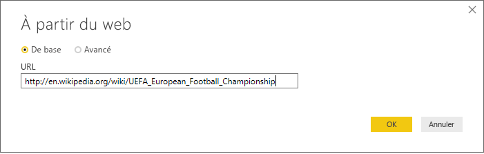
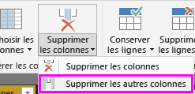
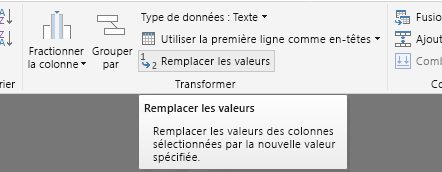
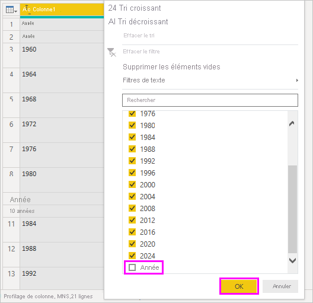
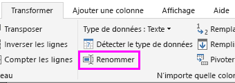
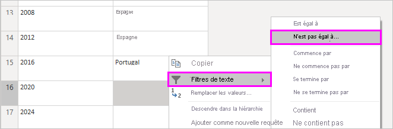
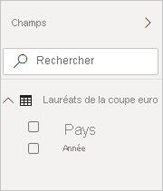
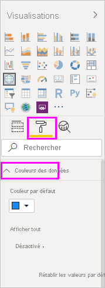
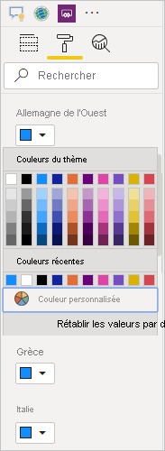
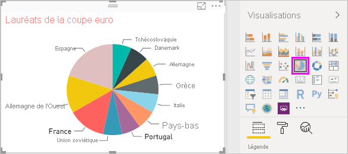

# Tutoriel : Analyser les données d’une page web à l’aide de Power BI Desktop

En tant que fan de football depuis longtemps, vous souhaitez créer un rapport sur les vainqueurs du Championnat d’Europe (Euro Cup) au fil des années. Avec Power BI Desktop, vous pouvez importer ces données à partir d’une page web dans un rapport et créer des visualisations qui affichent les données. Dans ce tutoriel, vous allez apprendre à utiliser Power BI Desktop pour :

- Vous connecter à une source de données web et en parcourir les tables disponibles.
- Former et transformer des données dans l’éditeur Power Query.
- Nommer une requête et l’importer dans un rapport Power BI Desktop.
- Créer et personnaliser une carte et une visualisation sous forme de graphique à secteurs.

## Se connecter à une source de données web

Vous pouvez obtenir les données sur les vainqueurs du Championnat de l’UEFA à partir de la table Résultats sur la page Wikipédia consacrée au Championnat de football européen UEFA à l’adresse https://en.wikipedia.org/wiki/UEFA_European_Football_Championship. 

Les connexions web sont établies uniquement à l’aide de l’authentification de base. Les sites web nécessitant une authentification risquent de ne pas fonctionner correctement avec le connecteur web.

Pour importer les données :

1. Dans l’onglet du ruban **Accueil** de Power BI Desktop, sélectionnez la flèche déroulante en regard de **Obtenir des données**, puis sélectionnez **Web**.

    

   >[!NOTE]
   >Vous pouvez également sélectionner l’élément **Obtenir des données** lui-même, ou sélectionnez **Obtenir des données** dans la boîte de dialogue Prise en main de Power BI Desktop, puis sélectionnez **Web** dans la section **Tous** ou **Autres** de la boîte de dialogue **Obtenir des données**, puis sélectionnez **Se connecter**.

1. Dans la boîte de dialogue **À partir du Web**, collez l’URL `https://en.wikipedia.org/wiki/UEFA_European_Football_Championship` dans la zone de texte **URL**, puis sélectionnez **OK**.

    

   Après la connexion à la page web de Wikipédia, la boîte de dialogue **Navigateur** affiche une liste des tables disponibles dans la page. Vous pouvez sélectionner l’un des noms de table pour afficher un aperçu de ses données. La table **Results[edit]** contient les données souhaitées, bien que celles-ci n’aient pas la forme requise. Vous allez modifier la forme et nettoyer les données avant de les charger dans votre rapport.

   

   >[!NOTE]
   >Le volet **Aperçu** affiche la dernière table sélectionnée, mais toutes les tables sélectionnées sont chargées dans l’éditeur Power Query lorsque vous sélectionnez **Transformer des données** ou **Charger**.

1. Sélectionnez la table **Results[edit]** dans la liste du **Navigateur**, puis sélectionnez **Transformer des données**.

   Un aperçu de la table s’ouvre dans **l’éditeur Power Query**, où vous pouvez appliquer des transformations pour nettoyer les données.

   

## Former des données dans l’éditeur Power Query

Vous souhaitez simplifier l’analyse des données en affichant uniquement les années et les pays vainqueurs. Vous pouvez utiliser l’éditeur Power Query pour effectuer ces étapes de mise en forme et de nettoyage des données.

Premièrement, supprimez toutes les colonnes sauf deux dans la table. Renommez ces colonnes comme *Year* et *Country* ensuite dans le processus.

1. Dans la grille de **l’éditeur Power Query**, sélectionnez les colonnes. Cliquez sur Ctrl pour sélectionner plusieurs éléments.

1. Cliquez avec le bouton droit et sélectionnez **Supprimer d’autres colonnes**, ou sélectionnez **Supprimer les colonnes** > **Supprimer d’autres colonnes** à partir du groupe **Gérer les colonnes** dans l’onglet du ruban **Accueil**, afin de supprimer toutes les autres colonnes de la table.

   

   ou

   

Ensuite, supprimez le mot supplémentaire *Details* des cellules de la première colonne.

1. Sélectionnez la première colonne.

1. Cliquez avec le bouton droit et sélectionnez **Remplacer les valeurs**, ou sélectionnez **Remplacer les valeurs** dans le groupe **Transformer** dans l’onglet **Accueil** du ruban. Cette option se trouve également dans le groupe **N’importe quelle colonne** de l’onglet **Transformer**.

    

   ou

   

1. Dans la boîte de dialogue **Remplacer les valeurs**, tapez **Details** dans la zone de texte **Valeur à rechercher**, laissez la zone de texte **Remplacer par** vide, puis sélectionnez **OK** pour supprimer le mot *Details* de cette colonne.

   

Certaines cellules contiennent uniquement le mot « Year » au lieu des valeurs d’année. Vous pouvez filtrer la colonne pour afficher uniquement les lignes qui ne contiennent pas le mot « Year ».

1. Sélectionnez la flèche déroulante de filtre dans la colonne.

1. Dans le menu déroulant, faites défiler la liste et décochez la case en regard de l’option **Year**, puis sélectionnez **OK**.

   

Dans la mesure où seule la liste des vainqueurs vous intéresse, vous pouvez renommer la deuxième colonne **Country**. Pour renommer la colonne :

1. Double-cliquez sur l’en-tête de la deuxième colonne ou appuyez dessus en continu, ou
   - Cliquez avec le bouton droit sur l’en-tête de colonne et sélectionnez **Renommer**, ou
   - Sélectionnez la *colonne et **Renommer** à partir du groupe **N’importe quelle colonne** dans l’onglet **Transformer** du ruban.

    
  
   ou

   

1. Tapez **Country** dans l’en-tête et appuyez sur **Entrée** pour renommer la colonne.

Vous souhaitez également filtrer les lignes comme « 2020 » qui contiennent des valeurs null dans la colonne **Country**. Vous pouvez utiliser le menu de filtre comme vous venez de le faire avec les valeurs **Year**, ou vous pouvez :

1. Cliquer avec le bouton droit sur la cellule **Country** dans la ligne **2020**, dont la valeur est *null*.

1. Sélectionner **Filtres de texte** > **N’est pas égal à** dans le menu contextuel pour supprimer toutes les lignes qui contiennent la valeur de cette cellule.

   

## Importer la requête dans la vue Rapport

Maintenant que les données ont la forme souhaitée, vous êtes prêt à nommer votre requête « Euro Cup Winners » et à l’importer dans votre rapport.

1. Dans le volet **Paramètres d’une requête**, dans la zone de texte **Nom**, entrez **Euro Cup Winners**.

   

1. Sélectionnez **Fermer & appliquer** > **Fermer & appliquer** à partir de l’onglet **Accueil** du ruban.

   

La requête est chargée dans la vue *Rapport* de Power BI Desktop, où vous pouvez l’afficher dans le volet **Champs**.

   

>[!TIP]
>Vous pouvez toujours revenir dans l’éditeur Power Query pour modifier et affiner votre requête en procédant comme suit :
>- Sélectionnez les points de suspension **Plus d’options** ( **...** ) à côté de **Euro Cup Winners** dans le volet **Champs** et sélectionnez **Modifier la requête**, ou
>- Sélectionnez **Modifier les requêtes** > **Modifier les requêtes** dans le groupe **Données externes** de l’onglet du ruban **Accueil** dans la vue Rapport. 

## Créer une visualisation

Pour créer une visualisation en fonction de vos données :

1. Sélectionnez le champ **Country** dans le volet **Champs**, ou faites-le glisser vers le canevas de rapport. Power BI Desktop reconnaît les données en tant que noms de pays et crée automatiquement une visualisation **Carte**.

   

1. Agrandissez la carte en faisant glisser les poignées dans les coins afin que tous les noms des pays vainqueurs soient visibles.  

   

1. La carte affiche des points de données identiques pour tous les pays ayant remporté un tournoi Euro Cup. Pour que la taille de chaque point de données reflète le nombre de fois où un pays a gagné, faites glisser le champ **Year** vers **Faire glisser ici les champs de données** sous **Taille** dans la partie inférieure du volet **Visualisations**. Le champ se change automatiquement en mesure **Count of Year** et la visualisation de la carte affiche désormais des points de données plus gros pour les pays ayant remporté le plus de tournois.

   

## Personnaliser la visualisation

Comme vous pouvez le voir, il est très facile de créer des visualisations en fonction de vos données. Il est également facile de personnaliser vos visualisations pour représenter au mieux les données de la manière que vous voulez.

### Mettre en forme la carte

Vous pouvez modifier l’apparence d’une visualisation en la sélectionnant, puis en sélectionnant l’icône **Format** (rouleau de peinture) dans le volet **Visualisations**. Par exemple, les points de données « Germany » dans la visualisation peuvent être trompeurs, car l’Allemagne de l’ouest a gagné deux tournois et l’Allemagne en a gagné un, et la carte superpose les deux points plutôt que de les séparer ou de les ajouter. Vous pouvez colorer ces deux points différemment pour illustrer ce fait. Vous pouvez aussi donner à la carte un titre plus descriptif et plus intéressant.

1. Avec la visualisation sélectionnée, sélectionnez l’icône **Format**, puis **Couleurs des données** pour développer les options de couleur des données.

   

1. Configurez **Afficher tout** sur **Activé**, puis sélectionnez le menu déroulant à côté de **West Germany** et choisissez la couleur jaune.

   

1. Sélectionnez **Titre** pour développer les options de titre, et dans le champ **Texte de titre**, tapez **Euro Cup Winners** à la place du titre actuel.

1. Définissez la **Couleur de police** sur rouge, la **Taille du texte** sur **12** et la **Famille de polices** sur **Segoe (gras)** .

   

La visualisation de votre carte ressemble maintenant à ceci :

### Changer de type de visualisation

Vous pouvez modifier le type d’une visualisation en la sélectionnant, puis en sélectionnant une autre icône en haut du volet **Visualisations**. Par exemple, votre visualisation de la carte ne contient pas les données pour l’Union soviétique et la République tchèque, car ces pays n’existent plus sur la carte du monde. Un autre type de visualisation, comme un treemap ou un graphique à secteurs, peut être plus précis, car il affiche toutes les valeurs.

Pour modifier la carte en graphique à secteurs, sélectionnez la carte, puis sélectionnez l’icône **Graphique à secteurs** dans le volet **Visualisations**.

>[!TIP]
>- Vous pouvez utiliser les options de mise en forme **Couleurs des données** pour donner la même couleur à « Germany » et « West Germany ». 
>- Pour regrouper les pays avec le plus de victoires sur le graphique à secteurs, sélectionnez les points de suspension ( **...** ) dans l’angle supérieur droit de la visualisation et sélectionnez **Trier par Count of Year**.

Power BI Desktop fournit une expérience de bout en bout transparente, allant de la récupération de données d’un large éventail de sources de données à la visualisation de ces données au moyen de méthodes interactives et enrichies, en passant par leur mise en forme en fonction des besoins d’analyse. Une fois que votre rapport est prêt, vous pouvez [le charger dans Power BI](../create-reports/desktop-upload-desktop-files.md) et créer des tableaux de bord basés sur celui-ci, que vous pouvez partager avec d’autres utilisateurs de Power BI.

## Voir aussi

* [Microsoft Learn pour Power BI](/learn/powerplatform/power-bi?WT.mc_id=powerbi_landingpage-docs-link)
* [Vidéos relatives à Power BI Desktop](../fundamentals/desktop-videos.md)
* [Forum Power BI](https://go.microsoft.com/fwlink/?LinkID=519326)
* [Blog Power BI](https://go.microsoft.com/fwlink/?LinkID=519327)