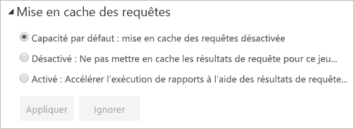

# Mise en cache des requêtes dans Power BI Premium/Embedded

Les organisations avec Power BI Premium ou Power BI Embedded peuvent tirer parti de la *mise en cache des requêtes* pour accélérer l’exécution de rapports associés à un jeu de données. La mise en cache des requêtes indique à la capacité Premium/Embedded d’utiliser son service de mise en cache local pour tenir à jour les résultats des requêtes, ce qui évite de recourir à la source de données sous-jacente pour calculer ces résultats.

> [!IMPORTANT]
> La mise en cache des requêtes est disponible uniquement sur Power BI Premium ou Power BI Embedded. Elle n’est pas applicable aux jeux de données LiveConnect tirant parti d’Azure Analysis Services ou de SQL Server Analysis Services.

Les résultats des requêtes mis en cache sont spécifiques au contexte de l’utilisateur et du jeu de données, et respectent toujours les règles de sécurité. Pour l’instant, le service effectue uniquement la mise en cache des requêtes pour la page initiale à laquelle vous accédez. En d’autres termes, les requêtes ne sont pas mises en cache quand vous interagissez avec le rapport. Le cache de requêtes respecte les [signets personnels](../consumer/end-user-bookmarks.md#personal-bookmarks) et les [filtres persistants](https://powerbi.microsoft.com/blog/announcing-persistent-filters-in-the-service/) de sorte que les requêtes générées par un rapport personnalisé seront mises en cache. Les [vignettes de tableau de bord](../create-reports/service-dashboard-tiles.md) qui reposent sur les mêmes requêtes tirent également des avantages une fois que la requête est mise en cache. Les performances sont en particulier optimisées quand un jeu de données est fréquemment sollicité et n’a pas besoin d’être souvent actualisé. La mise en cache des requêtes peut également diminuer la charge sur votre capacité Premium/Embedded en réduisant le nombre total de requêtes.

Vous contrôlez le comportement de la mise en cache des requêtes dans la page **Paramètres** pour le jeu de données dans le service Power BI. Trois paramètres sont possibles :

- **Capacité par défaut** : Mise en cache des requêtes désactivée
- **Off** (Désactivée) : N’utilisez pas la mise en cache des requêtes pour ce jeu de données.
- **On** (Activée) : Utilisez la mise en cache des requêtes pour ce jeu de données.

    

## Considérations et limitations

- Quand vous remplacez le paramètre de mise en cache **On** (Activée) par **Off** (Désactivée), tous les résultats des requêtes précédemment enregistrés pour le jeu de données sont supprimés du cache de capacité. Vous pouvez désactiver la mise en cache explicitement ou en rétablissant le paramètre par défaut de la capacité auquel un administrateur a affecté la valeur **Off** (Désactivée). Cette désactivation peut introduire un petit délai la prochaine fois qu’un rapport exécute des requêtes sur ce jeu de données. Le délai est dû à ces requêtes de rapport qui s’exécutent à la demande et ne tirent pas parti des résultats enregistrés. En outre, il est possible que le jeu de données requis doive être chargé en mémoire avant de pouvoir traiter les requêtes.
- Lorsque le cache de requêtes est actualisé, Power BI doit exécuter des requêtes sur les modèles de données sous-jacents pour obtenir les résultats les plus récents. Si la mise en cache des requêtes est activée pour un grand nombre de jeux de données et que la capacité Premium/Embedded est surchargée, une dégradation des performances peut se produire lors de l’actualisation du cache. La dégradation résulte de l’augmentation du volume des requêtes exécutées.

## Étapes suivantes

* [Qu’est-ce que Power BI Premium ?](../admin/service-premium-what-is.md)
* [Qu’est-ce que Power BI Embedded dans Azure ?](../developer/embedded/azure-pbie-what-is-power-bi-embedded.md)
