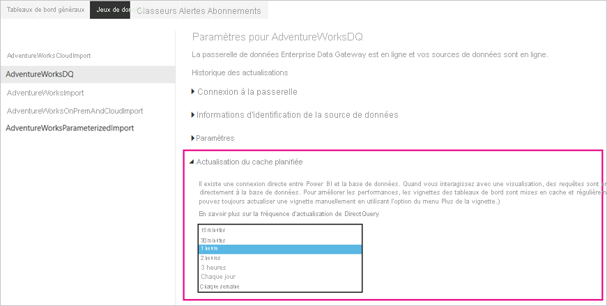
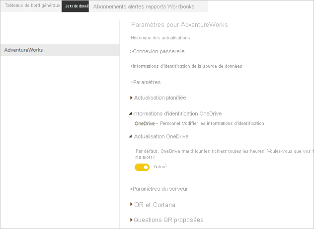
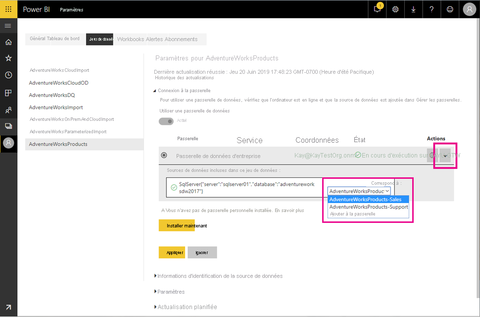
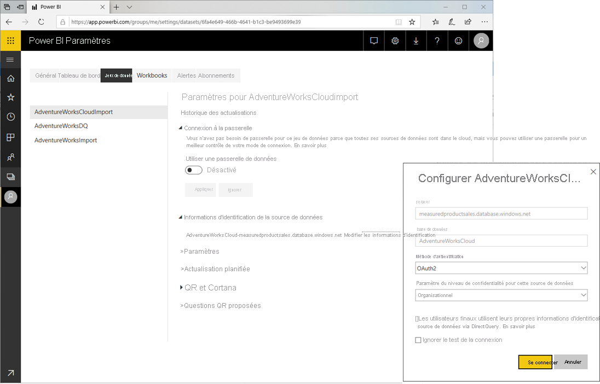
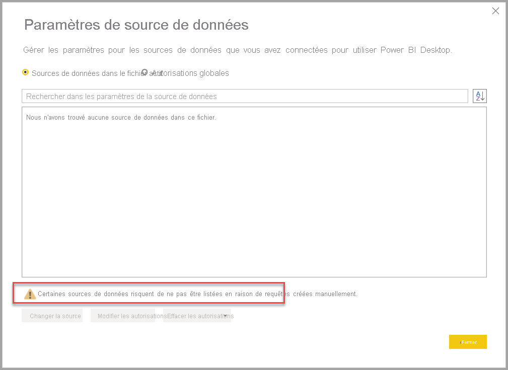

# <a name="data-refresh-in-power-bi"></a>Actualisation des données dans Power BI

Power BI vous permet de transformer rapidement des données en insights puis en actions, mais vous devez vérifier que les données dans vos tableaux de bord et rapports Power BI sont récentes. Pour obtenir des résultats précis, il est souvent essentiel de connaître la procédure d’actualisation des données.

Cet article décrit les fonctionnalités d’actualisation des données de Power BI et leurs dépendances à un niveau conceptuel. Il fournit également des bonnes pratiques et des conseils pour éviter les problèmes d’actualisation courants. Ce contenu sert de base pour vous aider à comprendre le fonctionnement de l’actualisation des données. Pour obtenir des instructions pas à pas concernant la configuration de l’actualisation des données, reportez-vous aux tutoriels et aux guides pratiques listés dans la section Étapes suivantes à la fin de cet article.

## <a name="understanding-data-refresh"></a>Présentation de l’actualisation des données

Chaque fois que vous actualisez des données, Power BI doit interroger les sources de données sous-jacentes, éventuellement charger les données sources dans un jeu de données, puis mettre à jour les visualisations dans vos rapports ou tableaux de bord qui reposent sur le jeu de données mis à jour. L’ensemble du processus comprend plusieurs phases en fonction des modes de stockage de vos jeux de données, comme l’expliquent les sections suivantes.

Pour comprendre comment Power BI actualise vos jeux de données, rapports et tableaux de bord, vous devez connaître les concepts suivants :

- **Modes de stockage et types de jeu de données** : Les modes de stockage et les types de jeu de données pris en charge par Power BI ont des exigences différentes en termes d’actualisation. Vous pouvez soit réimporter des données dans Power BI pour voir les changements apportées, soit interroger les données directement à la source.
- **Types d’actualisation Power BI** : Quelles que soient les spécificités du jeu de données, le fait de connaître les différents types d’actualisation peut vous aider à comprendre où Power BI peut passer son temps durant une opération d’actualisation. En combinant ces informations avec les spécificités du mode de stockage, vous pouvez comprendre exactement ce que fait Power BI quand vous sélectionnez **Actualiser maintenant** pour un jeu de données.

### <a name="storage-modes-and-dataset-types"></a>Modes de stockage et types de jeu de données

Un jeu de données Power BI peut utiliser l’un des modes suivants pour accéder aux données provenant de sources de données diverses. Pour plus d’informations, consultez [Mode de stockage dans Power BI Desktop](../transform-model/desktop-storage-mode.md).

- Mode Importation
- Mode DirectQuery
- Mode LiveConnect
- Mode Push

Le diagramme suivant illustre les différents flux de données en fonction du mode de stockage. Le point le plus important est que seuls les jeux de données du mode Importation nécessitent une actualisation des données sources. Cela vient du fait que seul ce type de jeu de données importe des données de ses sources de données et que les données importées peuvent être mises à jour de manière régulière ou ad hoc. Les jeux de données DirectQuery et ceux en mode LiveConnect à destination d’Analysis Services n’importent pas de données ; ils interrogent la source de données sous-jacente à chaque interaction avec l’utilisateur. Les jeux de données en mode Push n’accèdent pas directement aux sources de données, mais partent du principe que vous transmettez (push) les données à Power BI. Les exigences en matière d’actualisation des jeux de données varient en fonction du mode de stockage et du type de jeu de données.


#### <a name="datasets-in-import-mode"></a>Jeux de données en mode Importation

Power BI importe les données des sources de données d’origine dans le jeu de données. Les requêtes de rapport et de tableau de bord Power BI soumises au jeu de données retournent les résultats des tables et des colonnes importées. Vous pouvez considérer un tel jeu de données comme une copie à un moment donné. Étant donné que Power BI copie les données, vous devez actualiser le jeu de données pour récupérer les changements des sources de données sous-jacentes.

Dans la mesure où Power BI met en cache les données, la taille des jeux de données en mode Importation peut être considérable. Reportez-vous au tableau suivant pour connaître les tailles maximales des jeux de données par capacité. Restez bien en dessous des tailles maximales des jeux de données pour éviter les problèmes d’actualisation qui peuvent survenir si vos jeux de données nécessitent plus que le maximum des ressources disponibles durant une opération d’actualisation.

| Type de capacité | Taille maximale du jeu de données |
| --- | --- |
| Partagée, A1, A2 ou A3 | 1 Go |
| A4 ou P1 | 3 Go |
| A5 ou P2 | 6 Go |
| A6 ou P3 | 10 Go |
| | |

#### <a name="datasets-in-directqueryliveconnect-mode"></a>Jeux de données en mode DirectQuery/LiveConnect

Power BI n’importe pas de données sur des connexions qui fonctionnent en mode DirectQuery/LiveConnect. Au lieu de cela, le jeu de données retourne les résultat de la source de données sous-jacente chaque fois qu’un rapport ou un tableau de bord interroge le jeu de données. Power BI transforme les requêtes et les transfère à la source de données.

Bien que le mode DirectQuery et le mode LiveConnect soient similaires en ce sens que Power BI transfère les requêtes à la source, il est important de noter que Power BI n’a pas à transformer les requêtes en mode LiveConnect. Les requêtes vont directement à l’instance Analysis Services hébergeant la base de données sans consommer de ressources sur une capacité partagée ou une capacité Premium.

Étant donné que Power BI n’importe pas les données, vous n’avez pas besoin d’exécuter une actualisation des données. Toutefois, Power BI continue d’actualiser les vignettes et éventuellement les rapports, comme l’indique la section suivante sur les types d’actualisation. Une vignette est un visuel de rapport épinglé à un tableau de bord. L’actualisation des vignettes de tableau de bord ayant lieu environ toutes les heures, les vignettes affichent des résultats récents. Vous pouvez changer la planification dans les paramètres du jeu de données, comme dans la capture d’écran ci-dessous, ou forcer manuellement une mise à jour du tableau de bord à l’aide de l’option **Actualiser maintenant**.



> [!NOTE]
> La section **Actualisation du cache planifiée** de l’onglet **Jeux de données** n’est pas disponible pour les jeux de données en mode Importation. Ces jeux de données ne nécessitent pas une actualisation distincte des vignettes, car Power BI actualise automatiquement les vignettes durant chaque opération d’actualisation des données planifiée ou à la demande.

#### <a name="push-datasets"></a>Transmettre des jeux de données

Les jeux de données Push ne contiennent pas de définition formelle d’une source de données. Vous n’êtes donc pas obligé de procéder à une actualisation des données dans Power BI. Vous les actualisez en envoyant (push) vos données dans le jeu de données par le biais d’un service ou d’un processus externe, tel que Azure Stream Analytics. Il s’agit d’une approche courante pour l’analyse en temps réel avec Power BI. Power BI continue d’actualiser le cache pour toutes les vignettes utilisées sur un jeu de données Push. Pour obtenir une procédure pas à pas, consultez [Tutoriel : Stream Analytics et Power BI : tableau de bord d’analyse en temps réel pour le streaming des données](/azure/stream-analytics/stream-analytics-power-bi-dashboard).

> [!NOTE]
> Le mode Push présente plusieurs limitations qui sont décrites dans [Limites de l’API REST de Power BI](../developer/automation/api-rest-api-limitations.md).

### <a name="power-bi-refresh-types"></a>Types d’actualisation Power BI

Une opération d’actualisation Power BI peut comprendre plusieurs types d’actualisation, notamment l’actualisation des données, l’actualisation OneDrive, l’actualisation des caches de requêtes, l’actualisation des vignettes et l’actualisation des visuels de rapport. Alors que Power BI détermine automatiquement les étapes d’actualisation requises pour un jeu de données donné, vous devez savoir de quelle façon elles contribuent à la complexité et à la durée d’une opération d’actualisation. Pour obtenir une référence rapide, consultez le tableau suivant.

| Mode de stockage | Actualisation des données | Actualisation OneDrive | Caches de requêtes | Actualisation des vignettes | Visuels de rapport |
| --- | --- | --- | --- | --- | --- |
| Importer | Planifiée et à la demande | Oui, pour les jeux de données connectés | Si l’option est activée dans la capacité Premium | Automatiquement et à la demande | Non |
| DirectQuery | Non applicable | Oui, pour les jeux de données connectés | Si l’option est activée dans la capacité Premium | Automatiquement et à la demande | Non |
| LiveConnect | Non applicable | Oui, pour les jeux de données connectés | Si l’option est activée dans la capacité Premium | Automatiquement et à la demande | Oui |
| Envoi (push) | Non applicable | Non applicable | Pas pratique | Automatiquement et à la demande | Non |
| | | | | | |

#### <a name="data-refresh"></a>Actualisation des données

Pour les utilisateurs de Power BI, l’actualisation de données passe généralement par l’importation des données de sources de données d’origine dans un jeu de données, selon une planification d’actualisation ou à la demande. Vous pouvez effectuer plusieurs actualisations quotidiennes du jeu de données, ce qui peut être nécessaire si les données sources sous-jacentes changent fréquemment. Power BI limite les jeux de données dans une capacité partagée à huit actualisations quotidiennes. Si le jeu de données se trouve dans une capacité Premium, vous pouvez planifier jusqu’à 48 actualisations par jour dans les paramètres du jeu de données. Pour plus d’informations, consultez [Configurer une actualisation planifiée](#configure-scheduled-refresh) plus loin dans cet article. Les jeux de données sur une capacité Premium avec le [point de terminaison XMLA](../admin/service-premium-connect-tools.md) activé pour la prise en charge de la lecture-écriture prennent en charge des opérations d’actualisation illimitées lorsqu’elles sont configurées par programmation avec TMSL ou PowerShell.

Il est également important de souligner que la limite de capacité partagée pour les actualisations quotidiennes s’applique à la fois aux actualisations planifiées et aux actualisations d’API. Vous pouvez également déclencher une actualisation à la demande en sélectionnant **Actualiser maintenant** dans le menu Jeux de données, comme le montre la capture d’écran suivante. Les actualisations à la demande ne sont pas comptabilisées dans la limite des actualisations. Notez également que les jeux de données d’une capacité Premium ne limitent pas le nombre d’actualisations d’API. Si vous souhaitez créer votre propre solution d’actualisation à l’aide de l’API REST Power BI, consultez [Jeux de données - Actualiser le jeu de données](/rest/api/power-bi/datasets/refreshdataset).


> [!NOTE]
> Les actualisations de données doivent durer moins de 2 heures sur une capacité partagée. Si vos jeux de données nécessitent des opérations d’actualisation plus longues, songez à déplacer le jeu de données vers une capacité Premium (où la durée maximale d’actualisation est de 5 heures).

#### <a name="onedrive-refresh"></a>Actualisation OneDrive

Si les jeux de données et les rapports que vous avez créés sont basés sur un fichier Power BI Desktop, un classeur Excel ou un fichier .csv (valeurs séparées par des virgules) sur OneDrive ou SharePoint Online, Power BI effectue un autre type d’actualisation, appelé actualisation OneDrive. Pour plus d’informations, consultez [Obtenir des données à partir de fichiers pour Power BI](service-get-data-from-files.md).

Contrairement à l’actualisation d’un jeu de données au cours de laquelle Power BI importe les données d’une source de données dans un jeu de données, l’actualisation OneDrive synchronise les jeux de données et les rapports avec leurs fichiers sources. Par défaut, Power BI vérifie à peu près toutes les heures si un jeu de données connecté à un fichier sur OneDrive ou SharePoint Online nécessite une synchronisation.

Power BI effectue l’actualisation en fonction d’un ID d’élément dans OneDrive, aussi faites attention lorsque vous choisissez entre mise à jour et remplacement. Quand vous définissez un fichier OneDrive comme source de données, Power BI référence l’ID d’élément du fichier quand il effectue l’actualisation. Considérez le scénario suivant : vous avez un fichier maître _A_ et une copie de production de ce fichier _B_, et où vous configurez l’actualisation de OneDrive pour le fichier B. Si vous _copiez_ ensuite le fichier A sur le fichier B, l’opération de copie supprime l’ancien fichier B et crée un nouveau fichier B avec un ID d’élément différent, ce qui empêche l’actualisation de OneDrive. Pour éviter cette situation, vous pouvez télécharger et remplacer le fichier B, qui conserve son ID d’élément.

Vous pouvez déplacer le fichier à un autre emplacement (par exemple avec la fonction de glisser-déposer) : l’actualisation continuera de fonctionner, car Power BI connaît encore l’ID de fichier. Cependant, si vous copiez ce fichier à un autre emplacement, une nouvelle instance du fichier et un nouvel ID de fichier sont créés. Par conséquent, votre référence de fichier Power BI n’est plus valide et l’actualisation échoue.

> [!NOTE]
> L’actualisation d’un jeu de données peut demander à Power BI jusqu’à 10 minutes, même une fois que la synchronisation est terminée sur votre machine locale et que vous avez utilisé *Actualiser maintenant* dans le service Power BI.

Pour passer en revue les cycles de synchronisation antérieurs, consultez l’onglet OneDrive dans l’historique des actualisations. La capture d’écran suivante montre un cycle de synchronisation terminé pour un exemple de jeu de données.


Comme le montre la capture d’écran ci-dessus, Power BI a identifié cette actualisation OneDrive comme étant **planifiée**, mais il n’est pas possible de configurer l’intervalle d’actualisation. Vous pouvez uniquement désactiver l’actualisation OneDrive dans les paramètres du jeu de données. La désactivation de l’actualisation est utile si vous ne souhaitez pas que vos jeux de données et vos rapports dans Power BI récupèrent automatiquement les changements apportés aux fichiers sources.

Notez que la page des paramètres du jeu de données affiche uniquement les sections **Informations d’identification OneDrive** et **Actualisation OneDrive** si le jeu de données est connecté à un fichier dans OneDrive ou SharePoint Online, comme dans la capture d’écran suivante. Les jeux de données qui ne sont pas connectés au fichier source dans OneDrive ou SharePoint Online n’affichent pas ces sections.



Si vous désactivez l’actualisation OneDrive pour un jeu de données, vous pouvez toujours synchroniser votre jeu de données à la demande en sélectionnant **Actualiser maintenant** dans le menu du jeu de données. Dans le cadre de l’actualisation à la demande, Power BI vérifie si le fichier source sur OneDrive ou SharePoint Online est plus récent que le jeu de données dans Power BI et, le cas échéant, synchronise le jeu de données. L’**Historique des actualisations** liste ces activités en tant qu’actualisations à la demande sous l’onglet **OneDrive**.

N’oubliez pas que l’actualisation OneDrive n’extrait pas les données des sources de données d’origine. L’actualisation OneDrive met simplement à jour les ressources dans Power BI avec les métadonnées et les données du fichier .pbix, .xlsx ou .csv, comme l’illustre le diagramme suivant. Pour garantir que le jeu de données contient les données les plus récentes des sources de données, Power BI déclenche également une actualisation des données dans le cadre d’une actualisation à la demande. Vous pouvez le vérifier dans l’**Historique des actualisations** si vous passez à l’onglet **Planifié**.


Si l’actualisation OneDrive est activée pour un jeu de données connecté à OneDrive ou SharePoint Online et que vous souhaitez actualiser les données de manière planifiée, veillez à configurer la planification de sorte que Power BI effectue l’actualisation des données après l’actualisation OneDrive. Par exemple, si vous avez créé votre propre service ou processus pour mettre à jour le fichier source dans OneDrive ou SharePoint Online tous les soirs à 1 heure du matin, vous pouvez configurer une actualisation planifiée à 2 heures 30 du matin afin de donner à Power BI suffisamment de temps pour effectuer l’actualisation OneDrive avant de lancer l’actualisation des données.

#### <a name="refresh-of-query-caches"></a>Actualisation des caches de requêtes

Si votre jeu de données réside dans une capacité Premium, vous pouvez peut-être améliorer les performances des rapports et des tableaux de bord associés en activant la mise en cache des requêtes, comme dans la capture d’écran suivante. La mise en cache des requêtes indique à la capacité Premium d’utiliser son service de mise en cache local pour tenir à jour les résultats des requêtes, ce qui évite de recourir à la source de données sous-jacente pour calculer ces résultats. Pour plus d’informations, consultez [Mise en cache des requêtes dans Power BI Premium](power-bi-query-caching.md).


Après une actualisation des données, les résultats de la requête précédemment mis en cache ne sont plus valides. Power BI rejette ces résultats mis en cache et doit les reconstruire. Pour cette raison, la mise en cache des requêtes peut ne pas être aussi bénéfique pour les rapports et les tableaux de bord associés aux jeux de données que vous actualisez très souvent, par exemple 48 fois par jour.

#### <a name="tile-refresh"></a>Actualisation des vignettes

Power BI gère un cache pour chaque visuel de vignette sur vos tableaux de bord et met à jour de manière proactive les caches de vignette quand les données changent. En d’autres termes, l’actualisation des vignettes a lieu automatiquement après une actualisation des données. Cela est vrai pour les opérations d’actualisation planifiées et à la demande. Vous pouvez également forcer une actualisation des vignettes en sélectionnant **Plus d’options** (...) dans l’angle supérieur droit d’un tableau de bord, puis l’option **Actualiser les vignettes du tableau de bord**.


Étant donné que cela se produit automatiquement, vous pouvez considérer que l’actualisation des vignettes fait partie intégrante de l’actualisation des données. Entre autres choses, vous remarquerez peut-être que la durée d’actualisation augmente avec le nombre de vignettes. La durée d’actualisation des vignettes peut être importante.

Par défaut, Power BI gère un seul cache pour chaque vignette, mais si vous utilisez la sécurité dynamique pour restreindre l’accès aux données en fonction des rôles d’utilisateur, comme indiqué dans l’article [Sécurité au niveau des lignes (SNL) avec Power BI](../admin/service-admin-rls.md), Power BI doit gérer un cache pour chaque rôle et chaque vignette. Le nombre de caches de vignette est multiplié par le nombre de rôles.

La situation peut devenir encore plus complexe si votre jeu de données utilise une connexion active à un modèle de données Analysis Services avec SNL, comme indiqué dans le tutoriel [Sécurité dynamique au niveau des lignes avec le modèle tabulaire Analysis Services](desktop-tutorial-row-level-security-onprem-ssas-tabular.md). Dans ce cas, Power BI doit gérer et actualiser un cache pour chaque vignette et chaque utilisateur ayant déjà consulté le tableau de bord. Il n’est pas rare que la partie d’actualisation des vignettes d’une telle opération d’actualisation des données dépasse largement le temps nécessaire pour récupérer les données de la source. Pour plus d’informations sur l’actualisation des vignettes, consultez [Résolution des erreurs de vignette](refresh-troubleshooting-tile-errors.md).

#### <a name="refresh-of-report-visuals"></a>Actualisation des visuels de rapport

Ce processus d’actualisation est moins important car il ne concerne que les connexions actives à Analysis Services. Pour ces connexions, Power BI met en cache le dernier état des visuels de rapport. Ainsi, quand vous visualisez à nouveau le rapport, Power BI n’a pas besoin d’interroger le modèle tabulaire Analysis Services. Quand vous interagissez avec le rapport, par exemple pour changer un filtre de rapport, Power BI interroge le modèle tabulaire et met à jour les visuels de rapport automatiquement. Si vous pensez qu’un rapport contient des données périmées, vous pouvez également sélectionner le bouton Actualiser du rapport pour déclencher l’actualisation de tous les visuels de rapport, comme le montre la capture d’écran suivante.


## <a name="review-data-infrastructure-dependencies"></a>Passer en revue les dépendances d’infrastructure de données

Quels que soient les modes de stockage, aucune actualisation des données ne peut réussir si les sources de données sous-jacentes ne sont pas accessibles. Il existe trois principaux scénarios d’accès aux données :

- Un jeu de données utilise des sources de données qui résident localement.
- Un jeu de données utilise des sources de données dans le cloud.
- Un jeu de données utilise des données de sources locales et dans le cloud.

### <a name="connecting-to-on-premises-data-sources"></a>Connexion à des sources de données locales

Si votre jeu de données utilise une source de données à laquelle Power BI ne peut pas accéder par le biais d’une connexion réseau directe, vous devez configurer une connexion de passerelle pour ce jeu de données avant d’activer une planification d’actualisation ou d’effectuer une actualisation des données à la demande. Pour plus d’informations sur les passerelles de données et leur fonctionnement, consultez [Que sont les passerelles de données locales ?](service-gateway-onprem.md)

Les options suivantes s’offrent à vous :

- Choisir une passerelle de données d’entreprise avec la définition de source de données requise
- Déployer une passerelle de données personnelle

> [!NOTE]
> Vous trouverez la liste des types de sources de données nécessitant une passerelle de données dans l’article [Gérer votre source de données - Importation/actualisation planifiée](service-gateway-enterprise-manage-scheduled-refresh.md).

#### <a name="using-an-enterprise-data-gateway"></a>Utilisation d’une passerelle de données d’entreprise

Microsoft recommande d’utiliser une passerelle de données d’entreprise plutôt qu’une passerelle personnelle pour connecter un jeu de données à une source de données locale. Vérifiez que la passerelle est correctement configurée, c’est-à-dire qu’elle doit disposer des dernières mises à jour et de toutes les définitions de source de données nécessaires. Une définition de source de données fournit à Power BI les informations de connexion pour une source donnée, notamment les points de terminaison de connexion, le mode d’authentification et les informations d’identification. Pour plus d’informations sur la gestion des sources de données sur une passerelle, consultez [Gérer votre source de données - Importation/actualisation planifiée](service-gateway-enterprise-manage-scheduled-refresh.md).

La connexion d’un jeu de données à une passerelle d’entreprise est relativement simple si vous êtes administrateur de passerelle. Avec des autorisations d’administrateur, vous pouvez rapidement mettre à jour la passerelle et ajouter des sources de données manquantes si nécessaire. En fait, vous pouvez ajouter une source de données manquante à votre passerelle directement à partir de la page de paramètres du jeu de données. Développez le bouton bascule pour afficher les sources de données et sélectionnez le lien **Ajouter à la passerelle**, comme dans la capture d’écran suivante. En revanche, si vous n’êtes pas administrateur de passerelle, vous devez en contacter un pour ajouter la définition de source de données nécessaire.

> [!NOTE]
> Seuls les administrateurs de passerelle peuvent ajouter des sources de données à une passerelle. Vérifiez également que votre administrateur de passerelle ajoute votre compte d’utilisateur à la liste des utilisateurs autorisés à utiliser la source de données. La page Paramètres du jeu de données vous permet seulement de sélectionner une passerelle d’entreprise avec une source de données correspondante que vous avez l’autorisation d’utiliser.



Veillez à mapper la bonne définition de source de données à votre source de données. Comme l’illustre la capture d’écran ci-dessus, les administrateurs de passerelle peuvent créer plusieurs définitions sur une seule passerelle connectée à la même source de données, chacune avec différentes informations d’identification. Dans l’exemple montré, le propriétaire d’un jeu de données du service des ventes choisirait la définition de source de données AdventureWorksProducts-Sales, tandis que le propriétaire d’un jeu de données du service de support mapperait le jeu de données à la définition de source de données AdventureWorksProducts-Support. Si le nom des définitions de source de données n’est pas intuitif, contactez votre administrateur de passerelle pour savoir quelle définition choisir.

> [!NOTE]
> Un jeu de données ne peut utiliser qu’une seule connexion de passerelle. En d’autres termes, il n’est pas possible d’accéder à des sources de données locales avec plusieurs connexions de passerelle. Vous devez donc ajouter toutes les définitions de source de données nécessaires à la même passerelle.

#### <a name="deploying-a-personal-data-gateway"></a>Déploiement d’une passerelle de données personnelle

Si vous n’avez pas accès à une passerelle de données d’entreprise et que vous êtes la seule personne à gérer des jeux de données, vous n’avez pas besoin de partager les sources de données avec d’autres personnes. Vous pouvez déployer une passerelle de données en mode personnel. Dans la section **Connexion à la passerelle**, sous **Vous n’avez pas de passerelle personnelle installée**, sélectionnez **Installer maintenant**. La passerelle de données personnelle présente plusieurs limitations qui sont décrites dans [Passerelle de données locale (mode personnel)](service-gateway-personal-mode.md).

Contrairement à une passerelle de données d’entreprise, il n’est pas nécessaire d’ajouter des définitions de source de données à une passerelle personnelle. Au lieu de cela, vous gérez la configuration de la source de données à l’aide de la section **Informations d’identification de la source de données** dans les paramètres du jeu de données, comme l’illustre la capture d’écran suivante.


> [!NOTE]
> La passerelle de données personnelle ne prend pas en charge les jeux de données en mode DirectQuery/LiveConnect. La page des paramètres du jeu de données peut vous demander de l’installer, mais si vous ne disposez que d’une passerelle personnelle, vous ne pouvez pas configurer une connexion de passerelle. Veillez à disposer d’une passerelle de données d’entreprise pour prendre en charge ces types de jeux de données.

### <a name="accessing-cloud-data-sources"></a>Accès aux sources de données cloud

Les jeux de données qui utilisent des sources de données cloud, comme Azure SQL DB, ne nécessitent pas de passerelle de données si Power BI peut établir une connexion réseau directe à la source. Vous pouvez donc gérer la configuration de ces sources de données à l’aide de la section **Informations d’identification de la source de données** dans les paramètres du jeu de données. Comme le montre la capture d’écran suivante, vous n’avez pas besoin de configurer une connexion de passerelle.



### <a name="accessing-on-premises-and-cloud-sources-in-the-same-source-query"></a>Accès aux sources locales et cloud dans la même requête source

Un jeu de données peut obtenir des données provenant de plusieurs sources, et ces sources peuvent résider localement ou dans le cloud. Cependant, un jeu de données ne peut utiliser qu’une seule connexion de passerelle, comme indiqué précédemment. Bien que les sources de données cloud ne nécessitent pas forcément de passerelle, une passerelle est nécessaire si un jeu de données se connecte à la fois à des sources locales et cloud dans une seule requête mashup. Dans ce scénario, Power BI doit également utiliser une passerelle pour les sources de données cloud. Le diagramme suivant illustre comment un tel jeu de données accède à ses sources de données.


> [!NOTE]
> Si un jeu de données utilise des requêtes mashup distinctes pour se connecter à des sources locales et cloud, Power BI utilise une connexion de passerelle pour atteindre les sources locales et une connexion réseau directe aux sources cloud. Si une requête mashup fusionne ou ajoute des données provenant de sources locales et cloud, Power BI passe à la connexion de passerelle même pour les sources cloud.

Les jeux de données Power BI s’appuient sur Power Query pour accéder aux données sources et les récupérer. La liste de mashups suivante montre un exemple de base d’une requête qui fusionne les données d’une source locale et d’une source cloud.

```
Let

    OnPremSource = Sql.Database("on-premises-db", "AdventureWorks"),

    CloudSource = Sql.Databases("cloudsql.database.windows.net", "AdventureWorks"),

    TableData1 = OnPremSource{[Schema="Sales",Item="Customer"]}[Data],

    TableData2 = CloudSource {[Schema="Sales",Item="Customer"]}[Data],

    MergedData = Table.NestedJoin(TableData1, {"BusinessEntityID"}, TableData2, {"BusinessEntityID"}, "MergedData", JoinKind.Inner)

in

    MergedData
```

Il existe deux options pour configurer une passerelle de données afin de prendre en charge la fusion ou l’ajout de données provenant de sources locales et cloud :

- Ajouter une définition de source de données pour la source cloud à la passerelle de données en plus des sources de données locales
- Cocher la case **Autorisez l’actualisation des connecteurs de données personnalisés de l’utilisateur par le biais de ce cluster de passerelle**


Si vous cochez la case **Autorisez l’actualisation des connecteurs de données personnalisés de l’utilisateur par le biais de ce cluster de passerelle**, comme dans la capture d’écran ci-dessus, Power BI peut utiliser la configuration définie par l’utilisateur pour la source cloud sous **Informations d’identification de la source de données** dans les paramètres du jeu de données. Cela peut contribuer à réduire les coûts de configuration de la passerelle. En revanche, si vous souhaitez contrôler davantage les connexions établies par votre passerelle, ne cochez pas cette case. Dans ce cas, vous devez ajouter à votre passerelle une définition de source de données explicite pour chaque source cloud que vous souhaitez prendre en charge. Il est également possible de cocher la case et d’ajouter des définitions de source de données explicites pour vos sources cloud à une passerelle. Dans ce cas, la passerelle utilise les définitions de source de données pour toutes les sources correspondantes.

### <a name="configuring-query-parameters"></a>Configuration des paramètres de requête

Le mashup ou les requêtes M que vous créez à l’aide de Power Query peuvent varier en complexité, allant d’étapes simples à des constructions paramétrées. La liste suivante présente un exemple de requête mashup qui utilise deux paramètres appelés _SchemaName_ et _TableName_ pour accéder à une table donnée dans une base de données AdventureWorks.

```
let

    Source = Sql.Database("SqlServer01", "AdventureWorks"),

    TableData = Source{[Schema=SchemaName,Item=TableName]}[Data]

in

    TableData
```

> [!NOTE]
> Les paramètres de requête sont uniquement pris en charge pour les jeux de données en mode Importation. Le mode DirectQuery/LiveConnect ne prend pas en charge les définitions de paramètre de requête.

Pour vérifier qu’un jeu de données paramétré accède aux bonnes données, vous devez configurer les paramètres de requête mashup dans les paramètres du jeu de données. Vous pouvez également mettre à jour les paramètres par programmation à l’aide de l’[API REST Power BI](/rest/api/power-bi/datasets/updateparametersingroup). La capture d’écran suivante montre l’interface utilisateur permettant de configurer les paramètres de requête pour un jeu de données utilisant la requête mashup ci-dessus.


## <a name="refresh-and-dynamic-data-sources"></a>Actualisation et sources de données dynamiques
 
Une *source de données dynamique* est une source de données dans laquelle une partie ou la totalité des informations requises pour se connecter ne peut pas être déterminée tant que Power Query n’a pas exécuté sa requête, car les données sont générées dans le code ou retournées par une autre source de données. Exemples : le nom d’instance et la base de données d’une base de données SQL Server, le chemin d’accès d’un fichier CSV ou l’URL d’un service web. 
 
Dans la plupart des cas, les jeux de données Power BI qui utilisent des sources de données dynamiques ne peuvent pas être actualisés dans le service Power BI. Il existe quelques exceptions dans lesquelles les sources de données dynamiques peuvent être actualisées dans le service Power BI, par exemple lors de l’utilisation des options RelativePath et Query avec la fonction M Web.Contents. Les requêtes qui référencent des paramètres Power Query peuvent également être actualisées.
 
Pour déterminer si votre source de données dynamique peut être actualisée, ouvrez la boîte de dialogue **Paramètres de la source de données** dans **l’éditeur de Power Query**, puis sélectionnez **Sources de données dans le fichier actif**. Dans la fenêtre qui s’affiche, recherchez le message d’avertissement suivant, comme illustré dans l’image suivante :
 
    Some data sources may not be listed because of hand-authored queries.



Si cet avertissement est présent dans la boîte de dialogue **Paramètres de source de données** qui s’affiche, une source de données dynamique qui ne peut pas être actualisée dans le service Power BI est présente.

## <a name="configure-scheduled-refresh"></a>Configurer une actualisation planifiée

L’établissement de la connectivité entre Power BI et vos sources de données est de loin la tâche la plus délicate de la configuration d’une actualisation des données. Les étapes restantes sont relativement simples et comprennent la définition de la planification de l’actualisation et l’activation des notifications d’échec d’actualisation. Pour obtenir des instructions pas à pas, consultez le guide pratique [Configuration d’une actualisation planifiée](refresh-scheduled-refresh.md).

### <a name="setting-a-refresh-schedule"></a>Définition d’une planification d’actualisation

Dans la section **Actualisation planifiée**, vous définissez la fréquence et les plages horaires pour l’actualisation d’un jeu de données. Comme indiqué précédemment, vous pouvez configurer jusqu’à 8 créneaux horaires quotidiens si votre jeu de données est en capacité partagée ou 48 créneaux horaires dans Power BI Premium. La capture d’écran suivante montre une planification d’actualisation sur un intervalle de douze heures.


Une fois une planification d’actualisation configurée, la page des paramètres du jeu de données vous informe de la prochaine heure d’actualisation, comme dans la capture d’écran ci-dessus. Si vous souhaitez actualiser les données plus tôt, par exemple pour tester votre passerelle et la configuration de la source de données, effectuez une actualisation à la demande en utilisant l’option **Actualiser maintenant** dans le menu Jeu de données du volet de navigation. Les actualisations à la demande n’affectent pas la prochaine heure d’actualisation planifiée.

Notez également que l’heure d’actualisation configurée peut ne pas être l’heure exacte à laquelle Power BI démarre le prochain processus planifié. Power BI démarre les actualisations planifiées dans la mesure du possible. L’objectif est de lancer l’actualisation dans les 15 minutes qui suivent l’intervalle de temps prévu, mais un délai pouvant aller jusqu’à une heure peut survenir si le service ne peut pas allouer les ressources nécessaires plus tôt.

> [!NOTE]
> Power BI désactive votre planification d’actualisation après quatre échecs consécutifs ou quand le service détecte une erreur irrécupérable nécessitant une mise à jour de la configuration, par exemple des informations d’identification non valides ou ayant expiré. Il n’est pas possible de changer le seuil d’échecs consécutifs.

### <a name="getting-refresh-failure-notifications"></a>Obtention de notifications d’échec d’actualisation

Par défaut, Power BI envoie des notifications d’échec d’actualisation par e-mail au propriétaire du jeu de données pour qu’il puisse agir rapidement. Power BI vous envoie également une notification quand le service désactive votre planification en raison d’échecs consécutifs. Microsoft vous recommande de laisser la case **M’envoyer des e-mails de notification d’échec d’actualisation** cochée.

Il est également judicieux de spécifier des destinataires supplémentaires via la zone de texte **Envoyer un e-mail à ces utilisateurs en cas d’échec de l’actualisation**. En plus du propriétaire du jeu de données, les destinataires spécifiés reçoivent des notifications d’échec de l’actualisation. Il peut s’agir d’un collègue s’occupant de vos jeux de données quand vous êtes en vacances. Il peut également s’agir de l’alias d’e-mail de votre équipe de support qui prend en charge les problèmes d’actualisation pour votre service ou votre organisation. L’envoi de notifications d’échec d’actualisation à d’autres personnes en plus du propriétaire du jeu de données est pratique pour garantir que les problèmes sont remarqués et résolus en temps opportun.

Notez que Power BI envoie non seulement des notifications sur les échecs d’actualisation, mais également quand le service met en pause une actualisation planifiée pour cause d’inactivité. Après deux mois, quand un utilisateur n’a visité aucun tableau de bord ou rapport créé sur le jeu de données, Power BI considère le jeu de données comme étant inactif. Dans ce cas, Power BI envoie un e-mail au propriétaire du jeu de données indiquant que le service a interrompu la planification de l’actualisation du jeu de données. Consultez la capture d’écran suivante pour obtenir un exemple de notification.


Pour reprendre une actualisation planifiée, visitez un rapport ou un tableau de bord créé à l’aide de ce jeu de données ou actualisez le jeu de données manuellement à l’aide de l’option **Actualiser maintenant**.

### <a name="checking-refresh-status-and-history"></a>Vérification de l’état de l’actualisation et de l’historique des actualisations

En plus des notifications d’échec, il est judicieux d’inspecter régulièrement vos jeux de données à la recherche d’erreurs d’actualisation. Un moyen rapide consiste à afficher la liste des jeux de données dans un espace de travail. Les jeux de données contenant des erreurs présentent une petite icône d’avertissement. Sélectionnez l’icône d’avertissement pour obtenir des informations supplémentaires, comme dans la capture d’écran suivante. Pour plus d’informations sur la résolution d’erreurs d’actualisation spécifiques, consultez [Scénarios de résolution de problèmes liés à l’actualisation](refresh-troubleshooting-refresh-scenarios.md).


L’icône d’avertissement permet d’indiquer les problèmes actuels liés au jeu de données, mais il est également judicieux de vérifier occasionnellement l’historique des actualisations. Comme son nom l’indique, l’historique des actualisations vous permet d’examiner l’état de réussite ou d’échec des cycles de synchronisation antérieurs. Par exemple, un administrateur de passerelle peut avoir mis à jour un jeu d’informations d’identification de base de données ayant expiré. Comme vous pouvez le voir dans la capture d’écran suivante, l’historique des actualisations indique quand une actualisation affectée recommence à fonctionner.


> [!NOTE]
> Vous trouverez un lien pour afficher l’historique des actualisations dans les paramètres du jeu de données. Vous pouvez également récupérer l’historique des actualisations par programmation à l’aide de l’[API REST Power BI](/rest/api/power-bi/datasets/getrefreshhistoryingroup). En utilisant une solution personnalisée, vous pouvez superviser l’historique des actualisations de plusieurs jeux de données de manière centralisée.

## <a name="automatic-page-refresh"></a>Actualisation automatique de la page

L’actualisation automatique de la page fonctionne au niveau de la page de rapport et permet aux créateurs de rapports de définir un intervalle d’actualisation pour les visuels dans une page qui est uniquement active lorsque la page est consommée. L’actualisation automatique de la page est uniquement disponible pour les sources de données DirectQuery. L’intervalle d’actualisation minimal dépend du type d’espace de travail dans lequel le rapport est publié et des paramètres d’administration de la capacité pour les espaces de travail Premium et les [espaces de travail incorporés](../developer/embedded/embedding.md).

Pour plus d’informations sur l’actualisation automatique de la, consultez l’article [Actualisation automatique de la page](../create-reports/desktop-automatic-page-refresh.md).

## <a name="best-practices"></a>Meilleures pratiques

La vérification régulière de l’historique des actualisations de vos jeux de données est l’une des pratiques les plus importantes que vous puissiez adopter pour vous assurer que vos rapports et tableaux de bord utilisent les données actuelles. Si vous découvrez des problèmes, résolvez-les rapidement et, si nécessaire, contactez les propriétaires de sources de données et les administrateurs de passerelle.

Par ailleurs, tenez compte des recommandations suivantes pour établir et gérer des processus d’actualisation des données fiables pour vos jeux de données :

- Planifiez vos actualisations pour les périodes moins occupées, notamment si vos jeux de données sont dans Power BI Premium. Si vous répartissez les cycles d’actualisation de vos jeux de données dans une fenêtre de temps plus large, vous pouvez contribuer à éviter les pics susceptibles de surcharger les ressources disponibles. Les retards de démarrage d’un cycle d’actualisation sont un indicateur de la surcharge des ressources. Si une capacité Premium est complètement épuisée, Power BI peut même ignorer un cycle d’actualisation.
- N’oubliez pas les limites d’actualisation. Si les données sources changent fréquemment ou si le volume de données est important, envisagez d’utiliser le mode DirectQuery/LiveConnect au lieu du mode Importation si la charge accrue à la source et l’impact sur les performances de la requête sont acceptables. Évitez d’actualiser constamment un jeu de données en mode Importation. Toutefois, le mode DirectQuery/LiveConnect a plusieurs limitations, notamment une limite d’un million de lignes de données retournées et un délai de réponse de 225 secondes pour l’exécution de requêtes, comme indiqué dans [Utiliser DirectQuery dans Power BI Desktop](desktop-use-directquery.md). Ces limitations peuvent vous obliger à utiliser le mode Importation. Pour les volumes de données très importants, envisagez d’utiliser des [agrégations dans Power BI](../transform-model/desktop-aggregations.md).
- Vérifiez que la durée d’actualisation de votre jeu de données ne dépasse pas la durée d’actualisation maximale. Utilisez Power BI Desktop pour vérifier la durée de l’actualisation. Si plus de 2 heures sont nécessaires, songez à déplacer votre jeu de données vers Power BI Premium. Votre jeu de données peut ne pas être actualisable sur une capacité partagée. Pensez également à utiliser l’[actualisation incrémentielle dans Power BI Premium](../admin/service-premium-incremental-refresh.md) pour les jeux de données de plus de 1 Go ou dont l’actualisation nécessite plusieurs heures.
- Optimisez vos jeux de données pour inclure uniquement les tables et les colonnes utilisées par vos rapports et tableaux de bord. Optimisez vos requêtes mashup et, si possible, évitez les définitions de sources de données dynamiques et les calculs DAX coûteux. Évitez en particulier les fonctions DAX qui testent chaque ligne d’une table en raison de la consommation de mémoire élevée et de la surcharge de traitement.
- Appliquez les mêmes paramètres de confidentialité que dans Power BI Desktop pour vous assurer que Power BI peut générer des requêtes sources efficaces. N’oubliez pas que Power BI Desktop ne publie pas de paramètres de confidentialité. Vous devez réappliquer manuellement les paramètres dans les définitions de source de données après la publication de votre jeu de données.
- Limitez le nombre de visuels sur vos tableaux de bord, en particulier si vous utilisez la [sécurité au niveau des lignes (SNL)](../admin/service-admin-rls.md). Comme expliqué précédemment dans cet article, un nombre excessif de vignettes de tableau de bord peut augmenter considérablement la durée d’actualisation.
- Utilisez un déploiement de passerelle de données d’entreprise fiable pour connecter vos jeux de données à des sources de données locales. Si vous constatez des échecs d’actualisation liés à la passerelle, notamment une passerelle non disponible ou surchargée, contactez les administrateurs de la passerelle pour ajouter des passerelles à un cluster existant ou déployer un nouveau cluster (scale-up/scale-out).
- Utilisez des passerelles de données distinctes pour les jeux de données Importation et les jeux de données DirectQuery/LiveConnect de manière à ce que les importations de données durant l’actualisation planifiée n’impactent pas les performances des rapports et des tableaux de bord sur les jeux de données DirectQuery/LiveConnect, ceux-ci interrogeant les sources de données à chaque interaction.
- Vérifiez que Power BI peut envoyer des notifications d’échec d’actualisation à votre boîte aux lettres. Les filtres anti-courrier indésirable peuvent bloquer les e-mails ou les déplacer dans un dossier séparé où vous ne les remarquerez peut-être pas immédiatement.


## <a name="next-steps"></a>Étapes suivantes

[Configuration d’une actualisation planifiée](refresh-scheduled-refresh.md)  
[Outils de résolution des problèmes liés à l’actualisation](service-gateway-onprem-tshoot.md)  
[Scénarios de résolution de problèmes liés à l’actualisation](refresh-troubleshooting-refresh-scenarios.md)  

D’autres questions ? [Essayez d’interroger la communauté Power BI](https://community.powerbi.com/)
