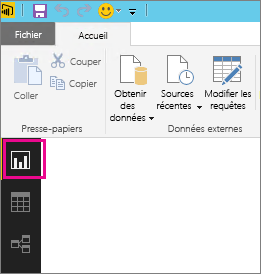
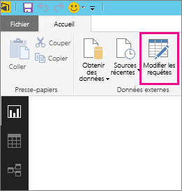
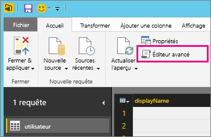
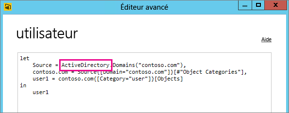

# Résolution des problèmes liés à la non prise en charge d’une source de données pour l’actualisation
Une erreur peut s’afficher lorsque vous tentez de configurer un jeu de données pour une actualisation planifiée.

        You cannot schedule refresh for this dataset because it gets data from sources that currently don’t support refresh.

Cela se produit quand la source de données que vous avez utilisée, dans Power BI Desktop, n’est pas prise en charge pour l’actualisation. Vous devez trouver la source de données utilisée et la comparer à la liste des sources de données prises en charge disponible dans la rubrique [Actualiser des données dans Power BI](refresh-data.md). 

## Rechercher la source de données
Si vous ne savez pas quelle source de données a été utilisée, effectuez les étapes suivantes dans Power BI Desktop.  

1. Dans Power BI Desktop, vérifiez que vous êtes dans le volet **Rapport** .  
   
2. Sélectionnez **Modifier les requêtes** dans la barre du ruban.  
   
3. Sélectionnez **Éditeur avancé**.  
   
4. Notez le fournisseur indiqué pour la source.  Dans cet exemple, le fournisseur est ActiveDirectory.  
   
5. Comparez le fournisseur à la liste des sources de données prises en charge disponible dans [Sources de données Power BI](power-bi-data-sources.md).

> [!NOTE]
> Pour plus d’informations sur les problèmes d’actualisation liés aux sources de données dynamiques, y compris les sources de données qui incluent des requêtes créées manuellement, consultez [Actualisation et sources de données dynamiques](refresh-data.md#refresh-and-dynamic-data-sources).

## Étapes suivantes
[Actualisation des données](refresh-data.md)  
[Power BI Gateway - Personal](service-gateway-personal-mode.md)  
[On-premises data gateway (Passerelle de données locale)](service-gateway-onprem.md)  
[Résolution des problèmes de passerelle de données locale](service-gateway-onprem-tshoot.md)  
[Résolution des problèmes liés à Power BI Gateway - Personal](service-admin-troubleshooting-power-bi-personal-gateway.md)  

D’autres questions ? [Essayez d’interroger la communauté Power BI](https://community.powerbi.com/)
