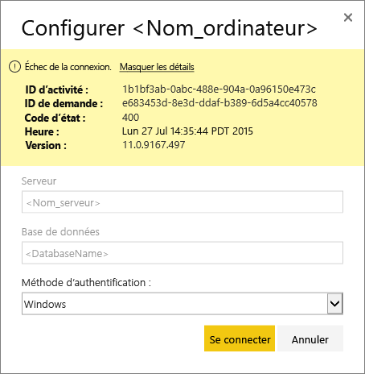
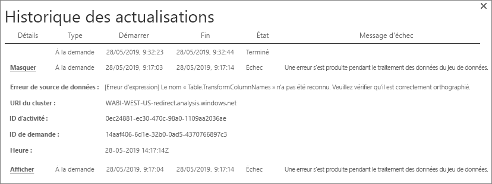
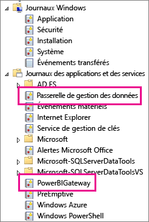
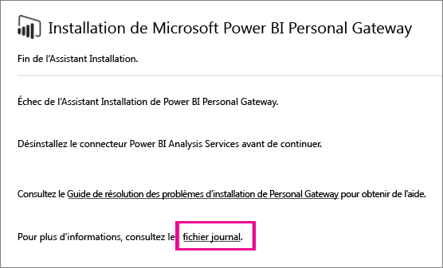

# Résolution des problèmes de la passerelle Power BI (mode personnel)

[!INCLUDE [gateway-rewrite](../includes/gateway-rewrite.md)]

Les sections suivantes décrivent certains problèmes courants que vous pouvez rencontrer quand vous utilisez la passerelle de données locale Power BI (mode personnel).

## Mise à jour vers la dernière version

La version actuelle de la passerelle utilisée à des fins personnelles est la passerelle de données locale (mode personnel). Mettez à jour votre installation pour utiliser cette version.

De nombreux problèmes peuvent faire surface quand la version de la passerelle est obsolète. Nous vous recommandons de vérifier que vous possédez bien la dernière version. Si vous n’avez pas mis à jour la passerelle depuis un mois ou plus, installez la dernière version de la passerelle. Vérifiez ensuite si vous pouvez reproduire le problème.

## Installation
**La passerelle (mode personnel) fonctionne sur les versions 64 bits :** si votre ordinateur est une version 32 bits, vous ne pouvez pas installer la passerelle (mode personnel). La version de votre système d’exploitation doit être 64 bits. Installez une version 64 bits de Windows ou installez la passerelle (mode personnel) sur un ordinateur 64 bits.

**La passerelle (mode personnel) ne parvient pas à s’installer en tant que service, même si vous êtes administrateur local de l’ordinateur :** l’installation peut échouer si l’utilisateur appartient au groupe Administrateur local de l’ordinateur, mais que la stratégie de groupe ne permet pas à ce nom d’utilisateur de se connecter en tant que service. Vérifiez que la stratégie de groupe permet à un utilisateur de se connecter en tant que service. Nous travaillons sur la résolution de ce problème. Pour plus d’informations, consultez [Ajouter le droit Ouvrir une session en tant que service à un compte](/previous-versions/windows/it-pro/windows-server-2003/cc739424(v=ws.10)).

**Délai dépassé pour l’opération :** ce message est courant si l’ordinateur (machine physique ou virtuelle) sur lequel vous installez la passerelle (mode personnel) dispose d’un processeur monocœur. Fermez toutes les applications désactivez tous les processus non essentiels, puis retentez l’installation.

**La passerelle de gestion des données ou Analysis Services Connector ne peut pas être installé sur le même ordinateur que la passerelle (mode personnel) :** si vous disposez déjà d’Analysis Services Connector ou d’une passerelle de gestion des données, vous devez d’abord désinstaller le connecteur ou la passerelle. Essayez ensuite d’installer la passerelle (mode personnel).

> [!NOTE]
> Si vous rencontrez un problème lors de l’installation, les journaux d’installation peuvent vous fournir des informations utiles à sa résolution. Pour plus d’informations, consultez [Journaux d’installation](#SetupLogs).
> 
> 

 **Configuration du proxy :** vous pourriez constater des problèmes avec la configuration de la passerelle (mode personnel) si votre environnement nécessite l’utilisation d’un proxy. Pour en savoir plus sur la configuration des informations du proxy, consultez [Configurer les paramètres de proxy pour la passerelle de données locale](/data-integration/gateway/service-gateway-proxy).

## Planifier l’actualisation
**Erreur : les informations d’identification stockées dans le cloud sont manquantes.**

Vous pouvez obtenir cette erreur dans les paramètres pour \<dataset\> si vous avez planifié une actualisation, puis désinstallé et réinstallé la passerelle (mode personnel). Quand vous désinstallez la passerelle (mode personnel), les informations d’identification de la source de données pour un jeu de données qui a été configuré pour l’actualisation sont supprimées du service Power BI.

**Solution :** dans Power BI, accédez aux paramètres d’actualisation pour un jeu de données. Dans **Gérer les sources de données**, pour toute source de données avec une erreur, sélectionnez **Modifier les informations d’identification**. Reconnectez-vous ensuite à la source de données.

**Erreur : les informations d’identification fournies pour le jeu de données ne sont pas valides. Mettez à jour les informations d’identification via une actualisation ou dans la boîte de dialogue Paramètres de la source de données pour continuer.**

**Solution :** si vous obtenez un message relatif aux informations d’identification, cela peut signifier ce qui suit :

* Les noms d’utilisateur et mots de passe que vous avez utilisés pour vous connecter aux sources de données ne sont pas à jour. Dans Power BI, accédez aux paramètres d’actualisation pour le jeu de données. Dans **Gérer les sources de données**, sélectionnez **Modifier les informations d’identification** pour mettre à jour ces informations pour la source de données.
* Dans une même requête, les mashups entre une source cloud et une source locale ne parviennent pas à s’actualiser dans la passerelle (mode personnel) si l’une des sources utilise OAuth pour l’authentification. C’est le cas, par exemple, d’un mashup entre CRM Online et une instance SQL Server locale. Le mashup échoue, car CRM Online nécessite OAuth.
  
  Il s’agit d’un problème connu, qui est actuellement traité. Pour contourner le problème, utilisez une requête distincte pour la source cloud et la source locale. Utilisez ensuite une requête de fusion ou d’ajout afin de les combiner.

**Erreur : source de données non prise en charge.**

**Solution :** si vous obtenez un message indiquant une source de données non prise en charge dans les paramètres **Planifier l’actualisation**, cela peut signifier ce qui suit : 

* La source de données n’est actuellement pas prise en charge pour l’actualisation dans Power BI. 
* Le classeur Excel ne contient pas un modèle de données, seulement des données de feuille de calcul. Power BI ne prend actuellement en charge l’actualisation que si le classeur Excel téléchargé contient un modèle de données. Quand vous importez des données à l’aide de Power Query dans Excel, choisissez l’option **Charger** pour charger des données dans un modèle de données. Cette option garantit que les données sont importées dans un modèle de données. 

**Erreur : [Impossible de combiner des données] &lt;partie de requête&gt;/&lt;…&gt;/&lt;…&gt; accède à des sources de données dont les niveaux de confidentialité ne peuvent pas être utilisés ensemble. Reconstruisez cette combinaison de données.**

**Solution :** Cette erreur est due à des restrictions du niveau de confidentialité et aux types de sources de données que vous utilisez.

**Erreur : erreur de source de données : Désolé... Nous n'avons pas pu convertir la valeur « \[Table\] » en type Table.**

**Solution :** Cette erreur est due à des restrictions du niveau de confidentialité et aux types de sources de données que vous utilisez.

**Erreur : espace insuffisant pour cette ligne.**

**Solution :** Cette erreur se produit si la taille d’une seule ligne est supérieure à 4 Mo. Recherchez la ligne dans votre source de données et essayez de la filtrer ou d’en réduire la taille.

## Sources de données
**Fournisseur de données manquant** : la passerelle (mode personnel) fonctionne sur les versions 64 bits uniquement. Elle nécessite l’installation d’une version 64 bits des fournisseurs de données sur le même ordinateur que celui sur lequel elle est installée. Par exemple, si la source de données dans le jeu de données est Microsoft Access, vous devez installer le fournisseur ACE 64 bits sur le même ordinateur que la passerelle (mode personnel). 

>[!NOTE]
>Si vous disposez d’une version 32 bits d’Excel, vous ne pouvez pas installer un fournisseur ACE 64 bits sur le même ordinateur.

**L’authentification Windows n’est pas prise en charge pour la base de données Access :** Power BI prend en charge uniquement l’authentification anonyme pour la base de données Access.

**Erreur : Erreur de connexion quand vous entrez des informations d’identification pour une source de données :** Si vous recevez une erreur semblable à celle-ci quand vous entrez des informations d’identification Windows pour une source de données : 

  

Il se peut que vous soyez toujours sur une version antérieure de la passerelle (mode personnel). 

**Solution :** Pour plus d’informations, consultez [Installer la dernière version de la passerelle Power BI (mode personnel](https://powerbi.microsoft.com/gateway/)).

**Erreur : Erreur de connexion quand vous sélectionnez l’authentification Windows pour une source de données avec ACE OLEDB :** Si vous recevez l’erreur suivante quand vous entrez des informations d’identification pour une source de données avec un fournisseur ACE OLEDB :

Power BI ne prend pas en charge l’authentification Windows pour une source de données avec un fournisseur ACE OLEDB.

**Solution :** Pour contourner cette erreur, sélectionnez l’**authentification anonyme**. Pour un fournisseur ACE OLEDB hérité, les informations d’identification anonymes sont égales aux informations d’identification Windows.

## Actualisation des vignettes
Si vous recevez une erreur quand les vignettes d’un tableau de bord sont actualisées, consultez [Résolution des erreurs de vignette](refresh-troubleshooting-tile-errors.md).

## Outils de résolution des problèmes
### Historique des actualisations
Avec l’**historique des actualisations**, vous pouvez déterminer les erreurs qui se sont produites et obtenir des données utiles au cas où vous auriez besoin de créer une demande de support. Vous pouvez visualiser à la fois les actualisations planifiées et les actualisations à la demande. Voici comment accéder à l’**historique des actualisations**.

1. Dans le volet de navigation de Power BI, dans **Jeux de données**, sélectionnez un jeu de données. Ouvrez le menu, puis sélectionnez **Planifier l’actualisation**.

   
1. Dans **Paramètres pour...** , sélectionnez **Historique des actualisations**. 

   
   
   

### Journaux d’événements
Plusieurs journaux d’événements peuvent fournir des informations. Les deux premiers, **Passerelle de gestion des données** et **PowerBIGateway**, sont disponibles si vous êtes administrateur de l’ordinateur. Si vous n’êtes pas administrateur et que vous utilisez la passerelle de données (mode personnel), vous trouverez les entrées de journal dans le journal **Application**.

Les journaux **Passerelle de gestion des données** et **PowerBIGateway** se situent sous **Journaux des applications et des services**.

### Trace Fiddler
[Fiddler](https://www.telerik.com/fiddler) est un outil gratuit de Telerik qui surveille le trafic HTTP. Vous pouvez voir les communications avec le service Power BI à partir de l’ordinateur client. Ces communications peuvent indiquer des erreurs et d’autres informations connexes.

### Journaux d’installation
Si l’installation de la passerelle (mode personnel) échoue, vous trouverez un lien pour consulter le journal d’installation. Les journaux d’installation peuvent contenir des détails sur l’échec. Il s’agit des journaux Windows Install, aussi appelés journaux MSI. Ils peuvent être assez complexes et difficiles à lire. En général, l’erreur rencontrée apparaît en bas, mais il n’est pas simple d’en déterminer la cause. Elle peut être due à des erreurs dans un autre journal. Elle peut également être due à une erreur plus haut dans le journal.

Vous pouvez aussi accéder à votre dossier temporaire (%temp%) et y rechercher des fichiers qui commencent par *Power\_BI\_* .

> [!NOTE]
> En accédant à %temp%, vous risquez de vous retrouver dans un sous-dossier de Temp. Les fichiers *Power\_BI\_* se trouvent à la racine du répertoire Temp. Vous serez peut-être amené à monter d’un ou deux niveaux.
> 
> 

## Étapes suivantes
- [Configurer les paramètres de proxy de la passerelle de données locale](/data-integration/gateway/service-gateway-proxy)- [Actualisation des données](refresh-data.md)  
- [Passerelle Power BI - Personal](service-gateway-personal-mode.md)  
- [Résolution des erreurs de vignette](refresh-troubleshooting-tile-errors.md)  
- [Résolution des problèmes de passerelle de données locale](service-gateway-onprem-tshoot.md) 
 
D’autres questions ? Essayez de d’interroger la [Communauté Power BI](https://community.powerbi.com/).