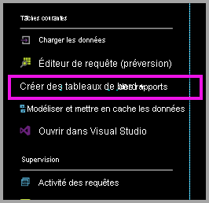
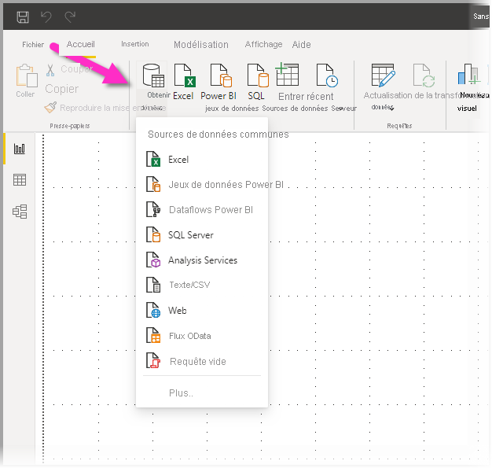
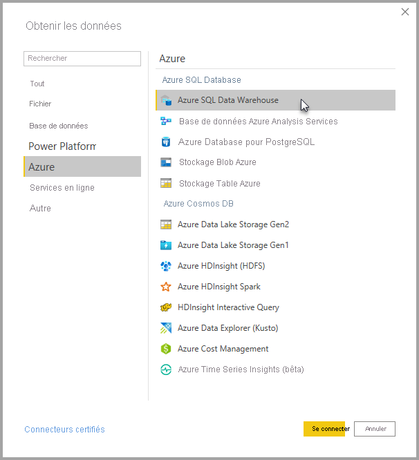
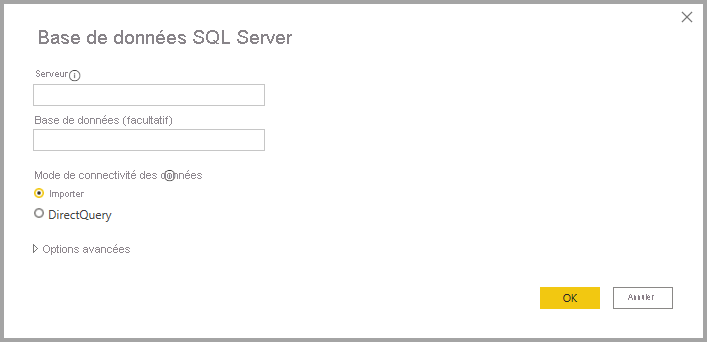
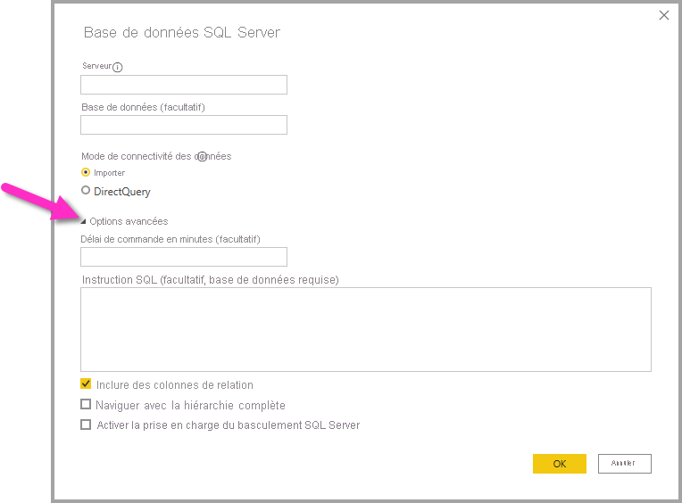
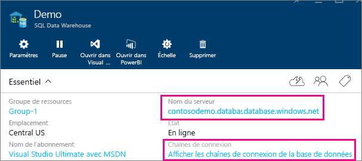

# Azure SQL Data Warehouse avec DirectQuery

Azure SQL Data Warehouse avec DirectQuery vous permet de créer des rapports dynamiques basés sur des données et mesures dont vous disposez déjà dans Azure SQL Data Warehouse. Avec DirectQuery, les requêtes sont renvoyées à Azure SQL Data Warehouse en temps réel pendant que vous explorez les données. Les requêtes en temps réel, combinées à l’échelle de SQL Data Warehouse, permettent aux utilisateurs de créer en quelques minutes des rapports dynamiques sur plusieurs téraoctets de données. De plus, le lien **Créer des tableaux de bord + des rapports** permet aux utilisateurs de créer des rapports Power BI en utilisant leur entrepôt SQL Data Warehouse.

Lorsque vous utilisez le connecteur SQL Data Warehouse :

* Spécifiez le nom de serveur complet lors de la connexion (voir ci-dessous pour plus de détails).
* Vérifiez que les règles de pare-feu sont configurées pour « Autoriser l’accès aux services Azure ».
* Chaque action, telle que la sélection d’une colonne ou l’ajout d’un filtre, interroge directement l’entrepôt de données.
* Les vignettes étant configurées pour s’actualiser environ toutes les 15 minutes, il est inutile de planifier l’actualisation.  L’actualisation peut être réglée dans les paramètres avancés lorsque vous vous connectez.
* Il n’y a pas de Q&R disponibles pour les jeux de données DirectQuery.
* Les modifications apportées aux schémas ne sont pas appliquées automatiquement.

Ces points sont susceptibles de changer, car nous travaillons actuellement à l’amélioration de l’expérience. Les étapes de connexion sont détaillées ci-dessous.

## Créer des tableaux de bord et des rapports dans Power BI

> [!Important]
> Nous avons amélioré notre connectivité à Azure SQL Data Warehouse. Pour une expérience optimale de connexion à votre source de données Azure SQL Data Warehouse, utilisez Power BI Desktop. Une fois que vous avez créé votre modèle et votre rapport, vous pouvez publier ce dernier sur le service Power BI. Le connecteur direct qui était disponible pour Azure SQL Data Warehouse dans le service Power BI n’est plus disponible.

Le moyen le plus simple de basculer entre votre entrepôt SQL Data Warehouse et Power BI est de créer des rapports dans Power BI Desktop. Vous pouvez utiliser le bouton **Créer des tableaux de bord + des rapports** dans le portail Azure.

1. Pour commencer, téléchargez et installez Power BI Desktop. Pour plus d’informations sur le téléchargement et l’installation, consultez l’article [Obtenir Power BI Desktop](../fundamentals/desktop-get-the-desktop.md) ou passez directement à l’étape suivante.

2. Vous pouvez également cliquer sur le lien **Créer des tableaux de bord + des rapports** pour télécharger Power BI Desktop.

    

## Connexion via Power BI Desktop

Vous pouvez vous connecter à un entrepôt SQL Data Warehouse en utilisant le bouton **Obtenir les données** dans Power BI Desktop. 

1. Sélectionnez le bouton **Obtenir les données** dans le menu **Accueil**.  

    

2. Sélectionnez **Plus...** pour voir toutes les sources de données disponibles. Dans la fenêtre qui s’affiche, sélectionnez **Azure** dans le volet gauche, puis sélectionnez **Azure SQL Data Warehouse** dans la liste des connecteurs disponibles dans le volet droit.

    

3. Dans la fenêtre qui s’affiche, entrez votre serveur et indiquez éventuellement la base de données à laquelle vous souhaitez vous connecter. Vous pouvez également sélectionner votre mode de connectivité des données : Importer ou DirectQuery. Pour un accès en temps réel aux informations de votre entrepôt Azure SQL Data Warehouse, utilisez DirectQuery.

    

4. Pour les options avancées de la connexion Azure SQL Data Warehouse, sélectionnez la flèche vers le bas située à côté de **Options avancées** pour afficher des options supplémentaires pour votre connexion.

    

La section suivante explique comment trouver les valeurs des paramètres pour votre connexion. 

## Recherche des valeurs de paramètres

Le nom complet de votre serveur et celui de votre base de données se trouvent dans le portail Azure. Notez qu’à l’heure actuelle, SQL Data Warehouse est uniquement proposé dans le portail Azure.

> [!NOTE]
> Si votre locataire Power BI se trouve dans la même région qu’Azure SQL Data Warehouse, aucuns frais de sortie ne sont exigés. Vous pouvez déterminer l’emplacement de votre locataire Power BI en suivant [ces instructions](https://docs.microsoft.com/power-bi/service-admin-where-is-my-tenant-located).

[!INCLUDE [direct-query-sso](../includes/direct-query-sso.md)]

## Étapes suivantes

* [À propos de l’utilisation de DirectQuery dans Power BI](desktop-directquery-about.md)
* [Qu’est-ce que Power BI ?](../fundamentals/power-bi-overview.md)  
* [Obtenir des données pour Power BI](service-get-data.md)  
* [Azure SQL Data Warehouse](/azure/sql-data-warehouse/sql-data-warehouse-overview-what-is/)

D’autres questions ? [Posez vos questions à la communauté Power BI](https://community.powerbi.com/)
