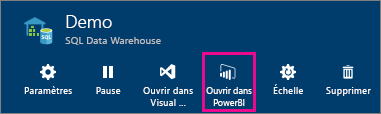
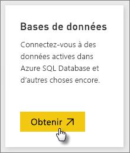
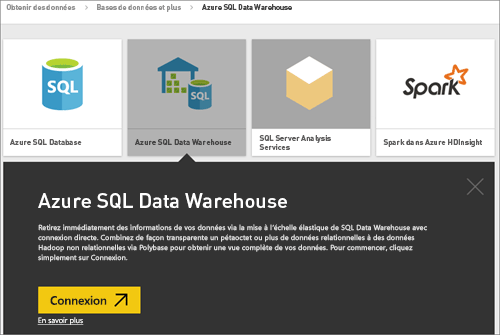
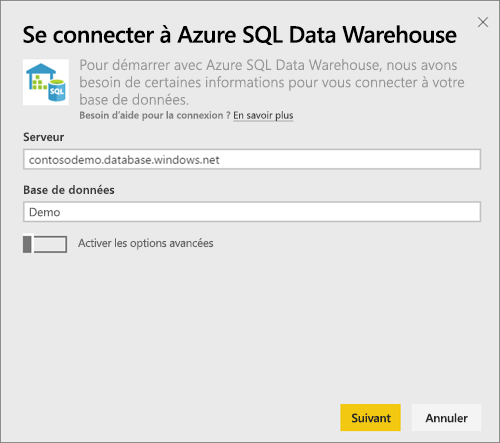
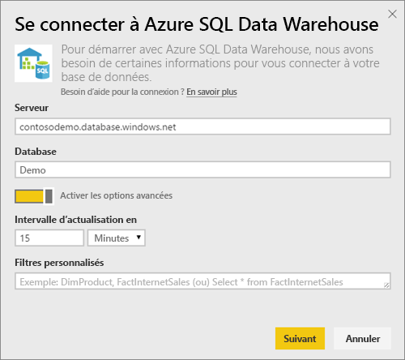
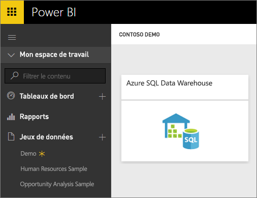
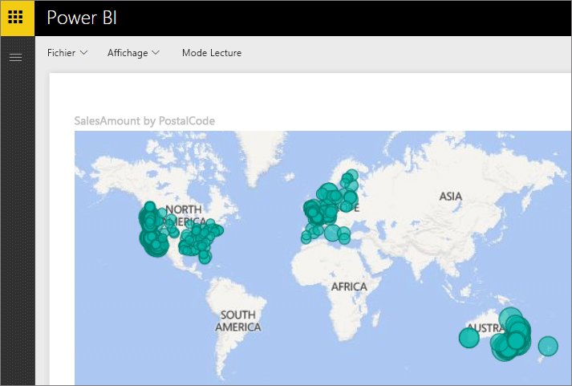

# Azure SQL Data Warehouse avec DirectQuery

Azure SQL Data Warehouse avec DirectQuery vous permet de créer des rapports dynamiques basés sur des données et mesures dont vous disposez déjà dans Azure SQL Data Warehouse. Avec DirectQuery, les requêtes sont renvoyées à Azure SQL Data Warehouse en temps réel pendant que vous explorez les données. Les requêtes en temps réel, combinées à l’échelle de SQL Data Warehouse, permettent aux utilisateurs de créer en quelques minutes des rapports dynamiques sur plusieurs téraoctets de données. De plus, l’introduction du bouton **Ouvrir dans Power BI** permet aux utilisateurs de connecter directement Power BI à leur entrepôt de données SQL sans avoir à spécifier manuellement les informations.

Lorsque vous utilisez le connecteur SQL Data Warehouse :

* Spécifiez le nom de serveur complet lors de la connexion (voir ci-dessous pour plus de détails).
* Vérifiez que les règles de pare-feu sont configurées pour « Autoriser l’accès aux services Azure ».
* Chaque action, telle que la sélection d’une colonne ou l’ajout d’un filtre, interroge directement l’entrepôt de données.
* Les vignettes étant configurées pour s’actualiser environ toutes les 15 minutes, il est inutile de planifier l’actualisation.  L’actualisation peut être réglée dans les paramètres avancés lorsque vous vous connectez.
* Il n’y a pas de Q&R disponibles pour les jeux de données DirectQuery.
* Les modifications apportées aux schémas ne sont pas appliquées automatiquement.

Ces points sont susceptibles de changer, car nous travaillons actuellement à améliorer le produit. Les étapes de connexion sont détaillées ci-dessous.

## Utilisation du bouton « Ouvrir dans Power BI »

> [!Important]
> Nous avons amélioré notre connectivité à Azure SQL Data Warehouse.  Pour une expérience optimale de connexion à votre source de données Azure SQL Data Warehouse, utilisez Power BI Desktop.  Une fois que vous avez créé votre modèle et votre rapport, vous pouvez publier ce dernier sur le service Power BI.  Le connecteur direct pour Azure SQL Data Warehouse rencontré dans le service Power BI est désormais déconseillé.

Le moyen le plus simple de basculer entre votre entrepôt de données SQL et Power BI consiste à utiliser le bouton **Ouvrir dans Power BI** dans le portail Azure. Ce bouton vous permet de commencer à créer des tableaux de bord dans Power BI en toute transparence.

1. Pour commencer, accédez à votre instance de SQL Data Warehouse dans le portail Azure. Notez qu’à l’heure actuelle, SQL Data Warehouse n’est présent que dans le portail Azure.

2. Cliquez sur le bouton **Ouvrir dans Power BI** .

    

3. Si nous ne pouvons pas vous connecter directement ou si vous n’avez pas de compte Power BI, vous devrez vous connecter.

4. Vous serez dirigé vers la page de connexion SQL Data Warehouse, où les informations de votre SQL Data Warehouse seront préremplies. Entrez vos informations d’identification et cliquez sur Se connecter pour créer une connexion.

## Connexion par le biais de Power BI

SQL Data Warehouse est également répertorié dans la page Obtenir des données de Power BI. 

1. Sélectionnez **Obtenir des données** dans le bas du volet de navigation.  

    

2. Dans **Bases de données**, sélectionnez **Obtenir**.

    

3. Sélectionnez **SQL Data Warehouse**\> **Se connecter**.

    

4. Entrez les informations nécessaires pour vous connecter. La section **Recherche des valeurs de paramètres** ci-dessous indique l’emplacement de ces données dans votre portail Azure.

    

    

    

   > [!NOTE]
   > Le nom d’utilisateur est un utilisateur qui est défini dans votre instance Azure SQL Data Warehouse.

5. Explorez le jeu de données en sélectionnant la nouvelle vignette ou le jeu de données nouvellement créé, indiqué par l’astérisque. Ce jeu de données a le même nom que votre base de données.

    

6. Vous pouvez explorer toutes les tables et les colonnes. La sélection d’une colonne renverra une requête à la source, créant ainsi dynamiquement votre élément visuel. Les filtres seront aussi convertis en requêtes et renvoyés à votre entrepôt de données. Vous pouvez enregistrer ces éléments visuels dans un nouveau rapport et les épingler dans votre tableau de bord.

    

## Recherche des valeurs de paramètres

Le nom complet de votre serveur et celui de votre base de données se trouvent dans le portail Azure. Notez qu’à l’heure actuelle, SQL Data Warehouse n’est présent que dans le portail Azure.

> [!NOTE]
> Si votre locataire Power BI se trouve dans la même région qu’Azure SQL Data Warehouse, aucuns frais de sortie ne sont exigés. Vous pouvez déterminer l’emplacement de votre locataire Power BI en suivant [ces instructions](https://docs.microsoft.com/power-bi/service-admin-where-is-my-tenant-located).

[!INCLUDE [direct-query-sso](../includes/direct-query-sso.md)]

## Étapes suivantes

* [Qu’est-ce que Power BI ?](../fundamentals/power-bi-overview.md)  
* [Obtenir des données pour Power BI](service-get-data.md)  
* [Azure SQL Data Warehouse](/azure/sql-data-warehouse/sql-data-warehouse-overview-what-is/)

D’autres questions ? [Posez vos questions à la communauté Power BI](https://community.powerbi.com/)
