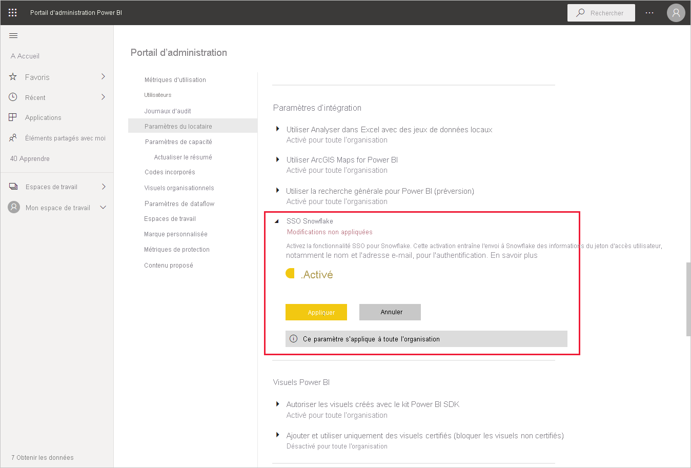
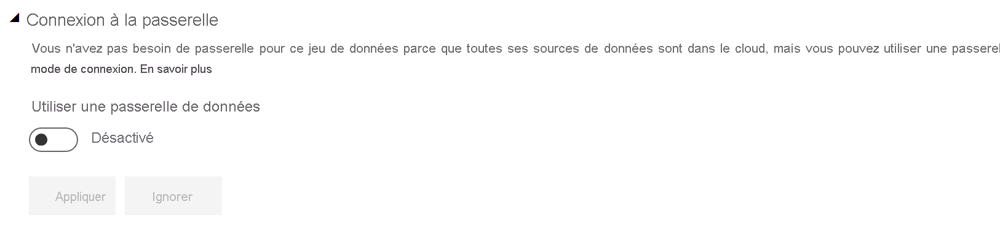
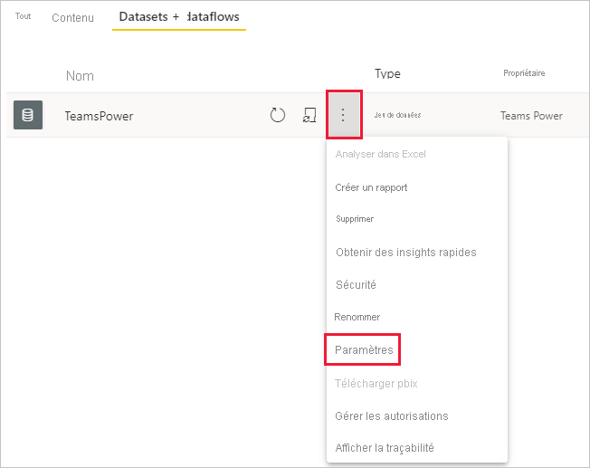
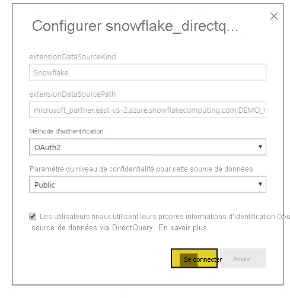

# Connexion à Snowflake dans le service Power BI

## Introduction

La connexion à Snowflake dans le service Power BI présente une seule différence avec les autres connecteurs. Snowflake offre une capacité supplémentaire pour Azure Active Directory (AAD), avec une option pour l’authentification unique. Les différents aspects de l’intégration exigent des rôles d’administration différents sur Snowflake, Power BI et Azure. Vous pouvez également choisir d’activer l’authentification AAD sans utiliser l’authentification unique. L’authentification de base fonctionne de la même façon qu’avec d’autres connecteurs du service.

Pour configurer l’intégration avec AAD et activer l’authentification unique (facultatif), suivez la procédure décrite dans cet article :

* Si vous êtes administrateur Snowflake : [Authentification unique Power BI à Snowflake – Prise en main](https://docs.snowflake.com/en/user-guide/oauth-powerbi.html) dans la documentation Snowflake.
* Si vous êtes administrateur Power BI : [Configuration du service Power BI – Portail d’administration](service-connect-snowflake.md#admin-portal) pour savoir comment activer l’authentification unique.
* Si vous êtes créateur de jeux de données Power BI : [Configuration du service Power BI – Configuration d’un jeu de données avec AAD](service-connect-snowflake.md#configuring-a-dataset-with-aad) pour savoir comment activer l’authentification unique.

## Configuration du service Power BI

### Portail d’administration

Le paramètre d’authentification unique doit être activé par un administrateur sur le portail d’administration Power BI. Il permet d’approuver l’envoi d’informations d’identification AAD à Snowflake pour l’authentification de l’ensemble de l’organisation. Suivez la procédure ci-dessous pour activer l’authentification unique :

1. [Connectez-vous à Power BI](https://app.powerbi.com) avec des informations d’identification d’administrateur général.
1. Sélectionnez **Paramètres** dans le menu d’en-tête de la page, puis **Portail d’administration**.
1. Sélectionnez **Paramètres du locataire**, puis faites défiler la liste pour rechercher **Paramètres d’intégration**.

   

4. Développez **Authentification unique Snowflake**, basculez le paramètre sur **Activé**, puis sélectionnez **Appliquer**.

Cette étape est requise pour accepter l’envoi de votre jeton AAD aux serveurs Snowflake. Une fois activé, le paramètre peut mettre une heure à s’appliquer.

Une fois l’authentification unique activée, vous pouvez utiliser des rapports avec l’authentification unique.

### Configuration d’un jeu de données avec AAD

Après la publication d’un rapport basé sur le connecteur Snowflake dans le service Power BI, le créateur du jeu de données doit mettre à jour les paramètres de l’espace de travail correspondant pour qu’il utilise l’authentification unique.

En raison du mode de fonctionnement de Power BI, l’authentification unique ne marche que si aucune source de données n’est exécutée par le biais de la passerelle de données locale. Voici les limitations qui s’appliquent :

* Si vous utilisez uniquement une source Snowflake dans votre modèle de données, vous pouvez utiliser l’authentification unique à condition de ne pas utiliser la passerelle de données locale.
* Si vous utilisez une source Snowflake et une autre source, vous pouvez utiliser l’authentification unique à condition qu’aucune des sources n’utilise la passerelle de données locale.
* Si vous utilisez une source Snowflake par le biais de la passerelle de données locale, les informations d’identification AAD ne sont pas prises en charge à l’heure actuelle. Cette considération peut se révéler pertinente si vous essayez d’accéder à un réseau virtuel à partir d’une seule adresse IP sur laquelle la passerelle est installée, plutôt qu’à partir de l’ensemble de la plage d’adresses IP de Power BI.
* Si vous utilisez une source Snowflake et une autre source qui exige une passerelle, vous devez passer par la passerelle de données locale pour interagir avec Snowflake. Dans ce cas, vous ne pourrez pas utiliser l’authentification unique.

Pour plus d’informations sur l’utilisation de la passerelle de données locale, consultez [Qu’est-ce qu’une passerelle de données locale ?](service-gateway-onprem.md).

Si vous n’utilisez pas la passerelle, tout est prêt. Si vous avez des informations d’identification Snowflake configurées sur votre passerelle de données locale, mais que vous utilisez uniquement cette source de données dans votre modèle, vous pouvez cliquer sur le bouton bascule sur la page Paramètres du jeu de données afin de désactiver la passerelle pour ce modèle de données.

Pour activer l’authentification unique pour un jeu de données, suivez la procédure ci-dessous :

1. [Connectez-vous à Power BI](https://app.powerbi.com) avec des informations d’identification de créateur de jeu de données.
1. Sélectionnez l’espace de travail approprié, puis choisissez **Paramètres** dans le menu Plus d’options situé à côté du nom du jeu de données.
  
1. Sélectionnez **Informations d’identification de la source de données** et connectez-vous. Vous pouvez connecter le jeu de données à Snowflake avec des informations d’identification de base ou OAuth2 (AAD). Si vous utilisez AAD, vous pouvez activer l’authentification unique à l’étape suivante.
1. Sélectionnez l’option **Les utilisateurs finaux utilisent leurs propres informations d’identification OAuth2 pour accéder à cette source de données via DirectQuery**. Ce paramètre permet d’activer l’authentification unique AAD. Que le premier utilisateur se connecte avec l’authentification de base ou OAuth2 (AAD), ce sont les informations d’identification AAD qui seront envoyées pour l’authentification unique.

    

Après avoir suivi toutes ces étapes, les utilisateurs devront systématiquement utiliser l’authentification AAD pour se connecter aux données à partir de ce jeu de données Snowflake.

Si vous choisissez de ne pas activer l’authentification unique, les utilisateurs qui actualisent le rapport utiliseront les informations d’identification de l’utilisateur qui s’est connecté, comme avec la plupart des autres rapports de Power BI.

### Résolution des problèmes

Si vous rencontrez des problèmes d’intégration, consultez le [guide de résolution des problèmes](https://docs.snowflake.com/en/user-guide/oauth-powerbi.html#troubleshooting) Snowflake.

## Étapes suivantes

* [Sources de données pour le service Power BI](service-get-data.md)
* [Connexion à des jeux de données dans le service Power BI à partir de Power BI Desktop](desktop-report-lifecycle-datasets.md)
* [Connexion à un entrepôt de calcul Snowflake](desktop-connect-snowflake.md)