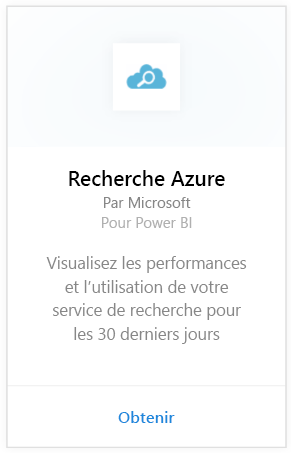
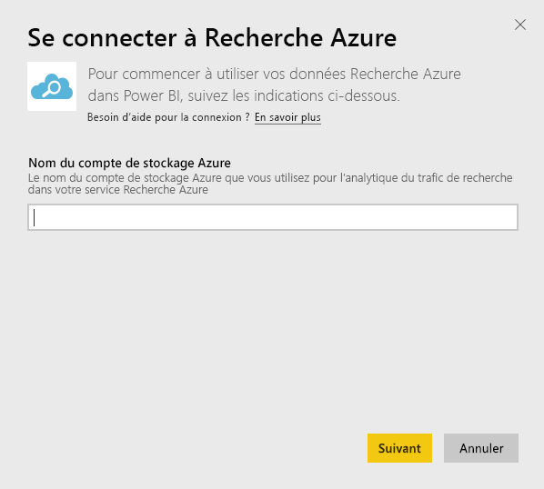
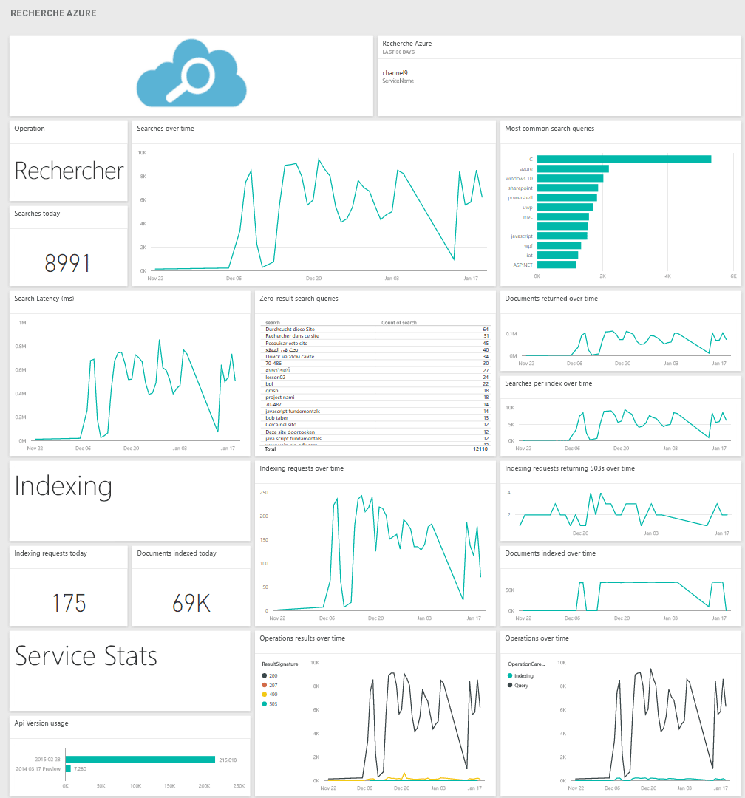

# Se connecter à Recherche Azure avec Power BI
Azure Search Traffic Analytics vous permet de surveiller et de comprendre le trafic vers votre service Recherche Azure. Le pack de contenu Recherche Azure pour Power BI fournit des informations détaillées sur vos données de recherche, notamment les recherches, indexations, statistiques du service et latences des 30 derniers jours. Pour plus de détails, consultez ce [billet de blog Azure](https://azure.microsoft.com/blog/analyzing-your-azure-search-traffic/).

[!INCLUDE [include-short-name](../includes/service-deprecate-content-packs.md)]

Connectez-vous au [pack de contenu Recherche Azure](https://app.powerbi.com/getdata/services/azure-search) pour Power BI.

## Comment se connecter
1. Sélectionnez **Obtenir des données** en bas du volet de navigation.
   
    
2. Dans la zone **Services**, sélectionnez **Obtenir**.
   
    
3. Sélectionnez **Azure Search** \> **Obtenir**.
   
   
4. Indiquez le nom du compte Stockage Table sous lequel votre analyse Recherche Azure est stockée.
   
   
5. Sélectionnez **Clé** comme mécanisme d’authentification et fournissez la clé de votre compte de stockage. Cliquez sur **Connexion** et commencez le processus de chargement.
   
   
6. Une fois le chargement terminé, un nouveau tableau de bord, un nouveau rapport et un nouveau modèle apparaissent dans le volet de navigation. Sélectionnez le tableau de bord pour afficher vos données importées.
   
    

**Et maintenant ?**

* Essayez de [poser une question dans la zone Q&R](../consumer/end-user-q-and-a.md) en haut du tableau de bord.
* [Modifiez les vignettes](../create-reports/service-dashboard-edit-tile.md) dans le tableau de bord.
* [Sélectionnez une vignette](../consumer/end-user-tiles.md) pour ouvrir le rapport sous-jacent.
* Même si une actualisation quotidienne de votre jeu de données est planifiée, vous pouvez modifier la planification de l’actualisation ou essayer d’actualiser le jeu de données sur demande à l’aide de l’option **Actualiser maintenant**.

## Configuration requise
Le pack de contenu Recherche Azure exige l’activation d’Azure Search Traffic Analytics sur le compte.

## Résolution des problèmes
Vérifiez que le nom du compte de stockage et la clé d’accès complète sont correctement entrés. Le nom du compte de stockage doit correspondre au compte configuré avec Azure Search Traffic Analytics.

## Étapes suivantes
[Qu’est-ce que Power BI ?](../fundamentals/power-bi-overview.md)

[Concepts de base pour les concepteurs du service Power BI](../fundamentals/service-basic-concepts.md)
