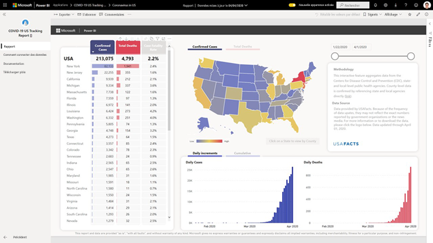
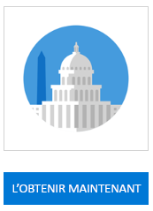
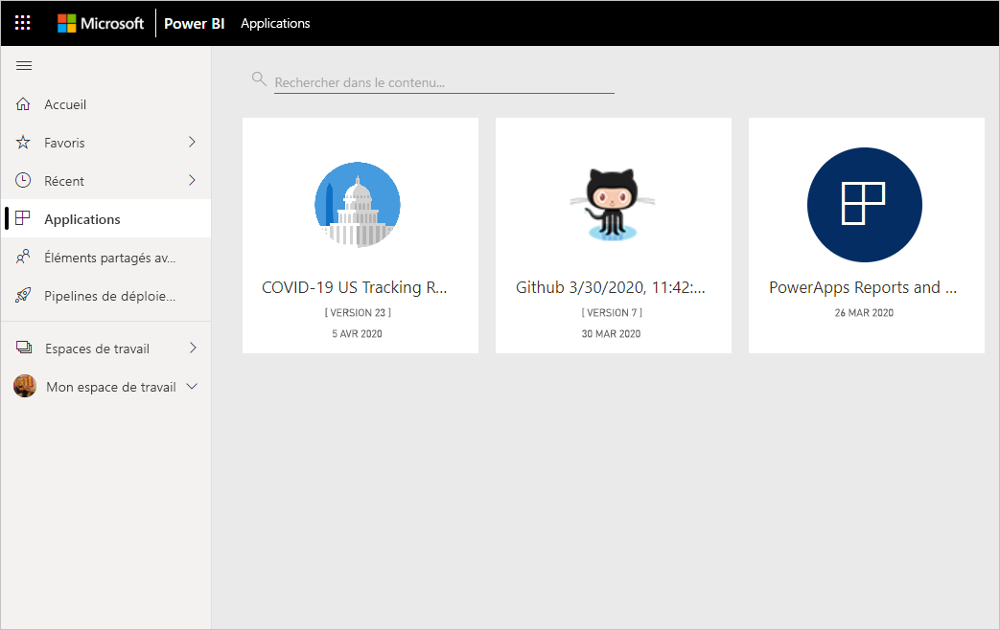
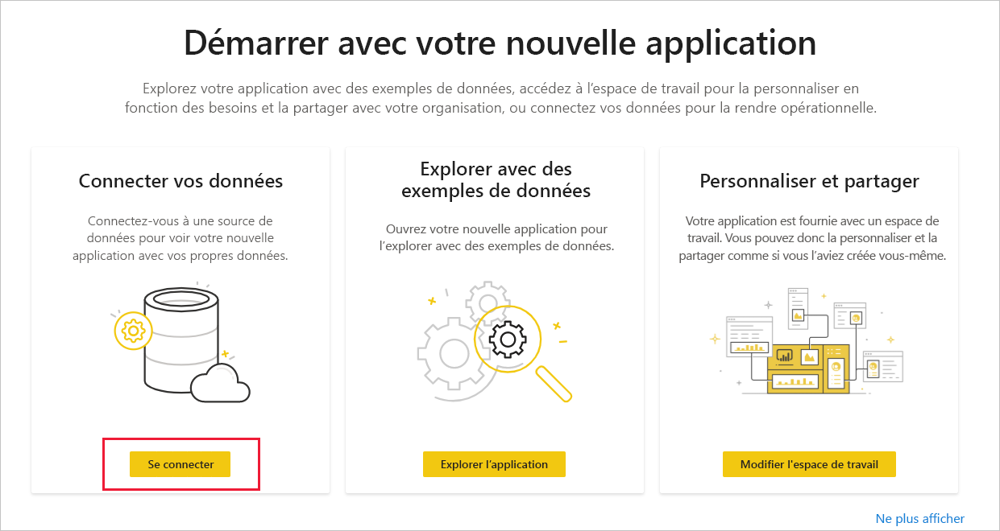
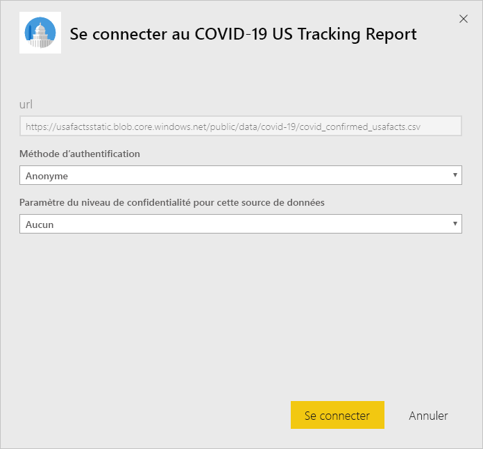
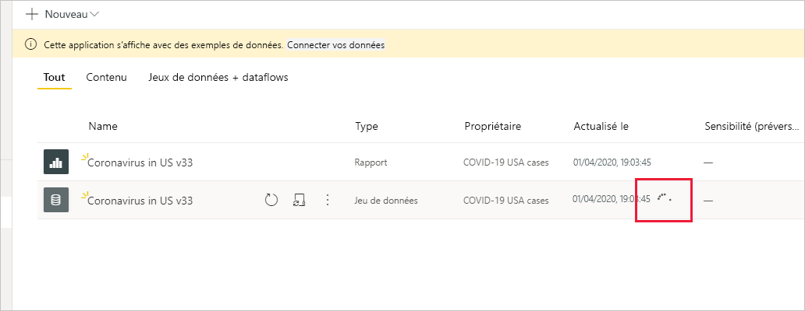

# Se connecter au rapport de suivi du COVID-19 aux États-Unis
Cet article vous explique comment installer l’application modèle pour le rapport de suivi du COVID-19 et comment se connecter aux sources de données.

Pour obtenir plus de détails sur le rapport, notamment les exclusions de responsabilité et des informations sur les données, consultez [Échantillon de suivi COVID-19 pour les gouvernements régionaux et d’État des États-Unis](../create-reports/sample-covid-19-us.md).

Après avoir installé l’application modèle et établi la connexion aux sources de données, vous pouvez personnaliser le rapport selon vos besoins. Vous pouvez ensuite le distribuer en tant qu’application aux collègues de votre organisation.

## Installer l’application

1. Cliquez sur le lien suivant pour accéder à l’application : [Application modèle Rapport de suivi du COVID-19 aux États-Unis](https://appsource.microsoft.com/en-us/product/power-bi/pbi-contentpacks.covid19ms)

1. Une fois dans la page AppSource de l’application, cliquez sur [**OBTENIR MAINTENANT**](https://appsource.microsoft.com/en-us/product/power-bi/pbi-contentpacks.covid19ms).

    

1. À l’invite, cliquez sur **Installer**. Une fois installée, l’application apparaît dans votre page Applications.

   

## Se connecter à la source de données

1. Cliquez sur l’icône dans votre page Applications pour ouvrir l’application.

1. Dans l’écran de démarrage qui apparaît, choisissez **Se connecter**.

   

1. Deux boîtes de dialogue de connexion s’ouvrent l’une après l’autre. Choisissez le niveau de confidentialité Public dans les deux.

   

   Une fois le rapport connecté aux sources de données, il est renseigné avec les données les plus récentes. Pendant ce temps, le moniteur d’activité tourne.

   

## Planifier l’actualisation du rapport

Quand l’actualisation des données est terminée, vous vous retrouvez dans l’espace de travail associé à l’application. [Configurez une planification de l’actualisation](../refresh-scheduled-refresh.md) pour tenir les données du rapport à jour.

## Personnaliser et partager

Pour plus d’informations, consultez [Personnaliser et partager l’application](../service-template-apps-install-distribute.md#customize-and-share-the-app). Veillez à passer en revue les [exclusions de responsabilité du rapport](../create-reports/sample-covid-19-us.md#disclaimers) avant de publier ou de distribuer l’application.

## Étapes suivantes
* [Échantillon de suivi COVID-19 pour les gouvernements régionaux et d’État des États-Unis](../create-reports/sample-covid-19-us.md)
* Vous avez des questions ? [Essayez d’interroger la communauté Power BI](https://community.powerbi.com/)
* [Que sont les applications modèles Power BI ?](../service-template-apps-overview.md)
* [Installer et distribuer des applications modèles dans votre organisation](../service-template-apps-install-distribute.md)
