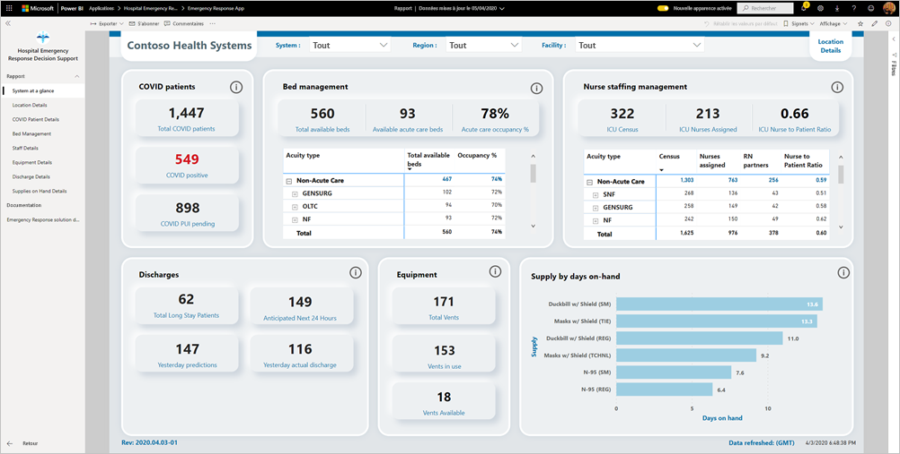
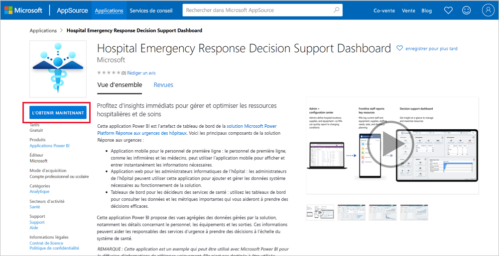
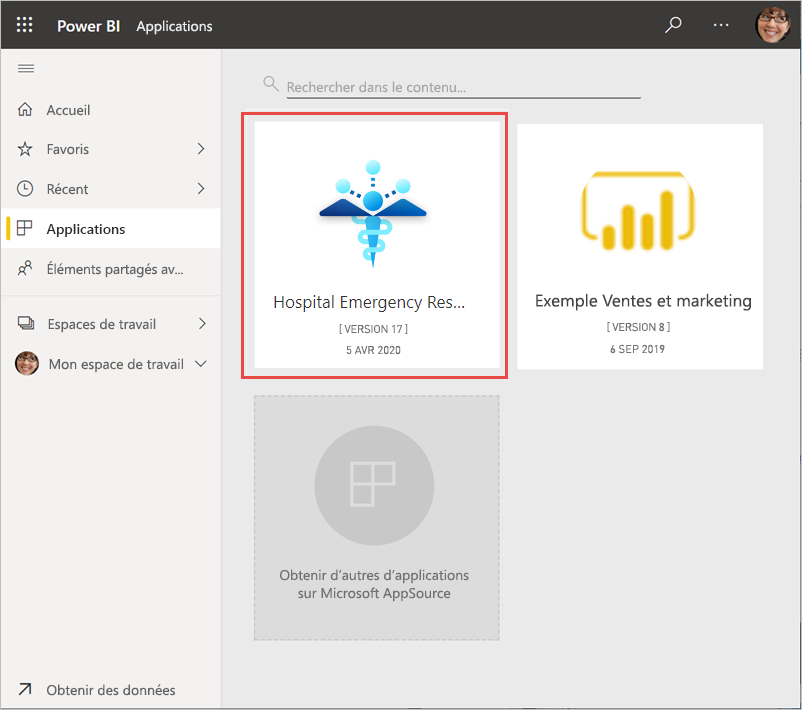
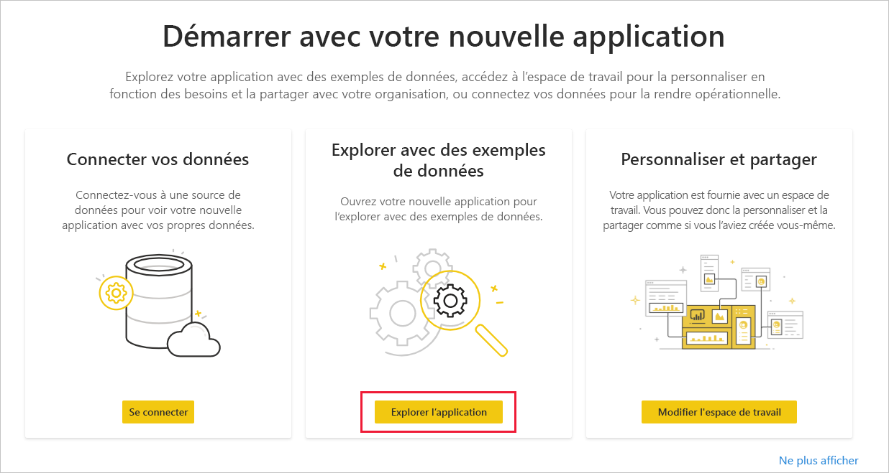
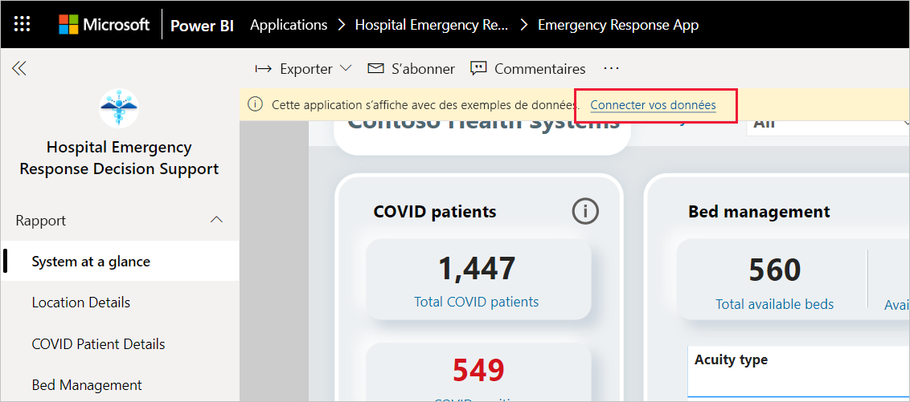
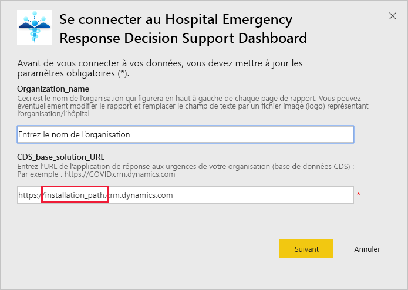
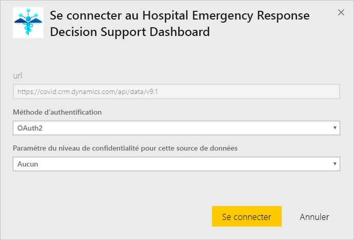
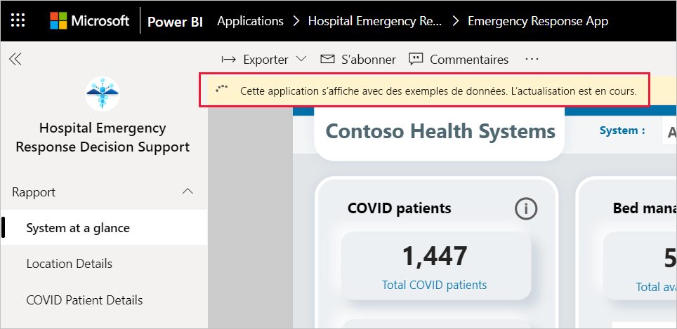
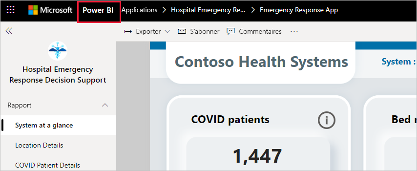

# Se connecter au Tableau de bord d’aide à la prise de décision en réponse aux urgences des hôpitaux
L’application modèle Tableau de bord d’aide à la prise de décision en réponse aux urgences des hôpitaux est la partie dédiée aux rapports de la [solution Microsoft Power Platform pour la réponse aux urgences sanitaires](https://powerapps.microsoft.com/blog/emergency-response-solution-a-microsoft-power-platform-solution-for-healthcare-emergency-response/). Le tableau de bord montre aux responsables des services d’urgence des données agrégées à l’échelle de leur système de santé pour les aider à prendre des décisions opportunes et éclairées.

Cet article vous explique comment installer l’application et comment se connecter aux sources de données. Pour savoir comment utiliser le rapport que vous voyez avec cette application, consultez la [documentation du Tableau de bord d’aide à la prise de décision en réponse aux urgences des hôpitaux](/powerapps/sample-apps/emergency-response/deploy-configure#view-the-power-bi-dashboard).

Après avoir installé l’application modèle et établi la connexion aux sources de données, vous pouvez personnaliser le rapport selon vos besoins. Vous pouvez ensuite le distribuer en tant qu’application aux collègues de votre organisation.

## Prérequis

Avant d’installer cette application modèle, vous devez installer et configurer la [solution Power Platform Réponse aux urgences des hôpitaux](/powerapps/sample-apps/emergency-response/deploy-configure). L’installation de cette solution crée les références nécessaires aux sources de données pour renseigner l’application avec des données.

Lors de l’installation de la solution Power Platform Réponse aux urgences des hôpitaux, prenez note de l’[URL de votre instance d’environnement Common Data Service](/powerapps/sample-apps/emergency-response/deploy-configure#publish-the-power-bi-dashboard). Vous en aurez besoin pour connecter l’application modèle aux données.

## Installer l’application

1. Cliquez sur le lien suivant pour accéder à l’application : [Application modèle Tableau de bord d’aide à la prise de décision en réponse aux urgences des hôpitaux](https://aka.ms/AppSource_Hospital_offer)

1. Dans la page AppSource de l’application, sélectionnez [**OBTENIR MAINTENANT**](https://aka.ms/AppSource_Hospital_offer).

    

1. Lisez les informations contenues dans **Encore une chose**, puis sélectionnez **Continuer**.

    

1. Sélectionnez **Installer**. 

    

    Une fois l’application installée, elle apparaît dans votre page Applications.

   

## Se connecter à la source de données

1. Sélectionnez l’icône dans votre page Applications pour ouvrir l’application.

1. Dans l’écran de démarrage, sélectionnez **Explorer**.

   

   L’application s’ouvre et présente des exemples de données.

1. Sélectionnez le lien **Connecter vos données** dans la bannière en haut de la page.

   

1. Dans la boîte de dialogue :
   1. Dans le champ du nom de l’organisation, entrez le nom de votre organisation. Par exemple : « Contoso Health Systems ». Ce champ est facultatif. Ce nom apparaît en haut à gauche du tableau de bord.
   1. Dans le champ CDS_base_solution, tapez l’[URL de votre instance d’environnement Common Data Service](/powerapps/sample-apps/emergency-response/deploy-configure#publish-the-power-bi-dashboard). Par exemple : https://[myenv].crm.dynamics.com. Quand vous avez terminé, cliquez sur **Suivant**.

   

1. Dans la boîte de dialogue suivante qui s’ouvre, choisissez **OAuth2** comme méthode d’authentification. Ne changez pas le paramètre de niveau de confidentialité.

   Sélectionnez **Connexion**.

   

1. Dans l’écran de connexion Microsoft, connectez-vous à Power BI.

   

   Une fois que vous êtes connecté, le rapport se connecte aux sources de données et est renseigné avec les dernières données disponibles. Pendant ce temps, le moniteur d’activité tourne.

   

## Planifier l’actualisation du rapport

Une fois l’actualisation des données terminée, [configurez une planification de l’actualisation](../connect-data/refresh-scheduled-refresh.md) pour tenir les données du rapport à jour.

1. Dans la barre d’en-tête supérieure, sélectionnez **Power BI**.

   

1. Dans le volet de navigation de gauche, recherchez l’espace de travail Tableau de bord d’aide à la prise de décision en réponse aux urgences des hôpitaux sous **Espaces de travail**, puis suivez les instructions décrites dans l’article [Configurer l’actualisation planifiée](../connect-data/refresh-scheduled-refresh.md).

## Personnaliser et partager

Pour plus d’informations, consultez [Personnaliser et partager l’application](../connect-data/service-template-apps-install-distribute.md#customize-and-share-the-app). Veillez à passer en revue les [exclusions de responsabilité du rapport](../create-reports/sample-covid-19-us.md#disclaimers) avant de publier ou de distribuer l’application.

## Étapes suivantes
* [Comprendre le rapport Réponse aux urgences des hôpitaux](/powerapps/sample-apps/emergency-response/deploy-configure#view-the-power-bi-dashboard)
* [Configurer et découvrir l’exemple de modèle de communication de crise dans Power Apps](/powerapps/maker/canvas-apps/sample-crisis-communication-app)
* Vous avez des questions ? [Essayez d’interroger la communauté Power BI](https://community.powerbi.com/)
* [Que sont les applications modèles Power BI ?](../connect-data/service-template-apps-overview.md)
* [Installer et distribuer des applications modèles dans votre organisation](../connect-data/service-template-apps-install-distribute.md)