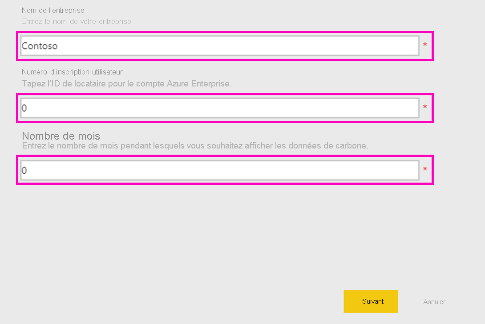
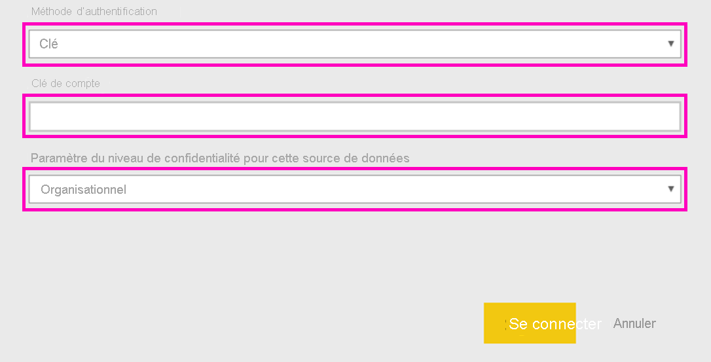

# Connecter Microsoft Sustainability Calculator
Obtenez des informations sur les émissions de carbone de votre infrastructure informatique pour prendre des décisions de calcul plus durables

Microsoft Sustainability Calculator fournit une nouvelle visibilité pour les données relatives aux émissions de carbone associées aux services Azure. Les responsables de la création de rapports concernant la durabilité et de la durabilité elle-même au sein de leur organisation ont désormais la possibilité de quantifier l’impact carbone de chaque abonnement Azure, ainsi que de voir les économies de carbone estimées en exécutant ces charges de travail dans Azure plutôt que dans des centres de développement locaux. Ces données peuvent être utilisées pour la création de rapports de gaz à effet de serre d’étendue 3. L’accès à Microsoft Sustainability Calculator nécessite votre ID de locataire et votre clé d’accès, généralement disponibles via l’administrateur Azure de votre organisation.

Pour utiliser cette application, vous aurez besoin d’informations du portail Azure Enterprise. Les administrateurs système de votre entreprise peuvent vous aider à obtenir ces informations. Lisez ces instructions et obtenez les informations requises avant d’installer l’application. 

Cette version du connecteur prend en charge seulement les inscriptions d’entreprise depuis [https://ea.azure.com](https://ea.azure.com/). Les inscriptions en Chine ne sont pas prises en charge actuellement.

## Comment se connecter
[!INCLUDE [powerbi-service-apps-get-more-apps](../includes/powerbi-service-apps-get-more-apps.md)]

1. Sélectionnez **Microsoft Sustainability Calculator** \> **Obtenir maintenant**.
1. Dans **Installer cette application Power BI ?** , sélectionnez**Installer**.
1. Dans le volet **Applications**, sélectionnez la vignette **Microsoft Sustainability Calculator**.
1. Dans **Démarrer avec votre nouvelle application**, sélectionnez **Se connecter**.

    

1. Entrez le **nom de la société, le numéro d’inscription de l’utilisateur,** et le **nombre de mois \> Connexion.** Consultez les détails sur la [recherche de ces paramètres](#finding-parameters) ci-dessous.

    

1. Pour **Méthode d’authentification**, sélectionnez **Clé**, et pour **Niveau de confidentialité**, sélectionnez **Organisation**.
1. Pour **Clé**, entrez votre **clé d’accès \> Connexion**.

    

1. Le processus d’importation commence automatiquement. Une fois le processus terminé, de nouveaux tableau de bord, rapport et modèle apparaissent dans le **volet de navigation**. Sélectionnez le rapport pour afficher vos données importées.

## Recherche de paramètres

Pour trouver l’**ID d’inscription** et la **clé d’accès** de votre entreprise, collaborez avec votre administrateur Azure pour obtenir les informations nécessaires. Votre administrateur se chargera du nécessaire

1. Connectez-vous au [portail Azure Enterprise](https://ea.azure.com), puis cliquez sur **Gérer** sur le ruban de gauche et obtenez le **numéro d’inscription**, comme indiqué ci-dessous
2. À partir du [portail Azure Enterprise](https://ea.azure.com), cliquez sur **Rapports** puis sur clé d’accès d’API, comme indiqué ci-dessous pour obtenir la clé du compte d’inscription principal

## Utilisation de l’application

Pour mettre à jour les paramètres à tout moment, accédez aux paramètres du **jeu de données** et accédez à l’espace de travail associé à l’application, puis mettez à jour l’ID de locataire, le nom de la société ou les mois de données. Après avoir appliqué vos paramètres, cliquez sur **Actualiser** pour recharger les données avec les nouveaux paramètres appliqués.