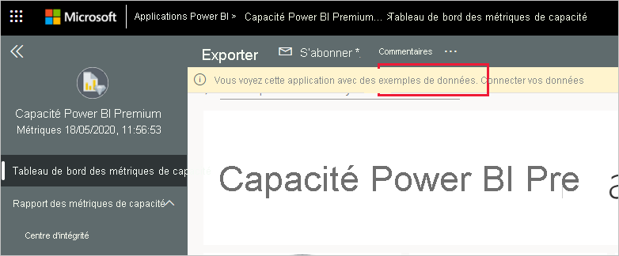
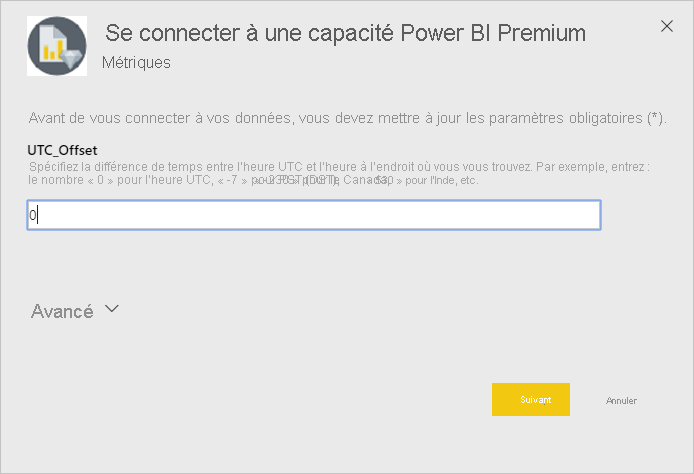
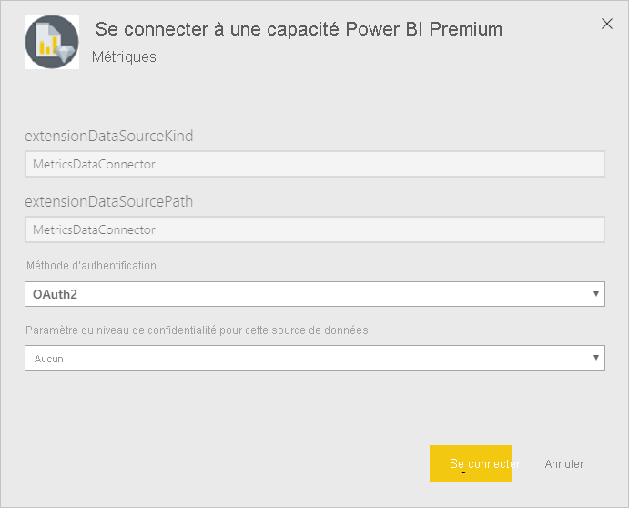
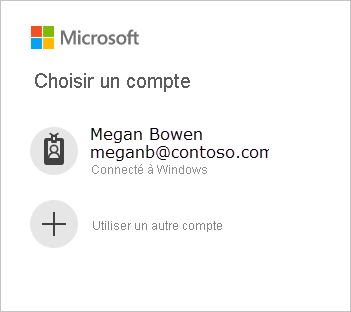
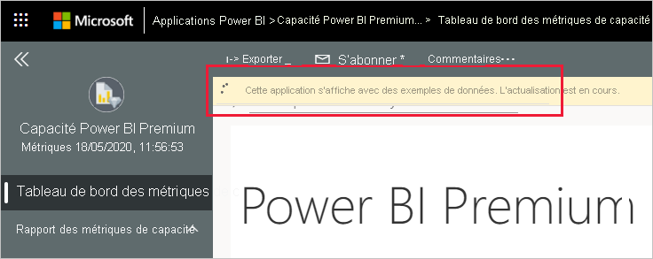
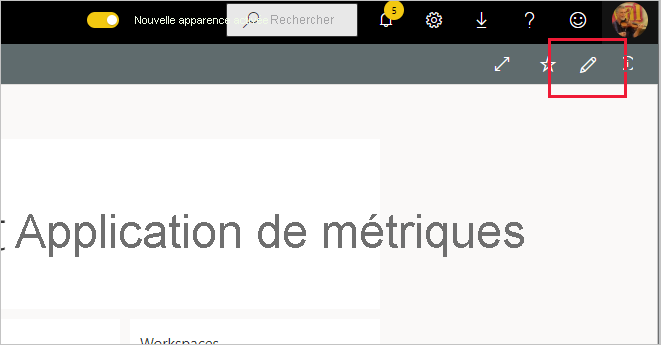

# Se connecter à Métriques de capacité Power BI Premium
La supervision de vos capacités est essentielle pour prendre des décisions avisées sur la meilleure utilisation de vos ressources de capacité Premium. L’application Métriques de capacité Power BI Premium fournit des informations très détaillées sur le fonctionnement de vos capacités.

Cet article vous explique comment installer l’application et comment se connecter aux sources de données. Pour plus d’informations sur le contenu du rapport et sur son utilisation, consultez [Superviser les capacités Premium avec l’application](../service-admin-premium-monitor-capacity.md) et le [billet de blog sur l’application Métriques de capacité Premium](https://powerbi.microsoft.com/blog/premium-capacity-metrics-app-new-health-center-with-kpis-to-explore-relevant-metrics-and-steps-to-mitigate-issues/).

Après avoir installé l’application et établi la connexion aux sources de données, vous pouvez personnaliser le rapport selon vos besoins. Vous pouvez ensuite le distribuer à des collègues au sein de votre organisation.

> [!NOTE]
> L’installation d’applications modèles nécessite des [autorisations](./service-template-apps-install-distribute.md#prerequisites). Si vous ne disposez pas des autorisations suffisantes, contactez l’administrateur de votre locataire.

## Installer l’application

1. Cliquez sur le lien suivant pour accéder à l’application : [Application modèle Métriques de capacité Power BI Premium](https://app.powerbi.com/groups/me/getapps/services/pbi_pcmm.capacity-metrics-dxt)

1. Dans la page AppSource de l’application, sélectionnez [**OBTENIR MAINTENANT**](https://app.powerbi.com/groups/me/getapps/services/pbi_pcmm.capacity-metrics-dxt).

    

1. Sélectionnez **Installer**. 

    

    > [!NOTE]
    > Si vous avez installé l’application précédemment, vous êtes invité à indiquer si vous voulez [remplacer cette installation](./service-template-apps-install-distribute.md#update-a-template-app) ou l’installer dans un nouvel espace de travail.

    Une fois l’application installée, elle apparaît dans votre page Applications.

   

## Se connecter à la source de données

1. Sélectionnez l’icône dans votre page Applications pour ouvrir l’application.

1. Dans l’écran de démarrage, sélectionnez **Explorer**.

   

   L’application s’ouvre et présente des exemples de données.

1. Sélectionnez le lien **Connecter vos données** dans la bannière en haut de la page.

   

1. Dans la boîte de dialogue qui s’affiche, définissez le décalage UTC, c’est-à-dire la différence en heures entre l’heure UTC et l’heure de l’endroit où vous êtes. Cliquez ensuite sur **Next**.
  
   

1. Dans la boîte de dialogue suivante qui apparaît, vous n’avez rien à faire. Sélectionnez simplement **Se connecter**.

   

1. Dans l’écran de connexion Microsoft, connectez-vous à Power BI.

   

   Une fois que vous êtes connecté, le rapport se connecte aux sources de données et est renseigné avec les dernières données disponibles. Pendant ce temps, le moniteur d’activité tourne.

   

   Les données de votre rapport sont actualisées automatiquement une fois par jour, sauf si vous avez désactivé cela lors du processus de connexion. Vous pouvez également [configurer votre propre planification de l’actualisation](./refresh-scheduled-refresh.md) pour mettre à jour les données du rapport comme vous le souhaitez.

## Personnaliser et partager

Pour commencer à personnaliser l’application, cliquez sur l’icône de crayon dans le coin supérieur droit.

 

Pour plus d’informations, consultez [Personnaliser et partager l’application](./service-template-apps-install-distribute.md#customize-and-share-the-app).

## Étapes suivantes
* [Superviser les capacités Premium avec l’application](../admin/service-admin-premium-monitor-capacity.md)
* [Billet de blog sur l’application Métriques de capacité Premium](https://powerbi.microsoft.com/blog/premium-capacity-metrics-app-new-health-center-with-kpis-to-explore-relevant-metrics-and-steps-to-mitigate-issues/)
* [Que sont les applications modèles Power BI ?](./service-template-apps-overview.md)
* [Installer et distribuer des applications modèles dans votre organisation](./service-template-apps-install-distribute.md)
* Vous avez des questions ? [Essayez d’interroger la communauté Power BI](https://community.powerbi.com/)