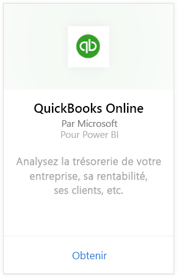
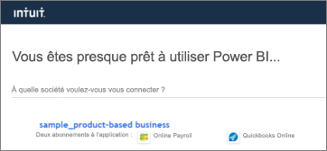
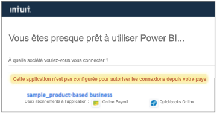

# Se connecter à QuickBooks Online avec Power BI
Quand vous vous connectez à vos données QuickBooks Online à partir de Power BI, vous obtenez immédiatement un tableau de bord et des rapports Power BI contenant des informations sur le flux de trésorerie de votre entreprise, sa rentabilité, ses clients et bien plus encore. Vous pouvez utiliser le tableau de bord et les rapports tels quels ou bien les personnaliser pour mettre en avant les informations qui vous intéressent le plus. Les données sont actualisées automatiquement une fois par jour.

Connectez-vous à [l’application de modèle QuickBooks Online](https://dxt.powerbi.com/getdata/services/quickbooks-online) pour Power BI.

>[!NOTE]
>Pour importer vos données QuickBooks Online dans Power BI, vous devez être administrateur de votre compte QuickBooks Online et vous connecter à l’aide de vos informations d’identification d’administrateur. Vous ne pouvez pas utiliser ce connecteur avec les logiciels QuickBooks Desktop. 

## Comment se connecter

[!INCLUDE [powerbi-service-apps-get-more-apps](../includes/powerbi-service-apps-get-more-apps.md)]

3. Sélectionnez **QuickBooks Online**, puis **Obtenir**.
   
   

4. Dans **Installer cette application Power BI ?** , sélectionnez**Installer**.

    

4. Dans le volet **Applications**, sélectionnez la vignette **QuickBooks**.

   

6. Dans **Démarrer avec votre nouvelle application**, sélectionnez **Se connecter**.

    

4. Sélectionnez **oAuth2** pour la méthode d’authentification, puis **Se connecter**. 
5. Quand vous y êtes invité, entrez vos informations d’identification QuickBooks Online et suivez le processus d’authentification QuickBooks Online. Si vous êtes déjà connecté à QuickBooks Online dans votre navigateur, vous ne serez peut-être pas invité à entrer vos informations d’identification.
   >[!NOTE]
   >Le compte QuickBooks Online nécessite des informations d’identification d’administrateur.
6. Dans l’écran suivant, sélectionnez l’entreprise que vous voulez connecter à Power BI.
   
   

7. Sélectionnez **Autoriser** dans l’écran suivant pour commencer le processus d’importation. Ce processus peut prendre quelques minutes selon la taille des données de votre entreprise. 
   
   
   
8. Une fois que Power BI a importé les données, vous voyez la liste de contenu de votre application QuickBooks : un nouveau tableau de bord, un nouveau rapport et un nouveau jeu de données.
9. Sélectionnez le tableau de bord QuickBooks pour démarrer le processus d’exploration. Il s’agit du tableau de bord créé automatiquement par Power BI pour afficher vos données importées.

    

**Et maintenant ?**

* Essayez de [poser une question dans la zone Q&R](../consumer/end-user-q-and-a.md) en haut du tableau de bord.
* [Modifiez les vignettes](../create-reports/service-dashboard-edit-tile.md) dans le tableau de bord.
* [Sélectionnez une vignette](../consumer/end-user-tiles.md) pour ouvrir le rapport sous-jacent.
* Même si une actualisation quotidienne de votre jeu de données est planifiée, vous pouvez modifier la planification de l’actualisation ou essayer d’actualiser le jeu de données sur demande à l’aide de l’option **Actualiser maintenant**.

## Résolution des problèmes
**« Désolé ! Une erreur s’est produite. »**

Si vous obtenez ce message après avoir sélectionné **Autoriser**:

« Désolé. Une erreur s’est produite. Fermez cette fenêtre, puis réessayez.

Un autre utilisateur de l’entreprise s’est déjà abonné à l’application. Contactez [e-mail de l’administrateur] pour apporter des modifications à cet abonnement. »

... cette erreur signifie qu’un autre administrateur de votre entreprise a déjà connecté vos données d’entreprise à Power BI. Demandez à l’administrateur en question de partager le tableau de bord avec vous. Actuellement, un seul administrateur peut connecter un jeu de données d’entreprise QuickBooks Online à Power BI. Une fois le tableau de bord créé par Power BI, l’administrateur peut le partager avec plusieurs collègues appartenant aux mêmes clients Power BI.

**« Cette application n’est pas configurée pour autoriser les connexions depuis votre pays »**

Actuellement, Power BI prend uniquement en charge les éditions américaines de QuickBooks Online. 

## Étapes suivantes
[Qu’est-ce que Power BI ?](../fundamentals/power-bi-overview.md)

[Concepts de base pour les concepteurs du service Power BI](../fundamentals/service-basic-concepts.md)
