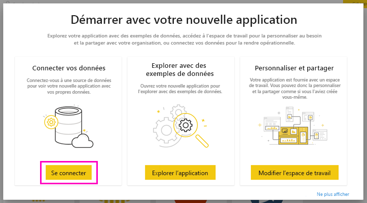
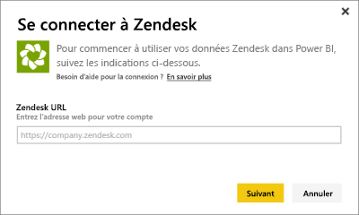
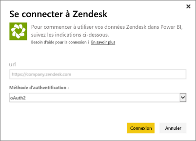
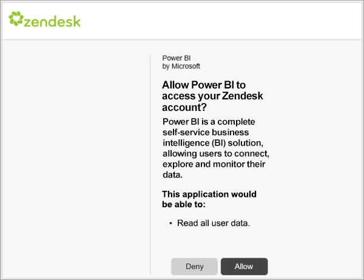
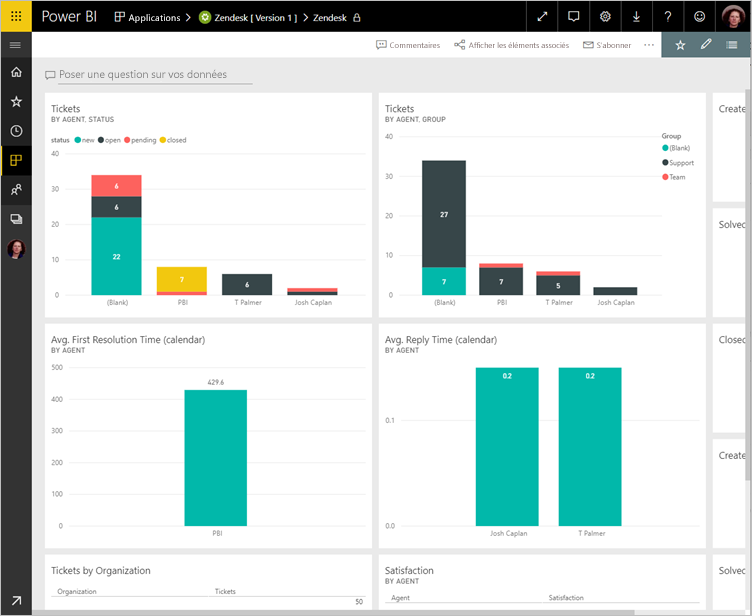
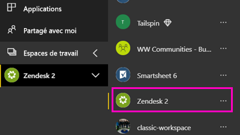

# Se connecter à Zendesk avec Power BI

Cet article vous guide tout au long de l’extraction de vos données à partir de votre compte Zendesk à l’aide d’une application de modèle Power BI. L’application Zendesk propose un tableau de bord Power BI et un ensemble de rapports Power BI qui fournissent des analyses relatives aux volumes de vos tickets et aux performances de vos agents. Les données sont actualisées automatiquement une fois par jour. 

Une fois l’application de modèle installée, vous pouvez personnaliser le tableau de bord et le rapport afin de mettre en évidence les informations qui vous intéressent le plus. Vous pouvez ensuite le distribuer en tant qu’application aux collègues de votre organisation.

Connectez-vous à [l’application de modèle Zendesk](https://app.powerbi.com/getdata/services/zendesk) ou obtenez davantage d’informations sur l’[intégration de Zendesk](https://powerbi.microsoft.com/integrations/zendesk) à Power BI.

Une fois l’application de modèle installée, vous pouvez modifier le tableau de bord et le rapport. Vous pouvez ensuite le distribuer en tant qu’application aux collègues de votre organisation.

>[!NOTE]
>Vous avez besoin d’un compte d’administrateur Zendesk pour vous connecter. Vous trouverez plus de détails sur la [configuration requise](#system-requirements) à la suite.

>[!WARNING]
>Avant le 15 octobre 2019, l’API Support Search de Zendesk pouvait recevoir 200 000 résultats en tout par le biais de la pagination de requêtes volumineuses. Pour aligner l’utilisation de la recherche sur l’étendue prévue, Zendesk limite désormais le nombre total de résultats retournés à 1 000, avec au maximum 100 résultats par page. Toutefois, le connecteur Zendesk actuel pour Power BI peut toujours créer des appels d’API qui dépassent ces nouvelles limites, d’où des résultats éventuellement trompeurs.

## Comment se connecter

[!INCLUDE [powerbi-service-apps-get-more-apps](../includes/powerbi-service-apps-get-more-apps.md)]

3. Sélectionnez **Zendesk** \> **Obtenir maintenant**.
4. Dans **Installer cette application Power BI ?** , sélectionnez**Installer**.
4. Dans le volet **Applications**, sélectionnez la vignette **Zendesk**.

    

6. Dans **Démarrer avec votre nouvelle application**, sélectionnez **Se connecter**.

    

4. Indiquez l’URL associée à votre compte. L’URL se présente sous la forme **https://company.zendesk.com** . Consultez les détails sur la [recherche de ces paramètres](#finding-parameters) ci-dessous.
   
   

5. Quand vous y êtes invité, entrez vos informations d’identification Zendesk.  Sélectionnez **oAuth2** comme mécanisme d’authentification et cliquez sur **Se connecter**. Suivez le flux d’authentification Zendesk. (Si vous êtes déjà connecté à Zendesk dans votre navigateur, vous ne serez peut-être pas invité à entrer vos informations d’identification.)
   
   > [!NOTE]
   > Cette application de modèle requiert que vous vous connectiez avec un compte d’administrateur Zendesk. 
   > 
   
   
6. Cliquez sur **Autoriser** pour autoriser Power BI à accéder à vos données Zendesk.
   
   
7. Cliquez sur **Se connecter** pour commencer le processus d’importation. 
8. Une fois que Power BI a importé les données, vous voyez la liste de contenu de votre application Zendesk : un nouveau tableau de bord, un nouveau rapport et un nouveau jeu de données.
9. Sélectionnez le tableau de bord pour démarrer le processus d’exploration.

    
   
## Modifier et distribuer votre application

Vous avez installé l’application de modèle Zendesk. Cela signifie que vous avez également créé l’espace de travail d’application Zendesk. Dans l’espace de travail, vous pouvez modifier le rapport et le tableau de bord, puis distribuez-le en tant qu’*application* aux collègues de votre organisation. 

1. Pour afficher tout le contenu de votre nouvel espace de travail Zendesk, dans le volet de navigation, sélectionnez **Espaces de travail** > **Zendesk**. 

    

    Cette vue est la liste de contenu de l’espace de travail. Dans l’angle supérieur droit, vous voyez **Mettre à jour l’application**. Lorsque vous êtes prêt à distribuer votre application à vos collègues, c’est là que vous allez commencer. 

    

2. Sélectionnez **Rapports** et **Jeux de données** pour afficher les autres éléments dans l’espace de travail.

    En savoir plus sur [la distribution d’applications](../collaborate-share/service-create-distribute-apps.md) à vos collègues.

## Configuration requise
Vous devez disposer d’un compte d’administrateur Zendesk pour accéder à l’application de modèle Zendesk. Si vous êtes un agent ou un utilisateur final et que vous souhaitez afficher vos données Zendesk, ajoutez une suggestion et examinez le connecteur Zendesk dans [Power BI Desktop](desktop-connect-to-data.md).

## Recherche de paramètres
Votre URL Zendesk est la même que celle que vous utilisez pour vous connecter à votre compte Zendesk. Si vous n’êtes pas certain de votre URL Zendesk, consultez [la page d’aide](https://www.zendesk.com/login/) expliquant comment se connecter à Zendesk.

## Résolution des problèmes
Si vous rencontrez des problèmes de connexion, vérifiez votre URL Zendesk et confirmez que vous utilisez bien un compte d’administrateur Zendesk.

## Étapes suivantes

* [Créer les nouveaux espaces de travail dans Power BI](../collaborate-share/service-create-the-new-workspaces.md)
* [Installer et utiliser des applications dans Power BI](../consumer/end-user-apps.md)
* [Se connecter aux applications Power BI pour des services externes](service-connect-to-services.md)
* Vous avez des questions ? [Essayez d’interroger la communauté Power BI](https://community.powerbi.com/)
