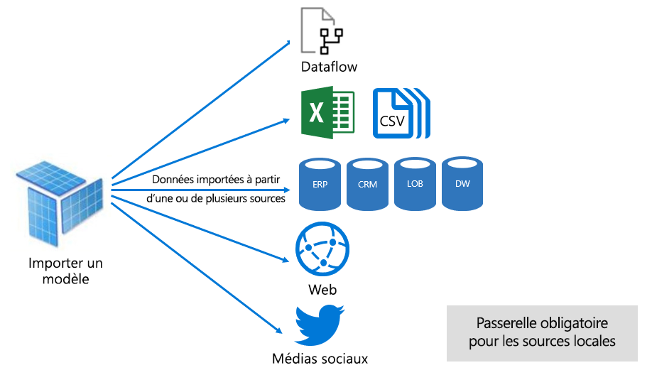
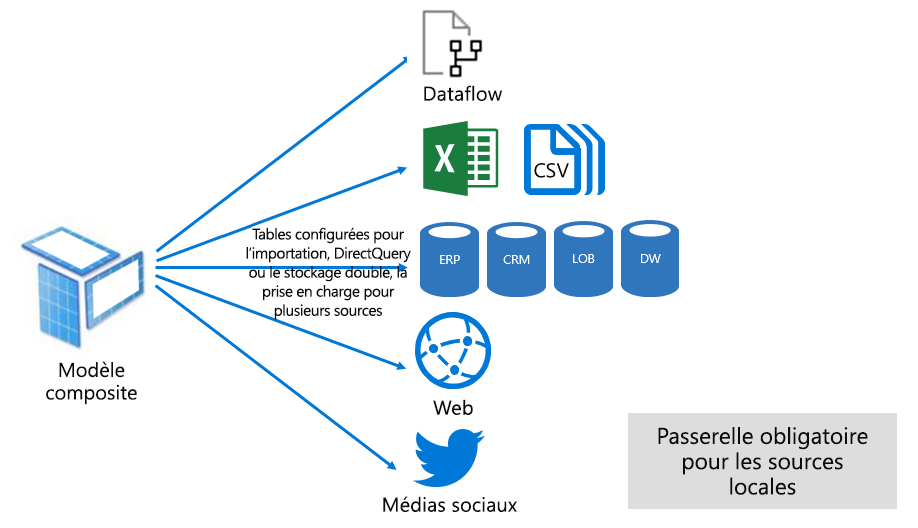

# Modes des jeux de données dans le service Power BI

Cet article fournit une explication technique des modes de jeux de données Power BI. Il s'applique aux jeux de données qui représentent une connexion continue à un modèle de services d'analyse hébergé à l'extérieur, ainsi qu'aux modèles développés dans Power BI Desktop. L'article met l'accent sur la fonction de chaque mode et sur les impacts possibles sur les ressources de capacité de Power BI.

Les trois modes de jeu de données sont :

- [Import](#import-mode)
- [DirectQuery](#directquery-mode)
- [Composite](#composite-mode)

## Mode Importation

_Le mode Import_ est le mode le plus couramment utilisé pour développer des modèles. Ce mode offre des performances extrêmement rapides grâce à l'interrogation en mémoire. Il offre également une flexibilité de conception aux modélisateurs et la prise en charge de fonctions de service Power BI spécifiques (Q&A, Quick Insights, etc.). En raison de ces atouts, c'est le mode par défaut lors de la création d'une nouvelle solution Power BI Desktop.

Il est important de comprendre que les données importées sont toujours stockées sur le disque. Lorsqu'elles sont interrogées ou actualisées, les données doivent être entièrement chargées dans la mémoire de la capacité Power BI. Une fois en mémoire, les modèles d'importation permettent d’obtenir des résultats de requête très rapides. Il est également important de comprendre qu'il n'existe aucun concept d'importation partielle d'un modèle en mémoire.

Une fois actualisées, les données sont compressées et optimisées, puis stockées sur disque par le moteur de stockage VertiPaq. Une fois les données sur le disque chargées en mémoire, il est possible d’obtenir une compression 10x. On peut donc raisonnablement compresser 10 Go de données source à une taille d'environ 1 Go. La taille de stockage sur disque peut être réduite de 20 % par rapport à la taille compressée. (La différence de taille peut être déterminée en comparant la taille du fichier Power BI Desktop avec l'utilisation de la mémoire du fichier dans le Gestionnaire des tâches.)

Une flexibilité de conception peut être obtenue de trois façons. Les modélisateurs de données peuvent :

- Intégrer les données en mettant en cache les données provenant de flux de données et de sources de données externes, quel que soit le type ou le format de la source de données
- Exploiter l'ensemble complet des fonctions [Power Query Formula Language](/powerquery-m/) (appelées de manière informelle M) lors de la création de requêtes de préparation de données
- Exploiter l'ensemble des fonctions [Data Analysis Expressions (DAX)](/dax/) pour améliorer le modèle avec la logique métier. Les colonnes calculées, les tables calculées et les mesures sont prises en charge.

Comme le montre l'image suivante, un modèle Import peut intégrer des données provenant d'un nombre quelconque de types de sources de données prises en charge.

Toutefois, si les modèles Import présentent des avantages incontestables, ils comportent aussi quelques inconvénients :

- Le modèle entier doit être chargé en mémoire avant que Power BI puisse l’interroger, ce qui peut exercer une pression sur les ressources de capacité disponibles, en particulier lorsque le nombre et la taille des modèles Import augmentent
- La version des données du modèle dépend de la dernière actualisation, et les modèles Import doivent donc être actualisés, généralement de manière planifiée
- Une actualisation complète supprimera toutes les données de toutes les tables et les rechargera à partir de la source de données. Cette opération peut s'avérer coûteuse en termes de temps et de ressources pour le service Power BI et la ou les sources de données.

    > [!NOTE]
    > Power BI peut effectuer une actualisation incrémentielle pour éviter de tronquer et de recharger des tables entières. Toutefois, cette fonctionnalité n'est prise en charge que lorsque le jeu de données est hébergé dans des espaces de travail sur des capacités Premium. Pour plus d'informations, consultez l'article [Actualisation incrémentielle dans Power BI Premium](../admin/service-premium-incremental-refresh.md).

Du point de vue des ressources du service Power BI, les modèles Import nécessitent la configuration suivante :

- Mémoire suffisante pour charger le modèle lorsqu'il est interrogé ou actualisé
- Ressources de traitement et ressources mémoire supplémentaires pour actualiser les données

## Mode DirectQuery

Le mode _DirectQuery_ est une alternative au mode Import. Les modèles développés en mode DirectQuery n'importent aucune donnée. Au lieu de cela, ils se composent de métadonnées définissant la structure du modèle. Lorsque le modèle est interrogé, des requêtes natives sont utilisées pour récupérer les données de la source de données sous-jacente.

Il existe deux raisons principales au développement d'un modèle DirectQuery :

- Lorsque les volumes de données sont trop importants pour être chargés dans un modèle ou actualisés (même si des [méthodes de réduction des données](../guidance/import-modeling-data-reduction.md) sont appliquées)
- Lorsque les rapports et les tableaux de bord doivent fournir des données « en quasi temps réel », au-delà de ce qui peut être réalisé dans les limites de l’actualisation planifiée. (Les limites de l’actualisation planifiée sont de huit fois par jour pour une capacité partagée, et de 48 fois par jour pour une capacité Premium.)

Les modèles DirectQuery présentent plusieurs avantages :

- Les limites de taille du modèle Import ne s'appliquent pas
- Les modèles n'ont pas besoin d'être actualisés
- Les utilisateurs de rapports verront les données les plus récentes lorsqu'ils interagissent avec segments et les filtres de rapports. De plus, les utilisateurs de rapports peuvent actualiser l'ensemble du rapport pour récupérer les données actuelles.
- Des rapports en temps réel peuvent être développés en utilisant la fonction [Actualisation automatique de la page](../create-reports/desktop-automatic-page-refresh.md)
- Les vignettes du tableau de bord, lorsqu'elles sont basées sur des modèles DirectQuery, peuvent être mises à jour automatiquement toutes les 15 minutes

Cependant, les modèles DirectQuery présentent certaines limitations :

- Les formules DAX sont limitées à l'utilisation de fonctions qui peuvent être transposées à des requêtes natives comprises par la source de données. Les tables calculées ne sont pas prises en charge.
- Les fonctionnalités « Questions et réponses » et « Quick Insights » ne sont pas prises en charge

Du point de vue des ressources du service Power BI, les modèles DirectQuery nécessitent la configuration suivante :

- Mémoire minimale pour charger le modèle (métadonnées uniquement) lorsqu'il est interrogé
- Parfois, le service Power BI doit utiliser des ressources processeur importantes pour générer et traiter les requêtes envoyées à la source de données. Dans ce cas, cela peut avoir un impact sur le débit, en particulier lorsque des utilisateurs simultanés interrogent le modèle.

Pour plus d’informations, consultez [Utiliser Direct Query dans Power BI Desktop](desktop-use-directquery.md).

## Mode Composite

Le mode _Composite_ peut combiner les modes Import et DirectQuery, ou intégrer plusieurs sources de données DirectQuery. Les modèles développés en mode Composite prennent en charge la configuration du mode de stockage pour chaque table de modèles. Ce mode prend également en charge les tables calculées (définies avec DAX).

Le mode de stockage de table peut être configuré sur Import, DirectQuery ou Double. Une table configurée en mode Double est à la fois Import et DirectQuery, et ce paramètre permet au service Power BI de déterminer le mode le plus efficace pour chaque requête.

Les modèles Composite s'efforcent d'offrir le meilleur des modes Import et DirectQuery. Correctement configurés, ils peuvent combiner les requêtes hautes performances de modèles en mémoire avec la capacité de récupérer des données en quasi temps réel à partir de sources de données.

Les modélisateurs de données qui développent des modèles Composite peuvent configurer les tables de types de dimensions en mode Import ou Double, et les tables de types de faits en mode DirectQuery. Pour plus d'informations sur les rôles des tables de modèles, consultez [Comprendre le schéma en étoile et son importance pour Power BI](../guidance/star-schema.md).

Par exemple, considérons un modèle avec une table de types de dimensions **Produit** en mode Double, et une table de types de faits **Ventes** en mode DirectQuery. La table **Produit** pourrait être interrogée efficacement et rapidement à partir de la mémoire pour générer un segment de rapport. La table **Sales** peut également être interrogée en mode DirectQuery avec la table **Product** correspondante. Cette dernière requête pourrait permettre la génération d'une seule requête SQL native efficace qui relie les tables **Produit** et **Ventes** et filtre les valeurs du segment.

En général, pour les modèles Composite, les avantages et les inconvénients associés aux modes Import et DirectQuery varient selon la configuration de chaque table.

Pour plus d’informations, consultez [Utiliser des modèles composites dans Power BI Desktop](../transform-model/desktop-composite-models.md).

## Étapes suivantes

- [Jeux de données dans le service Power BI](service-dataset-modes-understand.md)
- [Mode de stockage dans Power BI Desktop](../transform-model/desktop-storage-mode.md)
- [Utilisation de DirectQuery dans Power BI](desktop-directquery-about.md)
- [Utiliser des modèles composites dans Power BI Desktop](../transform-model/desktop-composite-models.md)
- D’autres questions ? [Essayez d’interroger la communauté Power BI](https://community.powerbi.com/)
