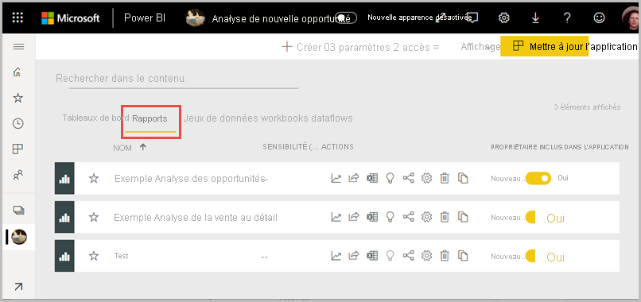
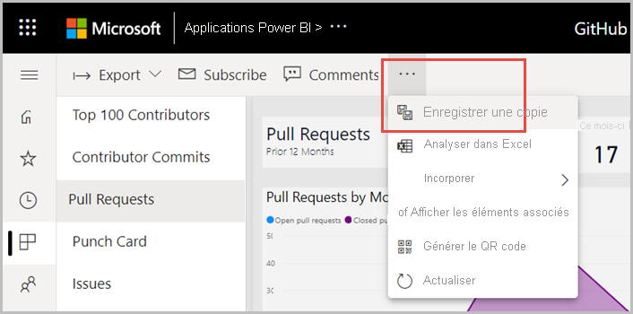
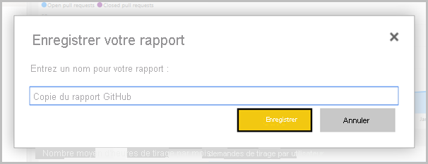
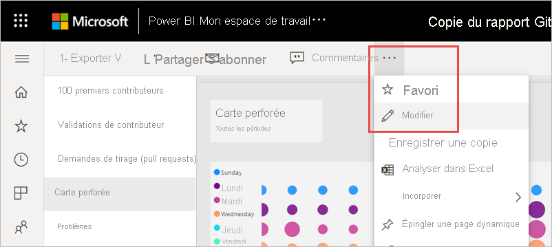
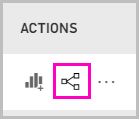
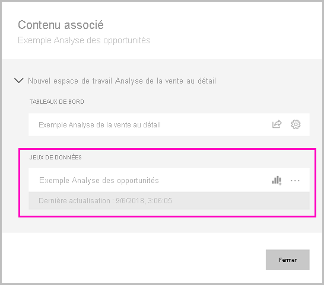
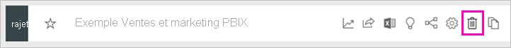

# Copier des rapports à partir d’autres espaces de travail

Quand vous trouvez un rapport qui vous intéresse dans un espace de travail ou une application, vous pouvez en faire une copie et l’enregistrer dans un autre espace de travail. Vous pouvez ensuite modifier votre copie du rapport, en ajoutant ou supprimant des visuels et d’autres éléments. Vous n’avez pas à vous soucier de la création du modèle de données. Il est déjà créé pour vous. En outre, il est beaucoup plus facile de modifier un rapport existant que de démarrer à partir de zéro. Cependant, quand vous créez une application à partir de votre espace de travail, vous ne pouvez pas toujours publier la copie du rapport dans l’application. Pour plus d’informations, consultez [Considérations et limitations dans l’article « Utiliser des jeux de données dans des espaces de travail »](service-datasets-across-workspaces.md#considerations-and-limitations).

> [!NOTE]
> Pour effectuer une copie, vous avez besoin d’une licence Pro, même si le rapport d’origine se trouve dans un espace de travail relevant d’une capacité Premium.

## Enregistrer la copie d’un rapport dans un espace de travail

1. Dans un espace de travail, accédez au mode Liste Rapports.

    

1. Sous **Actions**, sélectionnez **Enregistrer une copie**.

    

    Vous voyez uniquement l’icône **Enregistrer une copie** si le rapport se trouve dans un espace de travail de nouvelle expérience et que vous avez de l’[autorisation de génération](service-datasets-build-permissions.md). Même si vous avez accès à l’espace de travail, vous devez disposer de l’autorisation de génération pour le jeu de données.

3. Dans **Enregistrer une copie de ce rapport**, nommez le rapport, puis sélectionnez l’espace de travail de destination.

    

    Vous pouvez enregistrer le rapport dans l’espace de travail actuel ou un autre dans le service Power BI. Vous voyez uniquement les espaces de travail de nouvelle expérience, desquels vous êtes membre. 
  
4. Sélectionnez **Enregistrer**.

    Power BI crée automatiquement une copie du rapport et une entrée dans la liste des jeux de données si le rapport est basé sur un jeu de données se trouvant hors de l’espace de travail. L’icône de ce jeu de données est différente de l’icône des jeux de données dans l’espace de travail : 
    
    De cette manière, les membres de l’espace de travail peuvent indiquer les rapports et tableaux de bord qui utilisent des jeux de données se trouvant hors de l’espace de travail. L’entrée affiche des informations sur le jeu de données et quelques actions de sélection.

    

    Pour plus d’informations sur le rapport et le jeu de données associé, consultez [Votre copie du rapport](#your-copy-of-the-report) dans cet article.

## Copier un rapport dans une application

1. Dans une application, ouvrez le rapport que vous souhaitez copier.
2. Dans la barre de menus, sélectionnez **Plus d’options** ( **…** ) > **Enregistrer une copie**.

    

    L’option **Enregistrer une copie** n’apparaît que si le rapport se trouve dans un espace de travail nouvelle expérience et que vous disposez de [l’autorisation de génération](service-datasets-build-permissions.md).

3. Donnez un nom à votre rapport > **Enregistrer**.

    

    Votre copie est automatiquement enregistrée dans votre espace de travail personnel.

4. Sélectionnez **Accéder au rapport** pour ouvrir votre copie.

## Votre copie du rapport

Lorsque vous enregistrez une copie du rapport, vous créez une connexion active au jeu de données et vous pouvez ouvrir l’expérience de création de rapports avec le jeu de données complet disponible. 

Vous n’avez pas effectué de copie du jeu de données. Le jeu de données se trouve toujours dans son emplacement d’origine. Vous pouvez utiliser toutes les tables et mesures du jeu de données dans votre propre rapport. Comme les restrictions de sécurité au niveau des lignes (SNL) sur le jeu de données sont appliquées, vous voyez uniquement les données que vous êtes autorisé à afficher en fonction de votre rôle SNL.

## Afficher les jeux de données associés

Si vous avez dans un espace de travail un rapport basé sur un jeu de données d’un autre espace de travail, vous voudrez peut-être en savoir plus sur le jeu de données sur lequel il est basé.

1. En mode Liste des rapports, sélectionnez **Afficher les éléments associés**.

    

1. La boîte de dialogue **Contenu associé** affiche tous les éléments associés. Dans cette liste, le jeu de données ressemble à n’importe quel autre. Vous ne pouvez pas savoir qu’il se trouve dans un autre espace de travail. Ce problème est connu.
 
    

## Supprimer un rapport et son jeu de données partagé

Vous pouvez décider que vous ne voulez plus du rapport et de son jeu de données partagé associé dans l’espace de travail.

1. Supprimez le rapport. Dans la liste des rapports de l’espace de travail, sélectionnez l’icône **Supprimer**.

    

2. Dans la liste des jeux de données, vous voyez que les jeux de données partagés n’ont pas d’icône **Supprimer**. Actualisez la page, ou accédez à une autre page et revenez à la liste. Le jeu de données doit avoir disparu. Si ce n’est pas le cas, cochez **Afficher les éléments associés**. Il peut être lié à une autre table de votre espace de travail.

    

    > [!NOTE]
    > Supprimer le jeu de données partagé dans cet espace de travail ne supprime pas le jeu de données. Cette opération supprime simplement la référence à celui-ci.

## Étapes suivantes

- [Utiliser des jeux de données entre des espaces de travail](service-datasets-across-workspaces.md)
- Vous avez des questions ? [Essayez d’interroger la communauté Power BI](https://community.powerbi.com/)
