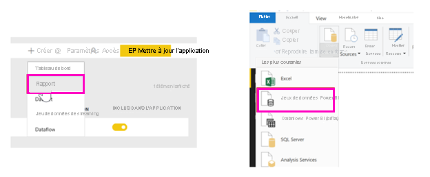
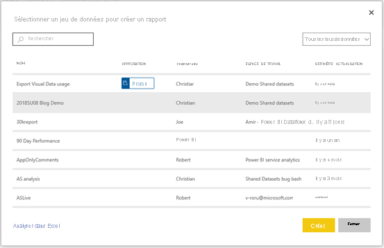
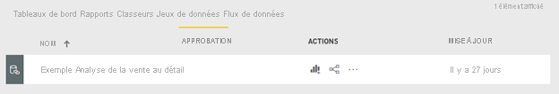

# Créer des rapports basés sur des jeux de données à partir de différents espaces de travail

Découvrez comment vous pouvez créer des rapports dans vos propres espaces de travail basés sur des jeux de données se trouvant dans d’autres espaces de travail. Pour générer un rapport basé sur un jeu de données existant, vous pouvez commencer à partir de Power BI Desktop ou du service Power BI, dans votre espace Mon espace de travail ou dans une [nouvelle expérience d’espace de travail](../collaborate-share/service-create-the-new-workspaces.md).

- Dans le service Power BI : **Obtenir les données** > **Jeux de données publiés**.
- Dans Power BI Desktop : **Obtenir les données** > **Jeux de données Power BI**.

    
   
Dans les deux cas, l’expérience de découverte de jeu de données commence dans cette boîte de dialogue, **Sélectionner un jeu de données pour créer un rapport**. Vous voyez tous les jeux de données auxquels vous avez accès, où qu’ils se trouvent :

Vous notez que le premier est étiqueté **Promu**. Nous le verrons dans [Rechercher un jeu de données approuvé](#find-an-endorsed-dataset), plus loin dans cet article.

Les jeux de données que vous voyez dans cette liste répondent à au moins l’une des conditions suivantes :

- Le jeu de données se trouve dans l’un des espaces de travail de nouvelle expérience d’espace de travail, et vous êtes membre de cet espace de travail. Consultez [Considérations et limitations](service-datasets-across-workspaces.md#considerations-and-limitations).
- Vous disposez de l’autorisation de génération pour le jeu de données, lequel se trouve dans un espace de travail de nouvelle expérience d’espace de travail.
- Le jeu de données se trouve dans votre espace Mon espace de travail.

> [!NOTE]
> Si vous êtes un utilisateur gratuit, vous voyez uniquement les jeux de données de votre espace Mon espace de travail, ou les jeux de données pour lesquels vous disposez d’une autorisation de génération et qui se trouvent dans des espaces de travail de capacité Premium.

Quand vous cliquez sur **Créer** , vous créez une connexion active au jeu de données et l’expérience de création de rapports s’ouvre avec le jeu de données complet disponible. Vous n’avez pas effectué de copie du jeu de données. Le jeu de données se trouve toujours dans son emplacement d’origine. Vous pouvez utiliser toutes les tables et mesures du jeu de données pour générer vos propres rapports. Comme les restrictions de sécurité au niveau des lignes (SNL) sur le jeu de données sont appliquées, vous voyez uniquement les données que vous êtes autorisé à afficher en fonction de votre rôle SNL.

Vous pouvez enregistrer le rapport dans l’espace de travail actuel dans le service Power BI ou publier le rapport à un espace de travail à partir de Power BI Desktop. Power BI crée automatiquement une entrée dans la liste des jeux de données si le rapport est basé sur un jeu de données se trouvant hors de l’espace de travail. L’icône de ce jeu de données est différente de l’icône des jeux de données dans l’espace de travail : 

De cette manière, les membres de l’espace de travail peuvent indiquer les rapports et tableaux de bord qui utilisent des jeux de données se trouvant hors de l’espace de travail. L’entrée affiche des informations sur le jeu de données et quelques actions de sélection.

## Rechercher un jeu de données approuvé

Il existe deux types de jeux de données approuvés différents. Les propriétaires de jeux de données peuvent *promouvoir* un jeu de données qu’ils vous recommandent. De même, l’administrateur Power BI peut confier à des experts au sein de votre organisation la mission de *certifier* les jeux de données que tout le monde peut utiliser. Les jeux de données aussi bien promus que certifiés affichent des *badges* que vous voyez à la fois lors de la recherche d’un jeu de données et dans la liste des jeux de données d’un espace de travail. Le nom de la personne qui a certifié un jeu de données s’affiche dans une info-bulle pendant l’expérience de découverte de jeu de données. Placez le curseur sur l’étiquette **Certifié** pour le voir.

- Dans le service Power BI : **Obtenir les données** > **Jeux de données publiés**.
- Dans Power BI Desktop : **Obtenir les données** > **Jeux de données Power BI**.

    Dans la boîte de dialogue **Sélectionner un jeu de données** , les jeux de données approuvés s’affichent en haut de la liste par défaut. 

    

## Étapes suivantes

- [Utiliser des jeux de données entre des espaces de travail](service-datasets-across-workspaces.md)
- Vous avez des questions ? [Essayez d’interroger la communauté Power BI](https://community.powerbi.com/)
