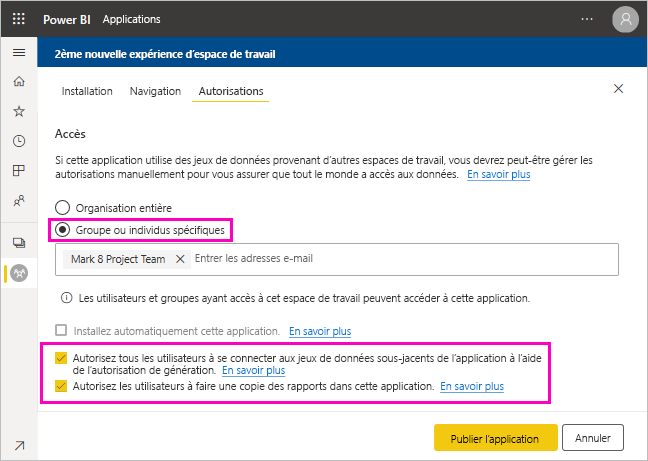
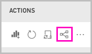
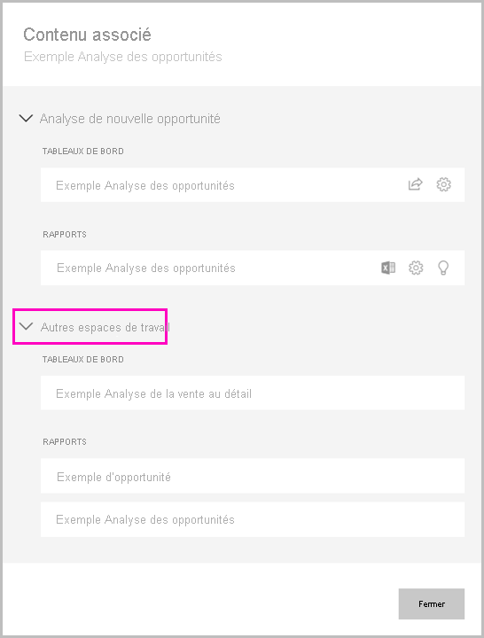

# Partager un jeu de données

En tant que créateur de *modèles de données* dans Power BI Desktop, vous créez des *jeux de données* que vous pouvez distribuer dans le service Power BI. D'autres créateurs de rapport peuvent ensuite utiliser vos jeux de données comme base pour leurs propres rapports. Dans cet article, vous découvrirez comment partager vos jeux de données. Pour savoir comment donner et supprimer l'accès à vos jeux de données partagés, lisez la section [Autorisation de génération](service-datasets-build-permissions.md).

## Procédure à suivre pour partager votre jeu de données

1. Vous commencez par créer un fichier .pbix avec un modèle de données dans Power BI Desktop. Si vous planifiez de proposer ce jeu de données pour que d’autres personnes génèrent des rapports, vous ne concevez même pas un rapport dans le fichier .pbix.

    Une bonne pratique est d’enregistrer le fichier .pbix dans un groupe Microsoft 365.

1. Publiez le fichier .pbix dans un [espace de travail de nouvelle expérience](../collaborate-share/service-create-the-new-workspaces.md) dans le service Power BI.
    
    Les autres membres de cet espace de travail peuvent déjà créer des rapports dans d’autres espaces de travail basés sur ce jeu de données. Utilisez l’option Gérer les autorisations sur le jeu de données dans la liste du contenu de l’espace de travail pour accorder à d’autres utilisateurs l’accès au jeu de données. 

1. Vous pouvez également [publier une application](../collaborate-share/service-create-distribute-apps.md) à partir de cet espace de travail. Dans ce cas, dans la page **Autorisations**, vous spécifiez qui dispose d’autorisations et ce qu’ils peuvent faire.

    > [!NOTE]
    > Si vous sélectionnez **Organisation entière**, personne dans l’organisation ne disposera de l’autorisation de génération. Ce problème est déjà connu. Au lieu de cela, spécifiez des adresses e-mail dans **Individus ou groupes spécifiques**.  Si vous voulez que l’ensemble de votre organisation dispose de l’autorisation de génération, spécifiez un alias d’e-mail pour toute l’organisation.

    

1. Sélectionnez **Publier l’application**, ou **Mettre à jour l’application** si elle est déjà publiée.

## Effectuer le suivi de l’utilisation de votre jeu de données

Quand vous avez un jeu de données partagé dans votre espace de travail, vous devrez peut-être savoir sur quels rapports d’autres espaces de travail il repose.

1. En mode Liste de jeux de données, sélectionnez **Afficher les éléments associés**.

    

1. La boîte de dialogue **Contenu associé** affiche tous les éléments associés. Dans cette liste, vous voyez les éléments associés dans cet espace de travail et dans d’**autres espaces de travail**.
 
    

## Considérations et limitations
Voici quelques éléments à prendre en compte lors du partage de jeux de données :

* Quand vous partagez un jeu de données en gérant des autorisations, en partageant des rapports ou des tableaux de bord, ou en publiant une application, vous accordez l’accès à l’ensemble du jeu de données, sauf si [la sécurité au niveau des lignes (RLS)](../admin/service-admin-rls.md) limite leur accès. Les auteurs de rapports peuvent utiliser des fonctionnalités qui personnalisent les expériences utilisateur lors de l’affichage ou de l’interaction avec les rapports, par exemple le masquage de colonnes ou la limitation des actions sur les visuels. Ces expériences utilisateur personnalisées ne limitent pas les données auxquelles les utilisateurs peuvent accéder dans le jeu de données. Utilisez la [sécurité au niveau des lignes (RLS)](../admin/service-admin-rls.md) dans le jeu de données pour que les informations d’identification de chaque personne déterminent les données auxquelles elle peut accéder.

## Étapes suivantes

- [Utiliser des jeux de données entre des espaces de travail](service-datasets-across-workspaces.md)
- Vous avez des questions ? [Essayez d’interroger la communauté Power BI](https://community.powerbi.com/)
