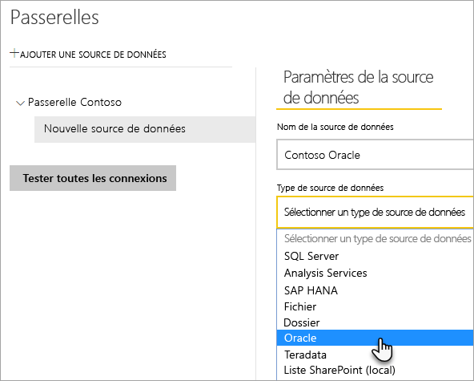
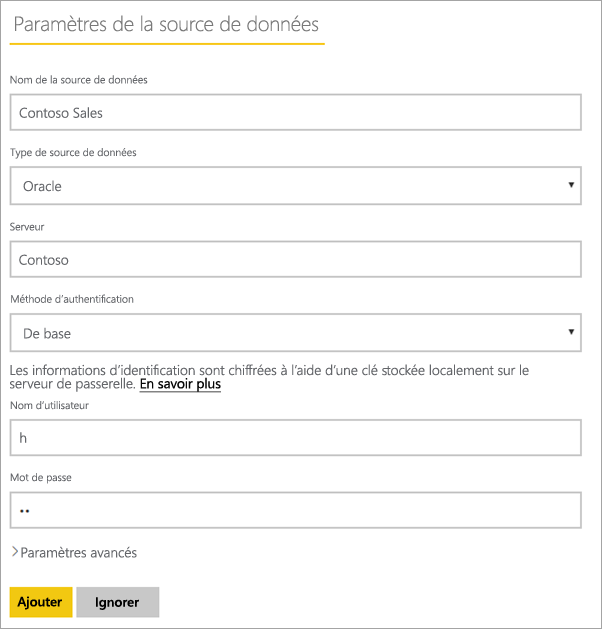
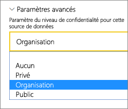
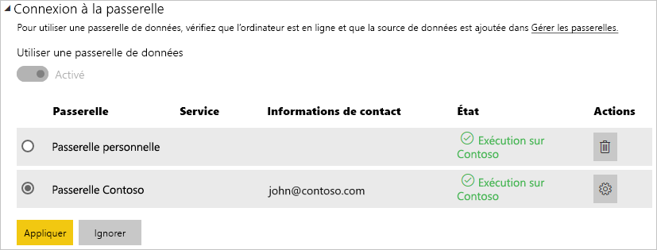

# Gérer votre source de données - Oracle

[!INCLUDE [gateway-rewrite](../includes/gateway-rewrite.md)]

Une fois que vous avez [installé la passerelle de données locale](/data-integration/gateway/service-gateway-install), vous devez [ajouter des sources de données](service-gateway-data-sources.md#add-a-data-source) qui peuvent être utilisées avec la passerelle. Cet article examine comment utiliser des passerelles et des sources de données Oracle pour l’actualisation planifiée ou pour DirectQuery.

## Se connecter à une base de données Oracle
Pour se connecter à une base de données Oracle avec la passerelle de données locale, le logiciel client Oracle approprié doit être installé sur l’ordinateur exécutant la passerelle. Le logiciel client Oracle que vous utilisez dépend de la version serveur d’Oracle, mais il correspond toujours à la passerelle 64 bits.

Versions d’Oracle prises en charge : 
- Oracle Server 9 et ultérieur
- Logiciel ODAC (Oracle Data Access Client) 11.2 et ultérieur

## Installer le client Oracle
- [Téléchargez et installez le client Oracle 64 bits](https://www.oracle.com/database/technologies/odac-downloads.html).

> [!NOTE]
> Choisissez une version d’ODAC compatible avec votre serveur Oracle. Par exemple, ODAC 12.x ne prend pas toujours en charge Oracle Server version 9.
> Choisissez le programme d’installation Windows du client Oracle.
> Pendant l’installation du client Oracle, veillez à activer *Configurer ASP.NET sur les fournisseurs ODP.NET et/ou Oracle pour l’ensemble de l’ordinateur* en cochant la case correspondante dans l’Assistant Installation. Dans certaines versions de l’Assistant du client Oracle, elle est cochée par défaut, mais ce n’est pas le cas de toutes. Il faut qu’elle soit cochée pour que Power BI puisse se connecter à votre base de données Oracle.
 
Une fois le client installé et ODAC configuré correctement, nous vous recommandons d’utiliser PowerBI Desktop ou un autre client test pour vérifier que l’installation et la configuration sont correctes sur la passerelle.

## Ajouter une source de données

Pour plus d’informations sur la façon d’ajouter une source de données, voir [Ajouter une source de données](service-gateway-data-sources.md#add-a-data-source). Sous **Type de source de données**, sélectionnez **Oracle**.

Après avoir sélectionné le type de source de données Oracle, renseignez les informations relatives à la source de données, notamment le **serveur** et la **base de données**. 

Sous **Méthode d’authentification**, vous pouvez choisir **Windows** ou **De base**. Choisissez **De base** si vous envisagez d’utiliser un compte créé dans Oracle plutôt que l’authentification Windows. Entrez les informations d’identification à utiliser pour cette source de données.

> [!NOTE]
> Toutes les requêtes à la source de données sont exécutées à l’aide de ces informations d’identification. Pour plus d’informations sur la façon dont les informations d’identification sont stockées, voir [Stocker des informations d’identification chiffrées dans le cloud](service-gateway-data-sources.md#store-encrypted-credentials-in-the-cloud).

Une fois que vous avez renseigné toutes les valeurs,sélectionnez **Ajouter**. Vous pouvez désormais utiliser cette source de données pour l’actualisation planifiée ou DirectQuery sur un serveur Oracle local. L’indication *Connexion réussie* apparaît une fois la connexion établie.

### Paramètres avancés

Vous pouvez aussi configurer le niveau de confidentialité de votre source de données. Ce paramètre contrôle la façon dont les données peuvent être combinées. Il concerne uniquement l’actualisation planifiée. Le paramètre de niveau de confidentialité ne s’applique pas à DirectQuery. Pour plus d’informations sur les niveaux de confidentialité de votre source de données, consultez [Niveaux de confidentialité (Power Query)](https://support.office.com/article/Privacy-levels-Power-Query-CC3EDE4D-359E-4B28-BC72-9BEE7900B540).

## Utiliser la source de données

Une fois la source de données créée, elle peut être utilisée avec des connexions DirectQuery ou via une actualisation planifiée.

> [!WARNING]
> Le nom du serveur et celui de la base de données doivent correspondre entre Power BI Desktop et la source de données dans la passerelle de données locale.

Le lien entre votre jeu de données et la source de données dans la passerelle est basé sur le nom de votre serveur et sur le nom de votre base de données. Ces noms doivent correspondre. Par exemple, si vous fournissez une adresse IP pour le nom du serveur dans Power BI Desktop, vous devez utiliser l’adresse IP de la source de données dans la configuration de la passerelle. Ce nom doit également correspondre à un alias défini dans le fichier tnsnames.ora. Pour plus d’informations sur le fichier tnsnames.ora, consultez [Installer le client Oracle](#install-the-oracle-client).

Cette exigence concerne DirectQuery et l’actualisation planifiée.

### Utiliser la source de données avec des connexions DirectQuery

Vérifiez que le nom du serveur et celui de la base de données correspondent entre Power BI Desktop et la source de données configurée pour la passerelle. Vous devez également vérifier que votre utilisateur est listé sous l’onglet **Utilisateurs** de la source de données pour qu’il puisse publier des jeux de données DirectQuery. Pour DirectQuery, la sélection se produit dans Power BI Desktop la première fois que vous importez des données. Pour plus d’informations sur la façon d’utiliser DirectQuery, consultez [Utiliser DirectQuery dans Power BI Desktop](desktop-use-directquery.md).

Une fois la publication effectuée, que ce soit à partir de Power BI Desktop ou de l’option **Obtenir les données**, vos rapports doivent commencer à fonctionner. Après la création de la source de données dans la passerelle, plusieurs minutes peuvent s’écouler avant que la connexion soit utilisable.

### Utiliser la source de données avec une actualisation planifiée

Si vous êtes listé sous l’onglet **Utilisateurs** de la source de données configurée dans la passerelle, et que le nom du serveur et celui de la base de données correspondent, la passerelle s’affiche comme option à utiliser avec l’actualisation planifiée.

## Résolution des problèmes

Vous pouvez rencontrer l’une des erreurs suivantes dans Oracle quand la syntaxe de dénomination est incorrecte ou n’est pas configurée correctement :

* ORA-12154: TNS:could not resolve the connect identifier specified. (ORA-12154 : TNS : l’identificateur de connexion indiqué n’a pas pu être résolu.)
* ORA-12514: TNS:listener does not currently know of service requested in connect descriptor. (ORA-12514 : le processus d’écoute ne connaît pas actuellement le service demandé dans le descripteur de connexion.)
* ORA-12541: TNS:no listener. (ORA-12541 : TNS : pas de processus d’écoute.)
* ORA-12170: TNS:connect timeout occurred. (ORA-12170 : TNS : une expiration de la connexion s’est produite.)
* ORA-12504: TNS:listener was not given the SERVICE_NAME in CONNECT_DATA. (ORA-12504 : le processus d’écoute n’a pas reçu SERVICE_NAME dans CONNECT_DATA.)

Ces erreurs peuvent se produire si le client Oracle n’est pas installé ou s’il n’est pas configuré correctement. S’il est installé, vérifiez que le fichier tnsnames.ora est correctement configuré et que vous utilisez le bon nom de service .NET (net_service_name). Vous devez également vérifier que le net_service_name est le même sur l’ordinateur utilisant Power BI Desktop et sur l’ordinateur qui exécute la passerelle. Pour plus d’informations, consultez [Installer le client Oracle](#install-the-oracle-client).

Vous pouvez également rencontrer un problème de compatibilité entre la version du serveur Oracle et la version d’ODAC. En règle générale, vous voulez que ces versions correspondent, car certaines combinaisons sont incompatibles. Par exemple, ODAC 12.x ne prend pas en charge Oracle Server version 9.

Pour diagnostiquer les problèmes de connectivité entre le serveur de source de données et la machine de passerelle, nous vous recommandons d’installer un client (par exemple, PowerBI Desktop ou Oracle ODBC Test) sur la machine de passerelle. Vous pouvez utiliser le client pour vérifier la connectivité au serveur de source de données.

Pour plus d’informations sur le dépannage de la passerelle, consultez [Résolution des problèmes de passerelle de données locale](/data-integration/gateway/service-gateway-tshoot).

## Étapes suivantes

* [Résoudre les problèmes liés aux passerelles - Power BI](service-gateway-onprem-tshoot.md)
* [Power BI Premium](../admin/service-premium-what-is.md)

D’autres questions ? Essayez de d’interroger la [Communauté Power BI](https://community.powerbi.com/).
